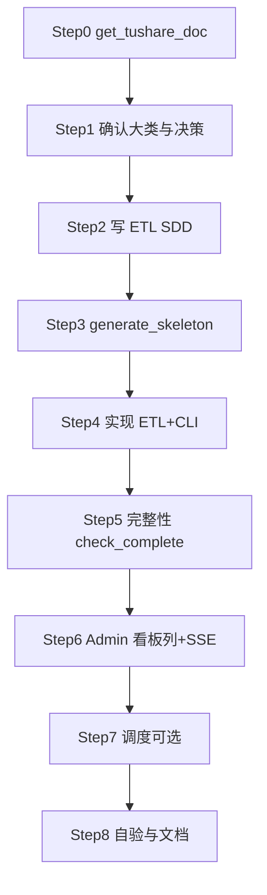

# Tushare 全链路开发 Skill

> **替代范围**：`vibe_tushare_etl`（仅 ETL 骨架）+ `admin_web_dev` 中「量化数据源看板」部分。
> **保留**：`get_tushare_doc` 查文档；`admin_web_dev` 模式 B（独立 ProTable 明细页 / 非看板 CRUD）。

## 工具路径

| 资源 | 路径 |
|------|------|
| Skill 目录 | `.claude/skills/vibe_tushare_fullstack/` |
| 大类映射 | [`mappings/dashboard_groups.yaml`](mappings/dashboard_groups.yaml) |
| ETL SDD 模板 | [`templates/etl_sdd_template.md`](templates/etl_sdd_template.md) |
| 看板列片段 | [`templates/dashboard_column_snippet.md`](templates/dashboard_column_snippet.md) |
| SSE 片段 | [`templates/api_sse_snippet.md`](templates/api_sse_snippet.md) |
| 骨架生成器 | [`generate_skeleton.py`](generate_skeleton.py) |
| ETL 清单 | [`checklists/etl_touchpoints.md`](checklists/etl_touchpoints.md) |
| Admin 清单 | [`checklists/admin_touchpoints.md`](checklists/admin_touchpoints.md) |

## 执行前必读

1. 本 skill 全文
2. [`get_tushare_doc`](../get_tushare_doc/skill.md) — Step 0
3. [`CLAUDE.md`](../../CLAUDE.md) §4 ETL 分层、§5 API 模式、§6 踩坑
4. [`docs/ETL模块分类与命名规范.md`](../../docs/ETL模块分类与命名规范.md)
5. Admin 看板配置：[`completeness_dashboard_config.py`](../../src/service/etl/completeness_dashboard_config.py)

---

## 总览流程（Step 0–8）



---

## Step 0 · 获取 Tushare 接口文档

**必须先 Read** [`get_tushare_doc/skill.md`](../get_tushare_doc/skill.md)。

```bash
# URL 或 doc_id
uv run python .claude/skills/get_tushare_doc/tushare_doc.py fetch <url_or_doc_id> -o

# 接口名
uv run python .claude/skills/get_tushare_doc/tushare_doc.py search "<api_name>" -d
```

**Exit criteria**：已提取 `api_name`、输入/输出字段、限流、示例。

---

## Step 1 · 确认「大类」与设计决策（最重要）

**大类 = Admin 看板分组**，须贯穿 ETL 域目录、完整性 `source_name`、看板列、SSE、菜单归属。

读取 [`mappings/dashboard_groups.yaml`](mappings/dashboard_groups.yaml)，用 AskQuestion **一次**确认：

| # | 决策项 | 说明 |
|---|--------|------|
| 1 | **Admin 大类**（6 选 1，必填） | → `group_id` / `date_key_type` / 明细页 path |
| 2 | 域前缀 & DB 表名 | 见 ETL 命名规范；表名必须带域前缀 |
| 3 | 拉取模式 | by-date / by-period / snapshot / by-code |
| 4 | 冲突键 | 冲突键列 NULL 须归一化为 `""` 或固定值 |
| 5 | Transform | 无 / JSONB / 自定义 |
| 6 | 完整性 | 需要 → `check-complete` + 看板完整率；不需要 → 仅 pull |
| 7 | CLI 组名 & 命令 | `pull-by-date` / `check-complete` 等 |
| 8 | 看板列 | `column_key` / `column_label` / `threshold` |
| 9 | SSE task_key | 默认 `{source_name}_check` |

**输出决策摘要表**（后续 Step 引用）：

```
api_name / table_name / domain_dir / group_id / sse_task_key / detail_path
```

### 大类对照（摘要）

| Admin 菜单 | group_id | date_key_type |
|------------|----------|---------------|
| 财务类 / 报告期 | financial_report_period | report_period |
| 财务类 / 公告日 | financial_ann_date | ann_date |
| K线类 / 交易日 | kline_trade_date | trade_date |
| 市场类 / 交易日 | market_trade_date | trade_date |
| 指数类 / 月 | index_month | month |
| 基础类 / 交易日 | stock_basic_trade_date | trade_date |

**Exit criteria**：用户确认决策摘要表。

---

## Step 2 · 生成 ETL SDD

1. 读 [`templates/etl_sdd_template.md`](templates/etl_sdd_template.md)
2. 填充 Step 0 文档 + Step 1 决策（含 §11 Admin、§12 完整性、§13 SSE）
3. 写入 `spec/etl/<功能>.sdd.md`
4. **用户 review 通过后再写代码**

**Exit criteria**：spec 文件路径已展示，用户确认。

---

## Step 3 · 生成 ETL 代码骨架

```bash
uv run python .claude/skills/vibe_tushare_fullstack/generate_skeleton.py \
  --api-name <api_name> \
  --domain <domain_prefix> \
  --domain-dir <financial|market|kline|stock|index|warehouse> \
  --table-name <table_name> \
  --pull-mode <by-date|by-period|snapshot|by-code> \
  --conflict-keys "<key1,key2,...>" \
  --output-fields "<field1:type1,...>" \
  --rate-limit <number> \
  --has-transform <true|false> \
  --has-completeness <true|false> \
  --cli-group <group> \
  --cli-command <command> \
  --dashboard-group <group_id> \
  --column-key <column_key> \
  --column-label "<中文列名>" \
  --sse-task-key <task_key> \
  --source-name <source_name> \
  --spec-path spec/etl/xxx.sdd.md \
  --emit-checklist
```

生成器产出：8 层 `*.py` + CLI / setting / tushare_entities / **看板列 / SSE** 片段。

**不自动修改**已有文件；按 [`checklists/etl_touchpoints.md`](checklists/etl_touchpoints.md) 手动合并。

**Exit criteria**：文件清单 + snippets + TODO 列表已展示。

---

## Step 4 · 实现 ETL + CLI

固定分层（禁止打洞）：

```
CLI → Strategy → Workflow → Extract → Transform? → Load
```

- CLI 仅解析参数 + 调 Strategy；子命令路径才 `typer.echo`
- Strategy：`ensure_trade_cal`、tqdm、增量起点 `settings.etl_start_date("{table_name}")`
- 参考：[`market_daily_basic_strategy.py`](../../src/etl/strategy/market/market_daily_basic_strategy.py)

**Exit criteria**：`pull-*` CLI 小范围日期跑通，DB 有数据。

---

## Step 5 · 完整性校验（若 Step 1 启用）

- Strategy：`CompletenessEngine` + `CompletenessConfig(source_name=..., pull_by_date=...)`
- CLI：`check-complete` 子命令
- `source_name` 与看板列一致
- pull 区间结束后 `refresh_completeness_snapshot`

**Exit criteria**：`check-complete` 小范围跑通；`completeness_snapshot` 有对应行。

---

## Step 6 · Admin 看板集成（默认 · 模式 A）

**不要**为每个数据源新建 `/data-source/xxx` 页面。

1. [`completeness_dashboard_config.py`](../../src/service/etl/completeness_dashboard_config.py) — 追加 `DashboardColumn`（见 [`dashboard_column_snippet.md`](templates/dashboard_column_snippet.md)）
2. [`etl_sse_registry.py`](../../src/service/etl/etl_sse_registry.py) — 注册 task_key（见 [`api_sse_snippet.md`](templates/api_sse_snippet.md)）
3. 列自动出现在：
   - 对应大类页（[`DataSourceDashboardTable`](../../src/web/admin/src/components/DataSourceDashboard/DataSourceDashboardTable.tsx)）
   - [`数据总览`](../../src/web/admin/src/pages/dataSource/OverviewPage.tsx)（`/data-source/overview`）

前端 SSE 已就绪：`useSseTask` → `POST /api/admin/etl/sse/run`。

按 [`checklists/admin_touchpoints.md`](checklists/admin_touchpoints.md) 勾选。

**Exit criteria**：Admin 看板见新列，点「补位」SSE 成功，**前端进度条与日志随补拉推进**（见下节注意事项）。

### ⚠️ SSE 补位进度（必做 · 常见漏项）

Admin 表头/单元格补位走 `POST /api/admin/etl/sse/run` → [`etl_sse_registry.py`](../../src/service/etl/etl_sse_registry.py) → Strategy。  
**控制台 tqdm 有进度 ≠ 前端有进度**；前端只消费 `progress_queue` 推入的 SSE 帧。

#### 前端识别的帧格式

| 帧 | 用途 |
|----|------|
| `{"status": "started"}` | 路由层 [`sse.py`](../../src/common/sse.py) 自动发 |
| `{"log": "..."}` | 写运行日志（快照刷新、缺口数量等） |
| `{"status": "running", "total": N}` | 设置总步数 |
| `{"index": i, "total": N, "period": "20260105", "saved": 123}` | 逐步进度 + 日志 |
| `{"done": true, "saved": N, "message": "..."}` | 结束 |

**禁止**对多日/多期循环只发 `{"status": "running", "total": 1}` 然后长时间无帧——前端会卡在「共 1 步待处理」。

#### 注册方式对照

| 补位类型 | registry 写法 | Strategy 要求 |
|----------|---------------|---------------|
| **CompletenessEngine**（市场/财务 by-date、技术因子等） | `_run_check(Strategy().check_complete, ...)` | `check_complete(..., progress_queue=q)` 转发给 `CompletenessEngine`（已内置按日/期推帧） |
| **K 线三维度**（日K/复权/涨跌停） | `_run_kline_dim("daily"\|"adj_factor"\|"stk_limit", ...)` | `pull_kline_*_by_date_range(..., progress_queue=q)` → `_pull_by_date_range_loop` 按开市日推帧 |
| **停复牌** | `_run_suspend_pull` | `pull_suspend_by_date(..., progress_queue=q)` 按日推帧 |
| **财报 history-init**（表头整列、区间≠单日） | `_run_report_history_or_period` | `ReportStrategy._run_history_init` 按报告期推帧（已有协议，见 [`financial_report_strategy.py`](../../src/etl/strategy/financial/financial_report_strategy.py) 顶部注释） |
| **自定义长任务** | 勿抄 snippet 里 `total: 1` 占位 | 循环内逐步 `q.put({index, total, period, saved})`，结束 `_run_*` 层 `q.put({done: true, ...})` |

新增 `check_complete` 时 Strategy 签名须含 `*, progress_queue=None` 并转发（参考 [`market_daily_basic_strategy.py`](../../src/etl/strategy/market/market_daily_basic_strategy.py)）。

#### 看板默认起点（表头整列补位日期）

- 表头补位区间来自看板搜索范围；默认起点读后端 `meta.default_start`（`settings.etl_start_date(group.start_default_env)`），**不是**前端硬编码。
- 改 [`DashboardMeta`](../../src/api/schemas/data_source_dashboard.py) 字段时须同步 Pydantic schema，否则 `default_start` 被 `response_model` 剥掉 → 弹窗出现 `undefined`。

#### 自验（Step 8 必做）

1. 表头点「整列补位」→ 日志出现「刷新快照 / N 个缺口」→ 进度 `第 i/N 步 …`
2. 与终端 tqdm 步数一致，完成后 `done` + 表格 reload
3. 同一区间重复点击 → 提示「有一个同样的任务已经正在进行中」（前端去重）

详见 [`templates/api_sse_snippet.md`](templates/api_sse_snippet.md)。

### 模式 B · 独立 ProTable 明细页（可选）

仅当用户明确要求逐条明细列表时，转 [`admin_web_dev`](../admin_web_dev/skill.md) 模式 B；**不替代**看板列。

---

## Step 7 · 调度（可选）

若需进 ETL 交互菜单 25 条：[`command_registry.py`](../../src/scheduler/command_registry.py) 注册 runner，与 CLI 共用 Strategy。

Admin「调度系统」自动可见，无需单独开发调度页。

---

## Step 8 · 收尾与自验

| 检查项 | 动作 |
|--------|------|
| ETL | `uv run ./src/etl/cli.py <group> check-complete --start-date ...` |
| Admin | `pnpm dev` → 量化数据源 → 大类页 → 补位 |
| 总览 | `/data-source/overview` 含新源 |
| 文档 | 更新 [`docs/开发进度.md`](../../docs/开发进度.md) |
| API spec | [`ETL-补位-SSE.sdd.md`](../../spec/api/admin/ETL-补位-SSE.sdd.md) task 表增行 |

**Exit criteria**：上表全部通过。

---

## Anti-patterns（禁止）

| 不要 | 应该 |
|------|------|
| 每个数据源新建 Admin 宽表页 | 向已有 6 个 `group_id` 追加列 |
| Router 里直接写 ETL 写库 | SSE 调 Strategy，复用 `check_complete` |
| 业务读放 `src/api/services/` | 读放 `src/service/<域>/` |
| 连续点多个 Admin 补位压测 | 单任务完成后再点（PG 连接数；前端已排队 + 去重，默认最多 5 并行） |
| SSE 只发 `total: 1` 不写循环进度 | `progress_queue` 按日/期推 `{index, total, period, saved}` |
| 表头补位日期写死 `19900101` | 用看板 `meta.default_start` + `.env` `{表名}_START_DATE` |
| 跳过 SDD 直接写代码 | Step 2 review 后再 Step 3+ |

---

## FAQ

**Q: 表头补位前端卡在「共 1 步」？**  
A: Strategy 未向 `progress_queue` 推逐步帧。`_run_check` 只转发 queue，须在 `CompletenessEngine` / 自定义循环内推 `{index, total, period, saved}`；勿在 registry 写死 `total: 1`。

**Q: Typer 组名和域前缀不一致？**  
A: 以 [`cli.py`](../../src/etl/cli.py) 的 `add_typer(..., name=...)` 为准；菜单经 `command_registry`。

**Q: 财报 history-init 走通用 SSE 吗？**  
A: 否，走专用 `POST .../financial/report/*-history-init`；看板列仍可指向该 task_key。

**Q: 何时用 admin_web_dev？**  
A: 调度页、因子列表、独立明细 ProTable 等非看板 CRUD。

---

## 回复规范

1. Step 0 后：API 摘要（字段数、限流）
2. Step 1 后：决策摘要表（含 group_id / sse_task_key）
3. Step 2 后：spec 路径，等待 review
4. Step 3 后：文件清单 + snippets
5. Step 8 后：自验命令清单
