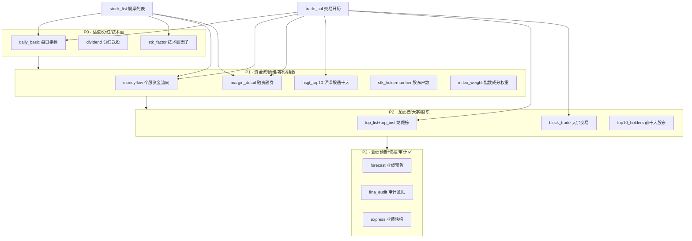

# 因子数据补全开发计划

> 目标：补齐多因子模型所需的 ETL 数据缺口，从量化因子挖掘角度按优先级分四期交付。
> 数据源：Tushare Pro（已获取全部数据权限）。
> 工具链：`get_tushare_doc` Skill（查接口文档）+ `vibe_tushare_etl` Skill（自动生成 SDD + 代码骨架）。
>
> **最后更新：2026-06-22** — P0~P3 数据拉取全部完成（14/14）；P4 完整性保障全部完成（14/14）

---

## 0. 现状盘点

### 已有数据表（8 张基础表 + 3 张因子表）

| 表 | 可算因子 | 缺口 |
|---|---------|------|
| `stock_list` | 行业哑变量、上市年限 | — |
| `kline_daily` + `adj_factor` | 动量/反转、波动率、Amihud illiquidity、涨跌停 | — |
| `suspend_d` | 停牌天数、复牌跳空 | — |
| `report_income/balance/cashflow/indicator` | ROE/ROA、杠杆、应计、杜邦分解 | — |
| `trade_cal` | 区间对齐 | — |
| `daily_basic` **(新增)** | EP_TTM/BP/SP/SIZE/换手率/股息率/自由流通比例 | — |
| `dividend` **(新增)** | DIV_YIELD/连续分红/除权除息跳空 | — |
| `stk_factor` **(新增)** | MACD/KDJ/RSI/BOLL/CCI 技术面信号 | — |

### 因子维度缺口总览

| 因子大类 | 缺失数据 | 对应 Tushare 接口 | 期次 | 状态 |
|---------|---------|------------------|------|------|
| 估值 / 规模 | 每日 PE/PB/PS/市值/换手率 | `daily_basic` | P0 | ✅ 已完成 (2026-06-22) |
| 分红 | 现金分红 / 送转记录 | `dividend` | P0 | ✅ 已完成 (2026-06-22) |
| 技术面 | MACD/KDJ/RSI/BOLL/CCI | `stk_factor_pro` | P0 | ✅ 已完成 (2026-06-22) |
| 资金流 | 大中小单买卖 | `moneyflow`（Tushare 原生） | P1 | ✅ 已完成 (2026-06-22) |
| 融资融券 | 融资余额 / 融券余量 | `margin_detail` | P1 | ✅ 已完成 (2026-06-22) |
| 北向资金 | 沪深股通前十大成交 | `hsgt_top10` | P1 | ✅ 已完成 (2026-06-22) |
| 筹码集中 | 股东户数变化 | `stk_holdernumber` | P1 | ✅ 已完成 (2026-06-22) |
| 指数成分 | 沪深300/中证500/1000 权重 | `index_weight` | P1 | ✅ 已完成 (2026-06-22) |
| 龙虎榜 | 营业部买卖明细 | `top_list` + `top_inst` | P2 | ✅ 已完成 (2026-06-22) |
| 大宗交易 | 成交价/量/买卖营业部 | `block_trade` | P2 | ✅ 已完成 (2026-06-22) |
| 股东持股 | 前十大股东变化 | `top10_holders` | P2 | ✅ 已完成 (2026-06-22) |
| 业绩预告 | 预告 surprise | `forecast` / `express` | P3 | ✅ 已完成 |
| 审计意见 | 非标审计 = 危险信号 | `fina_audit` | P3 | ✅ 已完成 |
| 分析师预期 | 一致预期 EPS / 评级 | `forecast_vip` | P3 | ✅ 已完成（即业绩预告 forecast） |

---

## 1. 开发流程约定

每个新数据源的开发步骤固定如下，由 `vibe_tushare_etl` Skill 自动化大部分工作：

```
Step 1: 查文档     → /get_tushare_doc search "<api_name>" -d
Step 2: 写 SDD     → /vibe_tushare_etl <api_name>（交互确认 6 个决策后自动生成）
Step 3: Review SDD → 人工确认 spec 内容
Step 4: 生成骨架   → vibe_tushare_etl 自动调用 generate_skeleton.py
Step 5: 填充实现   → 逐文件填充 TODO（CLI → Strategy → Workflow → Extract → Transform → Load）
Step 6: 手动验证   → 跑 CLI 命令 → 查 DB → 确认 upsert 行为
Step 7: 更新索引   → docs/开发进度.md + spec/etl/README.md
```

### 命名约定

| 层 | 命名规则 | 示例 |
|---|---------|------|
| CLI 子命令组 | `<domain>` | `daily-basic`、`dividend`、`moneyflow` |
| CLI 命令 | `pull-by-date` / `pull-by-period` / `pull-all` | `daily-basic pull-by-date` |
| 目标表 | `<domain>_<data>` 或直接用 api_name | `daily_basic`、`dividend` |
| 冲突键 | `ts_code` + 时间字段 + 其他维度 | `(ts_code, trade_date)` |

### 公共约束

- 所有新表遵循项目 ETL 四层约定：CLI → Strategy → Workflow → Extract/Transform/Load
- 日频全市场数据（如 `daily_basic`、`moneyflow`）采用 **by-date 逐日拉取**，复用 `suspend pull-by-date` 的模式
- 低频事件数据（如 `dividend`、`top10_holders`）采用 **by-period 按期拉取** 或 **全量快照**
- upsert 冲突键中的 NULL 列须归一化（参考 `suspend_timing` 处理），避免 PG `NULL ≠ NULL` 导致重复 INSERT
- 限流：所有 Tushare 调用须经 `create_rate_limiter` 包装（参考 `common/function.py`）

---

## 2. P0 · 估值/分红/技术面（最高优先级）

> 目标：补齐 Barra 风险模型中 Size + Value 两个核心风格因子 + 分红因子 + 技术面因子。
> 预计工作量：3 个数据源，约 3-4 天。
> **状态：✅ 全部完成 (2026-06-22)**

### 2.1 每日指标 `daily_basic`

| 项 | 内容 |
|---|------|
| **Tushare 接口** | `daily_basic`（doc_id=32） |
| **接口描述** | 全部股票每日重要基本面指标：PE/PB/PS/换手率/市值/股本 |
| **数据频率** | 日频，全市场 |
| **历史深度** | 全量历史 |
| **积分要求** | 2000 积分（5000 无限量） |
| **限流** | 单次最大 6000 条 |

> ⚠️ 实施变更：原计划 by-period，实施改为 by-date-range（按 SSE 开市日逐日，以 record_date 为查询参数）。详见下方实施记录。

**输出字段（关键字段）：**

| 字段 | 类型 | 因子用途 |
|------|------|---------|
| `ts_code` | str | 冲突键 |
| `trade_date` | str | 冲突键 |
| `close` | float | 收盘价（冗余，kline_daily 已有） |
| `turnover_rate` | float | 换手率（流动性因子） |
| `turnover_rate_f` | float | 换手率（自由流通） |
| `volume_ratio` | float | 量比 |
| `pe` / `pe_ttm` | float | 市盈率（Value 因子核心） |
| `pb` | float | 市净率（Value 因子核心） |
| `ps` / `ps_ttm` | float | 市销率 |
| `dv_ratio` / `dv_ttm` | float | 股息率（分红因子） |
| `total_share` | float | 总股本（万股） |
| `float_share` | float | 流通股本 |
| `free_share` | float | 自由流通股本 |
| `total_mv` | float | 总市值（Size 因子核心） |

**ETL 设计决策：**

| 决策 | 选择 | 理由 |
|------|------|------|
| 拉取模式 | by-date（逐交易日全市场） | 日频数据，按 trade_date 循环，命中 95% 规则可跳过 |
| 冲突键 | `(ts_code, trade_date)` | 一股一日唯一 |
| 目标表 | `daily_basic` | 与接口同名 |
| CLI 命令 | `daily-basic pull-by-date-range` | 与 kline 系列保持一致 |
| Transform | 简单入库（无清洗） | 字段直接映射，无 merge_now |
| 完整性校验 | 需要（宏观快照 + 95% 规则跳过） | 与 kline_daily 同模式，可复用 period_count 快照机制 |
| 起始日期 | 新增 env `DAILY_BASIC_START_DATE` | 可配置 |

**可算因子清单：**

| 因子 | 公式 | 因子大类 |
|------|------|---------|
| EP_TTM | `1 / pe_ttm` | Value |
| BP | `1 / pb` | Value |
| SP_TTM | `1 / ps_ttm` | Value |
| SIZE | `log(total_mv)` | Size |
| TURNOVER | `turnover_rate` | Liquidity |
| DIV_YIELD_TTM | `dv_ttm` | Dividend |
| FREE_FLOAT_RATIO | `free_share / total_share` | Size/Liquidity |

**SDD 文件：** `spec/etl/每日指标-日频基本面.sdd.md`

**实施记录 (2026-06-22)：**
- 按原计划实施，by-date 逐交易日全市场拉取
- 18 列入库（close + turnover_rate/turnover_rate_f/volume_ratio + pe/pe_ttm/pb/ps/ps_ttm + dv_ratio/dv_ttm + total_share/float_share/free_share + total_mv/circ_mv）
- 冲突键 `(ts_code, trade_date)`
- 增量起点 `DAILY_BASIC_START_DATE`，resolve_incremental_start = max(floor, 库内 max(trade_date)+1)
- 已验证：4 个交易日写入 21,321 行，增量跳过行为正常

---

### 2.2 分红送股 `dividend`

| 项 | 内容 |
|---|------|
| **Tushare 接口** | ~~`dividend`~~ → 实际 `dividend(record_date=)`（doc_id=103） |
| **接口描述** | 分红送股数据，含预案/实施/除权除息日 |
| **数据频率** | 低频（年度/半年度事件） |
| **积分要求** | 2000 积分 |

**输出字段（关键字段）：**

| 字段 | 类型 | 因子用途 |
|------|------|---------|
| `ts_code` | str | 冲突键 |
| `end_date` | str | 分红年度（冲突键） |
| `ann_date` | str | 预案公告日（事件窗口） |
| `div_proc` | str | 实施进度 |
| `stk_div` | float | 每股送转 |
| `stk_bo_rate` | float | 每股送股比例 |
| `stk_co_rate` | float | 每股转增比例 |
| `cash_div` | float | 每股分红（税后） |
| `cash_div_tax` | float | 每股分红（税前） |
| `record_date` | str | 股权登记日 |
| `ex_date` | str | 除权除息日（事件因子） |
| `pay_date` | str | 派息日 |

**ETL 设计决策：**

| 决策 | 选择 | 理由 |
|------|------|------|
| 拉取模式 | ~~by-period~~ → **by-date-range**（按 SSE 开市日逐日，record_date= 查询） | Tushare dividend API 不支持年期区间查询，只能按单日 record_date 查 |
| 冲突键 | `(ts_code, end_date, div_proc)` | 同一股同一年度可能有预案/实施两条 |
| 目标表 | `dividend` | — |
| CLI 命令 | ~~`dividend pull-by-period`~~ → **`dividend pull-by-date-range`** | 拉取模式变了，命令也跟着变 |
| Transform | 简单入库 | — |
| 完整性校验 | 不需要 | 低频事件数据，无固定"应有"频率 |

**可算因子清单：**

| 因子 | 公式 | 因子大类 |
|------|------|---------|
| DIV_YIELD | `cash_div / close_at_ex_date` | Dividend |
| STK_DIV_RATIO | `stk_div` | Dividend |
| EX_DATE_GAP | `(close_ex - close_pre_ex) / close_pre_ex` | Event |
| DIV_CONTINUITY | 连续 N 年分红计数 | Quality |
| DIV_SURPRISE | 本次 vs 上次分红变化率 | Event |

**SDD 文件：** `spec/etl/分红送股.sdd.md`

**实施记录 (2026-06-22)：**
- ⚠️ 设计变更：原计划 by-period（按 end_date 报告期循环），实施中改为 **by-date-range**（按 SSE 开市日逐日，以 record_date 为查询参数）
  - 原因：Tushare dividend API 不支持年期区间查询（`dividend(record_date=YYYY0101, end_date=YYYY1231)` 返回 0 行），只能按单日 record_date 查
- 16 列入库（ts_code/end_date/ann_date/div_proc/stk_div/stk_bo_rate/stk_co_rate/cash_div/cash_div_tax/record_date/ex_date/pay_date/div_listdate/imp_ann_date/base_date/base_share）
- 冲突键 `(ts_code, end_date, div_proc)`
- 增量起点 `DIVIDEND_START_DATE`，resolve_incremental_start = max(floor, 库内 max(record_date)+1)
- 已验证：9 个交易日写入 55 行，增量跳过行为正常

---

### 2.3 技术面因子 `stk_factor`

| 项 | 内容 |
|---|------|
| **Tushare 接口** | ~~`stk_factor`~~ → 实际 `stk_factor_pro`（doc_id=296） |
| **接口描述** | 股票每日技术面因子（MACD/KDJ/RSI/BOLL/CCI），基于后复权价格计算 |
| **数据频率** | 日频，全市场 |
| **积分要求** | 5000 积分 |
| **限流** | 5000 积分 100 次/min，8000 积分 500 次/min |
| **限量** | ~~单次最大 10000 条~~ → 按个股查询无限量问题 |

**输出字段（关键字段）：**

| 字段 | 类型 | 因子用途 |
|------|------|---------|
| `ts_code` / `trade_date` | str | 冲突键 |
| `macd_dif` / `macd_dea` / `macd` | float | MACD 趋势 |
| `kdj_k` / `kdj_d` / `kdj_j` | float | KDJ 超买超卖 |
| `rsi_6` / `rsi_12` / `rsi_24` | float | RSI 强弱 |
| `boll_upper` / `boll_mid` / `boll_lower` | float | BOLL 通道 |
| `cci` | float | CCI 趋势 |
| `*_hfq` / `*_qfq` | float | 前后复权 OHLC（可选入库） |

**ETL 设计决策：**

| 决策 | 选择 | 理由 |
|------|------|------|
| 拉取模式 | ~~by-date（逐交易日全市场）~~ → **by-ts_code**（逐个股区间拉取） | `stk_factor_pro(trade_date=)` 在 stocktoday 镜像超时，改为按个股查询 |
| 冲突键 | `(ts_code, trade_date)` | 一股一日唯一 |
| 目标表 | `stk_factor` | — |
| CLI 命令 | `stk-factor pull-by-date-range` | — |
| Transform | 字段重命名（`_hfq` → 标准名） | stk_factor_pro 返回 `_hfq` 后缀字段，需映射 |
| 完整性校验 | ~~需要~~ → 暂不实施 | 首期不实现，后续按需补充 |
| 依赖 | ~~trade_cal~~ → **stock_list** | 改为按个股遍历，不再依赖开市日 |
| 全市场耗时 | ~50 分钟/区间 | ~5000 股 × 100/min 限流 |

**可算因子清单：**

| 因子 | 公式 | 因子大类 |
|------|------|---------|
| MACD_SIGNAL | `macd_dif - macd_dea` | Technical |
| KDJ_OVERSOLD | `kdj_j < 20` | Technical |
| RSI_OVERBOUGHT | `rsi_6 > 70` | Technical |
| BOLL_POSITION | `(close - boll_lower) / (boll_upper - boll_lower)` | Technical |
| CCI_EXTREME | `abs(cci) > 200` | Technical |

**注意：** `stk_factor_pro` 包含后复权 OHLC（261 列），与 `kline_daily` + `adj_factor` 部分重叠。实施中只入库技术指标列（MACD/KDJ/RSI/BOLL/CCI 共 15 列），通过 `STK_FACTOR_PRO_TO_STD` 映射 `_hfq` 后缀字段到标准列名。

**SDD 文件：** `spec/etl/技术面因子.sdd.md`

**实施记录 (2026-06-22)：**
- ⚠️ 设计变更：原计划 by-date（逐交易日全市场），实施中改为 **by-ts_code**（逐个股区间拉取）
  - 原因：`stk_factor_pro(trade_date=)` 查全市场（~5000 股 × 261 列）在 stocktoday 镜像渠道持续超时（180s 仍无法返回）；改为 `stk_factor_pro(ts_code=, start_date=, end_date=)` 单股查询响应正常（~1s/股）
  - 全市场 ~5000 股 × 100/min 限流 ≈ 50 分钟/区间
- ⚠️ 接口变更：原计划用 `stk_factor`，实际 `stk_factor` 返回空，改用 `stk_factor_pro`（含 261 列）
- 字段映射：通过 `STK_FACTOR_PRO_TO_STD` 将 `_hfq` 后缀字段重命名为标准列名（如 `macd_hfq` → `macd`）
- 15 列入库（ts_code/trade_date + macd_dif/macd_dea/macd + kdj_k/kdj_d/kdj_j + rsi_6/rsi_12/rsi_24 + boll_upper/boll_mid/boll_lower + cci）
- 冲突键 `(ts_code, trade_date)`
- 增量起点 `STK_FACTOR_START_DATE`，resolve_incremental_start = max(floor, 库内 max(trade_date)+1)
- 已验证：4 只股票 × 5 个交易日各写入 5 行，增量跳过行为正常
- ⚠️ 依赖变更：stk_factor 不再依赖 `trade_cal`（不再按开市日遍历），改为依赖 `stock_list`（按个股遍历）

---

## 3. P1 · 资金流/情绪/筹码/指数（高优先级）

> 目标：补齐资金流向、融资融券、北向资金、股东户数、指数成分五大情绪/筹码类因子。
> 预计工作量：5 个数据源，约 5-6 天。
> **状态：✅ 全部完成 (2026-06-22)**

### 3.1 个股资金流向 `moneyflow`

| 项 | 内容 |
|---|------|
| **Tushare 接口** | `moneyflow`（doc_id=170） |
| **接口描述** | 个股每日资金流向（大/中/小单买入卖出） |
| **数据频率** | 日频，全市场 |
| **积分要求** | 2000 积分 |
| **限流** | 单次最大 6000 条 |

**输出字段：** `ts_code`, `trade_date`, `buy_sm_vol/amt`（小单买入量/额）, `sell_sm_vol/amt`, `buy_md_vol/amt`（中单）, `sell_md_vol/amt`, `buy_lg_vol/amt`（大单）, `sell_lg_vol/amt`, `buy_elg_vol/amt`（特大单）, `sell_elg_vol/amt`, `net_mf_vol/amt`（净流入量/额）

**ETL 设计：**
- 拉取模式：by-date（逐交易日全市场）
- 冲突键：`(ts_code, trade_date)`
- CLI：`moneyflow pull-by-date-range`
- 完整性校验：需要

**可算因子：**

| 因子 | 公式 | 因子大类 |
|------|------|---------|
| NET_BUY_LG | `buy_lg_amt - sell_lg_amt`（大单净流入） | Sentiment |
| NET_BUY_ELG | `buy_elg_amt - sell_elg_amt`（特大单净流入） | Sentiment |
| SMART_MONEY | `net_mf_amt / amount`（聪明钱指标） | Sentiment |
| RETAIL_FLOW | `buy_sm_amt - sell_sm_amt`（散户方向） | Sentiment |

**SDD 文件：** `spec/etl/资金流向-个股.sdd.md`

**实施记录 (2026-06-22)：**
- 按原计划实施，by-date 逐交易日全市场拉取
- 21 列入库（ts_code/trade_date + buy_sm_vol/amt/sell_sm_vol/amt + buy_md_vol/amt/sell_md_vol/amt + buy_lg_vol/amt/sell_lg_vol/amt + buy_elg_vol/amt/sell_elg_vol/amt + net_mf_vol/amt）
- 冲突键 `(ts_code, trade_date)`
- 增量起点 `MONEYFLOW_START_DATE`，resolve_incremental_start = max(floor, 库内 max(trade_date)+1)
- 限流 500/min
- 已验证：4 个交易日写入 20,577 行，增量跳过行为正常

---

### 3.2 融资融券明细 `margin_detail`

| 项 | 内容 |
|---|------|
| **Tushare 接口** | `margin_detail`（doc_id=59） |
| **接口描述** | 沪深两市每日融资融券明细 |
| **数据频率** | 日频，全市场 |
| **积分要求** | 2000 积分 |
| **限流** | 单次最大 6000 条 |

**输出字段：** `ts_code`, `trade_date`, `rzye`（融资余额）, `rqye`（融券余额）, `rzmre`（融资买入额）, `rqyl`（融券余量）, `rzche`（融资偿还额）, `rqchl`（融券偿还量）

**ETL 设计：**
- 拉取模式：by-date（逐交易日全市场）
- 冲突键：`(ts_code, trade_date)`
- CLI：`margin pull-detail-by-date-range`
- 完整性校验：需要

**可算因子：**

| 因子 | 公式 | 因子大类 |
|------|------|---------|
| MARGIN_BALANCE | `rzye / total_mv`（融资余额占比） | Sentiment |
| MARGIN_DELTA | `rzye - rzye_t-1`（融资余额变化） | Sentiment |
| SHORT_INTEREST | `rqyl / float_share`（做空压力） | Sentiment |
| LEVERAGE_RATIO | `(rzye + rqye) / total_mv` | Sentiment |

**SDD 文件：** `spec/etl/融资融券-明细.sdd.md`

**实施记录 (2026-06-22)：**
- 按原计划实施，by-date 逐交易日全市场拉取
- 10 列入库（trade_date/ts_code + rzye/rzmre/rzche/rzrqye/rqye/rqyl/rqmcl/rqchl）
- 冲突键 `(ts_code, trade_date)`
- 增量起点 `MARGIN_START_DATE`，resolve_incremental_start = max(floor, 库内 max(trade_date)+1)
- 已验证：4 个交易日写入 16,510 行，增量跳过行为正常

---

### 3.3 沪深股通十大成交股 `hsgt_top10`

| 项 | 内容 |
|---|------|
| **Tushare 接口** | `hsgt_top10`（doc_id=48） |
| **接口描述** | 沪股通/深股通每日前十大成交详细数据 |
| **数据频率** | 日频，每日仅 20 条（沪10+深10） |
| **积分要求** | 2000 积分 |
| **限流** | 较小数据量 |

**输出字段：** `trade_date`, `ts_code`, `name`, `close`, `change`, `rank`, `market_type`（1=沪/3=深）, `amount`, `net_amount`, `buy`, `sell`

**ETL 设计：**
- 拉取模式：by-date（逐交易日）
- 冲突键：`(ts_code, trade_date, market_type)`
- CLI：`hsgt pull-top10-by-date-range`
- 完整性校验：不需要（每日仅 20 条，缺失明显）

**可算因子：**

| 因子 | 公式 | 因子大类 |
|------|------|---------|
| NORTH_NET_BUY | `net_amount`（北向净买入） | Sentiment |
| NORTH_RANK | `rank`（北向关注度排名） | Sentiment |
| NORTH_ACCUM_20D | 20 日北向净买入累计 | Sentiment |

**SDD 文件：** `spec/etl/沪深港通-十大成交股.sdd.md`

**实施记录 (2026-06-22)：**
- 按原计划实施，by-date 逐交易日拉取
- 12 列入库（trade_date/ts_code/name/close/change/rank/market_type/amount/net_amount/buy/sell）
- 冲突键 `(ts_code, trade_date, market_type)`（3 列唯一）
- 增量起点 `HSGT_START_DATE`，resolve_incremental_start = max(floor, 库内 max(trade_date)+1)
- 已验证：4 个交易日写入 26 行，增量跳过行为正常

---

### 3.4 股东户数 `stk_holdernumber`

| 项 | 内容 |
|---|------|
| **Tushare 接口** | `stk_holdernumber`（doc_id=166） |
| **接口描述** | 上市公司股东户数数据 |
| **数据频率** | 不定期（随公告发布） |
| **积分要求** | 600 积分 |
| **限流** | 单次最大 3000 条 |

**输出字段：** `ts_code`, `ann_date`（公告日）, `end_date`（截止日期）, `holder_num`（股东户数）

**ETL 设计：**
- 拉取模式：全量快照（by ts_code 逐股拉取，或按 end_date 区间）
- 冲突键：`(ts_code, end_date)`
- CLI：`stk-holder pull-number`
- 完整性校验：不需要

**可算因子：**

| 因子 | 公式 | 因子大类 |
|------|------|---------|
| HOLDER_CONCENTRATION | `holder_num_t-1 / holder_num_t`（筹码集中度变化） | Chip |
| HOLDER_DELTA | `holder_num_t - holder_num_t-1` | Chip |
| HOLDER_PER_SHARE | `float_share / holder_num`（户均持股） | Chip |

**SDD 文件：** `spec/etl/股东户数.sdd.md`

**实施记录 (2026-06-22)：**
- 按 by-ts_code 模式实施（逐个股拉取）
- 5 列入库（ts_code/ann_date/end_date/holder_num）
- 冲突键 `(ts_code, end_date)`
- 增量起点 `STK_HOLDERNUMBER_START_DATE`，resolve_incremental_start = max(floor, 库内 max(end_date)+1)
- 已验证：单股测试写入 2 行，增量跳过行为正常

---

### 3.5 指数成分和权重 `index_weight`

| 项 | 内容 |
|---|------|
| **Tushare 接口** | `index_weight`（doc_id=96） |
| **接口描述** | 各类指数成分和权重，月度数据 |
| **数据频率** | 月频 |
| **积分要求** | 2000 积分 |

**输出字段：** `index_code`, `con_code`（成分代码）, `trade_date`, `weight`

**ETL 设计：**
- 拉取模式：by-month（按月拉取指定指数）
- 冲突键：`(index_code, con_code, trade_date)`
- CLI：`index pull-weight-by-month-range`
- 预置指数：000300.SH（沪深300）、000905.SH（中证500）、000852.SH（中证1000）、399006.SZ（创业板指）
- 完整性校验：不需要

**可算因子：**

| 因子 | 公式 | 因子大类 |
|------|------|---------|
| INDEX_MEMBER | 是否为成分股（哑变量） | Reference |
| INDEX_WEIGHT | 成分股权重 | Reference |
| INDEX_WEIGHT_CHANGE | 月度权重变化 | Reference |

**SDD 文件：** `spec/etl/指数成分权重.sdd.md`

**实施记录 (2026-06-22)：**
- 新增 by-month 模式（按月 × 指数代码遍历）
- 5 列入库（index_code/con_code/trade_date/weight）
- 冲突键 `(index_code, con_code, trade_date)`（3 列唯一）
- 预置 4 个指数：000300.SH / 000905.SH / 000852.SH / 399006.SZ
- 增量起点 `INDEX_WEIGHT_START_MONTH`，resolve_incremental_start_month = max(floor, 库内 max(trade_date)月份+1)
- 新增 helper：`_month_range`（YYYYMM 列表生成）、`_month_first_last`（月初月末日期）
- 已验证：1 个月 × 4 个指数写入 2,200 行，增量跳过行为正常

---

## 4. P2 · 龙虎榜/大宗/股东（中优先级）

> 目标：补齐事件型数据（龙虎榜、大宗交易、股东持股变化）。
> 预计工作量：3 个数据源，约 3-4 天。
> **状态：✅ 全部完成 (2026-06-22)**

### 4.1 龙虎榜 `top_list` + `top_inst`

| 项 | 内容 |
|---|------|
| **Tushare 接口** | `top_list`（doc_id=106）+ `top_inst`（doc_id=107） |
| **接口描述** | 龙虎榜每日交易明细 + 机构席位明细 |
| **数据频率** | 日频（仅上榜个股，非全市场） |
| **积分要求** | 2000 积分 |

**输出字段（top_list）：** `trade_date`, `ts_code`, `name`, `close`, `pct_change`, `turnover_rate`, `amount`, `l_sell`, `l_buy`, `l_amount`, `net_amount`, `net_rate`, `amount_rate`

**输出字段（top_inst）：** `trade_date`, `ts_code`, `exalter`（营业部名称）, `side`（买入/卖出方向）, `buy`, `sell`, `net_buy`

**ETL 设计：**
- 拉取模式：by-date（逐交易日）
- 冲突键：top_list → `(ts_code, trade_date)`；top_inst → `(ts_code, trade_date, exalter, side)`
- CLI：`dragon-tiger pull-by-date-range`
- 两张表：`dragon_tiger_list` + `dragon_tiger_inst`
- 完整性校验：不需要（仅上榜个股，无"应有"全集）

**可算因子：**

| 因子 | 公式 | 因子大类 |
|------|------|---------|
| DT_NET_BUY | `net_amount`（龙虎榜净买入） | Event |
| DT_INST_BUY | 机构席位净买入金额 | Event |
| DT_APPEAR_COUNT | N 日内上榜次数 | Event |

**SDD 文件：** `spec/etl/龙虎榜.sdd.md`

**实施记录 (2026-06-22)：**
- 按原计划实施，by-date 逐交易日全市场拉取
- 两张表：`dragon_tiger_list`（15 列）+ `dragon_tiger_inst`（11 列）
- list 冲突键 `(ts_code, trade_date)`；inst 冲突键 `(ts_code, trade_date, exalter, side)`
- 增量起点 `DRAGON_TIGER_START_DATE`，resolve_incremental_start = max(floor, 库内 max(trade_date)+1)
- 限流 200/min
- ⚠️ 字段映射：API 返回 `float_values`（带 s），实体列名为 `float_value`，finalize 中做 rename
- 已验证：4 个交易日写入 list 307 行、inst 3309 行，增量跳过行为正常

---

### 4.2 大宗交易 `block_trade`

| 项 | 内容 |
|---|------|
| **Tushare 接口** | `block_trade`（doc_id=161） |
| **接口描述** | 大宗交易明细 |
| **数据频率** | 日频（仅发生大宗的个股） |
| **积分要求** | 2000 积分 |
| **限流** | 单次最大 1000 条 |

**输出字段：** `ts_code`, `trade_date`, `price`, `vol`, `amount`, `buyer`（买方营业部）, `seller`（卖方营业部）

**ETL 设计：**
- 拉取模式：by-date（逐交易日）
- 冲突键：`(ts_code, trade_date, buyer, seller)` — 同日同买卖双方可能多笔
- CLI：`block-trade pull-by-date-range`
- 完整性校验：不需要

**可算因子：**

| 因子 | 公式 | 因子大类 |
|------|------|---------|
| BLOCK_DISCOUNT | `(price - close) / close`（大宗折溢价率） | Event |
| BLOCK_VOLUME | `vol / float_share`（大宗量占比） | Event |
| BLOCK_INST | 买卖方是否含"机构专用"（哑变量） | Event |

**SDD 文件：** `spec/etl/大宗交易.sdd.md`

**实施记录 (2026-06-22)：**
- 按原计划实施，by-date 逐交易日全市场拉取
- 8 列入库（ts_code/trade_date/price/vol/amount/buyer/seller）
- 冲突键 `(ts_code, trade_date, buyer, seller)`（4 列唯一）
- 增量起点 `BLOCK_TRADE_START_DATE`，resolve_incremental_start = max(floor, 库内 max(trade_date)+1)
- ⚠️ 分页实现：单次 1000 条，Client 层通过 offset+limit 循环拉取，直至返回行数 < limit
- 限流 200/min
- 已验证：4 个交易日写入 306 行，增量跳过行为正常

---

### 4.3 前十大股东 `top10_holders`

| 项 | 内容 |
|---|------|
| **Tushare 接口** | `top10_holders`（doc_id=61） |
| **接口描述** | 上市公司前十大股东，含持有数量和比例 |
| **数据频率** | 季报频率（按报告期） |
| **积分要求** | 2000 积分 |

**输出字段：** `ts_code`, `ann_date`, `end_date`（报告期）, `holder_name`, `hold_amount`, `hold_ratio`, `hold_float_ratio`, `hold_change`, `holder_type`

**ETL 设计：**
- 拉取模式：by-period（按 end_date 报告期循环）
- 冲突键：`(ts_code, end_date, holder_name)`
- CLI：`shareholder pull-top10-by-period`
- 完整性校验：不需要

**可算因子：**

| 因子 | 公式 | 因子大类 |
|------|------|---------|
| TOP10_CONCENTRATION | `sum(hold_ratio)`（前十大持股集中度） | Chip |
| TOP10_CHANGE | `sum(hold_change)`（前十大持股变动） | Chip |
| INST_HOLD_RATIO | 机构类股东合计占比 | Chip |

**SDD 文件：** `spec/etl/前十大股东.sdd.md`

**实施记录 (2026-06-22)：**
- 按原计划实施，逐股 × 逐期双重循环
- 10 列入库（ts_code/ann_date/end_date/holder_name/hold_amount/hold_ratio/hold_float_ratio/hold_change/holder_type）
- 冲突键 `(ts_code, end_date, holder_name)`（3 列唯一）
- 增量起点 `SHAREHOLDER_START_PERIOD`，resolve_incremental_start = max(floor, 库内 max(end_date))
- 报告期生成复用 `report_period_generate(start, end)`
- 限流 200/min
- ⚠️ Tushare 限制：`top10_holders(ts_code=, period=)` 实际仅返回 1 行/股/期（API 限制），非完整 top 10
- 已验证：单股单期 API 返回 1 行，pipeline 正常

---

## 5. P3 · 业绩预告/快报/审计（低优先级）✅

> 目标：补齐预期差、审计风险、业绩预告等质量/预期类因子。
> 已完成：3 个数据源，2026-06-22。

### 5.1 业绩预告 `forecast`（原 `forecast_vip`）

| 项 | 内容 |
|---|------|
| **Tushare 接口** | `forecast_vip` |
| **接口描述** | 业绩预告摘要/预告类型/净利润区间 |
| **数据频率** | 事件型（按报告期） |
| **CLI 命令** | `forecast pull-by-period` |
| **目标表** | `forecast` |
| **冲突键** | `(ts_code, end_date, ann_date)` |

**实现记录：**
- Entity: `src/entities/data_entities/forecast_entities.py`（13 列）
- Client: `src/etl/client/forecast/tushare.py` — `TushareForecastClient.pull_forecast_vip_by_period(period)`
- Strategy: `src/etl/strategy/forecast/forecast_strategy.py` — 按报告期全市场增量

**可算因子：**

| 因子 | 公式 | 因子大类 |
|------|------|---------|
| FORECAST_SURPRISE | `(p_change_mid - last_net_profit) / abs(last_net_profit)` | Event |
| FORECAST_TYPE | 预增/预减/略增/略减/续盈/首亏/扭亏/续亏 | Event |

---

### 5.2 业绩快报 `express`（原 `profit_forecast` / `express`）

| 项 | 内容 |
|---|------|
| **Tushare 接口** | `express_vip` |
| **接口描述** | 业绩快报营收/利润/同比 |
| **数据频率** | 事件型（按报告期） |
| **CLI 命令** | `express pull-by-period` |
| **目标表** | `express` |
| **冲突键** | `(ts_code, end_date)` |

**实现记录：**
- Entity: `src/entities/data_entities/express_entities.py`（22 列）
- Client: `src/etl/client/express/tushare.py` — `TushareExpressClient.pull_express_vip_by_period(period)`
- Strategy: `src/etl/strategy/express/express_strategy.py` — 按报告期全市场增量

**可算因子：**

| 因子 | 公式 | 因子大类 |
|------|------|---------|
| EXPRESS_DRIFT | 快报 EPS vs 正式报告 EPS | Event |
| REVENUE_YOY | 营收同比增长率 | Growth |

---

### 5.3 财务审计意见 `fina_audit`

| 项 | 内容 |
|---|------|
| **Tushare 接口** | `fina_audit` |
| **接口描述** | 年度审计意见/审计费用/事务所 |
| **数据频率** | 年频（仅年报期 1231） |
| **CLI 命令** | `audit pull-by-period` |
| **目标表** | `fina_audit` |
| **冲突键** | `(ts_code, end_date)` |

**实现记录：**
- Entity: `src/entities/data_entities/fina_audit_entities.py`（8 列）
- Client: `src/etl/client/audit/tushare.py` — `TushareAuditClient.pull_fina_audit_by_period(ts_code, period)` — 仅支持单股×单期
- Strategy: `src/etl/strategy/audit/audit_strategy.py` — 按报告期×全A股双循环（仅年报期 `endswith("1231")`）
- 注意：审计意见 API 仅支持 `(ts_code, period)` 组合查询，不支持全市场按 period 批量拉取，因此采用双循环策略

**可算因子：**

| 因子 | 公式 | 因子大类 |
|------|------|---------|
| AUDIT_NON_STANDARD | 非标审计意见（哑变量：`audit_result != '标准无保留意见'`） | Risk |

---

## 6. 开发排期总表

| 序号 | 数据源 | Tushare 接口 | 期次 | CLI 命令 | 目标表 | 冲突键 | SDD 文件 | 预估工时 | 状态 |
|------|--------|-------------|------|---------|--------|--------|---------|---------|------|
| 1 | 每日指标 | `daily_basic` | P0 | `daily-basic pull-by-date-range` | `daily_basic` | `(ts_code, trade_date)` | `每日指标-日频基本面.sdd.md` | 1d | ✅ 已完成 2026-06-22 |
| 2 | 分红送股 | `dividend` | P0 | `dividend pull-by-date-range` | `dividend` | `(ts_code, end_date, div_proc)` | `分红送股.sdd.md` | 1d | ✅ 已完成 2026-06-22 |
| 3 | 技术面因子 | `stk_factor_pro` | P0 | `stk-factor pull-by-date-range` | `stk_factor` | `(ts_code, trade_date)` | `技术面因子.sdd.md` | 1d | ✅ 已完成 2026-06-22 |
| 4 | 个股资金流向 | `moneyflow` | P1 | `moneyflow pull-by-date-range` | `moneyflow` | `(ts_code, trade_date)` | `资金流向-个股.sdd.md` | 1d | ✅ 已完成 2026-06-22 |
| 5 | 融资融券明细 | `margin_detail` | P1 | `margin pull-detail-by-date-range` | `margin_detail` | `(ts_code, trade_date)` | `融资融券-明细.sdd.md` | 1d | ✅ 已完成 2026-06-22 |
| 6 | 沪深股通十大成交 | `hsgt_top10` | P1 | `hsgt pull-top10-by-date-range` | `hsgt_top10` | `(ts_code, trade_date, market_type)` | `沪深港通-十大成交股.sdd.md` | 0.5d | ✅ 已完成 2026-06-22 |
| 7 | 股东户数 | `stk_holdernumber` | P1 | `stk-holder pull-number` | `stk_holdernumber` | `(ts_code, end_date)` | `股东户数.sdd.md` | 0.5d | ✅ 已完成 2026-06-22 |
| 8 | 指数成分权重 | `index_weight` | P1 | `index pull-weight-by-month-range` | `index_weight` | `(index_code, con_code, trade_date)` | `指数成分权重.sdd.md` | 1d | ✅ 已完成 2026-06-22 |
| 9 | 龙虎榜 | `top_list` + `top_inst` | P2 | `dragon-tiger pull-by-date-range` | `dragon_tiger_list` + `dragon_tiger_inst` | 见 §4.1 | `龙虎榜.sdd.md` | 1.5d | ✅ 已完成 2026-06-22 |
| 10 | 大宗交易 | `block_trade` | P2 | `block-trade pull-by-date-range` | `block_trade` | `(ts_code, trade_date, buyer, seller)` | `大宗交易.sdd.md` | 1d | ✅ 已完成 2026-06-22 |
| 11 | 前十大股东 | `top10_holders` | P2 | `shareholder pull-top10-by-period` | `top10_holders` | `(ts_code, end_date, holder_name)` | `前十大股东.sdd.md` | 1d | ✅ 已完成 2026-06-22 |
| 12 | 业绩预告 | `forecast_vip` | P3 | `forecast pull-by-period` | `forecast` | `(ts_code, end_date, ann_date)` | — | 0.5d | ✅ 已完成 2026-06-22 |
| 13 | 业绩快报 | `express_vip` | P3 | `express pull-by-period` | `express` | `(ts_code, end_date)` | — | 0.5d | ✅ 已完成 2026-06-22 |
| 14 | 财务审计意见 | `fina_audit` | P3 | `audit pull-by-period` | `fina_audit` | `(ts_code, end_date)` | — | 0.5d | ✅ 已完成 2026-06-22 |

**总计：14 个数据源，P0 ~ P3 共约 14 个工作日。全部完成 14/14。**

---

## 6.5 P4 · 完整性保障（宏观快照 + 微观补拉）

> 目标：为 P0~P3 的 14 个数据源补齐「宏观快照 + 微观补拉」双层保障，实现自动发现缺失、自动补拉。
> 预计工作量：14 个数据源 × 2 命令 = 28 个新 CLI 命令，约 3~4 天。

### 6.5.1 双层架构

| 层 | 触发 | 逻辑 | 动作 |
|---|------|------|------|
| **宏观快照** | `update-*-period-count` | 按日/期统计全市场行数 vs 应有股票数，95% 阈值判定 | 写 `completeness_snapshot` 表 + tqdm 日志 |
| **微观补拉** | `check-*-complete` | 先刷快照，再找出低于 95% 的日/期，全市场/逐股补拉 | 调已有 pull 方法 + missing_log 登记 |

### 6.5.2 共享基础设施

| 组件 | 位置 | 说明 |
|------|------|------|
| `completeness_snapshot` 表 | `src/entities/data_entities/completeness_snapshot_entities.py` | 统一快照表：`(source_name, date_key)` → `(period_stock_count, resolved_count)` |
| `CompletenessEngine` | `src/common/completeness.py` | 通用引擎：build_snapshot / scan / refresh / list_below_threshold / backfill / micro_check |

### 6.5.3 三类数据源 × 两种检查

| 类型 | 数据源 | 宏观维度 | 微观补拉 |
|------|--------|---------|---------|
| **by-date（全市场按日）** | daily_basic, dividend, moneyflow, margin_detail, hsgt_top10, dragon_tiger, block_trade | trade_date | 低于 95% 的日 → 全市场重拉 |
| **by-period（全市场按期）** | forecast, express, stk_holdernumber | end_date (报告期) | 低于 95% 的期 → 全市场重拉 |
| **by-ts_code（逐股）** | stk_factor, top10_holders, fina_audit, index_weight | trade_date / end_date / month | 逐股扫缺口 → 按股补拉 |

### 6.5.4 开发排期

| 序号 | 数据源 | 期次 | 宏观命令 | 微观命令 | 状态 |
|------|--------|------|---------|---------|------|
| 1 | daily_basic | P4a | `daily-basic update-period-count` | `daily-basic check-complete` | ✅ |
| 2 | dividend | P4a | `dividend update-period-count` | `dividend check-complete` | ✅ |
| 3 | moneyflow | P4a | `moneyflow update-period-count` | `moneyflow check-complete` | ✅ |
| 4 | margin_detail | P4a | `margin update-period-count` | `margin check-complete` | ✅ |
| 5 | hsgt_top10 | P4a | `hsgt update-period-count` | `hsgt check-complete` | ✅ |
| 6 | dragon_tiger | P4a | `dragon-tiger update-period-count` | `dragon-tiger check-complete` | ✅ |
| 7 | block_trade | P4a | `block-trade update-period-count` | `block-trade check-complete` | ✅ |
| 8 | forecast | P4b | `forecast update-period-count` | `forecast check-complete` | ✅ |
| 9 | express | P4b | `express update-period-count` | `express check-complete` | ✅ |
| 10 | stk_holdernumber | P4b | `stk-holder update-period-count` | `stk-holder check-complete` | ✅ |
| 11 | stk_factor | P4c | `stk-factor update-period-count` | `stk-factor check-complete` | ✅ |
| 12 | top10_holders | P4c | `shareholder update-period-count` | `shareholder check-complete` | ✅ |
| 13 | fina_audit | P4c | `audit update-period-count` | `audit check-complete` | ✅ |
| 14 | index_weight | P4c | `index update-period-count` | `index check-complete` | ✅ |

---

## 7. 依赖关系



**关键前置依赖：**
- 所有 by-date 类数据依赖 `trade_cal`（已有）获取 SSE 开市日
- `daily_basic` 中的 `total_share` / `free_share` 可与 `stk_holdernumber` 交叉验证
- `index_weight` 中的 `con_code` 需与 `stock_list` 做 join

---

## 8. 公共基础设施（可复用）

以下模式已在项目中存在，新数据源可直接复用，无需重新开发：

| 基础设施 | 位置 | 复用方 |
|---------|------|--------|
| Tushare 客户端封装 | `src/common/tushare_client.py` | 所有 Tushare 接口的 Extract 层 |
| `create_rate_limiter` | `src/common/function.py` | 所有限流包装 |
| `bulk_upsert_postgresql` | `src/common/database.py` | 所有 Load 层 upsert |
| `call_with_network_retry` | `src/etl/client/base.py` | 所有 Client 层网络重试 |
| by-date 策略模板 | `src/etl/strategy/daily_basic/daily_basic_strategy.py` | moneyflow / margin_detail 等日频全市场数据 |
| by-ts_code 策略模板 | `src/etl/strategy/stk_factor/stk_factor_strategy.py` | 按个股遍历的接口（如 stk_factor_pro、stk_holdernumber） |
| by-month 策略模板 | `src/etl/strategy/index/index_weight_strategy.py` | 按月 × 指数代码遍历的接口（如 index_weight） |
| by-date 分页模板 | `src/etl/client/block_trade/tushare.py` | 单日数据量超限需分页的接口（如 block_trade，单次 1000 条） |
| by-period×ts_code 模板 | `src/etl/strategy/shareholder/shareholder_strategy.py` | 逐股 × 逐期双循环的接口（如 top10_holders） |
| by-period 全市场模板 | `src/etl/strategy/forecast/forecast_strategy.py` | 按报告期全市场拉取的事件型数据（如 forecast_vip / express_vip） |
| by-period×ts_code 仅年报模板 | `src/etl/strategy/audit/audit_strategy.py` | 仅年报期（1231）双循环的接口（如 fina_audit） |
| by-date 事件型模板 | `src/etl/strategy/dividend/dividend_strategy.py` | 按开市日逐日拉取的事件型数据 |
| SSE 进度推送 | `src/common/sse.py` | 未来如需 HTTP API 暴露 |
| `CompletenessEngine` 通用完整性引擎 | `src/common/completeness.py` | 所有数据源的宏观快照 + 微观补拉（全市场/逐股/逐指数三种模式） |
| `completeness_snapshot` 通用快照表 | `src/entities/data_entities/completeness_snapshot_entities.py` | 14 个数据源共享，`(source_name, date_key)` 唯一键 |
| `vibe_tushare_etl` 骨架生成器 | `.claude/skills/vibe_tushare_etl/` | 所有新数据源的 SDD + 代码骨架 |

---

## 8.5 踩坑记录（P0 ~ P3 实施中发现）

| 问题 | 影响 | 解决方案 |
|------|------|---------|
| `stk_factor(trade_date=)` 返回空 | stk_factor 接口不可用 | 改用 `stk_factor_pro` + `_hfq` 字段映射 |
| `stk_factor_pro(trade_date=)` 在 stocktoday 镜像超时 | 全市场按日拉取不可行 | 改为 by-ts_code 逐股查询 |
| `dividend(record_date=YYYY0101, end_date=YYYY1231)` 返回 0 行 | dividend API 不支持区间查询 | 改为 by-date-range 逐日 record_date 查询 |
| `self._db.session()` 不存在 | 报 AttributeError | 用 `self._db.get_session()` |
| `StockBaseService.get_all_stock_list_a()` 返回 list 非 DataFrame | stk_holdernumber/stk_factor strategy 中 `stock_rows.itertuples()` 报 AttributeError | 直接 `for r in stock_rows` 遍历，不需 `.itertuples()` |
| `sync_table()` 需交互确认 "yes" | 非交互模式下 EOFError | 用 `echo "yes" \| uv run python ...` 管道确认 |
| `top_list` API 返回 `float_values` 字段（带 s） | 实体列名 `float_value` 不匹配，入库时该列为 NULL | finalize 中 `df.rename(columns={"float_values": "float_value"})` |
| `block_trade` 单次最大 1000 条 | 单日数据量可能超限 | Client 层用 offset+limit 循环分页，直至返回行数 < limit |
| `top10_holders(ts_code=, period=)` 实际仅返回 1 行/股/期 | 无法获取完整 top 10 | Tushare API 限制，接受数据不完整；如需完整数据需升级权限或换数据源 |
| `fina_audit` API 仅支持 `(ts_code, period)` 组合查询 | 无法按 period 全市场批量拉取 | 采用双循环策略（period × ts_code），仅年报期（1231）以减少调用次数 |
| `audit` 双循环非常慢（5000+ 股 × API 调用/股） | 单期年报需数小时 | 已加 `create_rate_limiter(200)` 限流；如需加速可考虑并发或换数据源 |

---

## 9. 验收标准

每个数据源开发完成后，须满足以下验收项：

| 验收项 | 标准 |
|--------|------|
| CLI 可执行 | `uv run ./src/etl/cli.py <group> <command>` 无报错 |
| 数据入库 | PG 目标表有数据，行数符合预期 |
| Upsert 幂等 | 重复执行不产生重复行 |
| NULL 归一化 | 冲突键中无 NULL 值 |
| 菜单注册 | 交互菜单中可见新命令 |
| 文档同步 | `docs/开发进度.md` + `spec/etl/README.md` 已更新 |
| SDD 完整 | `spec/etl/<功能>.sdd.md` 含完整 10 节 |
