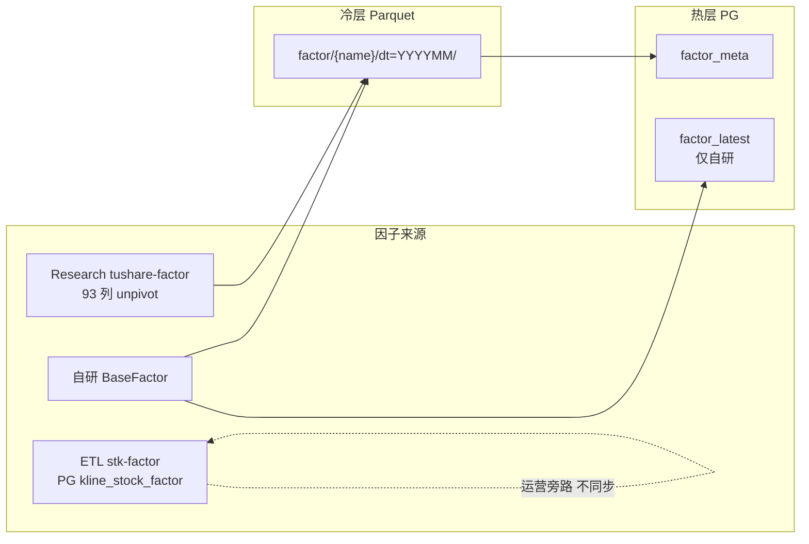

# Quantus 量化层完整方案

> 起草：2026-06-08 · **修订：2026-07-09**（多源统一 / 后复权写死 / 回测选型 / Phase 重排）  
> 前置：历史讨论见 [`docs/量化层方案-历史对话记录.md`](量化层方案-历史对话记录.md)  
> 目标：在现有 ETL + PG + Parquet 仓库基础上，建设因子计算、选股、回测、事件驱动四大能力  
> SDD 索引：[`spec/quant/README.md`](../spec/quant/README.md)

---

## 0. 当前基座盘点（2026-07）

### 0.1 数据与基础设施

| 已有 | 状态 |
|------|------|
| PG 日线 `kline_daily`（OHLCV + adj_factor + up_limit/down_limit） | 全市场历史 |
| PG 财报三表 + 指标 / 停复牌 / 交易日历 / 股票列表 | 完整 |
| PG 指数日线 `index_daily`、每日指标 `market_daily_basic` 等 | 已接入（见 [`tushare接入进度.md`](tushare接入进度.md)） |
| Parquet `kline_daily/dt=YYYYMM/` | Hive + zstd |
| DuckDB 跨源（attach PG + read_parquet） | 已验证 |
| ETL 四层 + 95%/99% 完整性 | 运行稳定 |

### 0.2 因子层（Phase 1 已基本落地）

| 能力 | 状态 | 说明 |
|------|------|------|
| `BaseFactor` + `FactorRegistry` | ✅ | [`src/research/factor/`](../src/research/factor/) |
| 自研 demo 因子 | ✅ | `momentum_20d` / `volatility_60d`（后复权 `close_adj`） |
| 因子 Parquet 长表 | ✅ | `factor/{name}/dt=YYYYMM/`，schema=`ts_code,trade_date,value` |
| Tushare 93 因子 → Parquet | ✅ | `research tushare-factor pull-by-date-range`（只保留 `_hfq`） |
| PG `factor_meta` + Admin 因子列表 | ✅ | 自研 + tushare 均可扫入 meta |
| PG `factor_latest` 热层 | ✅ | 自研 + tushare（及已有 Parquet 的国泰191）可同步 |
| ETL `kline_stock_factor`（14 列 MACD 等） | ⚠️ | Admin 完整性旁路，**不进**因子框架 |
| `FactorDataset` 读取层 | ✅ | `research/dataset/factor.py` |
| 截面回测 | ✅ | `backtest run` |
| 国泰 191 | ✅ | CLI + Admin SSE；Alpha30 仅 meta |

### 0.3 多源现状（必须写进下一阶段）



**下一阶段主线（Phase 1.5）**：多源统一 + `FactorDataset` + Tushare 进热层 + 厘清 `kline_stock_factor` 双路径。详见 [`spec/quant/多源因子统一与读取层.sdd.md`](../spec/quant/多源因子统一与读取层.sdd.md)。

---

## 1. 总体架构

```
┌─────────────────────────────────────────────────────────────────┐
│              Research CLI / Admin / API                         │
├─────────────────────────────────────────────────────────────────┤
│  research/backtest/       research/strategy/    research/perf/  │
│  ├─ crosssection/         ├─ single_factor/     ├─ ic.py       │
│  │  (截面调仓·自研)        ├─ multi_factor/      ├─ returns.py  │
│  └─ event_driven/         └─ event/             └─ report.py   │
├─────────────────────────────────────────────────────────────────┤
│  research/factor/                                               │
│  ├─ base.py + registry.py   （自研因子）                         │
│  ├─ price_volume/ / fundamental/ / event/ / gtja/（未来）        │
│  └─ （Tushare 因子：ETL 直落 Parquet，不经 BaseFactor.compute）   │
├─────────────────────────────────────────────────────────────────┤
│  research/dataset/           （统一数据访问·权威读入口）           │
│  ├─ kline.py                 日 K + 后复权 OHLC                  │
│  ├─ factor.py                FactorDataset（Phase 1.5）          │
│  ├─ universe.py              选股域                              │
│  └─ event.py                 事件源                              │
├─────────────────────────────────────────────────────────────────┤
│  存储                                                            │
│  ├─ Parquet 冷层（权威）  factor/{name}/ · kline_daily/ · backtest/│
│  ├─ PG 热层               factor_meta · factor_latest（近 60 日） │
│  ├─ PG 运营旁路           kline_stock_factor（不进研究主路径）     │
│  └─ DuckDB                跨源 join / 校验                       │
└─────────────────────────────────────────────────────────────────┘
```

---

## 2. 多源因子统一模型

### 2.1 权威源约定

| 来源 | `factor_meta.source` | 权威存储 | 进 `factor_latest` | 计算方式 |
|------|----------------------|----------|-------------------|----------|
| 自研 `BaseFactor` | `self`（实现可用「自研」中文） | Parquet `factor/{name}/` | ✅ | Polars `compute` |
| Tushare `stk_factor_pro` | `tushare` | 同上长表 | ✅（Phase 1.5 补齐） | Research 拉取 unpivot |
| 国泰 191 | `国泰191` | 同上 | ✅ | `gtja191 compute` / SSE |
| ETL `kline_stock_factor` | — | **PG 旁路** | ❌ | 不进框架 |

**研究 / 回测 / 多因子合成只认 Parquet `factor/{name}/`。**  
PG `factor_latest` 仅服务 Admin 近端展示；PG `kline_stock_factor` 仅服务看板完整性与少量技术指标展示，**不再扩展字段、不与 Research 互相同步**。

### 2.2 命名冲突

- `factor_name` 在 `factor_meta` 与 Parquet 目录上**全局唯一**
- 自研与 Tushare 撞名：自研优先；Tushare 侧跳过或加前缀（实现规则见多源 SDD）
- 国泰 191 目录建议 `gtja_alpha{N}`，避免与通用名冲突

### 2.3 读取层（Phase 1.5）

```python
class FactorDataset:
    def read(self, factor_name: str, start: str, end: str,
             ts_codes: list[str] | None = None) -> pl.LazyFrame: ...
    def read_multi(self, factor_names: list[str], trade_date: str) -> pl.DataFrame: ...
    def list_available(self, factor_name: str) -> list[str]: ...  # 已有月份
```

统一 schema：`ts_code, trade_date, value`。实现：Polars `scan_parquet`；跨源校验可用 DuckDB。

### 2.4 热层同步（Phase 1.5）

扩展 `FactorSyncService`：按 `factor_meta`（或扫描 `factor/`）同步 **自研 + tushare**，仍保留最近 **60** 个交易日宽表；动态 `ALTER TABLE ADD COLUMN`。

---

## 3. 复权约定（写死）

| 用途 | 约定 |
|------|------|
| 因子计算输入价 | **后复权**：`*_adj = raw * adj_factor`（`adj_factor` NULL → 1.0） |
| Tushare 技术因子 | 只认 `_hfq`（已实现；丢弃 `_bfq` / `_qfq`） |
| 国泰 191 | 公式 OHLC/VWAP 一律用后复权列；`VWAP ≈ amount/vol`（量纲见 191 对照文档） |
| 回测日收益 | 后复权收盘价：`close_adj[t] / close_adj[t-1] - 1` |
| 可交易约束 | 用**未复权**价与 `up_limit` / `down_limit`、停牌表判断涨跌停/停牌 |
| 前复权 | **不做主路径**；展示可临时算 qfq，不入库、不进因子计算 |

`KlineDataset` 现状仅产出 `close_adj`；Phase 1.5 / 191 前置需补齐 `open_adj` / `high_adj` / `low_adj` / `close_adj`。

---

## 4. 存储设计

### 4.1 Parquet 冷层（权威）

#### 因子值

```
{WAREHOUSE_ROOT}/factor/{factor_name}/dt=YYYYMM/part-{uuid}.parquet
```

| 列 | 类型 | 说明 |
|----|------|------|
| ts_code | string (dict) | 股票代码 |
| trade_date | string | YYYYMMDD |
| value | float64 | 因子值 |

排序：`(trade_date, ts_code)`。按因子名一级目录隔离，整月分区幂等 overwrite。

#### 回测结果

```
{WAREHOUSE_ROOT}/backtest/{strategy_name}/{run_id}/
  portfolio.parquet
  trades.parquet
  returns.parquet
  report.json
```

#### 分钟线（未来）

```
{WAREHOUSE_ROOT}/kline_minute/dt=YYYYMM/part-{uuid}.parquet
```

### 4.2 PG

| 表 | 角色 |
|----|------|
| `factor_meta` | 全库因子目录（name / source / category / 覆盖区间） |
| `factor_latest` | 近 60 日宽表热层（动态列） |
| `kline_stock_factor` | 运营旁路（14 列），非研究权威源 |
| `event_news` | 未来新闻事件 |

---

## 5. 目录结构（目标态）

```
src/research/
  cli.py
  dataset/
    kline.py          # ✅ 已有；待补全 OHLC 后复权
    factor.py         # ❌ Phase 1.5
    universe.py       # ❌ Phase 2
    connection.py     # ❌ 可选 DuckDB 工厂
  factor/
    base.py / registry.py / workflow.py / load.py / sync.py / meta_service.py  # ✅
    price_volume/     # ✅ demo
    fundamental/      # 未来
    event/            # 未来
    gtja/             # ✅ Phase 3
  backtest/           # ✅ Phase 2
    common/           # Portfolio / Cost / Calendar
    crosssection/
    event_driven/     # Phase 5
  strategy/
  performance/
```

---

## 6. 回测框架选型

### 6.1 结论：自研截面引擎（主路径）

| 框架 | 契合度 | 结论 |
|------|--------|------|
| **自研截面引擎** | 直接读 `factor/{name}/` + Polars；易接 universe / 停牌 / 涨跌停 / T+1；与 ETL 分层一致 | **主路径** |
| qlib | `.bin` 与 Hive Parquet 冲突；因子 DSL 难接事件与 191 | 不用 |
| backtrader | 事件循环为主，截面分组/IC 不自然 | 不用 |
| VectorBT | 向量化快，但 A 股约束与长表多源 meta 需大量胶水 | **不作主框架**；未来纯向量化实验可作可选加速器，**不进核心依赖** |
| zipline / vnpy | 过重或遗产依赖 | 不用 |

### 6.2 截面回测主循环（Phase 2）

```text
调仓日 T:
  Universe(T) → FactorDataset.read_multi → 排序/分组 → 目标权重
  [T, T+1) 用后复权日收益结算 → 扣 Cost
输出: IC / RankIC / 分组净值 / 多空
     → backtest/{strategy}/{run_id}/
```

共享：`Portfolio` / `Cost` / `Calendar`。事件驱动另引擎，共享成本与持仓，**不统一主循环**。  
接口契约：[`spec/quant/截面回测.sdd.md`](../spec/quant/截面回测.sdd.md)。

### 6.3 计算引擎选型（沿用）

| 场景 | 引擎 |
|------|------|
| 因子批量计算 | Polars LazyFrame |
| 截面排序/分组 | Polars / DuckDB |
| 跨源 join | DuckDB |
| 回测主循环 | 纯 Python |
| 事件驱动 | heapq + Python |
| 统计 | statsmodels / numpy |

---

## 7. 核心接口（摘要）

### 7.1 BaseFactor（已实现）

输入 LazyFrame 含 OHLCV + `adj_factor` + 后复权列；输出 `ts_code, trade_date, value`。IO 由 Workflow/Strategy 负责。

### 7.2 截面回测（规划）

```python
class CrossSectionEngine:
    def run(self, start: str, end: str) -> BacktestResult: ...

@dataclass
class BacktestResult:
    daily_returns: pl.DataFrame
    portfolio_history: pl.DataFrame
    trades: pl.DataFrame
    ic_series: pl.DataFrame
    summary: dict
```

### 7.3 绩效

IC / RankIC / IR / ICIR；年化 / 夏普 / MDD；分组净值与多空。

---

## 8. CLI（以 Research 为准）

```bash
# 自研因子
uv run ./src/research/cli.py factor compute --name momentum_20d
uv run ./src/research/cli.py factor update-all
uv run ./src/research/cli.py factor sync-pg
uv run ./src/research/cli.py factor list
uv run ./src/research/cli.py factor update-meta

# Tushare 技术因子 → Parquet
uv run ./src/research/cli.py tushare-factor pull-by-date-range

# 回测（Phase 2）
uv run ./src/research/cli.py backtest run \
    --strategy single_factor \
    --factor momentum_20d \
    --start 20150101 --end 20251231 \
    --rebalance monthly --groups 10
```

ETL 旁路（非研究主路径）：

```bash
uv run ./src/etl/cli.py stk-factor pull-by-date-range   # → PG kline_stock_factor
```

---

## 9. 与 ETL 体系的衔接

| 现有模式 | 量化层对应 |
|----------|-----------|
| CLI → Strategy → Workflow | 自研因子：`FactorComputeStrategy` → Workflow → Parquet |
| 95% 完整性 | 因子计算前检查日 K Parquet 分区就绪 |
| Hive `dt=YYYYMM` | 因子同规范 |
| DuckDB 校验 | Dataset / 回测复用 |
| SSE `progress_queue` | 未来 Admin 触发因子计算可复用 |

---

## 10. 分步推进计划（重排）

| Phase | 内容 | 文档 | 代码 |
|-------|------|------|------|
| **1** | 因子框架起步 | [因子框架-起步](../spec/quant/因子框架-起步.sdd.md) 等 | ✅ 基本落地 |
| **1.5** | **多源统一 + FactorDataset + Tushare 进热层 + 双路径定界 + OHLC 后复权列** | [多源因子统一与读取层](../spec/quant/多源因子统一与读取层.sdd.md) | ✅ |
| **2** | 截面回测最小闭环 | [截面回测](../spec/quant/截面回测.sdd.md) | ✅ |
| **3** | 国泰 191 计算引擎 | [国泰191因子](../spec/quant/国泰191因子.sdd.md) | ✅ |
| **4** | 多因子合成 + 财报因子 | 本节摘要 | — |
| **5** | 事件驱动（PEAD） | 本节摘要 | — |
| **6+** | 分钟线 / Admin 可视化 / 新闻 | 本节摘要 | — |

### Phase 1.5（下一阶段 · 优先）

| 步骤 | 交付物 |
|------|--------|
| 1.5a | `research/dataset/factor.py`：`FactorDataset` |
| 1.5b | `KlineDataset` 补齐 `open_adj/high_adj/low_adj/close_adj` |
| 1.5c | `FactorSyncService` 同步 tushare 因子进 `factor_latest` |
| 1.5d | 文档与代码注释写死：`kline_stock_factor` = 运营旁路 |
| 1.5e | 命名冲突规则落地 + `factor update-meta` 字段约定（`adj_convention=hfq`） |
| 1.5f | 验收：`FactorDataset.read` 可读自研与 tushare；热层含两类列 |

### Phase 2：截面回测

单因子排序分 10 组，输出 IC + 分组净值。依赖 1.5 的 `FactorDataset` + universe。

### Phase 3：国泰 191（已落地）

- CLI：`gtja191 compute`；Admin SSE：`gtja191_compute`
- `research/factor/gtja/` + 表达式算子；存储 `factor/gtja_alpha{N}/`，`source=国泰191`
- Alpha30：仅 meta；基准类 Alpha 依赖 `index_daily`（`000300.SH`）
- 剩余：FF 三因子管线补齐 Alpha30 值；个别公式失败按月跳过不中断

### Phase 4：多因子 + 财报因子

量价扩展；财报因子用 `ann_date` as-of join；`multi_factor` 等权 / IC 加权 / 岭回归。

### Phase 5：事件驱动

heapq 事件循环；首个策略 PEAD；共享 Portfolio/Cost。

### Phase 6+：分钟线 / Admin / 新闻

分钟线直落 Parquet；Admin IC/净值页；新闻 ETL。

---

## 11. 技术栈汇总

| 职责 | 选型 |
|------|------|
| 因子计算 | Polars ≥ 1.0 |
| Parquet | pyarrow（已有） |
| 跨源查询 | DuckDB（已有） |
| 统计 | statsmodels + numpy（回测阶段加入） |
| PG / CLI | SQLAlchemy / Typer（已有） |
| 回测主框架 | **自研**（不用 qlib / backtrader / VectorBT） |

---

## 12. 关键设计决策记录

| 决策 | 选择 | 理由 |
|------|------|------|
| 回测主框架 | 自研截面引擎 | 贴合 Parquet 长表与 A 股约束；见 §6 |
| qlib | 不用 | `.bin` 锁死存储 |
| backtrader | 不用 | 与截面路线不契合 |
| VectorBT | 不作主框架 | 胶水成本高；可不进核心依赖 |
| 因子权威存储 | Parquet `factor/{name}/` | 百亿行级；列存扫描 |
| `kline_stock_factor` | 运营旁路 | 与 Research 双路径并存、不互相同步 |
| 复权 | **统一后复权** | 与 `close_adj`、Tushare `_hfq` 一致 |
| 截面 vs 事件驱动 | 不统一主循环 | 共享 Portfolio/Cost |
| 分区 | 按月 `dt=YYYYMM` | 截面查询友好 |
| 财报 as-of | `ann_date` | 避免未来信息 |
| 分钟线 | 不进 PG | 体量过大 |
| Phase 顺序 | 1.5 多源 → 2 回测 → 3 的 191 | 191/回测都依赖统一读取层 |

---

## 13. 风险与注意事项

| 风险 | 应对 |
|------|------|
| 因子依赖日 K Parquet 完整性 | compute 前检查分区 |
| 财报 forward-fill 泄露 | `ann_date` as-of join |
| 生存偏差 | universe 用历史 `list_date`/`delist_date` |
| 复权混用 | 全链路后复权；涨跌停用未复权约束 |
| 双路径混淆 | 研究只读 `FactorDataset`；禁止回测读 `kline_stock_factor` |
| 热层列膨胀（93+ 自研） | 仅 60 日；可按 source 分批 sync |
| Alpha30 FF 缺失 | 191 分批上线，Alpha30 单独排期 |
