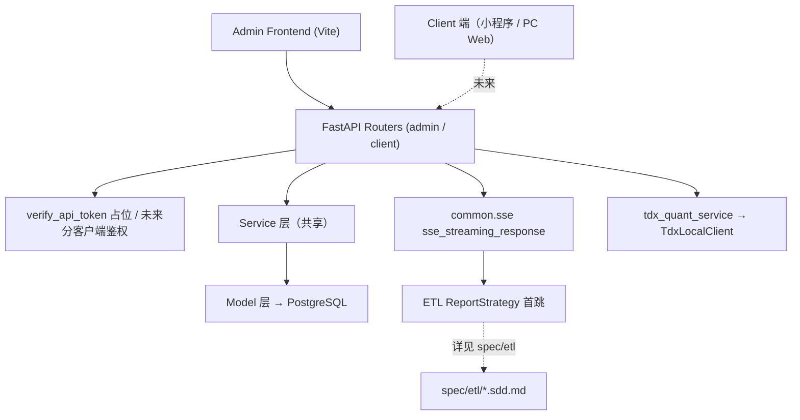

# Quantus API · SDD 规格文档

本目录按**客户端类型**组织 HTTP API 的运行规格，从 [`src/api/`](../../src/api/) 反推，供前后端对接、运维与 Review 使用。

## 客户端划分

| 子目录 | 受众 | 前缀 | 鉴权 | 状态 |
|--------|------|------|------|------|
| [`admin/`](./admin/) | Agent 管理后台（`src/web/admin`） | `/api/admin` | 占位 `verify_api_token` | 已上线 |
| `client/` | toC 用户端（小程序 / PC Web 共用） | `/api/v1` | 待实现（JWT / 微信登录等） | **未启用** |

> 客户端 API 不按平台拆分 —— 小程序和 PC Web 的业务数据一致，差异（字段裁剪、鉴权、限流）在 deps/middleware 层处理。详见根 [`CLAUDE.md`](../../CLAUDE.md)。

## 与 `spec/etl/` 的分工

| 文档 | 定位 |
|------|------|
| [`spec/etl/`](../etl/README.md) | CLI / ETL 任务：Strategy → Workflow → Extract/Transform/Load 全链 |
| `spec/api/**/*.sdd.md` | HTTP 入口：Router → Service/Model **或** ETL Strategy 首跳；ETL 内部不再展开 |

**ETL 引用约定：** API 若调用 ETL，文档只写到 **第一个 ETL 模块函数**（通常为 `ReportStrategy.*`），并链接对应 ETL SDD。

## 应用入口

| 项 | 值 |
|----|-----|
| 框架 | FastAPI 1.x |
| 入口 | [`src/api/main.py`](../../src/api/main.py) |
| 启动 | `uvicorn src.api.main:app --host 0.0.0.0 --port 8000` 或 `quantus-api` |
| OpenAPI | `/docs`、`/redoc` |
| 生命周期 | `tdx_quant_service.startup()` / `shutdown()` |

## 路由前缀

| Router | 前缀 | 文件 |
|--------|------|------|
| financial | `/api/admin/financial` | [`admin/financial.py`](../../src/api/routers/admin/financial.py) |
| stock | `/api/admin/stock` | [`admin/stock.py`](../../src/api/routers/admin/stock.py) |
| kline | `/api/admin/kline` | [`admin/kline.py`](../../src/api/routers/admin/kline.py) |
| tdx | `/api/admin/tdx` | [`admin/tdx_quant.py`](../../src/api/routers/admin/tdx_quant.py) |
| quant | `/api/admin/quant` | [`admin/quant.py`](../../src/api/routers/admin/quant.py) |
| health | `/health` | [`main.py`](../../src/api/main.py)（无 `/api/admin` 前缀，不鉴权） |

## 文档索引

**通用规范**（新增 API 前先看）：

| 文档 | 适用 |
|------|------|
| [API开发规范.sdd.md](./API开发规范.sdd.md) | 新增 HTTP 端点 SOP；覆盖 ① Service 读（同步 JSON）与 ② ETL Strategy + SSE 写两种主流模式 |

**Admin 端点 SDD**（详见 [`admin/README.md`](./admin/README.md)）：

| 文档 | 方法 | 路径 | 响应类型 |
|------|------|------|----------|
| [健康检查](./admin/健康检查.sdd.md) | GET | `/health` | JSON |
| [财报-三表历史入库-SSE](./admin/财报-三表历史入库-SSE.sdd.md) | POST ×3 | `/api/admin/financial/report/*-history-init` | **SSE** |
| [财报-报告期列表](./admin/财报-报告期列表.sdd.md) | POST | `/api/admin/financial/report/period-list` | JSON |
| [K线-日列表](./admin/K线-日列表.sdd.md) | POST | `/api/admin/kline/daily/trade-date-list` | JSON |
| [股票-列表查询](./admin/股票-列表查询.sdd.md) | GET | `/api/admin/stock/list` | JSON |
| [通达信-tq代理](./admin/通达信-tq代理.sdd.md) | GET / POST | `/api/admin/tdx/*` | JSON |
| [因子-因子列表](./admin/因子-因子列表.sdd.md) | GET | `/api/admin/quant/factor/list` | JSON |

**合计 11 个 HTTP 端点**（3 个 SSE + 8 个 JSON）。

**Client 端点 SDD**：目录未启用，未来新增时建 `client/README.md`。

## 公共架构

## 鉴权（公共）

| 项 | 说明 |
|----|------|
| 依赖 | [`src/api/deps.py`](../../src/api/deps.py) `verify_api_token` |
| Header | `Authorization` 或 `X-API-Token` |
| 当前行为 | **占位实现，未校验**；`/health` 不鉴权 |
| 挂载 | 所有 `/api/admin` router 的 `dependencies=[Depends(verify_api_token)]` |
| 未来 | 按客户端类型分发：admin 用 API Token，client 用 JWT / 微信登录 |

## SSE 公共机制

长任务（财报历史入库）使用 [`src/common/sse.py`](../../src/common/sse.py)：

| 机制 | 说明 |
|------|------|
| 包装 | `sse_streaming_response(task, start_date, thread_name=...)` |
| 线程 | daemon 后台线程执行同步 ETL，进度写入 `queue.Queue` |
| 消费 | 异步 `get_nowait` + `asyncio.sleep` 轮询（避免阻塞线程池） |
| Content-Type | `text/event-stream` |
| 帧格式 | `data: {json}\n\n` |
| 代理 | Header `X-Accel-Buffering: no`；建议 Nginx `proxy_buffering off` |

详见 [财报-三表历史入库-SSE.sdd.md](./admin/财报-三表历史入库-SSE.sdd.md)。

## 环境依赖（公共）

| 变量 | 用途 |
|------|------|
| `POSTGRESQL_*` | Service/Model 读库 |
| `TUSHARE_API_KEY` | SSE 财报入库 ETL |
| `TDX_QUANT_ENABLED` / `TDX_ROOT` | 通达信本地客户端 |
| `REPORT_PERIOD_COUNT_START_DATE` | ETL 默认起点（API body 可覆盖为 `19900101`） |
| `KLINE_DAILY_START_DATE` | 日 K API / ETL 默认起点 |

配置：[`src/common/setting.py`](../../src/common/setting.py)

## 未暴露为 HTTP 的 ETL 能力

以下能力仅在 CLI / 内部调用，**无对应 API**（见 [`spec/etl/`](../etl/README.md)）：

- `report check-report-complete`
- `stock pull-list-a`
- `trade-cal pull-history`
- 其余 `kline` 命令（`trade-date-list` 读库 API 见 [K线-日列表.sdd.md](./admin/K线-日列表.sdd.md)）

如需 Admin 触发 ETL，须新增 Router / SSE 或继续用 CLI。
