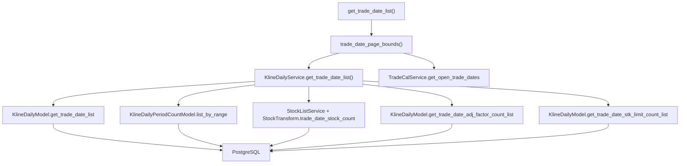

# SDD · 日 K 交易日列表

> **状态：** 已实现  
> **模式：** ① Service 读（同步 JSON） — 通用约定见 [API开发规范.sdd.md](./API开发规范.sdd.md)  
> **HTTP：** `POST /api/admin/kline/daily/trade-date-list`  
> **响应：** JSON  
> **参考：** [`财报-报告期列表.sdd.md`](./财报-报告期列表.sdd.md)  
> **源码：** [`src/api/routers/admin/kline.py`](../../src/api/routers/admin/kline.py) L34–61

---

## 1. 概述

分页查询 SSE 开市日及日 K、复权因子、涨跌停采集条数。**活跃股票数、kline_daily 与各 satellite 字段条数均为 API 读库实时计算**；`kline_daily_period_count` 快照仅用于确定开市日行列表（须先跑 ETL 刷新快照行）。

与财报报告期列表对称：财报按**季末**分页、合并三表 count；日 K 按**开市日**分页、返回 `kline_daily` 条数并补 `kline_daily_period_count` 快照中的 `period_stock_count`。

### 触发示例

```bash
curl -X POST http://localhost:8000/api/admin/kline/daily/trade-date-list \
  -H "Content-Type: application/json" \
  -d '{"page": 1, "count": 20, "start_date": "20200101"}'
```

---

## 2. 调用链



| 层级 | 组件 | 文件 |
|------|------|------|
| Router | `get_trade_date_list` | [`admin/kline.py`](../../src/api/routers/admin/kline.py) |
| Schema | `KlineDailyDateListRequest` / `KlineDailyDateItem` | [`schemas/kline_daily.py`](../../src/api/schemas/kline_daily.py) |
| 工具 | `trade_date_page_bounds` | [`src/common/function.py`](../../src/common/function.py) L128–165 |
| Service | `KlineDailyService.get_trade_date_list` | [`src/service/kline/kline_daily_service.py`](../../src/service/kline/kline_daily_service.py) |
| Model | 见下表 | `src/model/kline/`、`StockListService` |
| 日历 | `TradeCalService.get_open_trade_dates` | [`src/service/trade_cal/trade_cal_service.py`](../../src/service/trade_cal/trade_cal_service.py) |
| ETL | — | **无** |

### Model 层

| Model | 表 | 查询 |
|-------|-----|------|
| `KlineDailyPeriodCountModel` | `kline_daily_period_count` | 区间内开市日行列表（`trade_date` 倒序） |
| `StockListService` + `StockTransform` | `stock_list` | 实时 `trade_date_stock_count` → `period_stock_count` |
| `KlineDailyModel` | `kline_daily` | `GROUP BY trade_date` → `kline_daily_count`；`adj_factor IS NOT NULL` → `kline_adj_factor_count`；`up_limit/down_limit` 均非空 → `kline_stk_limit_count` |

Service：`period_stock_count`、`kline_daily_count`、`kline_adj_factor_count` 与 `kline_stk_limit_count` **均实时计算**；快照表仅提供分页窗口内的开市日行。

---

## 3. 请求

**Body Schema：** `KlineDailyDateListRequest`

| 字段 | 类型 | 默认 | 说明 |
|------|------|------|------|
| `start_date` | string \| null | `KLINE_DAILY_START_DATE`（路由层填充，通常 `19900101`） | 交易日下界 YYYYMMDD |
| `end_date` | string \| null | 今日 | 交易日上界 |
| `page` | int | `1` | ≥1，第 1 页为**最新**开市日 |
| `count` | int | `50` | 1–500，每页开市日个数 |

校验：`start_date` 不得大于 `end_date`。

### 分页逻辑

1. 在 `[start_bound, end_bound]` 内调用 `TradeCalService.get_open_trade_dates(exchange="SSE")` 得全部开市日（升序）
2. 按新→旧分页，取当前页的 `(window_lo, window_hi)`
3. 仅在此窗口内查 `kline_daily_period_count` 快照；**快照无记录的开市日不占行**（须先跑 `kline update-daily-period-count`）
4. `bounds is None`（越页 / 空区间 / 日历无数据）→ 返回 `[]`

`trade_date_page_bounds` 与 [`report_period_page_bounds`](../../src/common/function.py) 结构一致，仅将「季度末序列」替换为「SSE 开市日序列」。

---

## 4. 响应

**Schema：** `KlineDailyDateListResponse`

```json
{
  "items": [
    {
      "trade_date": "20241231",
      "period_stock_count": 5123,
      "kline_daily_count": 5100,
      "kline_adj_factor_count": 5080,
      "kline_stk_limit_count": 5075
    }
  ],
  "total": 245
}
```

| 字段 | 说明 |
|------|------|
| `items` | 当前页行列表 |
| `total` | 区间内 SSE 开市日总数（ProTable 分页用；与 `items` 条数可能不同） |
| `items[].trade_date` | 开市日 YYYYMMDD |
| `items[].period_stock_count` | 实时 `StockTransform.trade_date_stock_count`；`stock pull-list-a` 更新后立即生效 |
| `items[].kline_daily_count` | 实时 `kline_daily` 该日行数；无数据为 0 |
| `items[].kline_adj_factor_count` | 实时 `kline_daily.adj_factor` 非空该日行数；无数据为 0 |
| `items[].kline_stk_limit_count` | 实时 `kline_daily.up_limit`、`down_limit` 均非空该日行数；无数据为 0 |

Admin 可据 `kline_daily_count / period_stock_count ≥ 0.95` 判断完整性（与 ETL [`pull-daily-by-date-range`](../etl/K线-按date区间增量.sdd.md) 一致），**本 API 不额外返回布尔字段**。

---

## 5. 执行特性

| 项 | 说明 |
|----|------|
| 同步路由 | FastAPI 在线程池执行（非 async def） |
| 鉴权 | `verify_api_token`（占位） |
| 方法 | POST + JSON Body（与财报报告期列表一致，便于 ProTable 分页传参） |

---

## 6. 相关

| 项 | 关系 |
|----|------|
| ETL `kline update-daily-period-count` | 写入 `kline_daily_period_count` 快照（含 daily/adj/stk 条数） |
| ETL `kline pull-daily-by-date-range` | 按 95% 规则补拉缺失日；Admin 操作列可挂接（待 SSE/CLI 封装） |
| ETL `trade-cal pull-history` | 维护 `stock_trade_calendar`，分页序列依赖 SSE 开市日 |
| Admin 日 K 列表页 | 典型消费方（对标 [`ReportPeriodList`](../../quantus_admin/src/pages/financial/ReportPeriodList/index.tsx)） |
| 财报报告期列表 API | 分页与响应形态参考实现 |

---

## 7. 附录 · Call Stack

```
POST /api/admin/kline/daily/trade-date-list
└─ get_trade_date_list(body)
   ├─ start_bound = body.start_date or settings.kline_daily_start_date or "19900101"
   ├─ end_bound = body.end_date or today
   ├─ trade_date_page_bounds(start_bound, end_bound, page, count) → window_lo, window_hi
   ├─ TradeCalService.get_open_trade_dates() → total
   └─ KlineDailyService().get_trade_date_list(start_date=window_lo, end_date=window_hi) → items
```

### 与财报报告期列表对照

| 维度 | 财报 `period-list` | 日 K `trade-date-list` |
|------|-------------------|------------------------|
| 时间轴 | 季末 `report_period_generate` | SSE 开市日 `get_open_trade_dates` |
| 主表 count | 三表 `report_*_count` | `kline_daily_count` |
| 快照表 | `financial_report_period_count` | `kline_daily_period_count` |
| 默认起点 | `19900101` | `KLINE_DAILY_START_DATE` |
| 分页工具 | `report_period_page_bounds` | `trade_date_page_bounds` |
