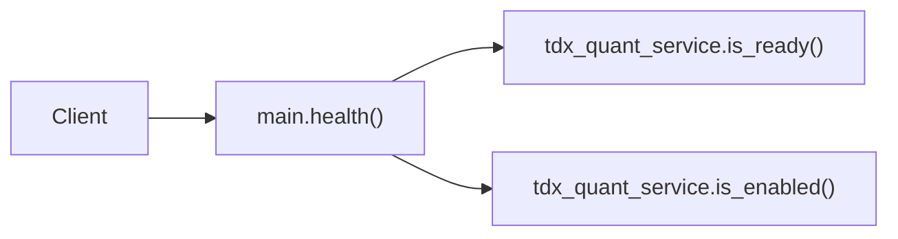

# SDD · 健康检查

> **HTTP：** `GET /health`  
> **鉴权：** 无  
> **源码：** [`src/api/main.py`](../../src/api/main.py) L38–43

---

## 1. 概述

轻量存活探针，返回服务状态及通达信本地客户端就绪情况。不访问数据库。

### 触发方式

```bash
curl http://localhost:8000/health
```

---

## 2. 调用链



| 层级 | 组件 | 说明 |
|------|------|------|
| Router | `health()` | 直接挂在 `app`，非 `/api/admin` |
| Service | `tdx_quant_service` | [`src/api/services/tdx_quant_service.py`](../../src/api/services/tdx_quant_service.py) |
| Model | — | 无 |
| ETL | — | 无 |

---

## 3. 请求

无 Query、Body、Header 要求。

---

## 4. 响应

**Content-Type：** `application/json`

```json
{
  "status": "ok",
  "tdx_quant": "ready | disabled | unavailable"
}
```

| `tdx_quant` 值 | 条件 |
|----------------|------|
| `ready` | `TDX_QUANT_ENABLED=true` 且 `TdxLocalClient` 已初始化 |
| `disabled` | `TDX_QUANT_ENABLED=false` |
| `unavailable` | 已启用但客户端未就绪 |

---

## 5. 相关命令

| 项 | 关系 |
|----|------|
| `/api/admin/tdx/*` | 依赖本探针中的 TDX 就绪状态 |
| ETL `kline pull-daily-by-date-range` | tdx_quant 数据源走 HTTP 中转，与本探针独立 |
