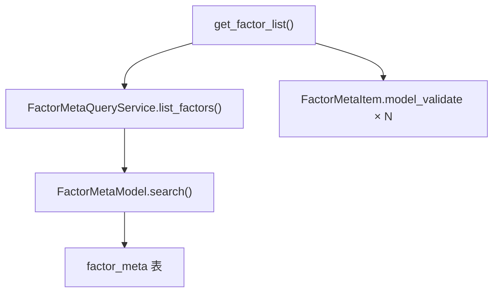

# SDD · 因子列表查询

> **HTTP：** `GET /api/admin/quant/factor/list`
> **响应：** JSON
> **模式：** ① Service 读（同步，秒级返回）
> **源码：** `src/api/routers/admin/quant.py`

---

## 1. 概述

返回 `factor_meta` 表中的因子列表，供 Admin 因子管理页面展示。纯读库，**不调用 ETL**。

### 触发示例

```bash
# 全量
curl "http://localhost:8000/api/admin/quant/factor/list"

# 按来源筛选
curl "http://localhost:8000/api/admin/quant/factor/list?source=tushare"

# 按分类筛选
curl "http://localhost:8000/api/admin/quant/factor/list?category=基本面"
```

---

## 2. 调用链



| 层级 | 组件 | 文件 |
|------|------|------|
| Router | `get_factor_list` | `src/api/routers/admin/quant.py` |
| Schema | `FactorMetaItem` | `src/api/schemas/factor_meta.py` |
| Service | `FactorMetaQueryService.list_factors` | `src/service/quant/factor_meta_query_service.py` |
| Model | `FactorMetaModel.search` | `src/model/quant/factor_meta_model.py` |
| Entity | `FactorMetaEntities` | `src/entities/data_entities/factor_meta_entities.py` |

---

## 3. 请求（Query 参数）

全部可选。

| 参数 | 类型 | 说明 |
|------|------|------|
| `source` | str | 来源筛选：`自研` / `tushare` |
| `category` | str | 分类筛选：`量价` / `基本面` / `技术` / `统计` 等 |

---

## 4. 响应

```json
[
  {
    "factor_name": "momentum_20d",
    "display_name": "20日动量",
    "source": "自研",
    "category": "price_volume",
    "formula": "{'window': 20}",
    "start_date": "19910305",
    "end_date": "20260608",
    "month_count": 424
  }
]
```

### FactorMetaItem Schema

| 字段 | 类型 | 说明 |
|------|------|------|
| factor_name | str | 因子名称 |
| display_name | str \| None | 中文名称 |
| source | str | 来源 |
| category | str \| None | 分类 |
| formula | str \| None | 算法说明 |
| start_date | str \| None | Parquet 最早日 |
| end_date | str \| None | Parquet 最晚日 |
| month_count | int \| None | Parquet 月份数 |

---

## 5. 数据依赖

| 表 | 操作 |
|----|------|
| `factor_meta` | 读 |

前置：`factor update-meta` CLI 命令需先跑过至少一次。
