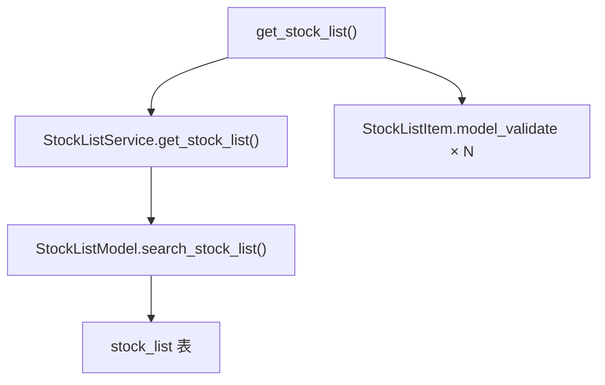

# SDD · 股票列表查询

> **HTTP：** `GET /api/admin/stock/list`  
> **响应：** JSON  
> **源码：** [`src/api/routers/admin/stock.py`](../../src/api/routers/admin/stock.py) L16–89

---

## 1. 概述

按多条件筛选返回 `stock_list` 表记录，供 Admin 股票列表页等使用。纯读库，**不调用 ETL**。

### 触发示例

```bash
curl "http://localhost:8000/api/admin/stock/list?exchange=SSE&period=1&name=银行"
```

---

## 2. 调用链



| 层级 | 组件 | 文件 |
|------|------|------|
| Router | `get_stock_list` | [`admin/stock.py`](../../src/api/routers/admin/stock.py) |
| Schema | `StockListItem` | [`schemas/stock_list.py`](../../src/api/schemas/stock_list.py) |
| Service | `StockListService.get_stock_list` | [`src/service/stock/stock_list_service.py`](../../src/service/stock/stock_list_service.py) |
| Model | `StockListModel.search_stock_list` | [`src/model/stock/stock_list_model.py`](../../src/model/stock/stock_list_model.py) |
| Entity | `StockListEntities` | [`stock_list_entities.py`](../../src/entities/data_entities/stock_list_entities.py) |
| ETL | — | **无** |

---

## 3. 请求（Query 参数）

全部可选。

| 参数 | 匹配方式 | 说明 |
|------|----------|------|
| `period` | 上市状态 | 空/`0` 不限；`1` = 截止**今日**在市未退市；否则 YYYYMMDD 参考日 |
| `ts_code` | ILIKE 模糊 | 股票代码 |
| `symbol` | ILIKE 模糊 | 语义同 `ts_code` 列；与 `ts_code` 同时传则**交集** |
| `name` | ILIKE 模糊 | 名称 |
| `cnspell` | ILIKE 模糊 | 拼音 |
| `market` | ILIKE 模糊 | 上市板 |
| `exchange` | 等值 | `BSE` / `SSE` / `SZSE` |
| `shenwan_1/2/3` | ILIKE 模糊 | 申万行业 |
| `zhengjian_1/2` | ILIKE 模糊 | 证监会行业 |
| `concept` / `area` / `city` / `country` | ILIKE 模糊 | 地区/概念 |
| `is_ggt` | 等值 | 港股通 `1`/`0` |
| `is_hs` | 等值 | 沪深港通 `Y`/`N` 或 `1`/`0` |

### period 过滤规则（Model 层）

参考日 `ref_date` 下：`list_date <= ref_date` 且（`delist_date` 为空或 `> ref_date`）。与 ETL `StockTransform.period_stock_count` 规则一致。

---

## 4. 响应

**Schema：** `list[StockListItem]` — 与 `stock_list` 表全列一致。

主要字段：`id`, `ts_code`, `symbol`, `name`, `exchange`, `market`, `list_date`, `delist_date`, 行业/地区字段, `kline_*_ddl`, `report_*_ddl` 等。

ORM → Pydantic：`StockListItem.model_validate(r)`。

---

## 5. 数据依赖

| 表 | 操作 |
|----|------|
| `stock_list` | 读 |

**数据维护（ETL，非本 API）：** [`spec/etl/基础-A股股票列表拉取.sdd.md`](../etl/基础-A股股票列表拉取.sdd.md)

---

## 6. 执行特性

| 项 | 说明 |
|----|------|
| 方法 | GET，无 Body |
| 同步路由 | 线程池执行 |
| 鉴权 | `verify_api_token`（占位） |

---

## 7. 附录 · Call Stack

```
GET /api/admin/stock/list?...
└─ get_stock_list(query params)
   └─ StockListService().get_stock_list(**filters)
      └─ StockListModel.search_stock_list(**merged)
         └─ Database → stock_list
   └─ [StockListItem.model_validate(r) for r in rows]
```
