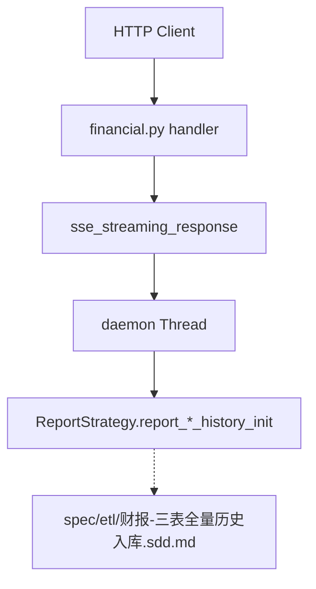

# SDD · 财报三表历史入库（SSE）

> **模式：** ② ETL Strategy + SSE 写 — 通用约定见 [API开发规范.sdd.md](./API开发规范.sdd.md)  
> **HTTP：** `POST /api/admin/financial/report/{income|balance|cashflow}-history-init`  
> **响应：** `text/event-stream`（Server-Sent Events）  
> **源码：** [`src/api/routers/admin/financial.py`](../../src/api/routers/admin/financial.py)

---

## 1. 概述

三个接口结构相同，分别触发利润表、资产负债表、现金流量表的**按报告期批量历史入库**。在后台线程执行 ETL，通过 SSE 推送进度。对应 CLI 中 `report report-history-init` 的单表阶段（CLI 一次跑三表+period_count，API 按表拆分且**不含**最后的 `financial_report_period_count`）。

### 端点一览

| 路径 | Handler | ETL 首跳 |
|------|---------|----------|
| `POST .../report/income-history-init` | `report_income_history_init` | `ReportStrategy.report_income_history_init` |
| `POST .../report/balance-history-init` | `report_balance_history_init` | `ReportStrategy.report_balance_history_init` |
| `POST .../report/cashflow-history-init` | `report_cashflow_history_init` | `ReportStrategy.report_cashflow_history_init` |

### 触发示例

```bash
curl -N -X POST http://localhost:8000/api/admin/financial/report/income-history-init \
  -H "Content-Type: application/json" \
  -d '{"start_date": "20100101"}'
```

---

## 2. 调用链



| 层级 | 组件 | 说明 |
|------|------|------|
| Router | `sse_streaming_response(...)` | [`src/common/sse.py`](../../src/common/sse.py) |
| Service | — | **无**，跳过 Service 直调 ETL |
| Model | — | ETL 内部使用（见 ETL SDD） |
| **ETL 首跳** | `ReportStrategy().report_*_history_init(start_date, progress_queue=q)` | [`src/etl/strategy/financial/report_strategy.py`](../../src/etl/strategy/financial/report_strategy.py) |

**ETL 后续（不在本文展开）：** 见 [`spec/etl/财报-三表全量历史入库.sdd.md`](../etl/财报-三表全量历史入库.sdd.md) — `LocalReportExtract.list_periods_below_threshold` → `ReportWorkflow.report_by_period(report_type, period)`。

---

## 3. 请求

**Content-Type：** `application/json`  
**Body Schema：** `IncomeHistoryInitRequest`（三接口共用）

| 字段 | 类型 | 默认 | 说明 |
|------|------|------|------|
| `start_date` | string | `"19900101"` | 报告期起点 YYYYMMDD，正则 `^\d{8}$` |

Body 可省略或 `{}`，等价于默认 `start_date`。

**与 CLI 差异：** CLI `report-history-init` 使用 `REPORT_PERIOD_COUNT_START_DATE` 且不可传参；API 默认 `19900101` 且 body 可覆盖。

---

## 4. 响应（SSE 帧序列）

**Content-Type：** `text/event-stream`  
**帧格式：** `data: {json}\n\n`

| 顺序 | 帧类型 | JSON 示例 | 来源 |
|------|--------|-----------|------|
| 1 | started | `{"status":"started"}` | SSE 框架首帧（路由层） |
| 2 | running | `{"status":"running","total":42}` | Strategy 算出期数后 |
| 3..N | progress | `{"index":1,"total":42,"period":"20241231","saved":5123}` | 每期入库完成 |
| 末 | done | `{"done":true,"periods":["20241231","20240930",...]}` | 全部完成 |
| 异常 | error | `{"error":"..."}` | worker 线程异常 |

**Schema 契约：** [`src/api/schemas/financial_report.py`](../../src/api/schemas/financial_report.py) — `IncomeHistoryInitStream*` 系列。

### 客户端注意事项

- 使用 `curl -N` 或 EventSource，避免缓冲吞首帧
- 第一期 ETL 完成前可能长时间无 progress 帧（仅有 started/running）
- Nginx 需 `proxy_buffering off`、足够长的 `proxy_read_timeout`
- 断连后 daemon 线程仍会继续跑完（无取消机制）

---

## 5. 数据与外部依赖（ETL 侧摘要）

| 表 | 操作 |
|----|------|
| `financial_report_period_count` | 读（95% 筛期） |
| `stock_list` | 读（退市过滤） |
| `financial_report_income` / `financial_report_balance` / `financial_report_cashflow` | 写 |

| API | 表 |
|-----|-----|
| `income_vip` | income |
| `balancesheet_vip` | balance |
| `cashflow_vip` | cashflow |

---

## 6. 与 CLI / ETL SDD 对照

| 项 | API（本接口） | CLI `report report-history-init` |
|----|---------------|----------------------------------|
| 范围 | 单表 | 三表 + `financial_report_period_count` |
| start_date | body 默认 `19900101` | `REPORT_PERIOD_COUNT_START_DATE` |
| 进度 | SSE | tqdm |
| ETL 首跳 | 同上 ReportStrategy | 同上 |

---

## 7. 附录 · Call Stack

```
POST /api/admin/financial/report/income-history-init
└─ report_income_history_init()
   └─ sse_streaming_response(ReportStrategy().report_income_history_init, start_date)
      └─ [Thread] ReportStrategy.report_income_history_init(start_date, progress_queue=q)
         └─ （ETL 详见 spec/etl/财报-三表全量历史入库.sdd.md）
```

balance / cashflow 路径仅替换 Strategy 方法名。
