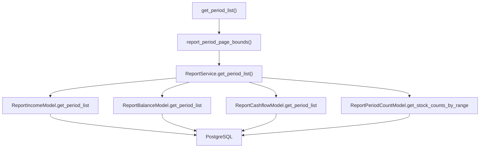

# SDD · 财报报告期列表

> **模式：** ① Service 读（同步 JSON） — 通用约定见 [API开发规范.sdd.md](./API开发规范.sdd.md)  
> **HTTP：** `POST /api/admin/financial/report/period-list`  
> **响应：** JSON  
> **源码：** [`src/api/routers/admin/financial.py`](../../src/api/routers/admin/financial.py) L109–147

---

## 1. 概述

分页查询报告期及三表采集条数快照。纯读库聚合，**不调用 ETL**。

### 触发示例

```bash
curl -X POST http://localhost:8000/api/admin/financial/report/period-list \
  -H "Content-Type: application/json" \
  -d '{"page": 1, "count": 20, "start_period_date": "20200101"}'
```

---

## 2. 调用链



| 层级 | 组件 | 文件 |
|------|------|------|
| Router | `get_period_list` | [`admin/financial.py`](../../src/api/routers/admin/financial.py) |
| 工具 | `report_period_page_bounds` | [`src/common/function.py`](../../src/common/function.py) L97–125 |
| Service | `ReportService.get_period_list` | [`src/service/financial/report_service.py`](../../src/service/financial/report_service.py) L20–72 |
| Model | 见下表 | `src/model/financial/` |
| ETL | — | **无** |

### Model 层

| Model | 表 | 查询 |
|-------|-----|------|
| `ReportIncomeModel` | `financial_report_income` | `GROUP BY end_date` → `report_income_count` |
| `ReportBalanceModel` | `financial_report_balance` | `GROUP BY end_date` → `report_balance_count` |
| `ReportCashflowModel` | `financial_report_cashflow` | `GROUP BY end_date` → `report_cashflow_count` |
| `ReportPeriodCountModel` | `financial_report_period_count` | 区间内 `period_stock_count` |

Service 合并三表 count，补 `period_stock_count`，按 `report_period` **倒序**返回。

---

## 3. 请求

**Body Schema：** `ReportPeriodListRequest`

| 字段 | 类型 | 默认 | 说明 |
|------|------|------|------|
| `start_period_date` | string \| null | `19900101`（路由层填充） | 报告期下界 YYYYMMDD |
| `end_period_date` | string \| null | 今日 | 报告期上界 |
| `page` | int | `1` | ≥1，第 1 页为**最新**报告期 |
| `count` | int | `50` | 1–500，每页季度个数 |

校验：`start_period_date` 不得大于 `end_period_date`。

### 分页逻辑

1. 在 `[start_bound, end_bound]` 内 `report_period_generate` 得全部季末
2. 按新→旧分页，取当前页的 `(window_lo, window_hi)`
3. 仅在此窗口内查库；**无数据的季度不占行**
4. `bounds is None`（越页/空区间）→ 返回 `[]`

---

## 4. 响应

**Schema：** `list[ReportPeriodItem]`

```json
[
  {
    "report_period": "20241231",
    "period_stock_count": 5123,
    "report_income_count": 5100,
    "report_balance_count": 5098,
    "report_cashflow_count": 5095
  }
]
```

| 字段 | 说明 |
|------|------|
| `report_period` | 季末 YYYYMMDD |
| `period_stock_count` | 来自 `financial_report_period_count`；无记录为 0 |
| `report_*_count` | 对应表该期行数；缺表为 0 |

---

## 5. 执行特性

| 项 | 说明 |
|----|------|
| 同步路由 | FastAPI 在线程池执行（非 async def） |
| 鉴权 | `verify_api_token`（占位） |

---

## 6. 相关

| 项 | 关系 |
|----|------|
| ETL `financial_report_period_count` | 写入 `period_stock_count` 快照的数据来源 |
| ETL `report update-period-count` | 刷新快照 |
| Admin 报告期页 | 典型消费方 |

---

## 7. 附录 · Call Stack

```
POST /api/admin/financial/report/period-list
└─ get_period_list(body)
   ├─ report_period_page_bounds(start, end, page, count) → window_lo, window_hi
   └─ ReportService().get_period_list(start_period_date=window_lo, end_period_date=window_hi)
      ├─ ReportIncomeModel.get_period_list()
      ├─ ReportBalanceModel.get_period_list()
      ├─ ReportCashflowModel.get_period_list()
      └─ ReportPeriodCountModel.get_stock_counts_by_range()
```
