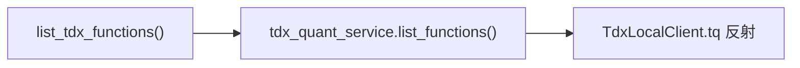
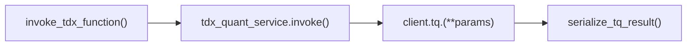
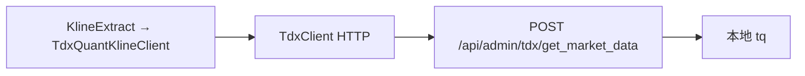

# SDD · 通达信 tq HTTP 代理

> **HTTP：**  
> - `GET /api/admin/tdx/functions`  
> - `POST /api/admin/tdx/{function_name}`  
> **响应：** JSON  
> **源码：** [`src/api/routers/admin/tdx_quant.py`](../../src/api/routers/admin/tdx_quant.py)

---

## 1. 概述

将本地通达信 `tqcenter` 客户端能力以 HTTP 形式暴露，供 ETL `tdx_quant` K 线 Client 远程调用（`TdxClient` → quantus-api）。**不经过 Service/Model/ETL 业务层**，直连 `tdx_quant_service`。

### 前置条件

| 条件 | 说明 |
|------|------|
| `TDX_QUANT_ENABLED=true` | 通常仅 Windows + 已安装通达信 |
| `TDX_ROOT` 等 | 见 [`setting.py`](../../src/common/setting.py) |
| API lifespan | 启动时 `tdx_quant_service.startup()` 初始化 `TdxLocalClient` |

---

## 2. 端点 A · 列出函数

### 请求

```
GET /api/admin/tdx/functions
```

### 调用链



| 层级 | 组件 |
|------|------|
| Router | `list_tdx_functions` |
| Service | [`tdx_quant_service.list_functions`](../../src/api/services/tdx_quant_service.py) L72–82 |
| Model / ETL | **无** |

**逻辑：** `inspect.getmembers(client.tq)` 过滤 `_` 前缀与 `_BLOCKED_FUNCTIONS`（如 `initialize`, `close`, `subscribe_*`）。

### 响应

```json
{ "functions": ["get_market_data", "stock_list", "..."] }
```

| HTTP | 条件 |
|------|------|
| 200 | 正常 |
| 503 | TDX 未启用或未初始化（`RuntimeError`） |

---

## 3. 端点 B · 调用函数

### 请求

```
POST /api/admin/tdx/{function_name}
Content-Type: application/json

{ "stock_list": ["000001.SZ"], "period": "1d", ... }
```

| 部分 | 说明 |
|------|------|
| Path | `function_name` — tq 公开方法名 |
| Body | kwargs 字典，默认 `{}` |

### 调用链



| 层级 | 组件 |
|------|------|
| Router | `invoke_tdx_function` |
| Service | [`tdx_quant_service.invoke`](../../src/api/services/tdx_quant_service.py) L85–96 |
| 序列化 | [`serialize_tq_result`](../../src/common/tdx_codec.py) |
| Model / ETL | **无** |

**安全：** 禁止 `_` 前缀函数及 `_BLOCKED_FUNCTIONS` 列表内方法。

### 响应

```json
{ "data": <任意 JSON 可序列化结果> }
```

| HTTP | 条件 |
|------|------|
| 200 | 调用成功 |
| 400 | 未知函数、禁止函数、参数 TypeError |
| 502 | 调用过程其它异常 |
| 503 | TDX 未就绪 |

---

## 4. 与 ETL 的关系

ETL K 线 **不经过本 Router**，而是 Client 侧 HTTP 调用同一服务：



| ETL 首跳 | 远程调用 |
|----------|----------|
| `KlineExtract.pull_kline_daily_range` | 内部可能 `TdxClient.get_market_data` → **本 API** |

详见 [`spec/etl/K线-按date区间增量.sdd.md`](../etl/K线-按date区间增量.sdd.md)。

---

## 5. 生命周期

| 事件 | 行为 |
|------|------|
| API startup | `TdxLocalClient._ensure_tq()` |
| API shutdown | `client.close()` |
| `GET /health` | `tdx_quant` 字段反映就绪状态 |

---

## 6. 附录 · Call Stack

```
GET /api/admin/tdx/functions
└─ list_tdx_functions()
   └─ tdx_quant_service.list_functions()
      └─ inspect.getmembers(TdxLocalClient.tq)

POST /api/admin/tdx/{function_name}
└─ invoke_tdx_function(function_name, params)
   └─ tdx_quant_service.invoke(function_name, params)
      └─ getattr(client.tq, function_name)(**params)
      └─ serialize_tq_result(result)
```
