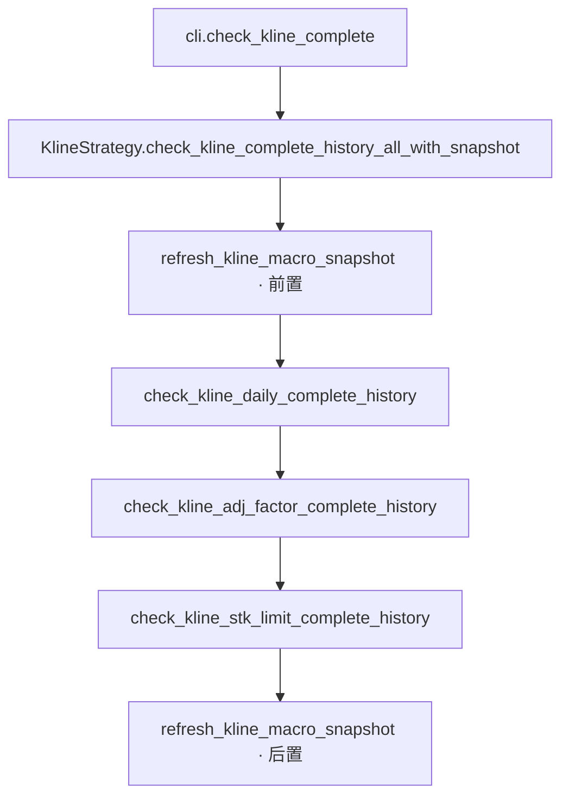
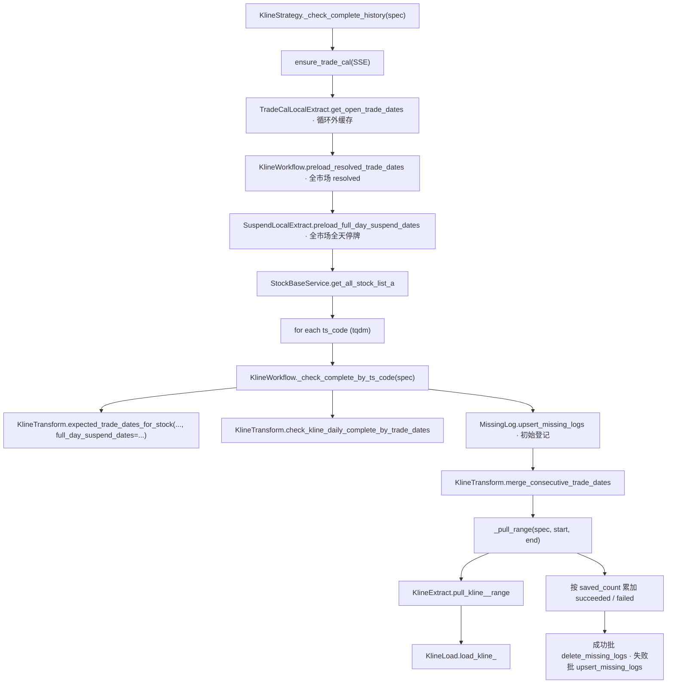
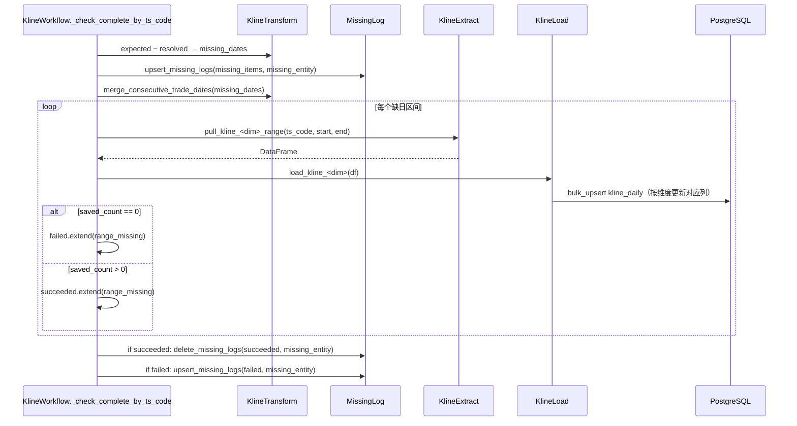

# SDD · K 线完整性校验（三维度合并）

> **CLI 命令：** `kline check-complete`（聚合，按 daily → adj_factor → stk_limit 顺序执行）
> **隐藏别名：** `kline check-daily-complete` / `kline check-adj-factor-complete` / `kline check-stk-limit-complete`（单维度）
> **交互菜单：** —（Typer 子命令；`pull-*-by-date-range` 流程首尾已自动补位）
> **参考实现：** [`report check-report-complete`](./财报-完整性校验.sdd.md)
> **源码入口：** [`src/etl/cli.py`](../../src/etl/cli.py)

---

## 1. 概述

对全 A 股逐只股票、三个维度（**日线 / 复权因子 / 涨跌停**）依次检查**在其上市存续期内、SSE 开市日维度**的数据是否齐全（**微观查漏补拉**）。每个维度发现缺日时写入 `log_missing`，并按**连续缺日合并为区间**后调用对应 `pull_kline_<dim>_range` 补拉、upsert 入库。三维度共享同一份 ETL 编排（Strategy → Workflow → Extract → Load）+ 缺日判定 Transform，仅在 spec 表里参数化 missing_entity / count 列 / resolved-dates 查询方法 / Workflow 方法名等少量字段。

「应有交易日」由**个股交易日历**给出：`SSE 开市日 ∩ [list_date, delist_date) − 全天停牌日（suspend_d 中 suspend_type='S' AND suspend_timing=''）`，避免把停牌日误判为缺日。计算口径见 [`StockTradeCalendarService.compute_stock_trade_calendar`](../../src/service/stock/stock_trade_calendar_service.py)；批量场景由 Strategy 一次性 `SuspendLocalExtract.preload_full_day_suspend_dates` 后注入 Workflow，消除逐股 DB 查询。

| 维度 | missing_entity | resolved-dates 来源 | 写入列 | 默认数据源链 |
|------|----------------|---------------------|--------|--------------|
| daily | `kline_daily` | `KlineDailyService.get_trade_dates_by_ts_code` | OHLCV / amount / pre_close / change / pct_chg | tdx_quant → tushare |
| adj_factor | `kline_adj_factor` | `get_trade_dates_with_adj_factor_by_ts_code` | `adj_factor` | tushare |
| stk_limit | `kline_stk_limit` | `get_trade_dates_with_stk_limit_by_ts_code` | `up_limit` / `down_limit` | tushare |

执行顺序：**前置宏观快照刷新 → 三轮微观补拉 → 后置宏观快照刷新**（与 `report check-report-complete` 同构）。

### 触发方式

```bash
# 三维度一次性
uv run ./src/etl/cli.py kline check-complete

# 单维度（隐藏别名）
uv run ./src/etl/cli.py kline check-daily-complete
uv run ./src/etl/cli.py kline check-adj-factor-complete
uv run ./src/etl/cli.py kline check-stk-limit-complete
```

### 前置依赖

| 依赖 | 说明 |
|------|------|
| `stock_list` | A 股列表与 `list_date` / `delist_date`；通过 `stock pull-list-a` 维护 |
| `stock_trade_calendar` | SSE 开市日序列；运行前 `ensure_trade_cal` 自动补缺口 |
| `stock_suspend` | 全天停牌名单（`suspend_type='S' AND suspend_timing=''`），通过 `suspend pull-by-date` 维护；缺数据则停牌日会被误判为缺日 |
| `KLINE_DAILY_START_DATE` | daily / adj_factor 检查起点（`.env`，默认 `19900101`） |
| `KLINE_STK_LIMIT_START_DATE` | stk_limit 检查起点（`.env`，默认 `20090601`） |
| `TUSHARE_API_KEY` / tdx HTTP | 补拉时按维度 `data_source_config` 的链降级 |
| PostgreSQL | 读已有 `trade_date`、写补拉结果与 `log_missing` |

### CLI 参数

无（与 `report check-report-complete` 一致；区间由对应起始日 env 与 `stock_list` 推导）。

---

## 2. CLI 入口

| 命令 | 处理函数 | 菜单 key |
|------|----------|----------|
| `check-complete` | `check_kline_complete()` → `KlineStrategy.check_kline_complete_history_all_with_snapshot()` | `kline-check-complete` |
| `check-daily-complete` | `check_kline_daily_complete()` → `check_kline_daily_complete_history()` | hidden 别名 |
| `check-adj-factor-complete` | `check_kline_adj_factor_complete()` → `check_kline_adj_factor_complete_history()` | hidden 别名 |
| `check-stk-limit-complete` | `check_kline_stk_limit_complete()` → `check_kline_stk_limit_complete_history()` | hidden 别名 |

---

## 3. 分层架构（dispatch 化）

```
CLI
  └─ KlineStrategy.check_kline_complete_history_all_with_snapshot()
       ├─ refresh_kline_macro_snapshot()                    ← 前置宏观（kline_daily_period_count）
       ├─ for dim in (daily, adj_factor, stk_limit):
       │   └─ check_kline_<dim>_complete_history()
       │       └─ _check_complete_history(spec)             ← spec dispatch 入口
       │           ├─ ensure_trade_cal(SSE)
       │           ├─ TradeCalLocalExtract.get_open_trade_dates(全区间)  ← 循环外缓存
       │           ├─ KlineWorkflow.preload_resolved_trade_dates(spec.name) ← 全市场 resolved
       │           ├─ SuspendLocalExtract.preload_full_day_suspend_dates() ← 全市场全天停牌
       │           ├─ for ts_code in stock_list:
       │           │   └─ KlineWorkflow.check_kline_<dim>_complete_by_ts_code(
       │           │           ts_code,
       │           │           open_trade_dates=...,           ← 复用循环外缓存
       │           │           resolved_trade_dates=...,       ← 来自 resolved 预加载
       │           │           full_day_suspend_dates=...,     ← 来自 suspend 预加载
       │           │       )
       │           │       └─ _check_complete_by_ts_code(spec)
       │           │           ├─ KlineTransform.expected_trade_dates_for_stock(..., full_day_suspend_dates=...)
       │           │           ├─ KlineTransform.check_kline_daily_complete_by_trade_dates → missing_dates
       │           │           ├─ MissingLog.upsert_missing_logs(missing_entity)  ← 初始登记
       │           │           ├─ KlineTransform.merge_consecutive_trade_dates → ranges
       │           │           ├─ for (range_start, range_end) in ranges:
       │           │           │   └─ _pull_range(spec, range_start, range_end)
       │           │           │       ├─ KlineExtract.pull_kline_<dim>_range
       │           │           │       └─ KlineLoad.load_kline_<dim>
       │           │           ├─ if succeeded: MissingLog.delete_missing_logs(succeeded, missing_entity)
       │           │           └─ if failed:    MissingLog.upsert_missing_logs(failed, missing_entity)  # try_count++
       └─ refresh_kline_macro_snapshot()                    ← 后置宏观
```

**spec 来源：** [`_KlineWorkflowSpec`](../../src/etl/workflow/kline/kline_workflow.py) 含 `missing_entity` / `extract_range_method` / `load_method` / `resolved_dates_service_method`；`_KlineStrategySpec` 含 desc / 起始日 env。

**复用的 Transform 方法（命名带 `daily` 但语义为通用 trade_date 差集，三维度共用）：**

- `expected_trade_dates_for_stock(open_trade_dates, list_date, delist_date, start, end, *, full_day_suspend_dates=None)` — SSE 开市日 ∩ 上市存续期 − 全天停牌日（缺省/空集等价于旧行为）
- `check_kline_daily_complete_by_trade_dates(resolved, expected)` — 差集
- `merge_consecutive_trade_dates(dates, open_trade_dates=...)` — 合并连续区间

**等价口径：** Workflow 入参 `full_day_suspend_dates` 与 [`StockTradeCalendarService.compute_stock_trade_calendar`](../../src/service/stock/stock_trade_calendar_service.py) 内部扣减的全天停牌集合一致；后者面向只读/分析场景，前者面向批量补拉时由 Strategy 预加载注入。

---

## 4. 完整调用流程图

### 4.1 顶层（三轮顺序 + 前后宏观快照）



### 4.2 单轮（_check_complete_history(spec)，三维度通过 spec 分派）



### 4.3 补拉子链时序



---

## 5. 逐步说明

### Phase 0 · CLI

| 步骤 | 处理 |
|------|------|
| 0.1 | 实例化 `KlineStrategy` |
| 0.2 | 聚合命令调 `check_kline_complete_history_all_with_snapshot()`：前置 `refresh_kline_macro_snapshot()` → 三维度顺序跑 `check_kline_<dim>_complete_history()` → 后置 `refresh_kline_macro_snapshot()`；单维度别名直接调对应 `check_kline_<dim>_complete_history()` |

### Phase 1 · Strategy（`_check_complete_history(spec)`）

| 步骤 | 处理 |
|------|------|
| 1.1 | `_resolve_spec(dimension)` 取得 `_KlineStrategySpec`（含起始日 env、Workflow 方法名、tqdm desc） |
| 1.2 | `ensure_trade_cal(start=起始日, end=今日, exchange=SSE)` 补全缺口 |
| 1.3 | `TradeCalLocalExtract.get_open_trade_dates(start, end, SSE)` 循环外缓存 |
| 1.4 | 预热对应 data_key 的数据源链（`_get_source_chain`），避免 tqdm 内 print |
| 1.5 | `KlineWorkflow.preload_resolved_trade_dates(spec.name, start, complete_end)` 一次性预加载全市场 `{ts_code → resolved trade_dates}` |
| 1.6 | `SuspendLocalExtract.preload_full_day_suspend_dates(start, complete_end)` 一次性预加载全市场 `{ts_code → set(全天停牌日)}` |
| 1.7 | `StockBaseService.get_all_stock_list_a()` 读 A 股列表 |
| 1.8 | 每股：`start = max(起始日, list_date)`，`end = min(今日, delist_date)`；从预加载结果取 `resolved` 与 `suspend_dates`，调 `KlineWorkflow.check_kline_<dim>_complete_by_ts_code(..., resolved_trade_dates=resolved, full_day_suspend_dates=suspend_dates)` |
| 1.9 | 汇总 `f"{ts_code},{td}"` 到 `missing_all`；tqdm 进度条 + postfix（活跃/通过/缺失/缺日统计） |
| 1.10 | 返回 `len(missing_all)` |

### Phase 2 · Workflow 单股（`_check_complete_by_ts_code(spec)`）

| 步骤 | 处理 |
|------|------|
| 2.1 | `start > end` → 返回 `[]` |
| 2.2 | `resolved_trade_dates` 若调用方未传则现查（`spec.resolved_dates_service_method(ts_code, start, end)`）：daily 返回所有 `trade_date`；adj_factor / stk_limit 返回对应卫星列**非空**的 `trade_date`；批量路径由 Strategy 预加载注入，跳过现查 |
| 2.3 | `KlineTransform.expected_trade_dates_for_stock(..., full_day_suspend_dates=...)`：SSE 开市日 ∩ 上市存续期 − 全天停牌日；`full_day_suspend_dates` 由 Strategy 预加载注入（缺省/空集时行为同旧版） |
| 2.4 | `KlineTransform.check_kline_daily_complete_by_trade_dates`：差集 → `missing_dates` |
| 2.5 | `MissingLog.upsert_missing_logs(..., missing_entity=spec.missing_entity)`：初始登记，已存在则 try_count++ |
| 2.6 | `KlineTransform.merge_consecutive_trade_dates(missing_dates, open_trade_dates=open_in_range)` 合并连续区间 |
| 2.7 | 每个区间调 `_pull_range(spec, ts_code, range_start, range_end)`：Extract `pull_kline_<dim>_range` + Load `load_kline_<dim>`；daily 走 23 年拆段分支；按 `saved_count` 把 `range_missing` 分到 `succeeded` / `failed` |
| 2.8 | 终态合并写：`if succeeded: delete_missing_logs(succeeded, missing_entity)`；`if failed: upsert_missing_logs(failed, missing_entity)` 让 try_count++。每股至多 1 次 delete + 1 次 upsert，与区间数无关 |
| 2.9 | 返回 `missing_dates` |

> 单股 CLI 路径走 `verbose=False`，不打印逐期日志；批量优化路径（`check_kline_<dim>_complete` 预加载全表）属可选优化，未在 CLI 启用。

### Phase 3 · Transform 缺日判定

| 步骤 | 处理 |
|------|------|
| 3.1 | `expected_trade_dates_for_stock`：过滤 `list_date <= td` 且 `(delist_date 为空 或 delist_date > td)`，且 `start <= td <= end`，并扣除 `full_day_suspend_dates`（来自 `stock_suspend` 中 `suspend_type='S' AND suspend_timing=''`） |
| 3.2 | `check_kline_daily_complete_by_trade_dates`：`expected` 与 `resolved` 做差集，保持升序 |
| 3.3 | `merge_consecutive_trade_dates`：将升序缺日列表合并为连续区间，供单次 API 拉取 |

**不收缩起点：** 「应有」开市日从 Strategy 传入的 `start` 起算，**不**根据已观测 `trade_date` 最小值收缩。

**停牌口径与 `StockTradeCalendarService` 一致：** 两者均使用 `suspend_d.suspend_type='S' AND suspend_timing=''` 作为「全天停牌」定义；前者面向批量补拉路径（Workflow 接收 Strategy 预加载的集合），后者面向只读/分析路径（Service 内部按需查库）。

### Phase 4 · 补拉 ETL（`_pull_range`）

| 维度 | Extract | Load |
|------|---------|------|
| daily | `KlineExtract.pull_kline_daily_range`（tdx → tushare 降级 + 23 年拆段） | `KlineLoad.load_kline_daily`（`update_on_conflict=True`） |
| adj_factor | `KlineExtract.pull_kline_adj_factor_range`（tushare，3000 条分页） | `KlineLoad.load_kline_adj_factor`（卫星列 upsert） |
| stk_limit | `KlineExtract.pull_kline_stk_limit_range`（tushare，5800 条分页） | `KlineLoad.load_kline_stk_limit`（卫星列 upsert） |

缺日逐股按连续区间补拉，走 `KlineExtract.pull_kline_<dim>_range` 单股区间链路，**不是** `_by_date` 全市场链路。

---

## 6. 数据与外部依赖

### 6.1 数据库表

| 表 | 操作 | 用途 |
|----|------|------|
| `stock_list` | 读 | A 股列表、`list_date`、`delist_date` |
| `stock_trade_calendar` | 读（可写 via ensure） | SSE 开市日 |
| `stock_suspend` | 读 | 全天停牌名单（`suspend_type='S' AND suspend_timing=''`），从 expected 中扣除 |
| `kline_daily` | 读 + 写 | 按维度读对应非空 `trade_date` / 补拉入库 |
| `kline_daily_period_count` | 写 | 任务前后刷新宏观快照 |
| `log_missing` | 写 | 缺日与补拉尝试记录 |

### 6.2 外部 API

| 维度 | 默认链 | API |
|------|--------|-----|
| daily | tdx_quant → tushare | tdx `get_market_data(period=1d)` / `ts.daily(ts_code, start_date, end_date)` |
| adj_factor | tushare | `ts.adj_factor(ts_code, start_date, end_date)`，3000 条向前分页 |
| stk_limit | tushare | `ts.stk_limit(ts_code, start_date, end_date)`，5800 条向前分页 |

### 6.3 log_missing 字段语义

| 字段 | 说明 |
|------|------|
| `ts_code` | 股票代码 |
| `missing_entity` | `kline_daily` / `kline_adj_factor` / `kline_stk_limit` |
| `missing_date` | 缺失交易日 trade_date（YYYYMMDD） |
| `try_count` | 每次 upsert 递增 |
| `last_try_time` | 最后尝试时间 |

冲突键：`(ts_code, missing_entity, missing_date)`。语义：表里的每行都是「至今未补入库」的待办，补入成功后**物理删除**。详见 [`log-缺失日志.sdd.md`](./log-缺失日志.sdd.md)。

---

## 7. 业务规则

### 7.1 完整性定义

对每只股票、每个维度，在区间 `[max(起始日 env, list_date), min(今日, delist_date)]` 内：

1. 取 SSE **开市日**（`trade_cal.is_open=1`）
2. 过滤出该股**上市存续期内**的开市日
3. **扣除全天停牌日**（`stock_suspend` 中 `suspend_type='S' AND suspend_timing=''`），得到该股「应有交易日」
4. 与 DB 中该股「对应维度非空 `trade_date`」比较
5. 差集即为缺日 → 写 log → 按连续区间补拉

该 1～3 步与 [`StockTradeCalendarService.compute_stock_trade_calendar`](../../src/service/stock/stock_trade_calendar_service.py) 同口径，可独立调用以查询任意股票任意区间的「应有交易日」。

### 7.2 三维度执行顺序（聚合命令）

| 轮次 | dimension | API | 写入列 |
|------|-----------|-----|--------|
| 1 | daily | `ts.daily` / tdx | OHLCV / amount / pre_close / change / pct_chg |
| 2 | adj_factor | `ts.adj_factor` | `adj_factor` |
| 3 | stk_limit | `ts.stk_limit` | `up_limit` / `down_limit` |

三轮算法相同，彼此独立；**非交叉关联校验**（有 daily 缺日不影响 adj_factor 轮次的判定）。

### 7.3 与「95% 按日完整性」的关系

- `update-daily-period-count` + `pull-<dim>-by-date-range`：**宏观**发现「某日全市场对应维度条数不足」
- `check-<dim>-complete` / `check-complete`：**微观**发现「某股在其应有开市日上缺对应维度条数」

两者互补；本任务结束后刷新 `kline_daily_period_count` 使宏观快照反映补拉结果。

### 7.4 日期边界

| 边界 | daily / adj_factor | stk_limit |
|------|--------------------|-----------|
| 起始日 env | `KLINE_DAILY_START_DATE`（默认 `19900101`） | `KLINE_STK_LIMIT_START_DATE`（默认 `20090601`） |
| 单股起点 | `max(起始日 env, list_date)` | 同左 |
| 单股终点 | `min(今日, delist_date)` | 同左 |
| 交易日历 | 仅 SSE 开市日 | 同左 |

### 7.5 补拉策略

- 缺日按升序合并为连续区间，每区间一次 `pull_kline_<dim>_range`
- daily 区间超 ~23 个日历年时 Workflow 自动拆段（`_SPLIT_CALENDAR_YEARS`）
- adj_factor / stk_limit 由 Extract 内部按条数兜底分页，无 Workflow 层拆段
- **不对**每个缺日单独走 by-date 全市场链路（避免无关股票重复拉取）

---

## 8. 日志与可观测性

| 机制 | 说明 |
|------|------|
| tqdm 进度条 | Strategy 层按股票数展示，postfix 含活跃/通过/缺失/缺日统计 |
| `log_missing` | 缺日发现与补拉结果持久化 |
| CLI echo | **无**（与 `report check-report-complete` 一致）；不打印总缺日数 |
| 返回值 | Strategy 返回 `len(missing_all)`，CLI 层丢弃 |
| 快照刷新 | 前后 `kline_daily_period_count` 由 strategy 自动调；CLI 不 echo |
| tqdm.write | Workflow 批量路径（`verbose=True`）打印逐期补拉日志（不打散进度条）；CLI 单股路径 `verbose=False` |

---

## 9. 已知限制与实现备注

| 项 | 说明 |
|----|------|
| 仅 SSE 开市日 | 与现有 K 线任务一致；BSE 等若日历不同，本任务不单独处理 |
| 预加载消除逐股查库 | Strategy 一次性预加载全市场 resolved + 全天停牌；Workflow 直接复用注入值，不再逐股查 DB |
| API 空返回 | 区间 `saved_count == 0` 时记 log 失败，不抛异常，继续下一只 / 下一区间 |
| 性能 | 全 A 股 × 三维度 × 补拉 API；耗时主要由 Tushare 500/min/维度 限流决定 |
| 全天停牌日 | 由 `stock_suspend` 维护并从 expected 中扣除；**前提是 `suspend pull-by-date` 已覆盖检查区间**，否则停牌日会被误判为缺日并触发无效补拉 |
| 半日停牌 / 盘中停牌 | `suspend_timing != ''` 不视为全天停牌，仍按「应有交易日」处理；当日通常仍有 bar，若 API 无返回则记 log 失败 |
| 数据源链 | daily 走 `kline_daily`（tdx 优先），与 date-range 的 tushare 优先**不同**，属预期行为 |
| Transform 命名 | `check_kline_daily_complete_by_trade_dates` 等方法保留 `daily` 历史命名，但语义为通用 trade_date 差集，三维度共用 |

---

## 10. 相关命令

| 命令 | 关系 |
|------|------|
| `stock pull-list-a` | **应先执行**，提供 `stock_list` 与 `list_date` / `delist_date` |
| `trade-cal pull-history` | 交易日历基础数据 |
| `suspend pull-by-date` | **应先执行**，维护 `stock_suspend`；缺数据则全天停牌日会被误判为缺日 |
| `kline pull-<dim>-by-date-range` | 按日 95% 增量；宏观互补；首次灌库与日常增量均走此路径 |
| `kline update-daily-period-count` | 完整性快照；本任务前后由 Strategy 自动刷新 |
| `report check-report-complete` | 同构架构与 log 模式参考 |

---

## 附录 · 公共 Call Stack

```
cli.check_kline_complete()
└─ KlineStrategy.check_kline_complete_history_all_with_snapshot()
   ├─ refresh_kline_macro_snapshot()                            # 前置宏观
   ├─ for dim in (daily, adj_factor, stk_limit):
   │  └─ check_kline_<dim>_complete_history()
   │     └─ _check_complete_history(spec)
   │        ├─ ensure_trade_cal(SSE)
   │        ├─ TradeCalLocalExtract.get_open_trade_dates()      # 循环外缓存
   │        ├─ KlineWorkflow.preload_resolved_trade_dates()     # 全市场 resolved
   │        ├─ SuspendLocalExtract.preload_full_day_suspend_dates()  # 全市场全天停牌
   │        ├─ StockBaseService.get_all_stock_list_a()
   │        └─ for each stock:
   │           └─ KlineWorkflow.check_kline_<dim>_complete_by_ts_code(
   │                  ts_code, ...,
   │                  resolved_trade_dates=resolved_by_code[code],
   │                  full_day_suspend_dates=suspend_by_code[code],
   │              )
   │              └─ _check_complete_by_ts_code(spec)
   │                 ├─ KlineTransform.expected_trade_dates_for_stock(
   │                 │      ..., full_day_suspend_dates=...,
   │                 │  ) → expected
   │                 ├─ KlineTransform.check_kline_daily_complete_by_trade_dates → missing
   │                 ├─ MissingLog.upsert_missing_logs(initial)
   │                 ├─ KlineTransform.merge_consecutive_trade_dates → ranges
   │                 ├─ for (start, end) in ranges:
   │                 │  └─ _pull_range(spec) → Extract+Load → succeeded / failed
   │                 ├─ if succeeded: MissingLog.delete_missing_logs(succeeded, missing_entity)
   │                 └─ if failed:    MissingLog.upsert_missing_logs(failed, missing_entity)
   └─ refresh_kline_macro_snapshot()                            # 后置宏观
```
