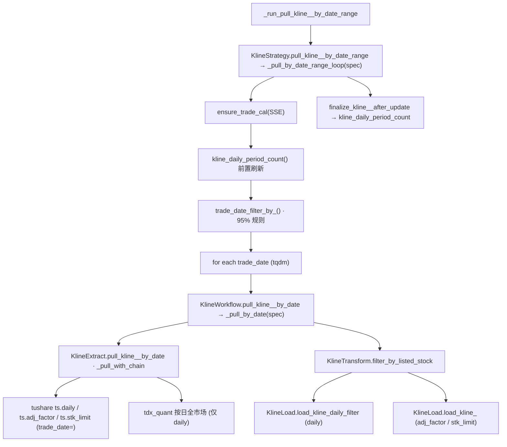

# SDD · K 线按 date 区间增量（三维度合并）

> **CLI 命令：** `kline pull-daily-by-date-range` · `kline pull-adj-factor-by-date-range` · `kline pull-stk-limit-by-date-range`
> **交互菜单：** 【K线】日线 / 复权因子 / 涨跌停 by date 区间增量
> **源码入口：** [`src/etl/cli.py`](../../src/etl/cli.py)

---

## 1. 概述

在指定交易日区间内，仅对「**对应维度**条数未达该日应在市股票数 95%」的**开市日**按日拉取全市场数据并 upsert 到 `kline_daily`。三维度共享同一份 ETL 编排（Strategy → Workflow → Extract → Load + 95% 筛日 + 前后宏观快照），仅在 spec 表里参数化数据源链、count 列名、起始日、Load 写入策略等少量字段。

| 维度 | 默认数据源链 | 写入列 | count 列（用于 95% 判定） | 起始日 env |
|------|--------------|--------|---------------------------|------------|
| daily | tushare → tdx_quant | OHLCV / amount / pre_close / change / pct_chg | `kline_daily_count` | `KLINE_DAILY_START_DATE` |
| adj_factor | tushare（tdx 不支持） | `adj_factor` | `kline_adj_factor_count` | `KLINE_DAILY_START_DATE` |
| stk_limit | tushare（tdx 不支持） | `up_limit` / `down_limit` | `kline_stk_limit_count` | `KLINE_STK_LIMIT_START_DATE` |

入库前 `ensure_trade_cal(SSE)` + 刷新 `kline_daily_period_count` 后用 95% 规则筛缺失开市日；入库后再次 `finalize_kline_<dim>_after_update()`（仅刷新宏观快照）。微观查漏请用 `kline check-<dim>-complete` 或 `kline check-complete`。

### 触发方式

```bash
# 默认区间（[起始日 env, 今日]）
uv run ./src/etl/cli.py kline pull-daily-by-date-range
uv run ./src/etl/cli.py kline pull-adj-factor-by-date-range
uv run ./src/etl/cli.py kline pull-stk-limit-by-date-range

# 自定义区间
uv run ./src/etl/cli.py kline pull-daily-by-date-range --start-date 20200101 --end-date 20251231
```

### 前置依赖

| 依赖 | 说明 |
|------|------|
| `stock_list` | period_count 统计应在市股数；daily 路径 tdx 按日拉取也需读列表 |
| `stock_trade_calendar` | SSE 开市日；`ensure_trade_cal` 自动补缺口 |
| `kline_daily_period_count` | 95% 缺失日筛选；任务前后自动刷新 |
| `data_source_config` | DB 数据源链配置；空时回退 `.env` 默认 |
| `TUSHARE_API_KEY` | tushare 路径鉴权 |
| tdx HTTP API | tdx_quant 路径（仅 daily 维度可用） |

### CLI 参数

| 选项 | 默认 | 说明 |
|------|------|------|
| `--start-date` | 起始日 env | 区间起点（YYYYMMDD） |
| `--end-date` | 今日 | 区间终点（YYYYMMDD） |

**交互菜单：** 两参数均为 `None`，使用上述默认。

---

## 2. CLI 入口

| 命令 | 内部 runner | 菜单 key |
|------|-------------|----------|
| `pull-daily-by-date-range` | `_run_pull_kline_daily_by_date_range` | `kline-pull-daily-by-date-range` |
| `pull-adj-factor-by-date-range` | `_run_pull_kline_adj_factor_by_date_range` | `kline-pull-adj-factor-by-date-range` |
| `pull-stk-limit-by-date-range` | `_run_pull_kline_stk_limit_by_date_range` | `kline-pull-stk-limit-by-date-range` |

> **未纳入菜单的子命令：** `kline pull-<dim>-by-date --trade-date YYYYMMDD`（单日拉取）由 date-range 内部按日调用。

---

## 3. 分层架构（dispatch 化）

```
CLI
  └─ KlineStrategy.pull_kline_<dim>_by_date_range()        ← spec dispatch
       └─ _pull_by_date_range_loop(spec)
            ├─ TradeCalStrategy.ensure_trade_cal(SSE)
            ├─ kline_daily_period_count()                  ← 前置宏观刷新
            ├─ KlineLocalExtract.trade_date_filter_by_<count_field>()
            │    └─ _trade_date_filter_below_threshold(count_field)   ← 95% 规则参数化
            ├─ for trade_date in missing_dates:
            │    └─ KlineWorkflow.pull_kline_<dim>_by_date(td)
            │         └─ _pull_by_date(spec)
            │              ├─ KlineExtract.pull_kline_<dim>_by_date(td) ← _pull_with_chain
            │              │    ├─ tushare 全市场 API
            │              │    └─ tdx_quant（仅 daily）
            │              ├─ KlineTransform.filter_by_listed_stock(td, df)
            │              └─ Load 分支：
            │                   ├─ daily：load_kline_daily_filter（先查再改再插）
            │                   └─ adj_factor / stk_limit：load_kline_<dim>（卫星列 upsert）
            └─ finalize_kline_<dim>_after_update()         ← 后置宏观刷新
```

**95% 筛日实现：** [`KlineLocalExtract._trade_date_filter_below_threshold(count_field, start_date, end_date, threshold=0.95)`](../../src/etl/extract/local/kline/kline_extract.py)，三维度共享。

**load_kline_daily_filter 规格：** 见 [`spec/load/存储-先查再改再插.sdd.md`](../load/存储-先查再改再插.sdd.md)。

---

## 4. 完整调用流程图



---

## 5. 逐步说明

| 步骤 | 处理 |
|------|------|
| 1 | `_resolve_spec(dimension)` 取得 `_KlineStrategySpec`（含起始日 env、count 列、Workflow / Load 方法名、finalize 方法名） |
| 2 | 解析区间 `[start, end]`；起始日缺省时取对应维度 env；`start > end` 直接 return 0 |
| 3 | `ensure_trade_cal(SSE)`：补全 `stock_trade_calendar` 缺口（可能写入 Tushare 回填） |
| 4 | `kline_daily_period_count()` 刷新 `kline_daily_period_count` 表 |
| 5 | `trade_date_filter_by_<count_field>(start, end)` 取得「未达 95%」开市日列表（`<count_field>` 由 spec 选择） |
| 6 | 无缺失日 → typer.echo / print 信息，调 finalize 后 return 0 |
| 7 | 预热数据源链（`_get_source_chain`），避免 tqdm 内打印 |
| 8 | 逐日 `KlineWorkflow.pull_kline_<dim>_by_date(td)`：Extract 全市场 API → `filter_by_listed_stock` 过滤当日未上市 / 已退市股 |
| 9 | Load 分支：daily 走 `load_kline_daily_filter`（先查比对、无变化 skip）；adj_factor / stk_limit 走 `load_kline_<dim>` 卫星列 upsert |
| 10 | tqdm postfix 含 `saved/total/trade_date` |
| 11 | 全部完成 → `finalize_kline_<dim>_after_update()` 再刷新宏观快照 |

---

## 6. 数据与外部依赖

### 数据库

| 表 | 操作 |
|----|------|
| `stock_trade_calendar` | 读；可能写（ensure） |
| `stock_list` | 读 |
| `kline_daily` | 读（filter 路径）+ 写（按维度更新对应列） |
| `kline_daily_period_count` | 读 + 写（前后各一次） |

### 外部 API

| 维度 | data_key | 链 | API |
|------|----------|-----|-----|
| daily | `kline_daily_by_date` | tushare → tdx_quant | `ts.daily(trade_date=)` / tdx 按日全市场 |
| adj_factor | `kline_adj_factor_by_date` | tushare | `ts.adj_factor(trade_date=)` |
| stk_limit | `kline_stk_limit_by_date` | tushare | `ts.stk_limit(trade_date=)` |

**tdx_quant：** 仅支持 daily；adj_factor / stk_limit 抛 `NotSupportedError`，链中跳过。

---

## 7. 业务规则

- **仅开市日**，且仅补「count < period_stock_count × 0.95」的日期。首次需先有 `kline_daily_period_count` 行（任务自动前置刷新）。
- 按**日**拉全市场，适合日常增量。
- daily 路径用 `load_kline_daily_filter` 先查再改再插，无变化 skip；等价于 `update_on_conflict=False` 的语义但更细粒度。
- adj_factor / stk_limit 走卫星列 upsert，**不会**覆盖 `kline_daily` 已存在的 OHLCV 列。
- 三维度共用同一张 `kline_daily_period_count` 快照表，仅 count 列不同。

---

## 8. 日志与可观测性

| 机制 | 说明 |
|------|------|
| typer.echo | `按 date 区间累计写入 {total} 条` |
| print / tqdm.write | 无缺失日 / 待补天数 / 数据源链解析 |
| tqdm | `按日{维度}入库`，postfix 含 `saved/total/trade_date` |

---

## 9. 已知限制

| 项 | 说明 |
|----|------|
| 依赖快照 | 首次需 `kline_daily_period_count` 行；任务自动前置刷新可解 |
| 冲突不更新（daily） | `load_kline_daily_filter` 比对后无变化 skip；如需强制覆盖须人工 DELETE 后重跑 |
| 卫星列 upsert | adj_factor / stk_limit 仅写对应列；该日若无 daily 行，会插入 `(ts_code, trade_date)` + 仅卫星列，其余列为 NULL |
| stk_limit 起点 | `KLINE_STK_LIMIT_START_DATE` 默认 `20090601`；Tushare 无更早数据 |

---

## 10. 相关命令

| 命令 | 关系 |
|------|------|
| `kline check-<dim>-complete` / `kline check-complete` | 微观逐股查漏；宏观快照达标但单股缺日时仍可补 |
| `kline update-daily-period-count` | 完整性快照；任务前后由 finalize 自动刷新 |
| `trade-cal pull-history` | 交易日历基础数据 |

---

## 附录 · 公共 Call Stack

```
_run_pull_kline_<dim>_by_date_range()
└─ KlineStrategy.pull_kline_<dim>_by_date_range()
   ├─ _resolve_spec(dimension) → _KlineStrategySpec
   ├─ ensure_trade_cal()
   ├─ kline_daily_period_count()                                 # 前置宏观
   ├─ trade_date_filter_by_<count_field>()                       # 95% 规则
   ├─ for trade_date in missing_dates:
   │  └─ KlineWorkflow.pull_kline_<dim>_by_date(trade_date)
   │     └─ _pull_by_date(spec)
   │        ├─ KlineExtract.pull_kline_<dim>_by_date() → tushare/tdx 降级
   │        ├─ KlineTransform.filter_by_listed_stock()
   │        └─ Load 分支：load_kline_daily_filter / load_kline_<dim>
   └─ finalize_kline_<dim>_after_update()                        # 后置宏观
```
