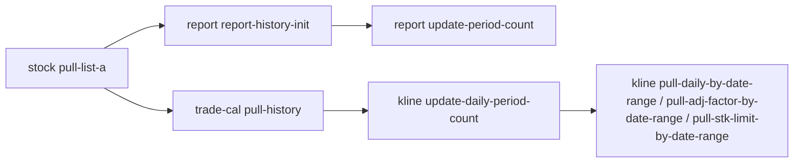
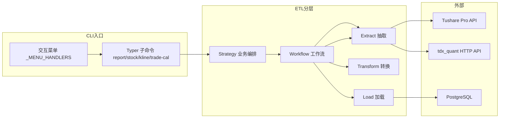

# Quantus ETL · SDD 规格文档

本目录存放 **ETL CLI 命令的运行规格**（Software Design Document），从现有代码反推，供运维、Review 与后续重构使用。

## 与 `src/etl/README.md` 的分工

| 文档 | 定位 |
|------|------|
| [`src/etl/README.md`](../../src/etl/README.md) | 开发者指南：如何扩展 balance/cashflow、新增财报表等 |
| `spec/etl/*.sdd.md` | 运行规格：入口、调用链、业务规则、数据表、外部 API、边界行为 |
| [`spec/api/`](../api/README.md) | HTTP API 规格（Router → Service/Model 或 ETL 首跳） |
| [`spec/load/`](../load/README.md) | Load 层入库模式（如先查再改再插） |

## 文档索引（CLI 命令）

| 文档 | CLI 命令 | 交互菜单 |
|------|----------|----------|
| [财报-三表全量历史入库.sdd.md](./财报-三表全量历史入库.sdd.md) | `report report-history-init` | 【财报】财报三表及财务指标全量历史入库 |
| [财报-三表全量历史入库.sdd.md](./财报-三表全量历史入库.sdd.md) | `report update-period-count` | — |
| [财报-完整性校验.sdd.md](./财报-完整性校验.sdd.md) | `report check-report-complete` | —（Typer 子命令；pull 流程首尾已自动补位） |
| [财报-财务指标全量历史入库.sdd.md](./财报-财务指标全量历史入库.sdd.md) | （合入 `report report-history-init`） | 财务指标作为第四张报表，随三表一起入库 |
| [财报-财务指标完整性校验.sdd.md](./财报-财务指标完整性校验.sdd.md) | （合入 `report check-report-complete`） | 财务指标完整性随三表补位一起校验 |
| [基础-A股股票列表拉取.sdd.md](./基础-A股股票列表拉取.sdd.md) | `stock pull-list-a` | 【基础】A 股股票列表拉取并入库 |
| [基础-交易日历增量入库.sdd.md](./基础-交易日历增量入库.sdd.md) | `trade-cal pull-history` | 【基础】全交易所交易日历增量入库 |
| [基础-A股停复牌数据入库.sdd.md](./基础-A股停复牌数据入库.sdd.md) | `suspend pull-by-date` | 【基础】A 股停复牌数据入库 |
| [每日指标-日频基本面.sdd.md](./每日指标-日频基本面.sdd.md) | `daily-basic pull-by-date-range` | 【估值】每日指标 by date 区间增量（PE/PB/PS/市值/换手率） |
| [分红送股.sdd.md](./分红送股.sdd.md) | `dividend pull-by-date-range` | 【分红】分红送股数据入库（现金分红/送转/除权除息日） |
| [技术面因子.sdd.md](./技术面因子.sdd.md) | `stk-factor pull-by-date-range` | 【因子】技术面因子 by date 区间增量（MACD/KDJ/RSI/BOLL/CCI） |
| [资金流向-个股.sdd.md](./资金流向-个股.sdd.md) | `moneyflow pull-by-date-range` | 【资金流】个股资金流向 by date 区间增量（大/中/小单） |
| [融资融券-明细.sdd.md](./融资融券-明细.sdd.md) | `margin pull-detail-by-date-range` | 【两融】融资融券明细 by date 区间增量 |
| [沪深港通-十大成交股.sdd.md](./沪深港通-十大成交股.sdd.md) | `hsgt pull-top10-by-date-range` | 【北向】沪深股通十大成交股 by date 区间增量 |
| [股东户数.sdd.md](./股东户数.sdd.md) | `stk-holder pull-number` | 【筹码】股东户数数据入库 |
| [指数成分权重.sdd.md](./指数成分权重.sdd.md) | `index pull-weight-by-month-range` | 【指数】指数成分和权重 by month 区间增量 |
| [指数基本信息.sdd.md](./指数基本信息.sdd.md) | `index pull-basic-snapshot` | 【指数】指数基本信息全量快照 |
| [申万行业分类.sdd.md](./申万行业分类.sdd.md) | `index pull-classify-snapshot` | 【指数】申万行业分类 L1/L2/L3 |
| [申万行业成分构成.sdd.md](./申万行业成分构成.sdd.md) | `index pull-member-all-snapshot` | 【指数】申万行业成分全量 |
| [指数日线行情.sdd.md](./指数日线行情.sdd.md) | `index pull-daily-by-code-range` | 【指数】基准指数日线 by 指数×交易日 |
| [沪深港通资金流向.sdd.md](./沪深港通资金流向.sdd.md) | `market_hsgt pull-by-date-range` | 【北向】沪深港通资金流向 by date |
| [港股通持股.sdd.md](./港股通持股.sdd.md) | `market_hk_hold pull-by-date-range` | 【北向】港股通持股明细 by date |
| [盘前股本.sdd.md](./盘前股本.sdd.md) | `stock_premarket pull-by-date-range` | 【股本】盘前总/流通股本 by date |
| [限售股解禁.sdd.md](./限售股解禁.sdd.md) | `stock_share_float pull-by-date` | 【股本】限售解禁 by float_date |
| [财报披露计划.sdd.md](./财报披露计划.sdd.md) | `financial_disclosure_date pull-by-period` | 【披露】财报披露计划 by 报告期 |
| [前十大流通股东.sdd.md](./前十大流通股东.sdd.md) | `shareholder pull-floatholders-by-date` | 【股东】前十大流通股东 by 公告日 |
| [主营业务构成.sdd.md](./主营业务构成.sdd.md) | `financial_fina_mainbz pull-by-period` | 【主营】主营业务构成 by 报告期 VIP |
| [龙虎榜.sdd.md](./龙虎榜.sdd.md) | `dragon-tiger pull-by-date-range` | 【龙虎榜】龙虎榜数据 by date 区间增量（top_list + top_inst） |
| [大宗交易.sdd.md](./大宗交易.sdd.md) | `block-trade pull-by-date-range` | 【大宗】大宗交易数据 by date 区间增量 |
| [前十大股东.sdd.md](./前十大股东.sdd.md) | `shareholder pull-by-date` | 【股东】前十大股东 by 公告日 区间增量 |
| [业绩预告.sdd.md](./业绩预告.sdd.md) | `forecast pull-vip-by-period` | 【预告】业绩预告 VIP by period 入库 |
| [财务审计意见.sdd.md](./财务审计意见.sdd.md) | `audit pull-by-period` | 【审计】财务审计意见 by period 入库（仅年报） |
| [业绩快报.sdd.md](./业绩快报.sdd.md) | `express pull-vip-by-period` | 【快报】业绩快报 VIP by period 入库 |
| [K线-按date区间增量.sdd.md](./K线-按date区间增量.sdd.md) | `kline pull-daily-by-date-range` | 【K线】日线 by date 区间增量（tushare → tdx_quant） |
| [K线-按date区间增量.sdd.md](./K线-按date区间增量.sdd.md) | `kline pull-adj-factor-by-date-range` | 【K线】复权因子 by date 区间增量（tushare） |
| [K线-按date区间增量.sdd.md](./K线-按date区间增量.sdd.md) | `kline pull-stk-limit-by-date-range` | 【K线】涨跌停 by date 区间增量（tushare） |
| [K线-完整性校验.sdd.md](./K线-完整性校验.sdd.md) | `kline check-complete` | —（Typer 子命令；pull 流程首尾已自动补位） |
| [K线-完整性校验.sdd.md](./K线-完整性校验.sdd.md) | `kline check-daily-complete` | hidden 别名，仅日线维度 |
| [K线-完整性校验.sdd.md](./K线-完整性校验.sdd.md) | `kline check-adj-factor-complete` | hidden 别名，仅复权维度 |
| [K线-完整性校验.sdd.md](./K线-完整性校验.sdd.md) | `kline check-stk-limit-complete` | hidden 别名，仅涨跌停维度 |
| [K线-更新日线完整性快照.sdd.md](./K线-更新日线完整性快照.sdd.md) | `kline update-daily-period-count` | 【K线】【宏观】刷新日K完整性快照 |
| [K线-更新复权因子完整性快照.sdd.md](./K线-更新复权因子完整性快照.sdd.md) | `kline update-adj-factor-period-count` | hidden 别名，同上 |
| [K线-更新涨跌停完整性快照.sdd.md](./K线-更新涨跌停完整性快照.sdd.md) | `kline update-stk-limit-period-count` | hidden 别名，同上 |
| [仓库-PG日K导出Parquet.sdd.md](./仓库-PG日K导出Parquet.sdd.md) | `warehouse pull-kline-daily-by-month-range` | 【仓库】日K PG 导出 Parquet 按月增量 |
| [仓库-PG日K导出Parquet.sdd.md](./仓库-PG日K导出Parquet.sdd.md) §8.2 | `warehouse check-kline-daily-parquet` | 【仓库】【校验】日K Parquet vs PG 月度行数对账 |
| [log-缺失日志.sdd.md](./log-缺失日志.sdd.md) | — | 跨域基础设施：完整性校验登记/解除登记缺失项的 `log_missing` 表与 `MissingLog` API |

> **未纳入菜单：** `kline pull-daily-by-date` / `kline pull-adj-factor-by-date` / `kline pull-stk-limit-by-date`（单日拉取）为 date-range 内部调用。

## 推荐执行顺序

## 公共架构

## 命令分类速查

| 类型 | 命令 | ETL 路径特点 |
|------|------|--------------|
| 财报 | report-history-init / update-period-count / check-report-complete | pull 后 finalize 仅宏观；check 为宏观→微观→宏观；含财务指标第四张表 |
| 基础 | pull-list-a / trade-cal | 多为 Extract→Load |
| K线 | pull-* / update-daily-period-count / check-complete | pull 后 finalize 仅宏观；check 为宏观→微观→宏观 |

**进度打印约定（Strategy 层）：**

- **宏观**（`update-*-period-count`）：按维度依次 tqdm（K线：日线/复权/涨跌停；财报：四表含财务指标），postfix 含 `活跃N股 通过N日/期 缺失N日/期 缺条N`
- **微观**（`check-complete` / `check-report-complete`）：逐股 tqdm，postfix 含 `活跃N股 通过N股 缺失N股 缺日/缺期N`

## SDD 单篇模板

每份 `.sdd.md` 建议包含：

1. 概述（用途、触发方式、前置依赖）
2. CLI 入口（Typer 注册、菜单映射、参数表）
3. 分层架构
4. 完整调用流程图（Mermaid）
5. 逐步说明（输入 / 处理 / 输出 / 副作用）
6. 数据与外部依赖
7. 业务规则
8. 日志与可观测性
9. 已知限制与实现备注
10. 相关命令

## 环境依赖（公共）

| 变量 | 用途 |
|------|------|
| `TUSHARE_API_KEY` | Tushare Pro 鉴权 |
| `POSTGRESQL_*` | PostgreSQL 连接 |
| `REPORT_PERIOD_COUNT_START_DATE` | 财报筛期 / report_period_count 起点 |
| `KLINE_DAILY_START_DATE` | K 线默认起始日 |
| `TRADE_CAL_START_DATE` | 交易日历默认起点 |
| `SUSPEND_START_DATE` | 停复牌（suspend_d）增量默认起点 |
| `DAILY_BASIC_START_DATE` | 每日指标（daily_basic）增量默认起点 |
| `DIVIDEND_START_DATE` | 分红送股（dividend）增量默认起点 |
| `STK_FACTOR_START_DATE` | 技术面因子（stk_factor）增量默认起点 |
| `KLINE_DAILY_SOURCES` / `KLINE_DAILY_BY_DATE_SOURCES` / `KLINE_ADJ_FACTOR_SOURCES` / `KLINE_STK_LIMIT_SOURCES` / `KLINE_STK_LIMIT_START_DATE` | K 线数据源链与涨跌停起点兜底 |
| `TDX_API_HOST` / `TDX_API_PORT` | tdx_quant HTTP 中转 |
| `WAREHOUSE_ROOT` | 列存仓库根目录（PG → Parquet/DuckDB），默认 `./data/warehouse` |

配置来源：[`src/common/setting.py`](../../src/common/setting.py)
