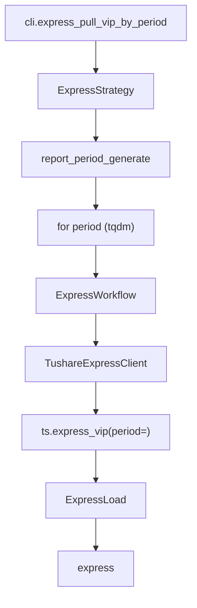

# SDD · 业绩快报

> **CLI 命令：** `express pull-vip-by-period`
> **交互菜单：** 【快报】业绩快报 VIP by period 入库 (express pull-vip-by-period)
> **源码入口：** `src/etl/cli.py`
> **Tushare 接口：** [`express_vip`](https://tushare.pro/document/2?doc_id=46)（VIP 版，支持按 period 全市场拉取）

---

## 1. 概述

按报告期调用 Tushare `express_vip` 拉取全市场业绩快报数据（营收/净利润/EPS/ROE 及同比），upsert 到 PostgreSQL `financial_express` 表。为多因子模型提供快报 surprise 因子、快报 vs 正式报告漂移因子等事件型因子。

> `express_vip` 与 `financial_express` 参数一致，但支持按 `period` 全市场拉取（需 5000 积分）。业绩快报比业绩预告更精确（含具体财务数据），但覆盖率低于预告。

### 触发方式

```bash
uv run ./src/etl/cli.py express pull-vip-by-period
uv run ./src/etl/cli.py express pull-vip-by-period --start-period 20100331
uv run ./src/etl/cli.py
```

### 前置依赖

| 依赖 | 说明 |
|------|------|
| `TUSHARE_API_KEY` | 需 5000+ 积分（VIP） |
| `EXPRESS_START_PERIOD` | floor（`.env`，推荐 `20100331`） |

### CLI 参数

| 选项 | 默认 | 说明 |
|------|------|------|
| `--start-period` | `EXPRESS_START_PERIOD` | 报告期起点 YYYYMMDD |
| `--end-period` | 最新报告期 | 报告期终点 YYYYMMDD |

---

## 2. CLI 入口

| 项 | 值 |
|----|-----|
| Typer 子命令组 | `financial_express`（新增） |
| 命令名 | `pull-vip-by-period` |
| 处理函数 | `express_pull_vip_by_period()` |
| 菜单 key | `express-pull-vip-by-period` |
| 菜单 label | `【快报】业绩快报 VIP by period 入库 (express pull-vip-by-period)` |

```python
express_strategy = typer.Typer()
app.add_typer(express_strategy, name="express", help="业绩快报 ETL commands")

@express_strategy.command("pull-vip-by-period")
def express_pull_vip_by_period(
    start_period: str | None = typer.Option(None, "--start-period"),
    end_period: str | None = typer.Option(None, "--end-period"),
) -> None:
    """按报告期拉取 Tushare express_vip 并 upsert。"""
    total = ExpressStrategy().pull_express_vip_by_period(start_period=start_period, end_period=end_period)
    typer.echo(f"业绩快报累计写入 {total} 条")
```

---

## 3. 分层架构

```
CLI → ExpressStrategy.pull_express_vip_by_period(start, end)
       ├─ ExpressLocalExtract.resolve_incremental_start_period()
       ├─ report_period_generate(start, end) → periods
       └─ for period in periods (tqdm):
            └─ ExpressWorkflow.pull_express_by_period(period)
                 ├─ ExpressExtract → TushareExpressClient
                 │    └─ ts.express_vip(period=, fields=...)
                 └─ ExpressLoad → bulk_upsert_postgresql → express
```

**新增源码：** `src/etl/{strategy,workflow,extract,load,client}/express/` + `src/entities/data_entities/express_entities.py`

---

## 4. 完整调用流程图



---

## 5. 逐步说明

| 步骤 | 位置 | 输入 | 处理 | 输出 |
|------|------|------|------|------|
| 1 | CLI | `--start-period` / `--end-period` | 实例化 Strategy | echo 总条数 |
| 2 | Strategy | floor / end | 缺省 floor=start_date env，end=今日；无效区间 → return 0 | — |
| 3 | Strategy | floor / end | `CompletenessEngine.backfill_keys(floor, end)`（`is_period=True`） | `pending` 报告期；空 → return 0 |
| 4 | Strategy | pending | tqdm 逐期调 Workflow | saved_count |
| 5 | Client | period | ts.express_vip(period=) → finalize | DataFrame |
| 6 | Load | DataFrame | bulk_upsert_postgresql | upsert 条数 |

---

## 6. 数据与外部依赖

### 6.1 Tushare API

| 项 | 值 |
|----|-----|
| 接口 | `express_vip`（参数同 `financial_express`） |
| Client | `src/etl/client/express/tushare.py` |
| 限流 | 200/min（`create_rate_limiter(200)`） |
| 积分要求 | 5000+（VIP） |

**接口输入参数：**

| 名称 | 类型 | 必选 | 说明 |
|------|------|------|------|
| ts_code | str | Y | 股票代码（VIP 版不用，按 period 全市场拉） |
| ann_date | str | N | 公告日期（不用） |
| start_date | str | N | 公告开始日期（不用） |
| end_date | str | N | 公告结束日期（不用） |
| period | str | N | 报告期（**逐期遍历**） |

**接口输出字段（全部入库）：**

| 名称 | 类型 | 说明 |
|------|------|------|
| ts_code | str | TS 股票代码 |
| ann_date | str | 公告日期 |
| end_date | str | 报告期 |
| revenue | float | 营业收入（元） |
| operate_profit | float | 营业利润（元） |
| total_profit | float | 利润总额（元） |
| n_income | float | 净利润（元） |
| total_assets | float | 总资产（元） |
| total_hldr_eqy_exc_min_int | float | 股东权益合计（不含少数股东权益）（元） |
| diluted_eps | float | 每股收益（摊薄）（元） |
| diluted_roe | float | 净资产收益率（摊薄）（%） |
| yoy_net_profit | float | 去年同期修正后净利润 |
| bps | float | 每股净资产 |
| yoy_sales | float | 同比增长率：营业收入 |
| yoy_op | float | 同比增长率：营业利润 |
| yoy_tp | float | 同比增长率：利润总额 |
| yoy_dedu_np | float | 同比增长率：归属母公司净利润 |
| yoy_eps | float | 同比增长率：基本每股收益 |
| yoy_roe | float | 同比增减：加权平均净资产收益率 |
| growth_assets | float | 比年初增长率：总资产 |
| yoy_equity | float | 比年初增长率：归属母公司股东权益 |

### 6.2 数据库

| 项 | 值 |
|----|-----|
| 表名 | `financial_express` |
| ORM | `ExpressEntities` |
| 冲突键 | `(ts_code, end_date)` |

**ORM 字段：**

| 列 | 类型 | 说明 |
|----|------|------|
| `id` | Integer PK | — |
| `ts_code` | String(20) | TS 代码 |
| `ann_date` | String(8) | 公告日期 |
| `end_date` | String(8) | 报告期 |
| `revenue` | Float | 营业收入（元） |
| `operate_profit` | Float | 营业利润（元） |
| `total_profit` | Float | 利润总额（元） |
| `n_income` | Float | 净利润（元） |
| `total_assets` | Float | 总资产（元） |
| `total_hldr_eqy_exc_min_int` | Float | 股东权益（元） |
| `diluted_eps` | Float | 每股收益（元） |
| `diluted_roe` | Float | 净资产收益率（%） |
| `yoy_net_profit` | Float | 去年同期净利润 |
| `bps` | Float | 每股净资产 |
| `yoy_sales` | Float | 营收同比(%) |
| `yoy_op` | Float | 营业利润同比(%) |
| `yoy_tp` | Float | 利润总额同比(%) |
| `yoy_dedu_np` | Float | 归母净利同比(%) |
| `yoy_eps` | Float | EPS同比(%) |
| `yoy_roe` | Float | ROE同比增减 |
| `growth_assets` | Float | 总资产增长率 |
| `yoy_equity` | Float | 股东权益增长率 |

**索引：**

| 索引名 | 列 | 唯一 |
|--------|----|------|
| `idx_express_unique` | `(ts_code, end_date)` | UNIQUE |
| `idx_express_ts_code` | `(ts_code)` | — |
| `idx_express_end_date` | `(end_date)` | — |

### 6.3 finalize_express 规则

| 列 | 规则 |
|----|------|
| `ts_code` | `str.strip()` |
| `ann_date` / `end_date` | `_normalize_ymd` → 8 位；NaN → `""` |
| 数值列 | NaN → None |

---

## 7. 业务规则

1. **按 period 全市场拉取：** `express_vip(period=)` 获取该期全市场所有业绩快报。
2. **报告期生成：** 复用 `report_period_generate(start, end)` 生成季度末序列。
3. **增量语义：** `eff_start_period = max(EXPRESS_START_PERIOD, 库内 max(end_date)+1)`。
4. **Upsert 幂等：** `(ts_code, end_date)` 联合唯一。同一股同一报告期只有一条快报（快报不像预告有多次修正）。
5. **不做完整性校验：** 事件型数据，非所有股票每期都有快报。

---

## 8. 日志与可观测性

| 机制 | 说明 |
|------|------|
| typer.echo | `业绩快报累计写入 {total} 条` |
| tqdm | `业绩快报入库`，单位「期」，postfix `period/saved` |

---

## 9. 已知限制与实现备注

| 项 | 说明 |
|----|------|
| VIP 接口 | 需 5000+ 积分 |
| 覆盖率低于预告 | 业绩快报覆盖率低于业绩预告 |
| 快报 vs 正式报告 | 快报数据可能与正式报告有差异，可做 drift 因子 |

---

## 10. 相关命令

| 命令 | 关系 |
|------|------|
| `report report-history-init` | 正式财报数据，快报为提前披露版本 |
| `forecast pull-vip-by-period` | 业绩预告，比快报更早但精度更低 |

---

## 附录 · Call Stack

```
cli.express_pull_vip_by_period()
└─ ExpressStrategy.pull_express_vip_by_period(start_period, end_period)
   ├─ ExpressLocalExtract.resolve_incremental_start_period(configured=floor)
   ├─ report_period_generate(start, end) → periods
   └─ for period in periods:
      └─ ExpressWorkflow.pull_express_by_period(period)
         ├─ ExpressExtract → TushareExpressClient
         │  └─ ts.express_vip(period=period, fields=EXPRESS_COLUMNS)
         │  └─ finalize_express(df)
         └─ ExpressLoad.load_express(df)
            └─ bulk_upsert_postgresql(ExpressEntities, conflict_keys=['ts_code','end_date'])
```

## 附录 · 环境变量新增项

| 变量 | 默认 | 用途 | 推荐 .env |
|------|------|------|-----------|
| `EXPRESS_START_PERIOD` | `""` | 报告期起点；空则 no-op | `20100331` |
