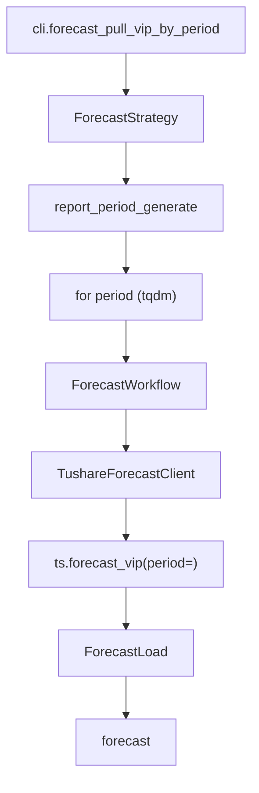

# SDD · 业绩预告

> **CLI 命令：** `forecast pull-vip-by-period`
> **交互菜单：** 【预告】业绩预告 VIP by period 入库 (forecast pull-vip-by-period)
> **源码入口：** `src/etl/cli.py`
> **Tushare 接口：** [`forecast_vip`](https://tushare.pro/document/2?doc_id=45)（VIP 版，支持按 period 全市场拉取）

---

## 1. 概述

按报告期调用 Tushare `forecast_vip` 拉取全市场业绩预告数据（预告净利润区间/变动幅度/预告类型），upsert 到 PostgreSQL `financial_forecast` 表。为多因子模型提供业绩预告 surprise 因子、预告类型哑变量等事件型因子。

> `forecast_vip` 与 `financial_forecast` 参数一致，但支持按 `period` 全市场拉取（需 5000 积分）。非 VIP 版本 `financial_forecast` 只能按 `ts_code` 逐股拉取。

### 触发方式

```bash
uv run ./src/etl/cli.py forecast pull-vip-by-period
uv run ./src/etl/cli.py forecast pull-vip-by-period --start-period 20100331
uv run ./src/etl/cli.py
```

### 前置依赖

| 依赖 | 说明 |
|------|------|
| `TUSHARE_API_KEY` | 需 5000+ 积分（VIP 接口） |
| `FORECAST_START_PERIOD` | floor（`.env`，推荐 `20100331`） |

### CLI 参数

| 选项 | 默认 | 说明 |
|------|------|------|
| `--start-period` | `FORECAST_START_PERIOD` | 报告期起点 YYYYMMDD |
| `--end-period` | 最新报告期 | 报告期终点 YYYYMMDD |

---

## 2. CLI 入口

| 项 | 值 |
|----|-----|
| Typer 子命令组 | `financial_forecast`（新增） |
| 命令名 | `pull-vip-by-period` |
| 处理函数 | `forecast_pull_vip_by_period()` |
| 菜单 key | `forecast-pull-vip-by-period` |
| 菜单 label | `【预告】业绩预告 VIP by period 入库 (forecast pull-vip-by-period)` |

```python
forecast_strategy = typer.Typer()
app.add_typer(forecast_strategy, name="forecast", help="业绩预告 ETL commands")

@forecast_strategy.command("pull-vip-by-period")
def forecast_pull_vip_by_period(
    start_period: str | None = typer.Option(None, "--start-period"),
    end_period: str | None = typer.Option(None, "--end-period"),
) -> None:
    """按报告期拉取 Tushare forecast_vip 并 upsert。"""
    total = ForecastStrategy().pull_forecast_vip_by_period(start_period=start_period, end_period=end_period)
    typer.echo(f"业绩预告累计写入 {total} 条")
```

---

## 3. 分层架构

```
CLI → ForecastStrategy.pull_forecast_vip_by_period(start, end)
       ├─ ForecastLocalExtract.resolve_incremental_start_period()
       ├─ report_period_generate(start, end) → periods
       └─ for period in periods (tqdm):
            └─ ForecastWorkflow.pull_forecast_by_period(period)
                 ├─ ForecastExtract → TushareForecastClient
                 │    └─ ts.forecast_vip(period=, fields=...)
                 └─ ForecastLoad → bulk_upsert_postgresql → forecast
```

**新增源码：** `src/etl/{strategy,workflow,extract,load,client}/forecast/` + `src/entities/data_entities/forecast_entities.py`

---

## 4. 完整调用流程图



---

## 5. 逐步说明

| 步骤 | 位置 | 输入 | 处理 | 输出 |
|------|------|------|------|------|
| 1 | CLI | `--start-period` / `--end-period` | 实例化 Strategy | echo 总条数 |
| 2 | Strategy | floor / end | 缺省 floor=start_date env，end=今日；无效区间 → return 0 | — |
| 3 | Strategy | floor / end | `CompletenessEngine.backfill_keys(floor, end)`（`is_period=True`） | `pending` 报告期；空 → return 0 |
| 4 | Strategy | pending | tqdm 逐期调 Workflow | saved_count |
| 5 | Client | period | ts.forecast_vip(period=) → finalize | DataFrame |
| 6 | Load | DataFrame | bulk_upsert_postgresql | upsert 条数 |

---

## 6. 数据与外部依赖

### 6.1 Tushare API

| 项 | 值 |
|----|-----|
| 接口 | `forecast_vip`（参数同 `financial_forecast`） |
| Client | `src/etl/client/forecast/tushare.py` |
| 限流 | 200/min（`create_rate_limiter(200)`） |
| 积分要求 | 5000+（VIP） |

**接口输入参数：**

| 名称 | 类型 | 必选 | 说明 |
|------|------|------|------|
| ts_code | str | N | 股票代码（VIP 版不用，按 period 全市场拉） |
| ann_date | str | N | 公告日期（不用） |
| start_date | str | N | 公告开始日期（不用） |
| end_date | str | N | 公告结束日期（不用） |
| period | str | N | 报告期（**本任务逐期遍历**） |
| type | str | N | 预告类型（不用，拉全类型） |

**接口输出字段（全部入库）：**

| 名称 | 类型 | 说明 |
|------|------|------|
| ts_code | str | TS 股票代码 |
| ann_date | str | 公告日期 |
| end_date | str | 报告期 |
| type | str | 业绩预告类型（预增/预减/扭亏/首亏/续亏/续盈/略增/略减） |
| p_change_min | float | 预告净利润变动幅度下限（%） |
| p_change_max | float | 预告净利润变动幅度上限（%） |
| net_profit_min | float | 预告净利润下限（万元） |
| net_profit_max | float | 预告净利润上限（万元） |
| last_parent_net | float | 上年同期归属母公司净利润 |
| first_ann_date | str | 首次公告日 |
| summary | str | 业绩预告摘要 |
| change_reason | str | 业绩变动原因 |

### 6.2 数据库

| 项 | 值 |
|----|-----|
| 表名 | `financial_forecast` |
| ORM | `ForecastEntities` |
| 冲突键 | `(ts_code, end_date, ann_date)` |

> **冲突键说明：** 同一股同一报告期可能有多次预告修正，以 `ann_date` 区分。

**ORM 字段：**

| 列 | 类型 | 说明 |
|----|------|------|
| `id` | Integer PK | — |
| `ts_code` | String(20) | TS 代码 |
| `ann_date` | String(8) | 公告日期 |
| `end_date` | String(8) | 报告期 |
| `type` | String(20) | 预告类型 |
| `p_change_min` | Float | 变动幅度下限(%) |
| `p_change_max` | Float | 变动幅度上限(%) |
| `net_profit_min` | Float | 净利润下限（万元） |
| `net_profit_max` | Float | 净利润上限（万元） |
| `last_parent_net` | Float | 上年同期净利润 |
| `first_ann_date` | String(8) | 首次公告日 |
| `summary` | Text | 业绩预告摘要 |
| `change_reason` | Text | 业绩变动原因 |

**索引：**

| 索引名 | 列 | 唯一 |
|--------|----|------|
| `idx_forecast_unique` | `(ts_code, end_date, ann_date)` | UNIQUE |
| `idx_forecast_ts_code` | `(ts_code)` | — |
| `idx_forecast_end_date` | `(end_date)` | — |

### 6.3 finalize_forecast 规则

| 列 | 规则 |
|----|------|
| `ts_code` | `str.strip()` |
| `ann_date` / `end_date` / `first_ann_date` | `_normalize_ymd` → 8 位；NaN → `""` |
| `type` | `str.strip()` |
| `summary` / `change_reason` | NaN → None（Text 列允许 NULL） |
| 数值列 | NaN → None |

---

## 7. 业务规则

1. **按 period 全市场拉取：** `forecast_vip(period=)` 获取该期全市场所有业绩预告。
2. **报告期生成：** 复用 `report_period_generate(start, end)` 生成季度末序列。
3. **增量语义：** `eff_start_period = max(FORECAST_START_PERIOD, 库内 max(end_date)+1)`。
4. **Upsert 幂等：** `(ts_code, end_date, ann_date)` 联合唯一。
5. **不做完整性校验：** 事件型数据，非所有股票每期都有预告。

---

## 8. 日志与可观测性

| 机制 | 说明 |
|------|------|
| typer.echo | `业绩预告累计写入 {total} 条` |
| tqdm | `业绩预告入库`，单位「期」，postfix `period/saved` |

---

## 9. 已知限制与实现备注

| 项 | 说明 |
|----|------|
| VIP 接口 | 需 5000+ 积分 |
| 非全量预告 | 仅发布预告的公司有数据，非全市场 |
| 多次修正 | 同一股同一报告期可能有多次预告，以 ann_date 区分 |

---

## 10. 相关命令

| 命令 | 关系 |
|------|------|
| `report report-history-init` | 正式财报数据，与本表预告数据互补 |
| `express pull-vip-by-period` | 业绩快报，比预告更精确但覆盖更少 |

---

## 附录 · Call Stack

```
cli.forecast_pull_vip_by_period()
└─ ForecastStrategy.pull_forecast_vip_by_period(start_period, end_period)
   ├─ ForecastLocalExtract.resolve_incremental_start_period(configured=floor)
   ├─ report_period_generate(start, end) → periods
   └─ for period in periods:
      └─ ForecastWorkflow.pull_forecast_by_period(period)
         ├─ ForecastExtract → TushareForecastClient
         │  └─ ts.forecast_vip(period=period, fields=FORECAST_COLUMNS)
         │  └─ finalize_forecast(df)
         └─ ForecastLoad.load_forecast(df)
            └─ bulk_upsert_postgresql(ForecastEntities,
                 conflict_keys=['ts_code','end_date','ann_date'])
```

## 附录 · 环境变量新增项

| 变量 | 默认 | 用途 | 推荐 .env |
|------|------|------|-----------|
| `FORECAST_START_PERIOD` | `""` | 报告期起点；空则 no-op | `20100331` |
