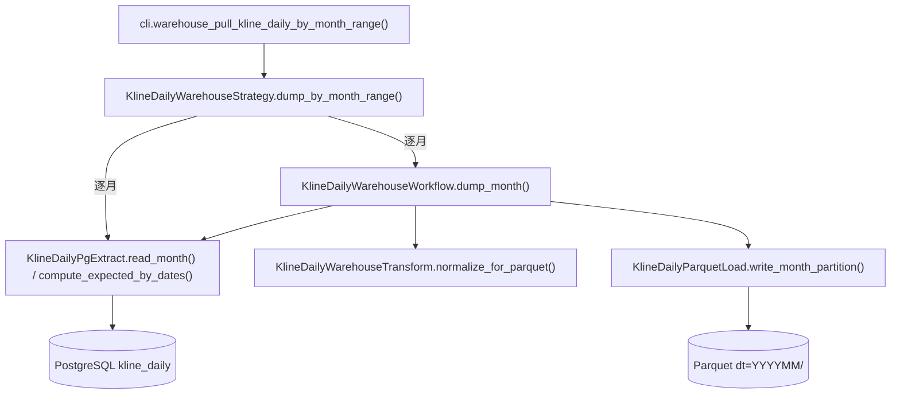
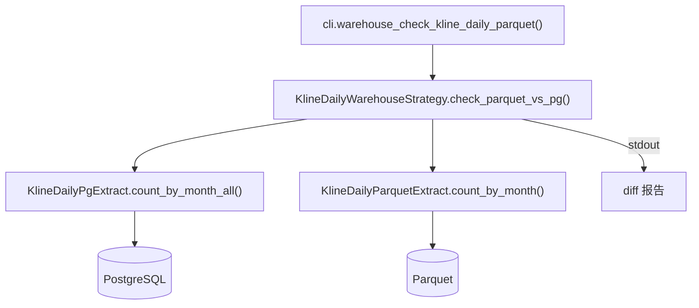

# SDD · 仓库 · PG 日 K 导出 Parquet

> **状态：** 起草中  
> **模式：** ETL 新子域 `warehouse`（PG → Parquet/DuckDB），不污染现有 Tushare/tdx → PG 链路  
> **CLI：** `quantus-etl warehouse pull-kline-daily-by-month-range`  
> **依赖新增：** `pyarrow`（写 parquet）、`duckdb`（验证查询、未来跨源 SQL）  
> **源码：** `src/etl/{extract,transform,load,workflow,strategy}/warehouse/`

---

## 1. 概述

将 PG 中 `kline_daily` 表（含 OHLCV + adj_factor + up_limit/down_limit 三维度融合）按**月**导出到本地 Parquet 分区，作为后续因子计算 / 回测 / 研究环境（DuckDB + Polars）的列存仓库。

**与现有 ETL 关系**：

| 维度 | 现有 kline ETL（Tushare → PG） | 本子域 warehouse（PG → Parquet） |
|------|-------------------------------|--------------------------------|
| 数据源 | Tushare / tdx_quant HTTP | 自家 PG `kline_daily` |
| 目标 | PG `kline_daily` 等 OLTP 表 | 本地 Parquet 文件（DuckDB 读） |
| 完整性 | 95% 阈值（容忍源端抖动） | **99% 阈值**（已有停复牌可精算 expected；容忍 PG 历史 1-2 股黑洞）；当月强制重写不卡阈值 |
| 调度粒度 | 按交易日 / 按股 | 按月（与分区一致） |
| 幂等 | upsert | **整月分区 overwrite** |

**前置依赖**：
- PG `kline_daily` / `stock_list` / `stock_trade_calendar` / `stock_suspend` 已就绪
- `kline check-complete` / `suspend pull-by-date` 至少跑过一轮，让 PG 数据真正接近 100% 完整（warehouse 自身按 99% 验收）

---

## 2. 分区策略（一次定终生）

### 2.1 路径约定

```
{WAREHOUSE_ROOT}/kline_daily/dt=YYYYMM/part-{uuid}.parquet
```

默认 `WAREHOUSE_ROOT = ./data/warehouse`（项目根目录下的本地目录，`.gitignore` 已含 `data/`；env `WAREHOUSE_ROOT` 可覆盖）。

### 2.2 为什么按月（vs 按股 / 按年 / 单文件）

| 维度 | **按月（采用）** | 按股 | 按年 | 单文件 |
|------|----------------|------|------|--------|
| 文件数（30 年） | 360 | 5500 | 30 | 1 |
| 单文件大小 | ~10MB（zstd） | ~2MB | ~150MB | ~3GB |
| 截面查询（某日全 A） | 1 个文件，row-group prune | 扫 5500 文件读 1 行 | 1 文件，row-group prune 较粗 | 1 文件 row-group prune |
| 区间扫描 | 连续 N 文件顺序 IO | 5500 并行 filter | 顺序 | 1 文件 |
| 单股全历史 | 360 文件 + ts_code zonemap prune | 1 文件直读 | 30 文件 | 1 文件 |
| 每日 / 增量写 | 重写当月（10MB） | **更新 5500 文件**（写放大爆炸） | 重写当年（150MB） | 重写 3GB |

**结论**：日线主路径是「截面 + 区间扫描」，按月在「截面/区间/增量写」三个最重要场景都最优。单股查询略弱但 row group statistics 仍能 prune，可接受。

分钟线未来需 `dt=YYYYMM/bucket=00~15`（按 ts_code hash 二级分区），日线不必要。

### 2.3 文件内排序与 row group

| 项 | 设置 | 理由 |
|----|------|------|
| 排序 | `ORDER BY trade_date, ts_code` | 截面查询的 trade_date filter 走 row group statistics |
| 压缩 | `zstd` (level 3) | snappy 兼容性更好但 zstd 压缩比 +20%，CPU 开销可忽略 |
| row_group_size | 128k 行 | 单月 ~115k 行，一个 row group 即可装下整月，统计信息精确 |
| use_dictionary | True（ts_code 列） | ts_code 高重复，dictionary encoding 显著缩小体积 |
| 文件名 | `part-{run_id}.parquet`（单文件每分区） | 重写分区前先 `rmtree` 该目录，避免遗留半成品 |

---

## 3. 99% 完整性规则 + 当月强制重写

### 3.1 expected 定义

```
expected_count(trade_date) = 
    | { stock | list_date ≤ trade_date AND (delist_date IS NULL OR delist_date > trade_date) } |
  − | { stock | suspend_d.trade_date = X AND suspend_type='S' AND suspend_timing='' } |
```

第一部分复用 `StockTransform.trade_date_stock_count`（现有），第二部分复用 `SuspendLocalExtract.preload_full_day_suspend_dates`（现有），二者合并即可。

### 3.2 单日完整 / 整月可 dump

```
complete(trade_date)  ↔  count(kline_daily WHERE trade_date=X) >= 0.99 × expected(trade_date)
dumpable(year_month)  ↔  ∀ trade_date ∈ SSE open days in month: complete(trade_date)
```

- 阈值 99% 而非 100%：容忍 PG 早期数据 1-2 股黑洞（如 200008(995/996)、200207(1160/1162)），但仍能拦截真正大缺口（如 199012/199101 的 8/9 ≈ 89%）。
- 对小 expected（如 5-10 股的早期市场），`< 0.99 × expected` 实际等价 100%（因 count 是整数）。
- 任何一日不满足 → 该月**非当月**则跳过，留下次重跑；**当月**则仅 warn 不 skip（详见 3.3）。

### 3.3 当月强制重写

当月分区必须每天能更新（T+1 数据陆续到位、当日 EOD 后才有今日 K 线），所以当月有专门处理：

- 当月**始终**纳入 targets（与"已落分区"无关）。
- 当月只对**已过去**的开市日（`trade_date < today`）做 99% 校验；今天及未来不进入门槛判定。
- 即使当月有已过去日 < 99%，也**不 skip**，仅 `[warn]` 打印未达标日，继续 dump 当前快照。
- 跨月日：`today = 20260701` 那一刻，`current_month` 变成 `202607`，202606 自然从"当月强制重写"退出；如果跨月时点 202606 已 100% 落齐，下次跑就不会再动 202606。

### 3.4 与现有 95% 规则的关系

**不动**现有 `pull-*-by-date-range` / `update-period-count` / `check-complete` 的 95% 阈值（解耦风险，避免影响 Admin 列表显示和已有 ops）。99% 仅在 warehouse 子域内部生效。

### 3.5 增量起点

```
dump_start_month = max(KLINE_DAILY_START_DATE 所在月, min(未落分区月))
dump_end_month   = 当月（含；当月每次跑必重写）
```

**不维护单独的 state 表** —— Parquet 自身的 `dt=YYYYMM` 目录就是状态。每次跑：
1. `ls {WAREHOUSE_ROOT}/kline_daily/` → 已落月集合
2. `targets = (months \ existing) ∪ {current_month}`
3. 逐月：当月直接 dump（只 warn），非当月 99% 校验 → 通过则 dump 重写整月分区

---

## 4. 字段映射（PG → Parquet）

| PG 列 | PG 类型 | Parquet 列 | Arrow 类型 | 备注 |
|-------|---------|-----------|-----------|------|
| ts_code | varchar(20) | ts_code | string (dict) | 主键 |
| trade_date | varchar(8) | trade_date | string | 主键；保留 `YYYYMMDD` 字符串便于直接 join |
| open / high / low / close / pre_close | float | 同名 | float64 | |
| change / pct_chg | float | 同名 | float64 | |
| vol / amount | float | 同名 | float64 | |
| adj_factor | float (nullable) | adj_factor | float64 | nullable |
| up_limit / down_limit | float (nullable) | 同名 | float64 | nullable |
| id | int | — | — | **不导出**（PG 自增主键无业务含义） |
| — | — | (dt) | (Hive 目录) | **不写入文件**，由目录名 `dt=YYYYMM` 表达；读侧 `hive_partitioning=1` 自动识别 |

排序：`(trade_date, ts_code)`。

---

## 5. 调用链

### 5.1 dump（增量导出）



### 5.2 check（对账校验）



| 层 | 职责 |
|----|------|
| Strategy | 区间 → 月份列表；逐月 dumpable 校验；逐月调 Workflow；tqdm 进度。check 路径下：调两个 Extract、做 diff、打印报告 |
| Workflow | 单月：Extract pull → Transform → Load write，幂等覆盖分区（check 路径不用 Workflow） |
| Extract | PG：按月读 DataFrame、按月聚合行数、计算 expected。Parquet：用 DuckDB 按月聚合行数 |
| Transform | 列裁剪、类型 cast、`(trade_date, ts_code)` 排序（check 路径不用） |
| Load | pyarrow.dataset 写 parquet（先删旧分区目录后写），不做业务逻辑（check 路径不用） |

---

## 6. 文件清单（新增）

```
src/etl/
  extract/warehouse/
    __init__.py
    kline_daily_pg_extract.py          # read_month / count_by_date / count_by_month_all / compute_expected_by_dates
    kline_daily_parquet_extract.py     # count_by_month / total_rows（DuckDB 读 parquet）
  transform/warehouse/
    __init__.py
    kline_daily_warehouse_transform.py # normalize_for_parquet
  load/warehouse/
    __init__.py
    parquet_load.py                    # 通用：write_partition / remove_partition
    kline_daily_parquet_load.py        # K 线特化：分区路径约定
  workflow/warehouse/
    __init__.py
    kline_daily_warehouse_workflow.py
  strategy/warehouse/
    __init__.py
    kline_daily_warehouse_strategy.py  # dump_by_month_range / check_parquet_vs_pg

src/common/
  setting.py                            # +warehouse_root: str

src/etl/
  cli.py                                # +warehouse_strategy typer + 菜单项（dump + check）
```

---

## 7. 关键类签名

### 7.1 Extract

```python
class KlineDailyPgExtract:
    def list_open_trade_dates_by_month(year_month: str) -> list[str]: ...
        # 该月 SSE 开市日（升序）

    def read_month(year_month: str) -> pd.DataFrame:
        # 按 trade_date 升序读 kline_daily WHERE trade_date BETWEEN ...
        # 月内一次读完（~10w 行）

    def count_by_date(year_month: str) -> dict[str, int]: ...
        # {trade_date: kline_daily 行数}

    def count_by_month_all() -> dict[str, int]: ...
        # 全表按 substr(trade_date, 1, 6) 聚合，{YYYYMM: 行数}；check 路径使用

    def compute_expected_by_dates(open_trade_dates: list[str]) -> dict[str, int]: ...
        # expected = 在市 - 全天停牌；复用 StockTransform + SuspendLocalExtract


class KlineDailyParquetExtract:
    """DuckDB 读 Parquet 仓库，专供 check 路径用，不与 KlineDailyParquetLoad 耦合。"""

    def count_by_month() -> dict[str, int]: ...
        # SELECT dt, COUNT(*) FROM read_parquet(glob, hive_partitioning=1) GROUP BY dt
        # 返回 {YYYYMM: 行数}；空仓库返回 {}

    def total_rows() -> int: ...
        # SELECT COUNT(*) FROM read_parquet(glob)；空仓库返回 0
```

### 7.2 Transform

```python
class KlineDailyWarehouseTransform:
    def normalize_for_parquet(df: pd.DataFrame) -> pa.Table:
        # drop id；补 dt = trade_date.str[:6]；排序 (trade_date, ts_code)
        # cast 到 arrow schema（明确 nullable）
```

### 7.3 Load

```python
class ParquetLoad:
    def remove_partition(root: Path, partition_path: str) -> None:
        # rmtree {root}/{partition_path}，幂等

    def write_table(table: pa.Table, file_path: Path, *,
                    compression: str = "zstd",
                    row_group_size: int = 128_000) -> int:
        # 写单文件，返回行数

class KlineDailyParquetLoad:
    def write_month_partition(table: pa.Table, year_month: str) -> int:
        # 1. remove_partition(root, f"kline_daily/dt={year_month}")
        # 2. write_table to f"kline_daily/dt={year_month}/part-{uuid}.parquet"
```

### 7.4 Workflow

```python
class KlineDailyWarehouseWorkflow:
    def dump_month(year_month: str) -> int:
        # 返回写入行数；
        # extract.batch_yield_by_month → transform.normalize → load.write_month_partition
```

### 7.5 Strategy

```python
class KlineDailyWarehouseStrategy:
    def dump_by_month_range(
        start_month: str | None = None,    # YYYYMM，默认 KLINE_DAILY_START_DATE 所在月
        end_month: str | None = None,      # YYYYMM，默认当月
    ) -> int:
        # 1. 解析月份序列
        # 2. 与已落分区取并集：未落月 ∪ 当月（强制重写）
        # 3. 逐月：
        #    a. expected_by_dates = extract.compute_expected_by_dates(opens_in_month)
        #    b. count_by_date = extract.count_by_date(year_month)
        #    c. 当月：跳过门槛，直接 dump（已过去日 < 99% 时打 warn）
        #    d. 非当月：dumpable ↔ ∀ d: count >= 0.99 * expected
        #    e. dumpable → workflow.dump_month()；否则 skip 并 print 未达标日列表
        # 4. tqdm desc="导出日K到Parquet"，postfix(month=, rows=, total=)
        # 5. 返回累计写入行数

    def check_parquet_vs_pg() -> dict[str, list[str]]:
        # 1. pg_counts  = KlineDailyPgExtract.count_by_month_all()
        # 2. pq_counts  = KlineDailyParquetExtract.count_by_month()
        # 3. all_months = sorted(set(pg_counts) | set(pq_counts))
        # 4. 分桶：ok / diff / pg_only / pq_only
        #    - 99% 守门预期跳过的早期月（pg_only 且 pg_count < 0.99 * expected）单独标 expected_skip
        # 5. 打印分段报告：[ok N 月] / [diff N 月] / [pg-only N 月（含预期跳过 M）] / [pq-only N 月]
        # 6. 总行数 sum 对比一行
        # 7. 返回 {"ok": [...], "diff": [...], "pg_only": [...], "pq_only": [...], "expected_skip": [...]}
```

---

## 8. CLI

### 8.1 子命令

```bash
quantus-etl warehouse pull-kline-daily-by-month-range \
    [--start-month YYYYMM] [--end-month YYYYMM]
```

省略参数 → 全量增量。Typer 注册在 `src/etl/cli.py`，并加入 `_MENU_ROWS` / `_MENU_HANDLERS`：

```
【仓库】日K PG 导出 Parquet 按月增量 (warehouse pull-kline-daily-by-month-range)
```

### 8.2 校验子命令

```bash
quantus-etl warehouse check-kline-daily-parquet
```

无参；用途 = **PG vs Parquet 行数对账**，用于发现：

- 已落分区因 PG 后续回填出现的 drift（增量逻辑除当月外不重校验，需要外部 trigger 知道哪些月需 `rm -rf` 重跑）
- 当月 dump 后又有新数据写入 PG 但 Parquet 没跟上
- 整体行数是否一致（dt < min(parquet) 的 PG 历史月会全部计入 `pg_only`）

**对账口径**：

| 维度 | 操作 | 备注 |
|------|------|------|
| 月度行数 | `SELECT substr(trade_date,1,6), COUNT(*) FROM pg.kline_daily GROUP BY 1` vs `SELECT dt, COUNT(*) FROM parquet GROUP BY 1` | 全外连接，列出 pg_n / pq_n / diff |
| 总行数 | sum 即可 | 兜底守门 |

**判定**：

- `pg_n == pq_n` → OK（不打印）
- `pq_n IS NULL` → `[pg-only]`（Parquet 该月未落，触发 dump 即可）
- `pg_n IS NULL` → `[pq-only]`（脏数据，Parquet 有但 PG 没，通常不该出现）
- `pg_n != pq_n` → `[diff]`（drift，需手动 `rm -rf data/warehouse/kline_daily/dt=YYYYMM` 后重跑 dump）

**99% 容忍**：早期月（如 199012/199101）PG 行数 < 99% × expected，本就被 dump 跳过 → 这些月预期会出现在 `pg-only` 列表中，工具输出会**单独标注**「99% 守门预期跳过」一段，避免误报。

### 8.3 未来命令（占位）

```bash
quantus-etl warehouse pull-kline-minute-by-month    # 分钟线（未来）
```

---

## 9. 数据与外部依赖

| 项 | 操作 |
|----|------|
| PG `kline_daily` | 读（按月 / 全表按 substr(trade_date,1,6) 聚合） |
| PG `stock_list` | 读（算 expected：在市股数） |
| PG `stock_suspend` | 读（算 expected：全天停牌扣除） |
| PG `stock_trade_calendar` | 读（SSE 月度开市日） |
| 本地文件系统 `{WAREHOUSE_ROOT}/kline_daily/dt=YYYYMM/` | 写（dump 覆盖分区）/ 读（check 路径用 DuckDB 聚合） |
| Tushare / tdx | **不调用**（纯本地处理） |

新增 env：

| 变量 | 默认 | 用途 |
|------|------|------|
| `WAREHOUSE_ROOT` | `./data/warehouse` | Parquet 仓库根目录 |

新增依赖（`pyproject.toml`）：

```toml
"pyarrow>=18.0.0",
"duckdb>=1.1.0",
```

---

## 10. 已知限制 / 边界

| 项 | 说明 |
|----|------|
| 当月每天重写 | 即使今天没数据 / 已过去日有缺，仍写一份当前快照；只 warn 不 skip；今天 0 数据不影响（只写已收盘日） |
| 已落分区不会被重新校验 | 除当月外，已落月一律视为已完成；若 PG 后续回填了某历史月，需手动 `rm -rf data/warehouse/kline_daily/dt=YYYYMM` 再跑 |
| 单进程串行 | 月间无依赖，可改并行；首版串行避免 PG 连接池压力 |
| 不监听 PG 变更 | 不是流式同步；依赖手动 / cron 触发 |
| 单文件每分区 | 简化幂等。未来若单分区超 1GB（分钟线），改多 part-{idx}.parquet |

---

## 11. 与现有 ETL 范式的对照复用

| 现有约定 | warehouse 对应 |
|----------|--------------|
| `pull-*-by-date-range` 95% 守门 | `pull-kline-daily-by-month-range` 99% 守门（当月强制重写） |
| `ensure_trade_cal` 前置 | 同样调用 |
| `tqdm_iter` 进度 | 同样使用 |
| `_KlineWorkflowSpec` 三维度参数化 | 未来 adj_factor / stk_limit 独立分区时引入；首版日 K 三列融合在同一 parquet |
| `progress_queue` SSE 协议 | Strategy 预留参数（首版可不实现），未来 Admin 一键 dump |
| missing_log 表 | warehouse 不写 missing_log，未达标日仅 stdout 列出 |

---

## 12. 附录 · Call Stack

```
cli.warehouse_pull_kline_daily_by_month_range(start_month, end_month)
└─ KlineDailyWarehouseStrategy.dump_by_month_range(start, end)
   ├─ months = build_month_list(start, end)
   ├─ existing = scan {WAREHOUSE_ROOT}/kline_daily/dt=*
   ├─ targets = (months \ existing) ∪ {current_month}
   └─ for ym in targets:
        ├─ opens = KlineDailyPgExtract.list_open_trade_dates_by_month(ym)
        ├─ expected = KlineDailyPgExtract.compute_expected_by_dates(opens)
        ├─ counts   = KlineDailyPgExtract.count_by_date(ym)
        ├─ if ym == current_month or all(counts[d] >= 0.99*expected[d] for d in opens):
        │     KlineDailyWarehouseWorkflow.dump_month(ym)
        │       ├─ df    = KlineDailyPgExtract.read_month(ym)
        │       ├─ table = KlineDailyWarehouseTransform.normalize_for_parquet(df)
        │       └─ n     = KlineDailyParquetLoad.write_month_partition(table, ym)
        │           ├─ ParquetLoad.remove_partition(root, f"kline_daily/dt={ym}")
        │           └─ ParquetLoad.write_table(table, file_path)
        └─ else: print skip + 列出未达标日

cli.warehouse_check_kline_daily_parquet()
└─ KlineDailyWarehouseStrategy.check_parquet_vs_pg()
   ├─ pg_counts = KlineDailyPgExtract.count_by_month_all()
   ├─ pq_counts = KlineDailyParquetExtract.count_by_month()
   ├─ months    = sort(set(pg_counts) | set(pq_counts))
   └─ for ym in months:
        ├─ pg_n, pq_n = pg_counts.get(ym, 0), pq_counts.get(ym, 0)
        ├─ if pg_n == pq_n: ok.append(ym)
        ├─ elif pq_n == 0:  pg_only.append(ym)           # PG 有 / Parquet 无（dump 跳过）
        ├─ elif pg_n == 0:  pq_only.append(ym)           # 脏数据：Parquet 有 / PG 无
        ├─ else:            diff.append((ym, pg_n, pq_n))# 行数不一致 → drift
   ├─ 对 pg_only 子集再分桶（与 dump 跳过同口径）：
   │     opens     = KlineDailyPgExtract.list_open_trade_dates_by_month(ym)
   │     expected  = KlineDailyPgExtract.compute_expected_by_dates(opens)
   │     day_count = KlineDailyPgExtract.count_by_date(ym)
   │     if any(day_count.get(d, 0) < 0.99 * expected[d] for d in opens):
   │         expected_skip.append(ym)
   └─ 打印 [ok] / [diff] / [pg-only ...含预期跳过] / [pq-only] / 总行数 sum
```

---

## 13. 验收（Phase 3）

1. `uv run ./src/etl/cli.py warehouse pull-kline-daily-by-month-range` 跑通无报错
2. `ls data/warehouse/kline_daily/` 看到合理的 `dt=YYYYMM/` 目录列表
3. `uv run ./src/etl/cli.py warehouse check-kline-daily-parquet` 输出：
   - `[diff]` 段为空（所有已落月行数与 PG 完全一致）
   - `[pg-only]` 段仅出现 199012/199101 等早期月（99% 守门预期跳过，单独标 expected_skip）
   - `[pq-only]` 段为空
   - 总行数 `pg_total - pq_total` 等于 expected_skip 月份累计 PG 行数（即 265 行左右）
4. DuckDB 一致性比对（原始脚本，可独立验证）：

```python
import duckdb
con = duckdb.connect()
con.sql("INSTALL postgres; LOAD postgres")
con.sql(f"ATTACH '{settings.postgresql_url}' AS pg (TYPE postgres, READ_ONLY)")

# 行数一致
pg_rows = con.sql("SELECT COUNT(*) FROM pg.public.kline_daily").fetchone()[0]
pq_rows = con.sql("SELECT COUNT(*) FROM read_parquet('data/warehouse/kline_daily/**/*.parquet')").fetchone()[0]

# 月度行数对比
con.sql("""
    WITH pg AS (
        SELECT substr(trade_date, 1, 6) AS ym, COUNT(*) AS n
        FROM pg.public.kline_daily GROUP BY 1
    ), pq AS (
        SELECT dt AS ym, COUNT(*) AS n
        FROM read_parquet('data/warehouse/kline_daily/**/*.parquet', hive_partitioning=1) GROUP BY 1
    )
    SELECT pg.ym, pg.n AS pg_n, pq.n AS pq_n
    FROM pg LEFT JOIN pq USING (ym)
    WHERE pg.n != COALESCE(pq.n, 0)
""").show()
```

只允许差异：199012/199101 等 < 99% 真低于阈值的早期月（PG 已有但 Parquet 不收）。当月行数应一致（已过去日的当前快照，今天 0 数据时今日也 0）。
