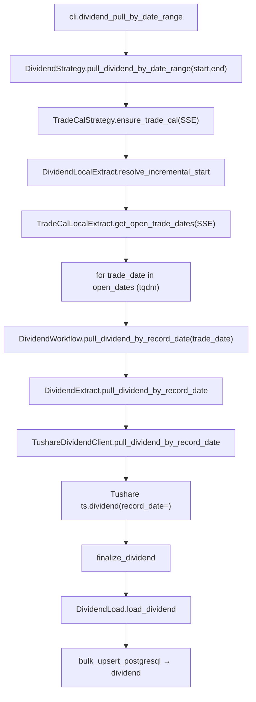
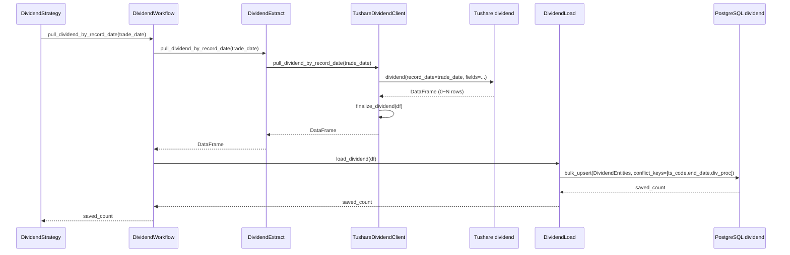

# SDD · 分红送股

> **CLI 命令：** `dividend pull-by-date-range`
> **交互菜单：** 【分红】分红送股数据入库 现金分红/送转/除权除息日 (dividend pull-by-date-range)
> **源码入口：** `src/etl/cli.py`
> **Tushare 接口：** [`dividend`](https://tushare.pro/document/2?doc_id=103)

---

## 1. 概述

按交易日历开市日，逐日调用 Tushare `dividend(record_date=)` 拉取全市场分红送股数据（含预案/实施/除权除息日等），upsert 到 PostgreSQL `market_dividend` 表。为多因子模型提供股息率因子、分红连续性因子、除权除息事件因子等原始数据。

> Tushare `dividend` 不支持按年度全市场拉取，仅支持按 `record_date`（股权登记日）单日查询。因此采用按交易日逐日遍历模式。积分要求 2000+。同一股同一年度可能有预案和实施两条记录（`div_proc` 不同），因此冲突键包含 `div_proc`。

### 触发方式

```bash
# 默认区间（[DIVIDEND_START_DATE, 今日]）
uv run ./src/etl/cli.py dividend pull-by-date-range

# 自定义区间
uv run ./src/etl/cli.py dividend pull-by-date-range --start-date 20200101 --end-date 20251231

# 交互菜单
uv run ./src/etl/cli.py
```

### 前置依赖

| 依赖 | 说明 |
|------|------|
| `TUSHARE_API_KEY` | Tushare Pro 鉴权（需 2000+ 积分） |
| `DIVIDEND_START_DATE` | 未传 `--start-date` 时的 floor（`.env`，推荐 `20000101`） |
| `stock_trade_calendar`（SSE） | 区间内开市日来源；缺失则自动 `ensure_trade_cal(SSE)` 回填 |
| PostgreSQL | 目标库连接（`POSTGRESQL_*`） |

### CLI 参数

| 选项 | 默认 | 说明 |
|------|------|------|
| `--start-date` | `DIVIDEND_START_DATE` | 区间起点 YYYYMMDD |
| `--end-date` | 今日 | 区间终点 YYYYMMDD |

---

## 2. CLI 入口

| 项 | 值 |
|----|-----|
| Typer 子命令组 | `market_dividend`（新增） |
| 命令名 | `pull-by-date-range` |
| 处理函数 | `dividend_pull_by_date_range()` |
| 菜单 key | `dividend-pull-by-date-range` |
| 菜单 label | `【分红】分红送股数据入库 现金分红/送转/除权除息日 (dividend pull-by-date-range)` |

```python
# src/etl/cli.py（示意）
dividend_strategy = typer.Typer()
app.add_typer(dividend_strategy, name="dividend", help="分红送股 ETL commands")

@dividend_strategy.command("pull-by-date-range")
def dividend_pull_by_date_range(
    start_date: str | None = typer.Option(None, "--start-date", help="起始日 YYYYMMDD，默认 DIVIDEND_START_DATE"),
    end_date: str | None = typer.Option(None, "--end-date", help="结束日 YYYYMMDD，默认今日"),
) -> None:
    """按 SSE 开市日逐日拉取 Tushare dividend 并 upsert（现金分红/送转/除权除息日）。"""
    total = DividendStrategy().pull_dividend_by_date_range(
        start_date=start_date,
        end_date=end_date,
    )
    typer.echo(f"分红送股累计写入 {total} 条")
```

---

## 3. 分层架构

```
CLI (cli.py)
  └─ DividendStrategy.pull_dividend_by_date_range(start, end)          ← 区间编排
       ├─ TradeCalStrategy.ensure_trade_cal(SSE)                         ← 区间日历兜底
       ├─ DividendLocalExtract.resolve_incremental_start()                ← max(floor, 库内 max(record_date)+1)
       ├─ TradeCalLocalExtract.get_open_trade_dates(SSE,...)              ← 开市日列表
       └─ for trade_date in open_dates:
            └─ DividendWorkflow.pull_dividend_by_record_date(trade_date) ← 单日 Extract→Load
                 ├─ DividendExtract.pull_dividend_by_record_date(trade_date)
                 │    └─ TushareDividendClient.pull_dividend_by_record_date(trade_date)
                 │         └─ ts.dividend(record_date=trade_date, fields=...)
                 └─ DividendLoad.load_dividend(df)
                      └─ Database.bulk_upsert_postgresql → dividend
```

**新增源码骨架：**

| 路径 | 角色 |
|------|------|
| `src/etl/cli.py` | 新增 `market_dividend` typer 子命令组与菜单项 |
| `src/etl/strategy/dividend/dividend_strategy.py` | 区间编排、开市日循环、tqdm |
| `src/etl/workflow/dividend/dividend_workflow.py` | 单日 Extract→Load 串联 |
| `src/etl/extract/dividend_extract.py` | 调用 Client |
| `src/etl/extract/local/dividend/dividend_local_extract.py` | 读 max(record_date) 解析增量起点 |
| `src/etl/client/dividend/tushare.py` | `TushareDividendClient`，限流 200/min，按 `record_date` 单日查询 |
| `src/etl/client/dividend/common.py` | `DIVIDEND_COLUMNS`、`finalize_dividend` |
| `src/etl/load/dividend/dividend_load.py` | upsert 到 `market_dividend` 表 |
| `src/entities/data_entities/dividend_entities.py` | ORM：`DividendEntities` |
| `src/common/setting.py` | 新增 `dividend_start_date` |

---

## 4. 完整调用流程图

### 4.1 模块调用链



### 4.2 时序图（单期）



---

## 5. 逐步说明

| 步骤 | 位置 | 输入 | 处理 | 输出 / 副作用 |
|------|------|------|------|----------------|
| 1 | CLI | `--start-date` / `--end-date` | 实例化 `DividendStrategy` 并调用 `pull_dividend_by_date_range()` | 透传 saved_count，CLI 路径 echo 总条数 |
| 2 | Strategy | floor / end | 缺省 floor=`DIVIDEND_START_DATE`，end=今日；任一为空或 `floor > end` → return 0 | — |
| 3 | Strategy | floor / end | `TradeCalStrategy.ensure_trade_cal(start=floor, end=end, exchange="SSE")` | 必要时回填 SSE 日历 |
| 4 | Strategy | floor | `DividendLocalExtract.resolve_incremental_start(configured_start=floor)` = `max(floor, 库内 max(record_date)+1)` | `eff_start`；空或 `> end` → return 0 |
| 5 | Strategy | eff_start / end | `TradeCalLocalExtract.get_open_trade_dates(start=eff_start, end=end, exchange="SSE")` | 升序开市日列表 |
| 6 | Strategy | open_dates | `tqdm(open_dates, desc="分红送股入库", unit="日")`，逐日调 `DividendWorkflow.pull_dividend_by_record_date(td)` | postfix 含 `saved/total/trade_date` |
| 7 | Workflow | trade_date | `DividendExtract.pull_dividend_by_record_date(td)` → 入库 | saved_count |
| 8 | Extract | trade_date | 调 Client，返回 DataFrame | DataFrame |
| 9 | Client | record_date | 限流 200/min；`ts.dividend(record_date=, fields=DIVIDEND_COLUMNS)` → `finalize_dividend` | 归一化 DataFrame |
| 10 | Load | DataFrame | 空 → 0；否则 `bulk_upsert_postgresql` | upsert 条数 |
| 11 | CLI | total | `typer.echo("分红送股累计写入 {total} 条")` | 终端输出 |

---

## 6. 数据与外部依赖

### 6.1 Tushare API

| 项 | 值 |
|----|-----|
| 接口 | `market_dividend` |
| Client | `src/etl/client/dividend/tushare.py` |
| Token | `settings.tushare_api_key` ← `TUSHARE_API_KEY` |
| 限流 | 200/min（`create_rate_limiter(200)`） |
| 查询模式 | 按 `record_date` 单日查询全市场（不支持按年度范围拉取） |

**接口输入参数：**

| 名称 | 类型 | 必选 | 说明 |
|------|------|------|------|
| ts_code | str | N | TS 代码（本任务不用，按年度全市场拉） |
| ann_date | str | N | 公告日（本任务不用） |
| record_date | str | N | 股权登记日期（**本任务按年度范围使用**） |
| ex_date | str | N | 除权除息日（本任务不用） |
| imp_ann_date | str | N | 实施公告日（本任务不用） |

**接口输出字段（全部入库）：**

| 名称 | 类型 | 说明 |
|------|------|------|
| ts_code | str | TS 代码 |
| end_date | str | 分红年度（YYYYMMDD，通常为 1231） |
| ann_date | str | 预案公告日 |
| div_proc | str | 实施进度（如"预案"、"实施"） |
| stk_div | float | 每股送转 |
| stk_bo_rate | float | 每股送股比例 |
| stk_co_rate | float | 每股转增比例 |
| cash_div | float | 每股分红（税后） |
| cash_div_tax | float | 每股分红（税前） |
| record_date | str | 股权登记日 |
| ex_date | str | 除权除息日 |
| pay_date | str | 派息日 |
| div_listdate | str | 红股上市日 |
| imp_ann_date | str | 实施公告日 |
| base_date | str | 基准日 |
| base_share | float | 基准股本（万） |

### 6.2 数据库

| 项 | 值 |
|----|-----|
| 表名 | `market_dividend` |
| ORM | `DividendEntities`（`src/entities/data_entities/dividend_entities.py`） |
| 冲突键 | `(ts_code, end_date, div_proc)` |
| Upsert | `bulk_upsert_postgresql(..., conflict_keys=[ts_code, end_date, div_proc], fallback_on_error=True)` |

**ORM 字段：**

| 列 | 类型 | 说明 |
|----|------|------|
| `id` | Integer PK autoincrement | — |
| `ts_code` | String(20) | TS 代码 |
| `end_date` | String(8) | 分红年度 |
| `ann_date` | String(8) | 预案公告日 |
| `div_proc` | String(20) | 实施进度 |
| `stk_div` | Float | 每股送转 |
| `stk_bo_rate` | Float | 每股送股比例 |
| `stk_co_rate` | Float | 每股转增比例 |
| `cash_div` | Float | 每股分红（税后） |
| `cash_div_tax` | Float | 每股分红（税前） |
| `record_date` | String(8) | 股权登记日 |
| `ex_date` | String(8) | 除权除息日 |
| `pay_date` | String(8) | 派息日 |
| `div_listdate` | String(8) | 红股上市日 |
| `imp_ann_date` | String(8) | 实施公告日 |
| `base_date` | String(8) | 基准日 |
| `base_share` | Float | 基准股本（万） |

**索引：**

| 索引名 | 列 | 唯一 |
|--------|----|------|
| `idx_dividend_unique` | `(ts_code, end_date, div_proc)` | UNIQUE |
| `idx_dividend_ts_code` | `(ts_code)` | — |
| `idx_dividend_ex_date` | `(ex_date)` | — |

**关于 NULL 与 ON CONFLICT：** `div_proc` 为非空字段（Tushare 始终返回），无需 NULL 归一化。日期类字段（`ex_date` / `pay_date` 等）可能为空，但不在冲突键中，不影响 upsert。

### 6.3 finalize_dividend 规则

| 列 | 规则 |
|----|------|
| `ts_code` | `str.strip()` |
| `end_date` | `_normalize_ymd` → 8 位 YYYYMMDD |
| `ann_date` / `record_date` / `ex_date` / `pay_date` / `div_listdate` / `imp_ann_date` / `base_date` | `_normalize_ymd`；NaN/None → `""` |
| `div_proc` | `str.strip()` |
| 数值列 | NaN → None |

---

## 7. 业务规则

1. **按 `record_date` 逐日全市场拉取：** 每次调 `dividend(record_date=td)` 获取当日全市场分红记录（每日 0~数十条，稀疏数据）。
2. **仅开市日遍历：** 通过 `stock_trade_calendar` SSE 开市日过滤遍历集，降低无效 API 调用。
3. **增量语义：** `eff_start = max(DIVIDEND_START_DATE, 库内 max(record_date)+1)`；与 `suspend pull-by-date` 同模式。
4. **Upsert 幂等：** `(ts_code, end_date, div_proc)` 联合唯一，重复执行不产生重复行。同一股同一年度可能有"预案"和"实施"两条，各自独立。
5. **空集容忍：** 大部分交易日无分红数据，saved=0，继续下一日。
6. **不做完整性校验：** 低频事件数据，无固定"应有"频率，不需要 period_count 快照。

---

## 8. 日志与可观测性

| 机制 | 说明 |
|------|------|
| typer.echo | 子命令：`分红送股累计写入 {total} 条`（菜单路径无） |
| print | `[信息] {eff_start}~{end} 共 N 个开市日待补` |
| tqdm | `分红送股入库`，单位「日」，postfix `saved/total/trade_date` |

---

## 9. 已知限制与实现备注

| 项 | 说明 |
|----|------|
| 积分要求 | 需 2000+ 积分 |
| API 限制 | `market_dividend` 不支持按年度范围拉取，仅支持按 `record_date` / `ex_date` / `ann_date` / `imp_ann_date` 单日查询 |
| 分红年度定义 | `end_date` 通常为 YYYY1231（年度截止），部分公司为其他日期 |
| 预案 vs 实施 | 同一 `(ts_code, end_date)` 可能有 `div_proc='预案'` 和 `div_proc='实施'` 两条；冲突键含 `div_proc` 可区分 |
| 数据稀疏 | 每日分红记录 0~数十条，大部分交易日为空；全量历史需遍历全部开市日 |
| 历史深度 | Tushare 分红数据覆盖较早年份，建议 `DIVIDEND_START_DATE=20000101` |
| 不做 Transform | 直接入库原始数据 |

---

## 10. 相关命令

| 命令 | 关系 |
|------|------|
| `stock pull-list-a` | 弱依赖：下游可按 `stock_list` join |
| `daily-basic pull-by-date-range` | `dv_ratio` / `dv_ttm` 字段为已计算的股息率，本表提供原始分红事件数据 |
| `kline pull-daily-by-date-range` | 除权除息日事件因子需结合 K 线计算跳空 |

---

## 附录 · Call Stack

```
cli.dividend_pull_by_date_range()
└─ DividendStrategy.pull_dividend_by_date_range(start_date, end_date)
   ├─ TradeCalStrategy.ensure_trade_cal(start, end, exchange="SSE")
   ├─ DividendLocalExtract.resolve_incremental_start(configured_start=floor)
   ├─ TradeCalLocalExtract.get_open_trade_dates(start=eff_start, end=end, exchange="SSE")
   └─ for trade_date in open_dates:
      └─ DividendWorkflow.pull_dividend_by_record_date(record_date=trade_date)
         ├─ DividendExtract.pull_dividend_by_record_date(record_date=trade_date)
         │  └─ TushareDividendClient.pull_dividend_by_record_date(record_date=trade_date)
         │     ├─ ts.dividend(record_date=trade_date, fields=DIVIDEND_COLUMNS)
         │     └─ finalize_dividend(df)
         └─ DividendLoad.load_dividend(df)
            └─ Database.bulk_upsert_postgresql(
                 DividendEntities,
                 conflict_keys=['ts_code', 'end_date', 'div_proc'],
                 fallback_on_error=True,
               )
```

## 附录 · 环境变量新增项

| 变量 | 默认 | 用途 | 推荐 .env |
|------|------|------|-----------|
| `DIVIDEND_START_DATE` | `""` | 分红增量起点；空则整命令 no-op | `20000101` |

> 应同步更新 `src/common/setting.py` 与 `spec/etl/README.md` 环境依赖表。
