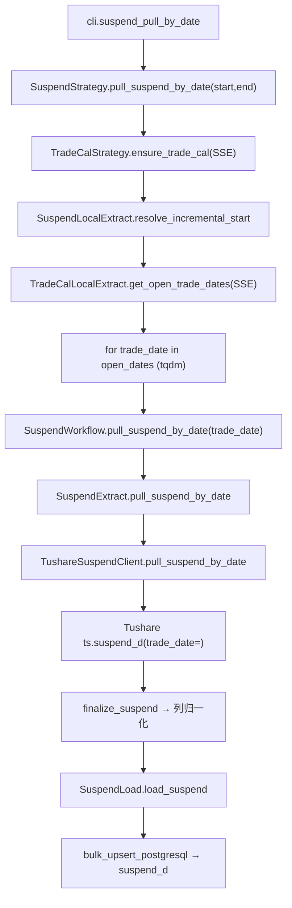
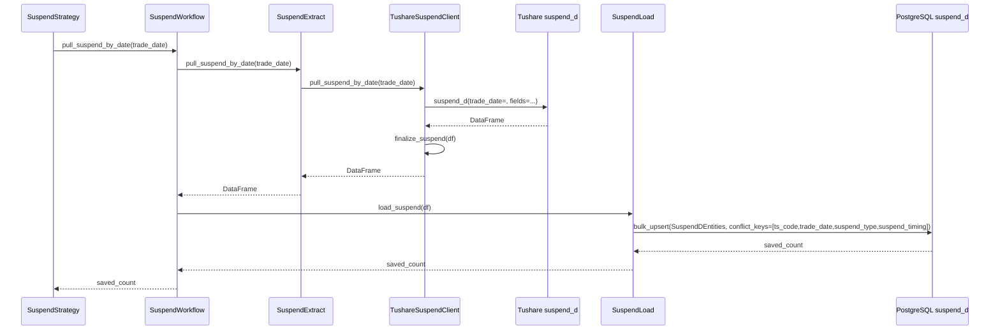

# SDD · A 股停复牌数据入库

> **CLI 命令：** `suspend pull-by-date`
> **交互菜单：** 【基础】A 股停复牌数据入库
> **源码入口（待实现）：** `src/etl/cli.py`（新增 `suspend` 子命令组）
> **Tushare 接口：** [`suspend_d`](https://tushare.pro/document/2?doc_id=214)

---

## 1. 概述

按交易日历开市日，逐日调用 Tushare `suspend_d` 拉取**全市场**停复牌信息（含日内停牌时段），upsert 到 PostgreSQL `stock_suspend` 表。为后续策略与回测提供「某日某股是否停牌 / 日内停牌区间 / 复牌日」的基础事实数据。

> Tushare `suspend_d` 默认按 `trade_date` 维度返回当日全部停复牌记录；不传 `suspend_type` 时同时返回停牌（S）与复牌（R）记录。本任务**不**过滤 `suspend_type`，一次拉全。

### 触发方式

```bash
# 默认区间（[SUSPEND_START_DATE, 今日]）
uv run ./src/etl/cli.py suspend pull-by-date

# 自定义区间
uv run ./src/etl/cli.py suspend pull-by-date --start-date 20250101 --end-date 20251231

# 交互菜单（不传日期，用默认）
uv run ./src/etl/cli.py
```

### 前置依赖

| 依赖 | 说明 |
|------|------|
| `TUSHARE_API_KEY` | `suspend_d` 接口鉴权 |
| `SUSPEND_START_DATE` | 未传 `--start-date` 时的 floor（`.env`，开发期 `20250101`） |
| `stock_trade_calendar`（SSE） | 区间内开市日来源；缺失则自动 `ensure_trade_cal(SSE)` 回填 |
| PostgreSQL | 目标库连接（`POSTGRESQL_*`），读 max(trade_date) 算增量起点 + 写 |

**注意：** 若 `SUSPEND_START_DATE` 未配置且 CLI 未传 `--start-date`，floor 为空，整命令直接 return 0（与 `trade-cal pull-history` 一致语义）。

### CLI 参数

| 选项 | 默认 | 说明 |
|------|------|------|
| `--start-date` | `SUSPEND_START_DATE` | 区间起点 YYYYMMDD |
| `--end-date` | 今日 | 区间终点 YYYYMMDD |

**交互菜单：** 调用 `SuspendStrategy().pull_suspend_by_date()` 无参，**不**执行 CLI 层 `typer.echo`（与 `trade-cal pull-history` 菜单路径行为一致）。

---

## 2. CLI 入口（待实现）

| 项 | 值 |
|----|-----|
| Typer 子命令组 | `suspend`（新增） |
| 命令名 | `pull-by-date` |
| 处理函数 | `suspend_pull_by_date()` |
| 菜单 key | `suspend-pull-by-date` → `_MENU_HANDLERS` |
| 菜单 label | `【基础】A 股停复牌数据入库 (suspend pull-by-date)` |

```python
# src/etl/cli.py（示意）
suspend_strategy = typer.Typer()
app.add_typer(suspend_strategy, name="suspend", help="停复牌 ETL commands")

@suspend_strategy.command("pull-by-date")
def suspend_pull_by_date(
    start_date: str | None = typer.Option(None, "--start-date", help="起始日 YYYYMMDD，默认 SUSPEND_START_DATE"),
    end_date: str | None = typer.Option(None, "--end-date", help="结束日 YYYYMMDD，默认今日"),
) -> None:
    """按交易日历开市日逐日拉取 Tushare suspend_d 并 upsert 到 suspend_d。"""
    total = SuspendStrategy().pull_suspend_by_date(
        start_date=start_date,
        end_date=end_date,
    )
    typer.echo(f"停复牌累计写入 {total} 条")
```

> **命名约定：** `SuspendStrategy.pull_suspend_by_date(start, end)` 与 `SuspendWorkflow.pull_suspend_by_date(trade_date)` 同名但不同签名（Strategy 接区间，Workflow 接单日），仅依赖类区分。与 kline 路径 `*_by_date_range` / `*_by_date` 命名风格不同，保留用户偏好。

---

## 3. 分层架构

```
CLI (cli.py)
  └─ SuspendStrategy.pull_suspend_by_date(start, end)            ← 区间编排
       ├─ TradeCalStrategy.ensure_trade_cal(SSE)                  ← 区间日历兜底
       ├─ SuspendLocalExtract.resolve_incremental_start()         ← max(floor, 库内 max(trade_date)+1)
       ├─ TradeCalLocalExtract.get_open_trade_dates(SSE,...)      ← 开市日列表
       └─ for trade_date in open_dates:
            └─ SuspendWorkflow.pull_suspend_by_date(trade_date)   ← 单日 Extract→Load
                 ├─ SuspendExtract.pull_suspend_by_date(trade_date)
                 │    └─ TushareSuspendClient.pull_suspend_by_date(trade_date)
                 │         └─ ts.suspend_d(trade_date=trade_date, fields=...)
                 └─ SuspendLoad.load_suspend(df)
                      └─ Database.bulk_upsert_postgresql → suspend_d
```

**新增源码骨架（待实现）：**

| 路径 | 角色 |
|------|------|
| `src/etl/cli.py` | 新增 `suspend` typer 子命令组与菜单项 |
| `src/etl/strategy/suspend/suspend_strategy.py` | 区间编排、增量起点解析、tqdm 循环 |
| `src/etl/workflow/suspend/suspend_workflow.py` | 单日 Extract→Load 串联 |
| `src/etl/extract/suspend_extract.py` | 调用 Client + `is_usable_suspend` 校验 |
| `src/etl/extract/local/suspend/suspend_extract.py` | `SuspendLocalExtract`：读 max(trade_date) 解析增量起点 |
| `src/etl/client/suspend/tushare.py` | `TushareSuspendClient.pull_suspend_by_date`，限流 200/min |
| `src/etl/client/suspend/common.py` | `SUSPEND_COLUMNS`、`finalize_suspend`、`is_usable_suspend` |
| `src/etl/load/suspend/suspend_load.py` | upsert 到 `stock_suspend` 表 |
| `src/entities/data_entities/suspend_d_entities.py` | ORM：`SuspendDEntities` |
| `src/entities/client_entities/tushare_entities.py` | 新增 `stock_suspend` 字段列表 |
| `src/service/suspend/suspend_service.py` | `get_max_trade_date()` / `resolve_incremental_start()` |
| `src/model/suspend/suspend_model.py` | 数据库读模型 |
| `src/common/setting.py` | 新增 `suspend_start_date: str = Field(default="", alias="SUSPEND_START_DATE")` |

---

## 4. 完整调用流程图

### 4.1 模块调用链



### 4.2 时序图（单日）



---

## 5. 逐步说明

| 步骤 | 位置 | 输入 | 处理 | 输出 / 副作用 |
|------|------|------|------|----------------|
| 1 | CLI | `--start-date` / `--end-date` | 实例化 `SuspendStrategy` 并调用 `pull_suspend_by_date()` | 透传 saved_count，CLI 路径 echo 总条数 |
| 2 | Strategy | floor / end | 缺省 floor=`SUSPEND_START_DATE`，end=今日；任一为空或 `floor > end` → return 0 | — |
| 3 | Strategy | floor / end | `TradeCalStrategy.ensure_trade_cal(start=floor, end=end, exchange="SSE")` | 必要时回填 SSE 日历 |
| 4 | Strategy | floor | `SuspendLocalExtract.resolve_incremental_start(configured_start=floor)` = `max(floor, 库内 max(trade_date)+1)` | `eff_start`；空或 `> end` → return 0 |
| 5 | Strategy | eff_start / end | `TradeCalLocalExtract.get_open_trade_dates(start=eff_start, end=end, exchange="SSE")` | 升序开市日列表 |
| 6 | Strategy | open_dates | `tqdm_iter(open_dates, desc="停复牌入库", unit="日")`，逐日调 `SuspendWorkflow.pull_suspend_by_date(td)` | postfix 含 `saved/total/trade_date` |
| 7 | Workflow | trade_date | `SuspendExtract.pull_suspend_by_date(td)` → 校验 → 入库 | saved_count |
| 8 | Extract | trade_date | 调 Client；`is_usable_suspend(df)` 不通过返回空 DataFrame | DataFrame |
| 9 | Client | trade_date | 限流 200/min；`ts.suspend_d(trade_date=, fields=SUSPEND_COLUMNS)` → `finalize_suspend` | 归一化 DataFrame |
| 10 | Load | DataFrame | 空 → 0；否则 `dataframe_to_list` → `bulk_upsert_postgresql` | upsert 条数 |
| 11 | CLI | total | `typer.echo("停复牌累计写入 {total} 条")` | 终端输出 |

**增量语义：** 跟 `trade-cal pull-history` 完全对齐 —— 每次取「库内最大 `trade_date` 的下一自然日」与配置 floor 取最大值作为有效起点，避免重复拉已入库区间。

**仅开市日：** Tushare `suspend_d` 在非开市日通常返回空集，但接口允许传任意自然日。本任务通过 `get_open_trade_dates` 过滤为 SSE 开市日，**降低无效 API 调用**（限流 200/min 友好）。

---

## 6. 数据与外部依赖

### 6.1 Tushare API

| 项 | 值 |
|----|-----|
| 接口 | `stock_suspend` |
| Client | `src/etl/client/suspend/tushare.py`（新增） |
| Token | `settings.tushare_api_key` ← `TUSHARE_API_KEY` |
| 限流 | 200/min（保持与现有 trade_cal 一致 `create_rate_limiter(200)`） |
| 字段定义 | `tushare_entities.suspend_d`（新增） |

**接口输入参数（实际仅用 `trade_date`）：**

| 名称 | 类型 | 必选 | 说明 |
|------|------|------|------|
| ts_code | str | N | 股票代码（可多值，本任务不使用） |
| trade_date | str | N | 交易日日期（本任务**按日**遍历使用） |
| start_date | str | N | 查询开始日期（本任务不使用） |
| end_date | str | N | 查询结束日期（本任务不使用） |
| suspend_type | str | N | `S`-停牌 / `R`-复牌（本任务**不**过滤，一次拉全） |

**接口输出字段（全部入库）：**

| 名称 | 类型 | 说明 |
|------|------|------|
| ts_code | str | TS 代码 |
| trade_date | str | 停复牌日期 YYYYMMDD |
| suspend_timing | str | 日内停牌时间段，如 `09:30-10:00`；全天停牌为 `None` |
| suspend_type | str | `S`-停牌 / `R`-复牌 |

**示例（doc）：**

```python
pro = ts.pro_api()
df = pro.suspend_d(suspend_type='S', trade_date='20200312')
#   ts_code  suspend_type  trade_date  suspend_timing
# 0 000029.SZ      S        20200312   None
# ...
# 12 300819.SZ     S        20200312   09:30-10:00
```

### 6.2 数据库

| 项 | 值 |
|----|-----|
| 表名 | `stock_suspend` |
| ORM | `SuspendDEntities`（新增 `src/entities/data_entities/suspend_d_entities.py`） |
| 冲突键 | `(ts_code, trade_date, suspend_type, suspend_timing)` |
| Upsert | `bulk_upsert_postgresql(..., conflict_keys=[...], fallback_on_error=True)` |
| 空 DataFrame | 返回 0，不写库 |

**ORM 字段：**

| 列 | 类型 | 说明 |
|----|------|------|
| `id` | Integer PK autoincrement | — |
| `ts_code` | String(20) | TS 代码 |
| `trade_date` | String(8) | 停复牌日期 YYYYMMDD |
| `suspend_type` | String(1) | `S` / `R` |
| `suspend_timing` | String(32) | 日内停牌时段；全天停牌归一化为空字符串 `""`（**不**保留 NULL，否则 ON CONFLICT 失效） |

**索引：**

| 索引名 | 列 | 唯一 |
|--------|----|------|
| `idx_suspend_d_unique` | `(ts_code, trade_date, suspend_type, suspend_timing)` | UNIQUE |
| `idx_suspend_d_trade_date` | `(trade_date)` | — |
| `idx_suspend_d_ts_code` | `(ts_code)` | — |
| `idx_suspend_d_type` | `(suspend_type, trade_date)` | — |

**关于 NULL 与 ON CONFLICT：** PostgreSQL `ON CONFLICT` 视 NULL 不相等，会导致全天停牌记录每次跑都重复 INSERT。`finalize_suspend` 必须把 `suspend_timing` 的 NaN/None 统一替换为空字符串 `""`，并保证四列联合唯一索引可正常生效。

**表创建：** ORM 文件末尾必须包含以下样板，便于 `uv run` 直接同步表结构（与 `LogMissing` / `TradeCalEntities` 等保持一致）：

```python
if __name__ == "__main__":
    from src.common.database import sync_table

    # 使用通用函数同步表结构
    sync_table(SuspendDEntities)
```

执行：

```bash
uv run ./src/entities/data_entities/suspend_d_entities.py
```

### 6.3 finalize_suspend 规则

| 列 | 规则 |
|----|------|
| `ts_code` | `str.strip()` |
| `trade_date` | `_normalize_ymd` → 8 位 YYYYMMDD；长度不足丢弃整行 |
| `suspend_type` | `str.strip().upper()`；只保留 `{"S","R"}` |
| `suspend_timing` | `None/NaN → ""`；其余 `str.strip()` |

---

## 7. 业务规则

1. **全量类型一次拉：** 单日调用 `suspend_d(trade_date=...)` 不传 `suspend_type`，同时入库 S 与 R 记录；下游可按 `suspend_type` 过滤。
2. **仅开市日遍历：** 通过 `stock_trade_calendar` SSE 开市日过滤遍历集；非开市日不发 API 请求。
3. **增量语义：** 与 `trade-cal pull-history` 对齐 —— `eff_start = max(SUSPEND_START_DATE, 库内 max(trade_date)+1)`；首次跑默认 `20250101` 起。
4. **Upsert 语义：** 以 `(ts_code, trade_date, suspend_type, suspend_timing)` 为联合冲突键；存在则更新（实际无其他业务列，等价于幂等空更新），不存在则插入。
5. **空集容忍：** 单日返回空 DataFrame 时不报错，saved=0，继续下一日。
6. **`suspend_timing` NULL 归一化：** 全天停牌的 NULL 在入库前统一改写为 `""`，使 ON CONFLICT 行为正确。下游消费方需识别 `""` 表示「全天 / 未指定时段」。
7. **范围 floor 缺省：** `SUSPEND_START_DATE` 未配置且未传 CLI 起点 → 整命令 no-op，return 0（不报错，保持与 trade_cal 同语义）。

---

## 8. 日志与可观测性

| 机制 | 说明 |
|------|------|
| typer.echo | 子命令：`停复牌累计写入 {total} 条`（菜单路径无） |
| print | `[信息] {eff_start}~{end} 共 N 个开市日待补 / 已同步至 {max}，跳过` |
| tqdm | `停复牌入库`，单位「日」，postfix `saved/total/trade_date` |

---

## 9. 已知限制与实现备注

| 项 | 说明 |
|----|------|
| 接口不定期更新 | Tushare 文档标注「更新时间：不定期」；历史回补可能逐步补全，建议周期性重跑近 N 日 |
| ON CONFLICT 与 NULL | 必须在 `finalize_suspend` 把 `suspend_timing` 空值归一化为 `""`；否则联合唯一索引失效 |
| `stock_trade_calendar` 兜底 | 强制 `ensure_trade_cal(SSE, floor, end)`；若 Tushare 日历回填失败将抛错 |
| 非 SSE 交易所 | 当前仅按 SSE 开市日遍历，假设两市开市日完全一致；如未来纳入北交所/港股通需重新评估 |
| 菜单 vs 子命令 | 菜单路径无 `typer.echo`、无 CLI 日期参数（统一约定） |
| 空 SUSPEND_START_DATE | 未配置且无 `--start-date` 时整命令 no-op |
| 不做 Transform 层 | 复用 Client 内 `finalize_suspend`，无独立 Transform；与 `stock_trade_calendar` 同套路 |
| 不刷新 period_count | 该数据无完整性快照表设计；如未来需要再加 `suspend_period_count` |

---

## 10. 相关命令

| 命令 | 关系 |
|------|------|
| `trade-cal pull-history` | **前置**：提供 SSE 开市日 |
| `stock pull-list-a` | 弱依赖：下游消费方常按 `stock_list` 关联 |
| `kline pull-daily-by-date-range` | 同为按日全市场增量，编排模式参考 |
| `kline check-complete` | **下游消费方**：用全天停牌（`suspend_type='S' AND suspend_timing=''`）从「应有交易日」扣除，避免把停牌日误判为缺日；详见 [K线-完整性校验.sdd.md](./K线-完整性校验.sdd.md) |
| `StockTradeCalendarService.compute_stock_trade_calendar` | 下游消费方：组合 `stock_trade_calendar` + `stock_list` + 本表，输出单股 `[start, end]` 内「应有交易日」（[源码](../../src/service/stock/stock_trade_calendar_service.py)） |

---

## 附录 A · 公共 Call Stack

```
cli.suspend_pull_by_date()
└─ SuspendStrategy.pull_suspend_by_date(start_date, end_date)
   ├─ TradeCalStrategy.ensure_trade_cal(start, end, exchange="SSE")
   ├─ SuspendLocalExtract.resolve_incremental_start(configured_start=floor)
   ├─ TradeCalLocalExtract.get_open_trade_dates(start=eff_start, end=end, exchange="SSE")
   └─ for trade_date in open_dates:
      └─ SuspendWorkflow.pull_suspend_by_date(trade_date)
         ├─ SuspendExtract.pull_suspend_by_date(trade_date)
         │  └─ TushareSuspendClient.pull_suspend_by_date(trade_date)
         │     ├─ ts.suspend_d(trade_date=trade_date, fields=SUSPEND_COLUMNS)
         │     └─ finalize_suspend(df)
         └─ SuspendLoad.load_suspend(df)
            ├─ dataframe_to_list(df)
            └─ Database.bulk_upsert_postgresql(
                 SuspendDEntities,
                 conflict_keys=['ts_code','trade_date','suspend_type','suspend_timing'],
                 fallback_on_error=True,
               )
```

## 附录 B · 环境变量新增项

| 变量 | 默认 | 用途 | 推荐 .env |
|------|------|------|-----------|
| `SUSPEND_START_DATE` | `""` | 停复牌增量起点；空则整命令 no-op | 开发期 `20250101` |

> 应同步更新 [`src/common/setting.py`](../../src/common/setting.py) `Settings` 与 [`spec/etl/README.md`](./README.md) 环境依赖表。
