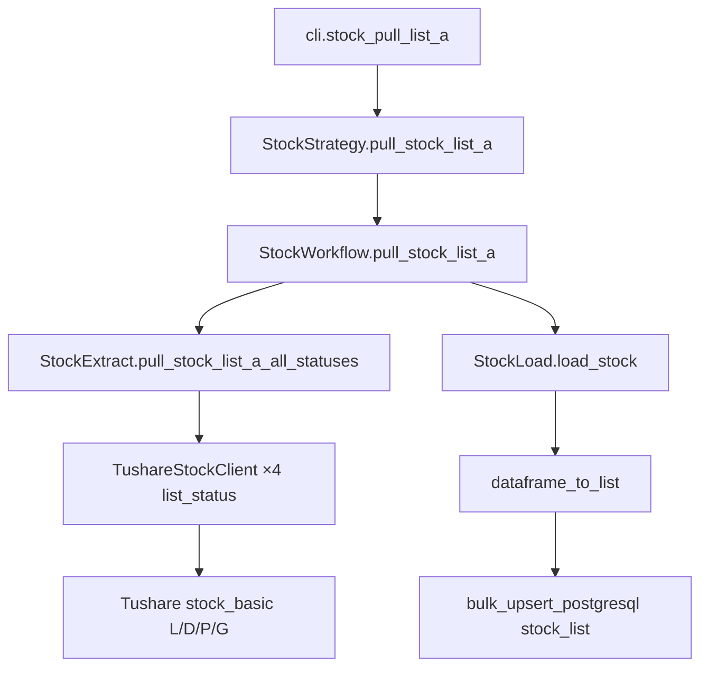
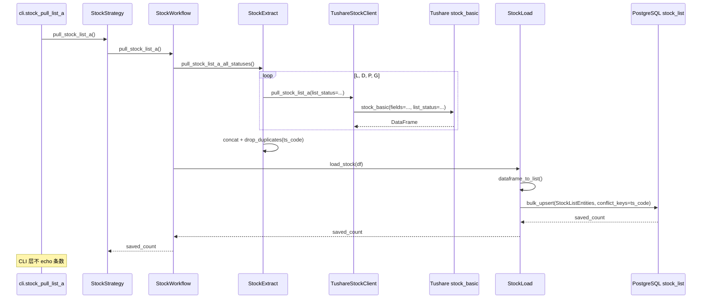

# SDD · A 股股票列表拉取

> **CLI 命令：** `stock pull-list-a`  
> **交互菜单：** 【基础】A 股股票列表拉取并入库  
> **源码入口：** [`src/etl/cli.py`](../../src/etl/cli.py) L85–89

---

## 1. 概述

从 Tushare Pro 按 `list_status` **L / D / P / G 四态**分别拉取 `stock_basic`，合并去重后经 upsert 写入 PostgreSQL `stock_list` 表。为后续 ETL（财报完整性检查、K 线拉取等）提供基础股票主数据（含已退市等历史代码）。

> Tushare [`stock_basic`](https://tushare.pro/document/2?doc_id=25) 默认 `list_status=L`，仅拉一次会缺失 D/P/G 股票，导致历史 `period_stock_count` 偏小。

### 触发方式

```bash
# 交互菜单
uv run ./src/etl/cli.py

# 直调
uv run ./src/etl/cli.py stock pull-list-a
```

### 前置依赖

| 依赖 | 说明 |
|------|------|
| `TUSHARE_API_KEY` | Tushare Pro 鉴权 |
| PostgreSQL | 目标库连接（`POSTGRESQL_*` 环境变量） |

无其他表或任务前置要求；通常作为 ETL 流水线**第一步**执行。

### CLI 参数

无。命令不接受任何 Option 或 Argument。

---

## 2. CLI 入口

| 项 | 值 |
|----|-----|
| Typer 子命令组 | `stock`（`stock_strategy`） |
| 命令名 | `pull-list-a` |
| 处理函数 | `stock_pull_list_a()` |
| 菜单 key | `stock-pull-list-a` → `_MENU_HANDLERS` |

```python
# src/etl/cli.py
stock_strat = StockStrategy()
stock_strat.pull_stock_list_a()  # 返回值未打印
```

---

## 3. 分层架构

```
CLI (cli.py)
  └─ StockStrategy (stock_strategy.py)
       └─ StockWorkflow (stock_workflow.py)
            ├─ StockExtract (stock_extract.py)
            │    ├─ pull_stock_list_a_all_statuses()
            │    └─ TushareStockClient (client/stock/tushare.py) ×4
            └─ StockLoad (load/stock/stock_load.py)
                 └─ Database.bulk_upsert_postgresql → stock_list
```

**本命令不经过：** `StockTransform`、`StockListService` / `StockListModel`（读层）。

---

## 4. 完整调用流程图

### 4.1 模块调用链



### 4.2 时序图



---

## 5. 逐步说明

| 步骤 | 位置 | 输入 | 处理 | 输出 / 副作用 |
|------|------|------|------|---------------|
| 1 | CLI | — | 实例化 `StockStrategy`，调用 `pull_stock_list_a()` | — |
| 2 | Strategy | — | 委托 `StockWorkflow.pull_stock_list_a()` | 透传 `saved_count` |
| 3 | Workflow | — | Extract 拉数 → Load 入库 | `saved_count` |
| 4 | Extract | — | `pull_stock_list_a_all_statuses()`：对 L/D/P/G 各调一次 Client | 合并去重 DataFrame |
| 5 | Client | `list_status` | 四次 `ts.stock_basic(fields=..., list_status=...)`；**无 exchange 过滤** | 各态 Tushare 结果 |
| 6 | Load | DataFrame | 空则返回 `0`；否则 `dataframe_to_list` → `bulk_upsert_postgresql` | upsert 条数 |
| 7 | CLI | `saved_count` | **丢弃**，不 `typer.echo` | 无终端输出 |

---

## 6. 数据与外部依赖

### 6.1 Tushare API

| 项 | 值 |
|----|-----|
| 接口 | `stock_basic` |
| Client | [`src/etl/client/stock/tushare.py`](../../src/etl/client/stock/tushare.py) |
| Token | `settings.tushare_api_key` ← `TUSHARE_API_KEY` |
| 字段定义 | [`tushare_entities.stock_basic`](../../src/entities/client_entities/tushare_entities.py) L158–175 |

**拉取字段：**

`ts_code`, `symbol`, `name`, `area`, `cnspell`, `market`, `list_date`, `fullname`, `enname`, `curr_type`, `list_status`, `exchange`, `delist_date`, `is_hs`

### 6.2 数据库

| 项 | 值 |
|----|-----|
| 表名 | `stock_list` |
| ORM | `StockListEntities`（[`stock_list_entities.py`](../../src/entities/data_entities/stock_list_entities.py)） |
| 冲突键 | `ts_code` |
| Upsert | `bulk_upsert_postgresql(..., conflict_keys=['ts_code'], fallback_on_error=True)` |
| 空 DataFrame | 返回 `0`，不写库 |

**入库时为 NULL 的列（API 未拉取）：** 如 `is_ggt`、`shenwan_*`、`zhengjian_*`、`concept`、`city`、`country` 及各类 `*_ddl` 截止日期字段等。

### 6.3 写入 vs 读取的 A 股范围

| 路径 | 过滤 |
|------|------|
| **写入**（本命令） | 不过滤 exchange；`list_status` 显式拉 L/D/P/G 四态后按 `ts_code` 去重 |
| **读取**（`StockBaseService.get_all_stock_list_a`） | `exchange in [SSE, SZSE, BSE]` |

下游任务（如财报完整性检查）通过 **读取侧** 过滤 A 股。写入侧保留更全的数据不影响读取逻辑，但 `stock_list` 中会存在非 A 股交易所记录。

---

## 7. 业务规则

1. **全量拉取：** 每次执行对 L/D/P/G 各拉一次 Tushare `stock_basic` 当前快照，非增量；合并后 upsert。
2. **Upsert 语义：** 以 `ts_code` 为键，存在则更新非冲突列，不存在则插入。
3. **幂等性：** 重复执行安全，仅更新已有记录或插入新码。
4. **命名「A 股」：** 业务称谓；代码层写入不做 A 股过滤，读取侧才按交易所过滤。

---

## 8. 日志与可观测性

| 机制 | 说明 |
|------|------|
| CLI echo | **无** |
| tqdm | 无 |
| 返回值 | Workflow → Strategy 返回 `saved_count`，CLI 丢弃 |

---

## 9. 已知限制与实现备注

| 项 | 说明 |
|----|------|
| 无 Transform | 原始 DataFrame 直接入库，无字段清洗层 |
| 唯一约束 | ORM 未声明 `unique=True` on `ts_code`；依赖 `bulk_upsert_postgresql` 的 ON CONFLICT，失败时回退逐条 upsert |
| 已废弃的 `update-base-info` | 曾组合调用 `pull_stock_list_a()` + `financial_report_period_count` + `kline_daily_period_count`，已拆回各自独立命令 |

---

## 10. 相关命令

| 命令 | 关系 |
|------|------|
| `report check-report-complete` | **依赖** `stock_list` 已有数据 |
| `report update-period-count` | 刷新财报报告期 count 快照 |
| `kline check-complete` | 依赖 `stock_list` 中的 `ts_code` 做逐股完整性查漏补拉 |

---

## 附录 · 完整 Call Stack

```
cli.stock_pull_list_a()
└─ StockStrategy.pull_stock_list_a()
   └─ StockWorkflow.pull_stock_list_a()
      ├─ StockExtract.pull_stock_list_a_all_statuses()
      │  └─ for status in L,D,P,G: TushareStockClient.pull_stock_list_a(list_status=status)
      │     └─ ts.stock_basic(fields=..., list_status=...)
      │  └─ pd.concat + drop_duplicates(ts_code)
      └─ StockLoad.load_stock(df)
         ├─ dataframe_to_list(df)
         └─ Database.bulk_upsert_postgresql(StockListEntities, conflict_keys=['ts_code'])
```
