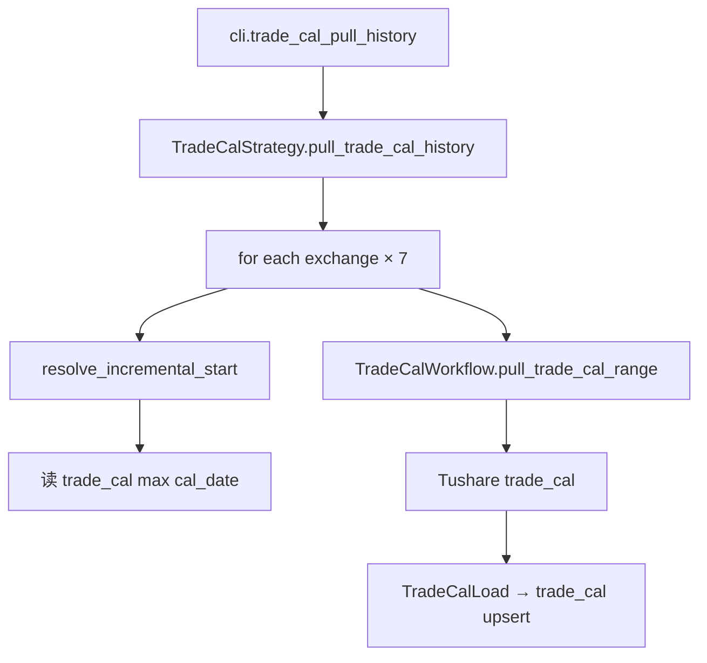

# SDD · 交易日历增量入库

> **CLI 命令：** `trade-cal pull-history`  
> **交互菜单：** 【基础】全交易所交易日历增量入库  
> **源码入口：** [`src/etl/cli.py`](../../src/etl/cli.py) L170–180

---

## 1. 概述

对 7 个交易所逐所增量拉取 Tushare `trade_cal`，含休市日，upsert 到 `stock_trade_calendar` 表。为 K 线按日拉取、开市日筛选等任务提供日历基础数据。

### 触发方式

```bash
# 直调（支持日期参数）
uv run ./src/etl/cli.py trade-cal pull-history
uv run ./src/etl/cli.py trade-cal pull-history --start-date 20200101 --end-date 20251231

# 交互菜单（不传日期，用默认）
uv run ./src/etl/cli.py
```

### 前置依赖

| 依赖 | 说明 |
|------|------|
| `TUSHARE_API_KEY` | trade_cal 接口 |
| `TRADE_CAL_START_DATE` | 未传 `--start-date` 时的 floor（`.env`，如 `19900101`） |
| PostgreSQL | 读 max(cal_date) 算增量起点 + 写 |

**注意：** 若 `TRADE_CAL_START_DATE` 未配置且 CLI 未传 `--start-date`，`floor` 为空，直接返回 0。

### CLI 参数

| 选项 | 默认 | 说明 |
|------|------|------|
| `--start-date` | `TRADE_CAL_START_DATE` | 配置起点 YYYYMMDD |
| `--end-date` | 今日 | 结束日 YYYYMMDD |

**交互菜单：** 调用 `TradeCalStrategy().pull_trade_cal_history()` 无参，**不会**执行 CLI 层 `typer.echo`。

---

## 2. CLI 入口

| 项 | 值 |
|----|-----|
| Typer 子命令组 | `trade-cal` |
| 处理函数 | `trade_cal_pull_history()` |
| 菜单 key | `trade-cal-pull-history` |

---

## 3. 分层架构

```
CLI → TradeCalStrategy.pull_trade_cal_history
  for exchange in [SSE, SZSE, CFFEX, SHFE, CZCE, DCE, INE]:
    LocalExtract.resolve_incremental_start → max(floor, DB max+1)
    TradeCalWorkflow.pull_trade_cal_range
      Extract(Tushare trade_cal) → Load(trade_cal)
```

---

## 4. 完整调用流程图



---

## 5. 逐步说明

| 步骤 | 处理 |
|------|------|
| 1 | 解析 `floor`（`--start-date` 或 `TRADE_CAL_START_DATE`）与 `end`（默认今日） |
| 2 | `floor > end` 或为空 → 返回 0 |
| 3 | 遍历 7 所：`SSE`, `SZSE`, `CFFEX`, `SHFE`, `CZCE`, `DCE`, `INE` |
| 4 | 每所 `eff_start = max(floor, 库内 max(cal_date)+1)` |
| 5 | `eff_start > end` → print 跳过 |
| 6 | `pull_trade_cal_range(exchange, eff_start, end)` → Tushare → upsert |
| 7 | 累加各所写入条数并返回 |

**增量语义：** 每所独立增量，避免重复拉已入库区间。

---

## 6. 数据与外部依赖

### 数据库

| 表 | 操作 | 冲突键 |
|----|------|--------|
| `stock_trade_calendar` | 读 max + 写 upsert | `(exchange, cal_date)` |

**字段：** `exchange`, `cal_date`, `is_open`, `pretrade_date`（含休市日 `is_open=0`）

### Tushare API

| API | 限流 |
|-----|------|
| `trade_cal(exchange, start_date, end_date, fields=...)` | 200/min |

---

## 7. 业务规则

- 拉取**含休市日**，不限开市日。
- 7 所独立增量，SSE 常用于 K 线任务的 `ensure_trade_cal`。
- Extract 校验 `is_usable_trade_cal`，不可用返回空 DataFrame → 该所写入 0。

---

## 8. 日志与可观测性

| 机制 | 说明 |
|------|------|
| typer.echo | 子命令：`交易日历累计写入 {total} 条`（菜单路径无） |
| print | 每所跳过/写入条数 |
| tqdm | `交易日历入库`，单位「所」 |

---

## 9. 已知限制

| 项 | 说明 |
|----|------|
| 菜单 vs 子命令 | 菜单无 echo、无 CLI 日期参数 |
| 空 TRADE_CAL_START_DATE | 未配置且无 `--start-date` 时整命令 no-op |
| ensure_trade_cal | K 线按需补日历路径，本命令不调用 |

---

## 10. 相关命令

| 命令 | 关系 |
|------|------|
| `kline pull-daily-by-date-range` | 依赖 `stock_trade_calendar` 开市日 |
| `kline update-daily-period-count` | 间接 via `ensure_trade_cal` |

---

## 附录 · Call Stack

```
cli.trade_cal_pull_history()
└─ TradeCalStrategy.pull_trade_cal_history()
   └─ for exchange in TRADE_CAL_EXCHANGES:
      ├─ TradeCalLocalExtract.resolve_incremental_start()
      └─ TradeCalWorkflow.pull_trade_cal_range()
         ├─ TradeCalExtract → Tushare trade_cal
         └─ TradeCalLoad → trade_cal
```
