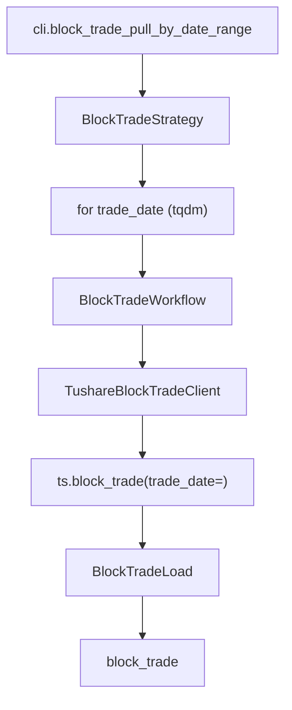

# SDD · 大宗交易

> **CLI 命令：** `block-trade pull-by-date-range`
> **交互菜单：** 【大宗】大宗交易数据 by date 区间增量 (block-trade pull-by-date-range)
> **源码入口：** `src/etl/cli.py`
> **Tushare 接口：** [`block_trade`](https://tushare.pro/document/2?doc_id=161)

---

## 1. 概述

按交易日历开市日，逐日调用 Tushare `block_trade` 拉取全市场大宗交易明细（成交价/量/买卖营业部），upsert 到 PostgreSQL `market_block_trade` 表。为多因子模型提供大宗交易折溢价率、大宗量占比、机构承接等事件型因子。

> Tushare `block_trade` 单次最大 1000 条（需分页）。积分要求 2000+。仅发生大宗交易的个股有数据。

### 触发方式

```bash
uv run ./src/etl/cli.py block-trade pull-by-date-range
uv run ./src/etl/cli.py block-trade pull-by-date-range --start-date 20150101
uv run ./src/etl/cli.py
```

### 前置依赖

| 依赖 | 说明 |
|------|------|
| `TUSHARE_API_KEY` | 需 2000+ 积分 |
| `BLOCK_TRADE_START_DATE` | floor（`.env`，推荐 `20100101`） |
| `stock_trade_calendar`（SSE） | 开市日来源 |

### CLI 参数

| 选项 | 默认 | 说明 |
|------|------|------|
| `--start-date` | `BLOCK_TRADE_START_DATE` | 区间起点 YYYYMMDD |
| `--end-date` | 今日 | 区间终点 YYYYMMDD |

---

## 2. CLI 入口

| 项 | 值 |
|----|-----|
| Typer 子命令组 | `block-trade`（新增） |
| 命令名 | `pull-by-date-range` |
| 处理函数 | `block_trade_pull_by_date_range()` |
| 菜单 key | `block-trade-pull-by-date-range` |
| 菜单 label | `【大宗】大宗交易数据 by date 区间增量 (block-trade pull-by-date-range)` |

```python
block_trade_strategy = typer.Typer()
app.add_typer(block_trade_strategy, name="block-trade", help="大宗交易 ETL commands")

@block_trade_strategy.command("pull-by-date-range")
def block_trade_pull_by_date_range(
    start_date: str | None = typer.Option(None, "--start-date"),
    end_date: str | None = typer.Option(None, "--end-date"),
) -> None:
    """按交易日历开市日逐日拉取 Tushare block_trade 并 upsert。"""
    total = BlockTradeStrategy().pull_block_trade_by_date_range(start_date=start_date, end_date=end_date)
    typer.echo(f"大宗交易累计写入 {total} 条")
```

---

## 3. 分层架构

```
CLI → BlockTradeStrategy.pull_block_trade_by_date_range(start, end)
       ├─ TradeCalStrategy.ensure_trade_cal(SSE)
       ├─ BlockTradeLocalExtract.resolve_incremental_start()
       ├─ TradeCalLocalExtract.get_open_trade_dates(SSE,...)
       └─ for trade_date in open_dates:
            └─ BlockTradeWorkflow.pull_block_trade_by_date(trade_date)
                 ├─ BlockTradeExtract → TushareBlockTradeClient
                 │    └─ ts.block_trade(trade_date=, fields=...)  [分页]
                 └─ BlockTradeLoad → bulk_upsert_postgresql → block_trade
```

**新增源码：** `src/etl/{strategy,workflow,extract,load,client}/block_trade/` + `src/entities/data_entities/block_trade_entities.py`

---

## 4. 完整调用流程图

### 4.1 模块调用链



---

## 5. 逐步说明

| 步骤 | 位置 | 输入 | 处理 | 输出 |
|------|------|------|------|------|
| 1 | CLI | `--start-date` / `--end-date` | 实例化 Strategy | echo 总条数 |
| 2 | Strategy | floor / end | ensure_trade_cal + `CompletenessEngine.backfill_keys(floor, end)` | `pending`；空 → return 0 |
| 3 | Strategy | pending | tqdm 逐日调 Workflow | saved_count |
| 4 | Client | trade_date | ts.block_trade(trade_date=) → finalize（需分页，单次 1000 条） | DataFrame |
| 5 | Load | DataFrame | bulk_upsert_postgresql | upsert 条数 |

---

## 6. 数据与外部依赖

### 6.1 Tushare API

| 项 | 值 |
|----|-----|
| 接口 | `market_block_trade` |
| Client | `src/etl/client/block_trade/tushare.py` |
| 限流 | 200/min（`create_rate_limiter(200)`） |
| 单次限量 | 1000 条（需分页） |

**接口输入参数：**

| 名称 | 类型 | 必选 | 说明 |
|------|------|------|------|
| ts_code | str | N | 股票代码（不用） |
| trade_date | str | N | 交易日期（**按日遍历**） |
| start_date | str | N | 开始日期（不用） |
| end_date | str | N | 结束日期（不用） |

**接口输出字段（全部入库）：**

| 名称 | 类型 | 说明 |
|------|------|------|
| ts_code | str | TS 代码 |
| trade_date | str | 交易日期 |
| price | float | 成交价 |
| vol | float | 成交量（万股） |
| amount | float | 成交金额 |
| buyer | str | 买方营业部 |
| seller | str | 卖方营业部 |

### 6.2 数据库

| 项 | 值 |
|----|-----|
| 表名 | `market_block_trade` |
| ORM | `BlockTradeEntities` |
| 冲突键 | `(ts_code, trade_date, buyer, seller)` |

> **冲突键说明：** 同一股票同一天可能有多个买卖双方组合的大宗交易，因此 `(ts_code, trade_date)` 不够唯一，需加入 `buyer` + `seller`。

**ORM 字段：**

| 列 | 类型 | 说明 |
|----|------|------|
| `id` | Integer PK | — |
| `ts_code` | String(20) | TS 代码 |
| `trade_date` | String(8) | 交易日期 |
| `price` | Float | 成交价 |
| `vol` | Float | 成交量（万股） |
| `amount` | Float | 成交金额 |
| `buyer` | String(200) | 买方营业部 |
| `seller` | String(200) | 卖方营业部 |

**索引：**

| 索引名 | 列 | 唯一 |
|--------|----|------|
| `idx_block_trade_unique` | `(ts_code, trade_date, buyer, seller)` | UNIQUE |
| `idx_block_trade_trade_date` | `(trade_date)` | — |
| `idx_block_trade_ts_code` | `(ts_code)` | — |

### 6.3 finalize_block_trade 规则

| 列 | 规则 |
|----|------|
| `ts_code` | `str.strip()` |
| `trade_date` | `_normalize_ymd` → 8 位 |
| `buyer` / `seller` | `str.strip()`；NaN → `""`（避免 NULL 在冲突键中导致 upsert 失效） |
| 数值列 | NaN → None |

**关于 NULL 与 ON CONFLICT：** `buyer` 和 `seller` 在冲突键中，必须保证非 NULL。Tushare 大宗交易的买卖营业部通常非空，但为安全起见 NaN → `""`。

---

## 7. 业务规则

1. **按日拉取 + 分页：** `block_trade(trade_date=td)` 获取当日全市场大宗交易，单次限量 1000 条需分页循环。
2. **仅开市日遍历：** 通过 `stock_trade_calendar` SSE 开市日过滤。
3. **增量语义：** `eff_start = max(BLOCK_TRADE_START_DATE, 库内 max(trade_date)+1)`。
4. **Upsert 幂等：** `(ts_code, trade_date, buyer, seller)` 联合唯一。
5. **不做完整性校验：** 事件型数据，无"应有"全集。

---

## 8. 日志与可观测性

| 机制 | 说明 |
|------|------|
| typer.echo | `大宗交易累计写入 {total} 条` |
| tqdm | `大宗交易入库`，单位「日」，postfix `saved/trade_date` |

---

## 9. 已知限制与实现备注

| 项 | 说明 |
|----|------|
| 分页 | 单次最大 1000 条，需分页循环 |
| 冲突键含字符串 | `buyer` / `seller` 为营业部名称，可能含特殊字符 |
| 仅发生大宗的个股 | 非全市场，每日发生大宗交易的个股数量有限 |

---

## 10. 相关命令

| 命令 | 关系 |
|------|------|
| `trade-cal pull-history` | **前置**：提供 SSE 开市日 |
| `dragon-tiger pull-by-date-range` | 同为事件型数据，互补（大宗 vs 龙虎榜） |
| `kline pull-daily-by-date-range` | `close` 可计算大宗折溢价率 |

---

## 附录 · Call Stack

```
cli.block_trade_pull_by_date_range()
└─ BlockTradeStrategy.pull_block_trade_by_date_range(start_date, end_date)
   ├─ TradeCalStrategy.ensure_trade_cal(start, end, exchange="SSE")
   ├─ BlockTradeLocalExtract.resolve_incremental_start(configured_start=floor)
   ├─ TradeCalLocalExtract.get_open_trade_dates(start=eff_start, end=end, exchange="SSE")
   └─ for trade_date in open_dates:
      └─ BlockTradeWorkflow.pull_block_trade_by_date(trade_date)
         ├─ BlockTradeExtract → TushareBlockTradeClient
         │  └─ ts.block_trade(trade_date=trade_date, fields=...) [分页]
         │  └─ finalize_block_trade(df)
         └─ BlockTradeLoad.load_block_trade(df)
            └─ bulk_upsert_postgresql(BlockTradeEntities,
                 conflict_keys=['ts_code','trade_date','buyer','seller'])
```

## 附录 · 环境变量新增项

| 变量 | 默认 | 用途 | 推荐 .env |
|------|------|------|-----------|
| `BLOCK_TRADE_START_DATE` | `""` | 增量起点；空则 no-op | `20100101` |
