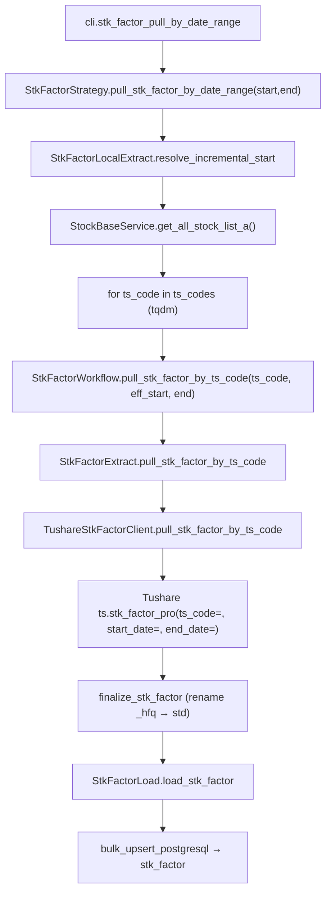
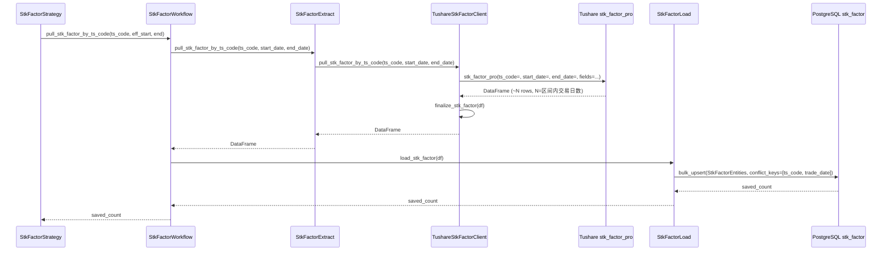

# SDD · 技术面因子

> **CLI 命令：** `stk-factor pull-by-date-range`
> **交互菜单：** 【因子】技术面因子 by date 区间增量 (stk-factor pull-by-date-range)
> **源码入口：** `src/etl/cli.py`
> **Tushare 接口：** [`stk_factor_pro`](https://tushare.pro/document/2?doc_id=296)

---

## 1. 概述

按 SSE 开市日逐日调用 Tushare `stk_factor_pro(trade_date=)` 拉取全市场技术面因子（MACD/KDJ/RSI/BOLL/CCI），upsert 到 PostgreSQL `kline_stock_factor` 表。

> **增量语义：** 先刷 `completeness_snapshot`，仅拉取 `resolved_count / period_stock_count < 95%` 的开市日（与 K 线 pull-by-date-range 同思路）。**不用** `max(trade_date)+1`——避免按股半成品数据把起点误推到后段。

### 触发方式

```bash
# 默认区间（[STK_FACTOR_START_DATE, 今日]）
uv run ./src/etl/cli.py stk-factor pull-by-date-range

# 自定义区间
uv run ./src/etl/cli.py stk-factor pull-by-date-range --start-date 20150101 --end-date 20251231

# 交互菜单
uv run ./src/etl/cli.py
```

### 前置依赖

| 依赖 | 说明 |
|------|------|
| `TUSHARE_API_KEY` | Tushare Pro 鉴权（需 5000+ 积分） |
| `KLINE_STOCK_FACTOR_START_DATE` | 未传 `--start-date` 时的 floor（`.env`；legacy：`STK_FACTOR_START_DATE`） |
| `stock_trade_calendar` | SSE 开市日列表（`ensure_trade_cal`） |
| PostgreSQL | 目标库连接（`POSTGRESQL_*`） |

### CLI 参数

| 选项 | 默认 | 说明 |
|------|------|------|
| `--start-date` | `KLINE_STOCK_FACTOR_START_DATE` | 区间起点 YYYYMMDD |
| `--end-date` | 今日 | 区间终点 YYYYMMDD |

---

## 2. CLI 入口

| 项 | 值 |
|----|-----|
| Typer 子命令组 | `stk-factor` |
| 命令名 | `pull-by-date-range` |
| 处理函数 | `stk_factor_pull_by_date_range()` |
| 菜单 key | `stk-factor-pull-by-date-range` |
| 菜单 label | `【因子】技术面因子 by date 区间增量 MACD/KDJ/RSI/BOLL/CCI (stk-factor pull-by-date-range)` |

---

## 3. 分层架构

```
CLI (cli.py)
  └─ StkFactorStrategy.pull_stk_factor_by_date_range(start, end)    ← 区间编排
       ├─ TradeCalStrategy.ensure_trade_cal()
       ├─ StkFactorLocalExtract.resolve_incremental_start()             ← max(floor, 库内 max(trade_date)+1)
       └─ for trade_date in open_dates:
            └─ StkFactorWorkflow.pull_stk_factor_by_date(trade_date)
                 ├─ StkFactorExtract.pull_stk_factor_by_date(trade_date)
                 │    └─ TushareStkFactorClient.pull_stk_factor_by_date(trade_date)
                 │         └─ ts.stk_factor_pro(trade_date=, fields=...)
                 └─ StkFactorLoad.load_stk_factor(df)
```

**源码骨架：**

| 路径 | 角色 |
|------|------|
| `src/etl/cli.py` | `stk-factor` typer 子命令组与菜单项 |
| `src/etl/strategy/stk_factor/stk_factor_strategy.py` | 区间编排、增量起点解析、个股 tqdm 循环 |
| `src/etl/workflow/stk_factor/stk_factor_workflow.py` | 单股 Extract→Load 串联 |
| `src/etl/extract/stk_factor_extract.py` | 调用 Client |
| `src/etl/extract/local/stk_factor/stk_factor_local_extract.py` | 读 max(trade_date) 解析增量起点 |
| `src/etl/client/stk_factor/tushare.py` | `TushareStkFactorClient`，限流 100/min |
| `src/etl/client/stk_factor/common.py` | `STK_FACTOR_PRO_TO_STD` 字段映射、`finalize_stk_factor` |
| `src/etl/load/stk_factor/stk_factor_load.py` | upsert 到 `kline_stock_factor` 表 |
| `src/entities/data_entities/stk_factor_entities.py` | ORM：`StkFactorEntities` |
| `src/common/setting.py` | `stk_factor_start_date` |

---

## 4. 完整调用流程图

### 4.1 模块调用链



### 4.2 时序图（单股）



---

## 5. 逐步说明

| 步骤 | 位置 | 输入 | 处理 | 输出 / 副作用 |
|------|------|------|------|----------------|
| 1 | CLI | `--start-date` / `--end-date` | 实例化 `StkFactorStrategy` 并调用 `pull_stk_factor_by_date_range()` | 透传 saved_count，CLI 路径 echo 总条数 |
| 2 | Strategy | floor / end | 缺省 floor=`STK_FACTOR_START_DATE`，end=今日；任一为空或 `floor > end` → return 0 | — |
| 3 | Strategy | floor / end | `TradeCalStrategy.ensure_trade_cal` + `CompletenessEngine.backfill_keys(floor, end)` | `pending`；空 → return 0 |
| 4 | Strategy | pending | `tqdm(pending, desc="技术面因子入库", unit="日")`，逐日调 `pull_stk_factor_by_date` | saved_count |
| 5 | Workflow | trade_date | `StkFactorExtract` → `StkFactorLoad` | saved_count |
| 6 | Extract | trade_date | 调 Client，返回 DataFrame | DataFrame |
| 7 | Client | trade_date | 限流；`ts.stk_factor(trade_date=)` 全市场 → `finalize_stk_factor` | 归一化 DataFrame |
| 9 | Load | DataFrame | 空 → 0；否则 `bulk_upsert_postgresql` | upsert 条数 |
| 10 | CLI | total | `typer.echo("技术面因子累计写入 {total} 条")` | 终端输出 |

---

## 6. 数据与外部依赖

### 6.1 Tushare API

| 项 | 值 |
|----|-----|
| 接口 | `stk_factor_pro` |
| Client | `src/etl/client/stk_factor/tushare.py` |
| Token | `settings.tushare_effective_api_key` |
| 限流 | `create_rate_limiter(100)`（100/min） |

**接口输入参数：**

| 名称 | 类型 | 必选 | 说明 |
|------|------|------|------|
| ts_code | str | Y | 股票代码（**本任务按个股遍历**） |
| start_date | str | Y | 开始日期 YYYYMMDD |
| end_date | str | Y | 结束日期 YYYYMMDD |
| fields | str | N | 指定返回字段 |

**接口输出字段（仅入库技术指标列）：**

`stk_factor_pro` 返回 261 列，本任务通过 `fields` 参数仅请求以下 15 个后复权（`_hfq`）技术指标字段，并在 `finalize_stk_factor` 中重命名为标准列名：

| stk_factor_pro 字段 | 入库列名 | 说明 |
|---------------------|----------|------|
| `ts_code` | `ts_code` | 股票代码 |
| `trade_date` | `trade_date` | 交易日期 |
| `macd_dif_hfq` | `macd_dif` | MACD DIF |
| `macd_dea_hfq` | `macd_dea` | MACD DEA |
| `macd_hfq` | `macd` | MACD 柱 |
| `kdj_k_hfq` | `kdj_k` | KDJ K 值 |
| `kdj_d_hfq` | `kdj_d` | KDJ D 值 |
| `kdj_hfq` | `kdj_j` | KDJ J 值 |
| `rsi_hfq_6` | `rsi_6` | RSI 6日 |
| `rsi_hfq_12` | `rsi_12` | RSI 12日 |
| `rsi_hfq_24` | `rsi_24` | RSI 24日 |
| `boll_upper_hfq` | `boll_upper` | BOLL 上轨 |
| `boll_mid_hfq` | `boll_mid` | BOLL 中轨 |
| `boll_lower_hfq` | `boll_lower` | BOLL 下轨 |
| `cci_hfq` | `cci` | CCI |

> **字段映射见 `STK_FACTOR_PRO_TO_STD`**：`src/etl/client/stk_factor/common.py`。

### 6.2 数据库

| 项 | 值 |
|----|-----|
| 表名 | `kline_stock_factor` |
| ORM | `StkFactorEntities`（`src/entities/data_entities/stk_factor_entities.py`） |
| 冲突键 | `(ts_code, trade_date)` |
| Upsert | `bulk_upsert_postgresql(..., conflict_keys=[ts_code, trade_date], fallback_on_error=True)` |

**ORM 字段：**

| 列 | 类型 | 说明 |
|----|------|------|
| `id` | Integer PK autoincrement | — |
| `ts_code` | String(20) | TS 代码 |
| `trade_date` | String(8) | 交易日期 YYYYMMDD |
| `macd_dif` | Float | MACD DIF |
| `macd_dea` | Float | MACD DEA |
| `macd` | Float | MACD 柱 |
| `kdj_k` | Float | KDJ K 值 |
| `kdj_d` | Float | KDJ D 值 |
| `kdj_j` | Float | KDJ J 值 |
| `rsi_6` | Float | RSI 6日 |
| `rsi_12` | Float | RSI 12日 |
| `rsi_24` | Float | RSI 24日 |
| `boll_upper` | Float | BOLL 上轨 |
| `boll_mid` | Float | BOLL 中轨 |
| `boll_lower` | Float | BOLL 下轨 |
| `cci` | Float | CCI |

**索引：**

| 索引名 | 列 | 唯一 |
|--------|----|------|
| `idx_stk_factor_unique` | `(ts_code, trade_date)` | UNIQUE |
| `idx_stk_factor_trade_date` | `(trade_date)` | — |

### 6.3 finalize_stk_factor 规则

| 列 | 规则 |
|----|------|
| `ts_code` | `str.strip()` |
| `trade_date` | `_normalize_ymd` → 8 位 YYYYMMDD |
| 数值列 | NaN → None |
| 列重命名 | `STK_FACTOR_PRO_TO_STD` 映射（`_hfq` → 标准名） |

---

## 7. 业务规则

1. **按个股拉取：** 每次调 `stk_factor_pro(ts_code=X, start_date=Y, end_date=Z, fields=...)` 获取单股区间内每日技术指标。
2. **后复权指标：** 使用 `_hfq` 后缀字段（后复权价格计算的技术指标），重命名为标准列名入库。
3. **增量语义：** `eff_start = max(STK_FACTOR_START_DATE, 库内 max(trade_date)+1)`；与 `daily-basic pull-by-date-range` 同模式。
4. **Upsert 幂等：** `(ts_code, trade_date)` 联合唯一。
5. **空集容忍：** 单股返回空 DataFrame 时 saved=0，继续下一股。

---

## 8. 日志与可观测性

| 机制 | 说明 |
|------|------|
| typer.echo | 子命令：`技术面因子累计写入 {total} 条`（菜单路径无） |
| print | `[信息] {eff_start}~{end} 共 N 只股票待拉取` |
| tqdm | `技术面因子入库`，单位「股」 |

---

## 9. 已知限制与实现备注

| 项 | 说明 |
|----|------|
| 全市场耗时 | ~5000 股 × 100/min 限流 ≈ 50 分钟/日期区间 |
| 后复权基准 | `stk_factor_pro` `_hfq` 技术指标基于 Tushare 的后复权价格计算 |
| OHLC 不入库 | 本表仅存技术指标列；OHLC / 复权因子 / 成交量等从 `kline_daily` + `adj_factor` 获取 |
| 不做 Transform | 直接入库原始技术指标值 |
| 不做 period_count | 首期不含完整性快照机制 |
| 新股技术指标 | 新股上市初期技术指标可能为 NULL（指标计算需要足够历史数据），入库时保持 NULL |

---

## 10. 相关命令

| 命令 | 关系 |
|------|------|
| `stock pull-list-a` | **前置**：提供 A 股 ts_code 列表 |
| `kline pull-daily-by-date-range` | 提供原始 OHLC + 复权因子，本表提供后复权技术指标 |
| `daily-basic pull-by-date-range` | 互补（估值因子 vs 技术面因子） |

---

## 附录 · Call Stack

```
cli.stk_factor_pull_by_date_range()
└─ StkFactorStrategy.pull_stk_factor_by_date_range(start_date, end_date)
   ├─ StkFactorLocalExtract.resolve_incremental_start(configured_start=floor)
   ├─ StockBaseService.get_all_stock_list_a()
   └─ for ts_code in ts_codes:
      └─ StkFactorWorkflow.pull_stk_factor_by_ts_code(ts_code, eff_start, end)
         ├─ StkFactorExtract.pull_stk_factor_by_ts_code(ts_code, start_date, end_date)
         │  └─ TushareStkFactorClient.pull_stk_factor_by_ts_code(ts_code, start_date, end_date)
         │     ├─ ts.stk_factor_pro(ts_code=, start_date=, end_date=, fields=STK_FACTOR_PRO_FIELDS)
         │     └─ finalize_stk_factor(df)
         └─ StkFactorLoad.load_stk_factor(df)
            └─ Database.bulk_upsert_postgresql(
                 StkFactorEntities,
                 conflict_keys=['ts_code', 'trade_date'],
                 fallback_on_error=True,
               )
```

## 附录 · 环境变量

| 变量 | 默认 | 用途 | 推荐 .env |
|------|------|------|-----------|
| `STK_FACTOR_START_DATE` | `""` | 技术面因子增量起点；空则整命令 no-op | `20100101` |
