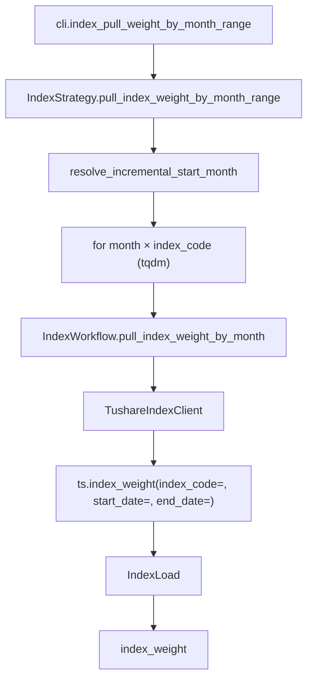

# SDD · 指数成分权重

> **CLI 命令：** `index pull-weight-by-month-range`
> **交互菜单：** 【指数】指数成分和权重 by month 区间增量 (index pull-weight-by-month-range)
> **源码入口：** `src/etl/cli.py`
> **Tushare 接口：** [`index_weight`](https://tushare.pro/document/2?doc_id=96)

---

## 1. 概述

按月调用 Tushare `index_weight` 拉取指定指数（沪深300/中证500/中证1000/创业板指）的成分股和权重，upsert 到 PostgreSQL `index_weight` 表。为多因子模型提供指数成分股哑变量、基准权重等参考因子。

> Tushare `index_weight` 为月度数据，每次调用传入 `index_code` + 月度区间。积分要求 2000+。

### 触发方式

```bash
uv run ./src/etl/cli.py index pull-weight-by-month-range
uv run ./src/etl/cli.py index pull-weight-by-month-range --start-month 201501 --end-month 202512
uv run ./src/etl/cli.py
```

### 前置依赖

| 依赖 | 说明 |
|------|------|
| `TUSHARE_API_KEY` | 需 2000+ 积分 |
| `INDEX_WEIGHT_START_MONTH` | floor（`.env`，推荐 `201001`） |
| PostgreSQL | 目标库连接 |

### CLI 参数

| 选项 | 默认 | 说明 |
|------|------|------|
| `--start-month` | `INDEX_WEIGHT_START_MONTH` | 起始月份 YYYYMM |
| `--end-month` | 当前月份 | 结束月份 YYYYMM |

---

## 2. CLI 入口

| 项 | 值 |
|----|-----|
| Typer 子命令组 | `index`（新增） |
| 命令名 | `pull-weight-by-month-range` |
| 处理函数 | `index_pull_weight_by_month_range()` |
| 菜单 key | `index-pull-weight-by-month-range` |
| 菜单 label | `【指数】指数成分和权重 by month 区间增量 (index pull-weight-by-month-range)` |

```python
index_strategy = typer.Typer()
app.add_typer(index_strategy, name="index", help="指数 ETL commands")

@index_strategy.command("pull-weight-by-month-range")
def index_pull_weight_by_month_range(
    start_month: str | None = typer.Option(None, "--start-month", help="起始月 YYYYMM"),
    end_month: str | None = typer.Option(None, "--end-month", help="结束月 YYYYMM"),
) -> None:
    """按月拉取 Tushare index_weight 并 upsert。"""
    total = IndexStrategy().pull_index_weight_by_month_range(start_month=start_month, end_month=end_month)
    typer.echo(f"指数成分权重累计写入 {total} 条")
```

---

## 3. 分层架构

```
CLI → IndexStrategy.pull_index_weight_by_month_range(start_month, end_month)
       ├─ INDEX_CODES 预置列表（000300/000905/000852/399006）
       ├─ IndexLocalExtract.resolve_incremental_start_month()
       └─ for month in months_range:
            └─ for index_code in INDEX_CODES:
                 └─ IndexWorkflow.pull_index_weight_by_month(index_code, month)
                      ├─ IndexExtract → TushareIndexClient
                      │    └─ ts.index_weight(index_code=, start_date=月首日, end_date=月末日)
                      └─ IndexLoad → bulk_upsert_postgresql → index_weight
```

**新增源码：** `src/etl/{strategy,workflow,extract,load,client}/index/` + `src/entities/data_entities/index_weight_entities.py`

---

## 4. 完整调用流程图

### 4.1 模块调用链



---

## 5. 逐步说明

| 步骤 | 位置 | 输入 | 处理 | 输出 |
|------|------|------|------|------|
| 1 | CLI | `--start-month` / `--end-month` | 实例化 Strategy | echo 总条数 |
| 2 | Strategy | floor / end | 缺省 → return 0 | — |
| 3 | Strategy | floor | resolve_incremental_start_month | eff_start_month |
| 4 | Strategy | months × INDEX_CODES | tqdm 双重循环 | saved_count |
| 5 | Workflow | index_code, month | 月首日~月末日调 Client | DataFrame |
| 6 | Client | index_code, start_date, end_date | ts.index_weight → finalize | DataFrame |
| 7 | Load | DataFrame | bulk_upsert_postgresql | upsert 条数 |

---

## 6. 数据与外部依赖

### 6.1 Tushare API

| 项 | 值 |
|----|-----|
| 接口 | `index_weight` |
| Client | `src/etl/client/index/tushare.py` |
| 限流 | 200/min（`create_rate_limiter(200)`） |

**接口输入参数：**

| 名称 | 类型 | 必选 | 说明 |
|------|------|------|------|
| index_code | str | Y | 指数代码（**预置列表遍历**） |
| trade_date | str | N | 交易日期（不用） |
| start_date | str | N | 开始日期（**月首日**） |
| end_date | str | N | 结束日期（**月末日**） |

**接口输出字段（全部入库）：**

| 名称 | 类型 | 说明 |
|------|------|------|
| index_code | str | 指数代码 |
| con_code | str | 成分代码 |
| trade_date | str | 交易日期 |
| weight | float | 权重 |

### 6.2 数据库

| 项 | 值 |
|----|-----|
| 表名 | `index_weight` |
| ORM | `IndexWeightEntities` |
| 冲突键 | `(index_code, con_code, trade_date)` |

**ORM 字段：**

| 列 | 类型 | 说明 |
|----|------|------|
| `id` | Integer PK autoincrement | — |
| `index_code` | String(20) | 指数代码 |
| `con_code` | String(20) | 成分代码 |
| `trade_date` | String(8) | 交易日期 |
| `weight` | Float | 权重 |

**索引：**

| 索引名 | 列 | 唯一 |
|--------|----|------|
| `idx_index_weight_unique` | `(index_code, con_code, trade_date)` | UNIQUE |
| `idx_index_weight_trade_date` | `(trade_date)` | — |
| `idx_index_weight_con_code` | `(con_code)` | — |

### 6.3 预置指数列表

| 指数代码 | 名称 | 成分股数量 |
|---------|------|-----------|
| `000300.SH` | 沪深300 | 300 |
| `000905.SH` | 中证500 | 500 |
| `000852.SH` | 中证1000 | 1000 |
| `399006.SZ` | 创业板指 | 100 |

> 可在 `IndexStrategy` 中通过 `INDEX_CODES` 常量配置，后续如需新增指数可修改此列表。

### 6.4 finalize_index_weight 规则

| 列 | 规则 |
|----|------|
| `index_code` / `con_code` | `str.strip()` |
| `trade_date` | `_normalize_ymd` → 8 位 |
| `weight` | NaN → None |

---

## 7. 业务规则

1. **按月 × 指数遍历：** 每月每个指数调一次 `index_weight(index_code=, start_date=月首日, end_date=月末日)`。
2. **预置指数列表：** 默认拉沪深300/中证500/中证1000/创业板指四个指数。
3. **增量语义：** `eff_start_month = max(INDEX_WEIGHT_START_MONTH, 库内 max(trade_date) 月份 + 1)`。
4. **Upsert 幂等：** `(index_code, con_code, trade_date)` 联合唯一。
5. **月度数据：** Tushare index_weight 为月度更新，每月一次。
6. **不做完整性校验：** 月度数据，无日频完整性概念。

---

## 8. 日志与可观测性

| 机制 | 说明 |
|------|------|
| typer.echo | `指数成分权重累计写入 {total} 条` |
| tqdm | `指数成分权重入库`，单位「月」，postfix `index_code/month/saved` |

---

## 9. 已知限制与实现备注

| 项 | 说明 |
|----|------|
| 月度数据 | Tushare index_weight 为月度更新 |
| 预置指数 | 默认四个指数，新增需改代码 |
| 成分调整 | 指数成分股半年度/季度调整，月度数据反映的是调整后快照 |

---

## 10. 相关命令

| 命令 | 关系 |
|------|------|
| `stock pull-list-a` | 弱依赖：`con_code` 可与 `stock_list.ts_code` join |
| `daily-basic pull-by-date-range` | `total_mv` 可与指数权重交叉计算 |

---

## 附录 · Call Stack

```
cli.index_pull_weight_by_month_range()
└─ IndexStrategy.pull_index_weight_by_month_range(start_month, end_month)
   ├─ IndexLocalExtract.resolve_incremental_start_month(configured=floor)
   └─ for month in months_range:
      └─ for index_code in INDEX_CODES:
         └─ IndexWorkflow.pull_index_weight_by_month(index_code, month)
            ├─ IndexExtract → TushareIndexClient
            │  └─ ts.index_weight(index_code=, start_date=月首日, end_date=月末日)
            │  └─ finalize_index_weight(df)
            └─ IndexLoad.load_index_weight(df)
               └─ bulk_upsert_postgresql(IndexWeightEntities,
                    conflict_keys=['index_code','con_code','trade_date'])
```

## 附录 · 环境变量新增项

| 变量 | 默认 | 用途 | 推荐 .env |
|------|------|------|-----------|
| `INDEX_WEIGHT_START_MONTH` | `""` | 增量起点月份；空则 no-op | `201001` |
