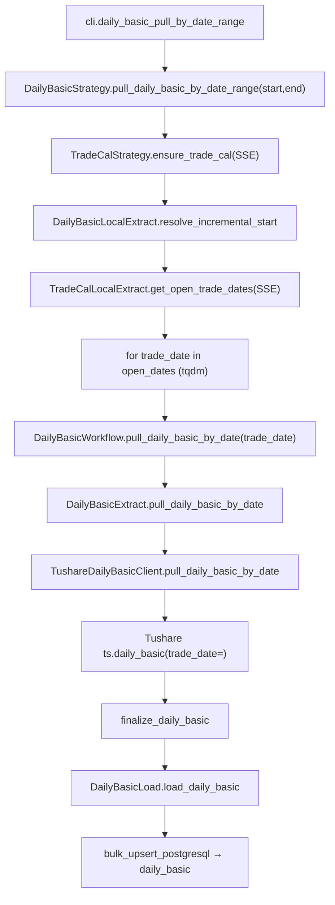
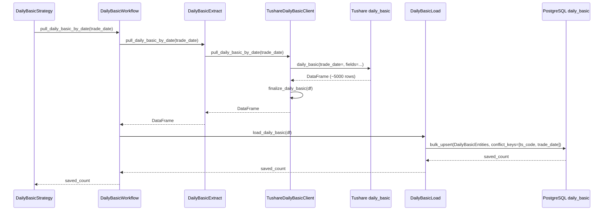

# SDD · 每日指标（日频基本面）

> **CLI 命令：** `daily-basic pull-by-date-range`
> **交互菜单：** 【估值】每日指标 by date 区间增量 (daily-basic pull-by-date-range)
> **源码入口：** `src/etl/cli.py`
> **Tushare 接口：** [`daily_basic`](https://tushare.pro/document/2?doc_id=32)

---

## 1. 概述

按交易日历开市日，逐日调用 Tushare `daily_basic` 拉取**全市场**每日基本面指标（PE/PB/PS/换手率/市值/股本等），upsert 到 PostgreSQL `market_daily_basic` 表。为多因子模型提供估值因子（EP_TTM、BP、SP_TTM）、规模因子（SIZE = log(total_mv)）、流动性因子（换手率）、股息率等核心因子的原始数据。

> Tushare `daily_basic` 单次最大返回 6000 条；按 `trade_date` 拉取全市场（~5000 股），单日一次可拉完。积分要求 2000+（5000 无限量）。数据于交易日 15:00~17:00 更新。

### 触发方式

```bash
# 默认区间（[DAILY_BASIC_START_DATE, 今日]）
uv run ./src/etl/cli.py daily-basic pull-by-date-range

# 自定义区间
uv run ./src/etl/cli.py daily-basic pull-by-date-range --start-date 20200101 --end-date 20251231

# 交互菜单
uv run ./src/etl/cli.py
```

### 前置依赖

| 依赖 | 说明 |
|------|------|
| `TUSHARE_API_KEY` | Tushare Pro 鉴权（需 2000+ 积分） |
| `DAILY_BASIC_START_DATE` | 未传 `--start-date` 时的 floor（`.env`，推荐 `20100101`） |
| `stock_trade_calendar`（SSE） | 区间内开市日来源；缺失则自动 `ensure_trade_cal(SSE)` 回填 |
| PostgreSQL | 目标库连接（`POSTGRESQL_*`） |

### CLI 参数

| 选项 | 默认 | 说明 |
|------|------|------|
| `--start-date` | `DAILY_BASIC_START_DATE` | 区间起点 YYYYMMDD |
| `--end-date` | 今日 | 区间终点 YYYYMMDD |

---

## 2. CLI 入口

| 项 | 值 |
|----|-----|
| Typer 子命令组 | `daily-basic`（新增） |
| 命令名 | `pull-by-date-range` |
| 处理函数 | `daily_basic_pull_by_date_range()` |
| 菜单 key | `daily-basic-pull-by-date-range` |
| 菜单 label | `【估值】每日指标 by date 区间增量 (daily-basic pull-by-date-range)` |

```python
# src/etl/cli.py（示意）
daily_basic_strategy = typer.Typer()
app.add_typer(daily_basic_strategy, name="daily-basic", help="每日指标 ETL commands")

@daily_basic_strategy.command("pull-by-date-range")
def daily_basic_pull_by_date_range(
    start_date: str | None = typer.Option(None, "--start-date", help="起始日 YYYYMMDD"),
    end_date: str | None = typer.Option(None, "--end-date", help="结束日 YYYYMMDD"),
) -> None:
    """按交易日历开市日逐日拉取 Tushare daily_basic 并 upsert。"""
    total = DailyBasicStrategy().pull_daily_basic_by_date_range(
        start_date=start_date,
        end_date=end_date,
    )
    typer.echo(f"每日指标累计写入 {total} 条")
```

---

## 3. 分层架构

```
CLI (cli.py)
  └─ DailyBasicStrategy.pull_daily_basic_by_date_range(start, end)   ← 区间编排
       ├─ TradeCalStrategy.ensure_trade_cal(SSE)                       ← 区间日历兜底
       ├─ DailyBasicLocalExtract.resolve_incremental_start()           ← max(floor, 库内 max(trade_date)+1)
       ├─ TradeCalLocalExtract.get_open_trade_dates(SSE,...)            ← 开市日列表
       └─ for trade_date in open_dates:
            └─ DailyBasicWorkflow.pull_daily_basic_by_date(trade_date) ← 单日 Extract→Load
                 ├─ DailyBasicExtract.pull_daily_basic_by_date(trade_date)
                 │    └─ TushareDailyBasicClient.pull_daily_basic_by_date(trade_date)
                 │         └─ ts.daily_basic(trade_date=trade_date, fields=...)
                 └─ DailyBasicLoad.load_daily_basic(df)
                      └─ Database.bulk_upsert_postgresql → daily_basic
```

**新增源码骨架：**

| 路径 | 角色 |
|------|------|
| `src/etl/cli.py` | 新增 `daily-basic` typer 子命令组与菜单项 |
| `src/etl/strategy/daily_basic/daily_basic_strategy.py` | 区间编排、增量起点解析、tqdm 循环 |
| `src/etl/workflow/daily_basic/daily_basic_workflow.py` | 单日 Extract→Load 串联 |
| `src/etl/extract/daily_basic_extract.py` | 调用 Client |
| `src/etl/extract/local/daily_basic/daily_basic_local_extract.py` | `DailyBasicLocalExtract`：读 max(trade_date) 解析增量起点 |
| `src/etl/client/daily_basic/tushare.py` | `TushareDailyBasicClient`，限流 500/min |
| `src/etl/client/daily_basic/common.py` | `DAILY_BASIC_COLUMNS`、`finalize_daily_basic` |
| `src/etl/load/daily_basic/daily_basic_load.py` | upsert 到 `market_daily_basic` 表 |
| `src/entities/data_entities/daily_basic_entities.py` | ORM：`DailyBasicEntities` |
| `src/common/setting.py` | 新增 `daily_basic_start_date` |

---

## 4. 完整调用流程图

### 4.1 模块调用链



### 4.2 时序图（单日）



---

## 5. 逐步说明

| 步骤 | 位置 | 输入 | 处理 | 输出 / 副作用 |
|------|------|------|------|----------------|
| 1 | CLI | `--start-date` / `--end-date` | 实例化 `DailyBasicStrategy` 并调用 `pull_daily_basic_by_date_range()` | 透传 saved_count，CLI 路径 echo 总条数 |
| 2 | Strategy | floor / end | 缺省 floor=`DAILY_BASIC_START_DATE`，end=今日；任一为空或 `floor > end` → return 0 | — |
| 3 | Strategy | floor / end | `TradeCalStrategy.ensure_trade_cal(start=floor, end=end, exchange="SSE")` | 必要时回填 SSE 日历 |
| 4 | Strategy | floor / end | `CompletenessEngine.backfill_keys(floor, end)`：刷新快照，返回 count/period_stock_count < 95% 的开市日 | `pending`；空 → return 0 |
| 5 | Strategy | pending | `tqdm(pending, desc="每日指标入库", unit="日")`，逐日调 `DailyBasicWorkflow.pull_daily_basic_by_date(td)` | saved_count |
| 6 | Workflow | trade_date | `DailyBasicExtract.pull_daily_basic_by_date(td)` → 入库 | saved_count |
| 7 | Workflow | trade_date | `DailyBasicExtract.pull_daily_basic_by_date(td)` → 入库 | saved_count |
| 8 | Extract | trade_date | 调 Client，返回 DataFrame | DataFrame |
| 9 | Client | trade_date | 限流 500/min；`ts.daily_basic(trade_date=, fields=DAILY_BASIC_COLUMNS)` → `finalize_daily_basic` | 归一化 DataFrame |
| 10 | Load | DataFrame | 空 → 0；否则 `bulk_upsert_postgresql` | upsert 条数 |
| 11 | CLI | total | `typer.echo("每日指标累计写入 {total} 条")` | 终端输出 |

---

## 6. 数据与外部依赖

### 6.1 Tushare API

| 项 | 值 |
|----|-----|
| 接口 | `market_daily_basic` |
| Client | `src/etl/client/daily_basic/tushare.py` |
| Token | `settings.tushare_api_key` ← `TUSHARE_API_KEY` |
| 限流 | 500/min（`create_rate_limiter(500)`） |
| 单次限量 | 6000 条（全市场 ~5000 股/日，单次可拉完） |

**接口输入参数：**

| 名称 | 类型 | 必选 | 说明 |
|------|------|------|------|
| ts_code | str | Y | 股票代码（二选一，本任务不用） |
| trade_date | str | N | 交易日期（**本任务按日遍历使用**） |
| start_date | str | N | 开始日期（本任务不用） |
| end_date | str | N | 结束日期（本任务不用） |

**接口输出字段（全部入库）：**

| 名称 | 类型 | 说明 |
|------|------|------|
| ts_code | str | TS 股票代码 |
| trade_date | str | 交易日期 |
| close | float | 当日收盘价 |
| turnover_rate | float | 换手率（成交量/无限售流通股数） |
| turnover_rate_f | float | 换手率（自由流通股） |
| volume_ratio | float | 量比 VOL/MA |
| pe | float | 市盈率（总市值/净利润，亏损为空） |
| pe_ttm | float | 市盈率 TTM |
| pb | float | 市净率 |
| ps | float | 市销率（总市值/营业收入(最新年报)） |
| ps_ttm | float | 市销率 TTM |
| dv_ratio | float | 股息率（%） |
| dv_ttm | float | 股息率 TTM（%） |
| total_share | float | 总股本（万股） |
| float_share | float | 流通股本（万股） |
| free_share | float | 自由流通股本（万） |
| total_mv | float | 总市值（万元） |
| circ_mv | float | 流通市值（万元） |

**示例（doc）：**

```python
pro = ts.pro_api()
df = pro.daily_basic(ts_code='000001.SZ', start_date='20180101', end_date='20180110',
                     fields='ts_code,trade_date,close,turnover_rate,pe_ttm,pb,total_mv')
```

### 6.2 数据库

| 项 | 值 |
|----|-----|
| 表名 | `market_daily_basic` |
| ORM | `DailyBasicEntities`（`src/entities/data_entities/daily_basic_entities.py`） |
| 冲突键 | `(ts_code, trade_date)` |
| Upsert | `bulk_upsert_postgresql(..., conflict_keys=[ts_code, trade_date], fallback_on_error=True)` |

**ORM 字段：**

| 列 | 类型 | 说明 |
|----|------|------|
| `id` | Integer PK autoincrement | — |
| `ts_code` | String(20) | TS 代码 |
| `trade_date` | String(8) | 交易日期 YYYYMMDD |
| `close` | Float | 收盘价 |
| `turnover_rate` | Float | 换手率 |
| `turnover_rate_f` | Float | 换手率（自由流通） |
| `volume_ratio` | Float | 量比 |
| `pe` | Float | 市盈率（亏损为空） |
| `pe_ttm` | Float | 市盈率 TTM |
| `pb` | Float | 市净率 |
| `ps` | Float | 市销率 |
| `ps_ttm` | Float | 市销率 TTM |
| `dv_ratio` | Float | 股息率 |
| `dv_ttm` | Float | 股息率 TTM |
| `total_share` | Float | 总股本（万股） |
| `float_share` | Float | 流通股本（万股） |
| `free_share` | Float | 自由流通股本（万） |
| `total_mv` | Float | 总市值（万元） |
| `circ_mv` | Float | 流通市值（万元） |

**索引：**

| 索引名 | 列 | 唯一 |
|--------|----|------|
| `idx_daily_basic_unique` | `(ts_code, trade_date)` | UNIQUE |
| `idx_daily_basic_trade_date` | `(trade_date)` | — |

**关于 NULL 与 ON CONFLICT：** 冲突键 `ts_code` 和 `trade_date` 均为非空字段，无需 NULL 归一化。`pe` / `pe_ttm` 等值列允许 NULL（亏损公司无市盈率），不影响 upsert。

### 6.3 finalize_daily_basic 规则

| 列 | 规则 |
|----|------|
| `ts_code` | `str.strip()` |
| `trade_date` | `_normalize_ymd` → 8 位 YYYYMMDD |
| 数值列 | NaN → None（保持 PG NULL 语义） |

---

## 7. 业务规则

1. **按日全市场拉取：** 每次调 `daily_basic(trade_date=td)` 获取当日全市场 ~5000 条，一次拉完（单次限量 6000 条充足）。
2. **仅开市日遍历：** 通过 `stock_trade_calendar` SSE 开市日过滤遍历集，降低无效 API 调用。
3. **增量语义：** `eff_start = max(DAILY_BASIC_START_DATE, 库内 max(trade_date)+1)`；与 `suspend pull-by-date` 同模式。
4. **Upsert 幂等：** `(ts_code, trade_date)` 联合唯一，重复执行不产生重复行。
5. **空集容忍：** 单日返回空 DataFrame 时不报错，saved=0，继续下一日。
6. **不做 95% 跳过：** 首期实现不含 95% 完整性跳过规则（与 kline 不同）；每日数据量稳定，按日全量拉取即可。未来如需可加 period_count 快照。

---

## 8. 日志与可观测性

| 机制 | 说明 |
|------|------|
| typer.echo | 子命令：`每日指标累计写入 {total} 条`（菜单路径无） |
| print | `[信息] {eff_start}~{end} 共 N 个开市日待补` |
| tqdm | `每日指标入库`，单位「日」，postfix `saved/total/trade_date` |

---

## 9. 已知限制与实现备注

| 项 | 说明 |
|----|------|
| 积分要求 | 需 2000+ 积分，5000 积分无限量 |
| 数据更新延迟 | 交易日 15:00~17:00 更新，当日 17:00 前拉取可能为空或不完整 |
| PE 为空 | 亏损公司的 `pe` / `pe_ttm` 为 NULL，下游因子计算需处理 |
| `close` 冗余 | `daily_basic.close` 与 `kline_daily.close` 重复，本表仅作估值计算用，不以本表 close 为准 |
| 不做 Transform | 直接入库原始数据，无清洗层 |
| 不做 period_count | 首期不含完整性快照机制 |

---

## 10. 相关命令

| 命令 | 关系 |
|------|------|
| `trade-cal pull-history` | **前置**：提供 SSE 开市日 |
| `stock pull-list-a` | 弱依赖：下游可按 `stock_list` join |
| `kline pull-daily-by-date-range` | 同为按日全市场增量，编排模式参考 |
| `suspend pull-by-date` | 同为 by-date 模式，增量语义参考 |

---

## 附录 · Call Stack

```
cli.daily_basic_pull_by_date_range()
└─ DailyBasicStrategy.pull_daily_basic_by_date_range(start_date, end_date)
   ├─ TradeCalStrategy.ensure_trade_cal(start, end, exchange="SSE")
   ├─ DailyBasicLocalExtract.resolve_incremental_start(configured_start=floor)
   ├─ TradeCalLocalExtract.get_open_trade_dates(start=eff_start, end=end, exchange="SSE")
   └─ for trade_date in open_dates:
      └─ DailyBasicWorkflow.pull_daily_basic_by_date(trade_date)
         ├─ DailyBasicExtract.pull_daily_basic_by_date(trade_date)
         │  └─ TushareDailyBasicClient.pull_daily_basic_by_date(trade_date)
         │     ├─ ts.daily_basic(trade_date=trade_date, fields=DAILY_BASIC_COLUMNS)
         │     └─ finalize_daily_basic(df)
         └─ DailyBasicLoad.load_daily_basic(df)
            └─ Database.bulk_upsert_postgresql(
                 DailyBasicEntities,
                 conflict_keys=['ts_code', 'trade_date'],
                 fallback_on_error=True,
               )
```

## 附录 · 环境变量新增项

| 变量 | 默认 | 用途 | 推荐 .env |
|------|------|------|-----------|
| `DAILY_BASIC_START_DATE` | `""` | 每日指标增量起点；空则整命令 no-op | `20100101` |

> 应同步更新 `src/common/setting.py` 与 `spec/etl/README.md` 环境依赖表。
