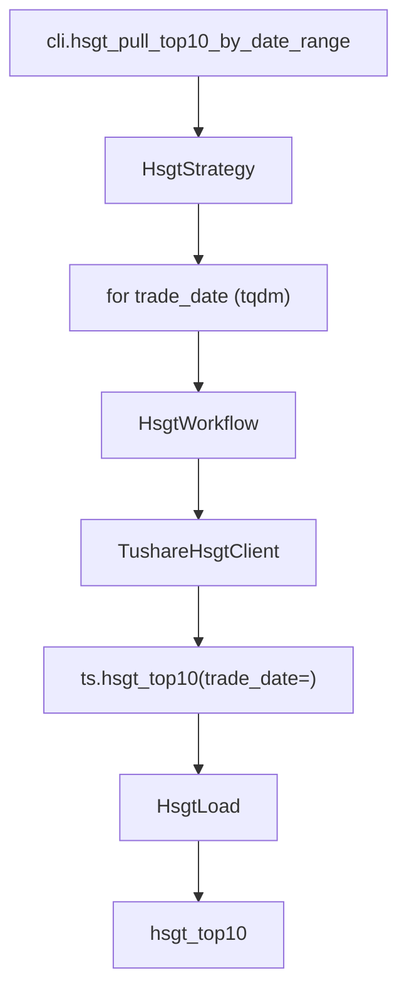

# SDD · 沪深股通十大成交股

> **CLI 命令：** `hsgt pull-top10-by-date-range`
> **交互菜单：** 【北向】沪深股通十大成交股 by date 区间增量 (hsgt pull-top10-by-date-range)
> **源码入口：** `src/etl/cli.py`
> **Tushare 接口：** [`hsgt_top10`](https://tushare.pro/document/2?doc_id=48)

---

## 1. 概述

按交易日历开市日，逐日调用 Tushare `hsgt_top10` 拉取沪股通/深股通每日前十大成交详细数据，upsert 到 PostgreSQL `market_northbound_top10` 表。为多因子模型提供北向资金净买入、北向关注度排名等情绪因子。

> 每日仅 20 条数据（沪 10 + 深 10），数据量极小。每天 18:00~20:00 完成当日更新。

### 触发方式

```bash
uv run ./src/etl/cli.py hsgt pull-top10-by-date-range
uv run ./src/etl/cli.py hsgt pull-top10-by-date-range --start-date 20160101
uv run ./src/etl/cli.py
```

### 前置依赖

| 依赖 | 说明 |
|------|------|
| `TUSHARE_API_KEY` | 需 2000+ 积分 |
| `HSGT_START_DATE` | floor（`.env`，推荐 `20160101`，沪股通开通日） |
| `stock_trade_calendar`（SSE） | 开市日来源 |

### CLI 参数

| 选项 | 默认 | 说明 |
|------|------|------|
| `--start-date` | `HSGT_START_DATE` | 区间起点 YYYYMMDD |
| `--end-date` | 今日 | 区间终点 YYYYMMDD |

---

## 2. CLI 入口

| 项 | 值 |
|----|-----|
| Typer 子命令组 | `hsgt`（新增） |
| 命令名 | `pull-top10-by-date-range` |
| 处理函数 | `hsgt_pull_top10_by_date_range()` |
| 菜单 key | `hsgt-pull-top10-by-date-range` |
| 菜单 label | `【北向】沪深股通十大成交股 by date 区间增量 (hsgt pull-top10-by-date-range)` |

```python
hsgt_strategy = typer.Typer()
app.add_typer(hsgt_strategy, name="hsgt", help="沪深港通 ETL commands")

@hsgt_strategy.command("pull-top10-by-date-range")
def hsgt_pull_top10_by_date_range(
    start_date: str | None = typer.Option(None, "--start-date"),
    end_date: str | None = typer.Option(None, "--end-date"),
) -> None:
    """按交易日历开市日逐日拉取 Tushare hsgt_top10 并 upsert。"""
    total = HsgtStrategy().pull_hsgt_top10_by_date_range(start_date=start_date, end_date=end_date)
    typer.echo(f"沪深股通十大成交股累计写入 {total} 条")
```

---

## 3. 分层架构

```
CLI → HsgtStrategy.pull_hsgt_top10_by_date_range(start, end)
       ├─ TradeCalStrategy.ensure_trade_cal(SSE)
       ├─ HsgtLocalExtract.resolve_incremental_start()
       ├─ TradeCalLocalExtract.get_open_trade_dates(SSE,...)
       └─ for trade_date in open_dates:
            └─ HsgtWorkflow.pull_hsgt_top10_by_date(trade_date)
                 ├─ HsgtExtract → TushareHsgtClient → ts.hsgt_top10(trade_date=)
                 └─ HsgtLoad → bulk_upsert_postgresql → hsgt_top10
```

**新增源码：** `src/etl/{strategy,workflow,extract,load,client}/hsgt/` + `src/entities/data_entities/hsgt_top10_entities.py`

---

## 4. 完整调用流程图

### 4.1 模块调用链



---

## 5. 逐步说明

| 步骤 | 位置 | 输入 | 处理 | 输出 |
|------|------|------|------|------|
| 1 | CLI | `--start-date` / `--end-date` | 实例化 Strategy | echo 总条数 |
| 2 | Strategy | floor / end | 缺省 → return 0 | — |
| 3 | Strategy | floor / end | ensure_trade_cal + `CompletenessEngine.backfill_keys(floor, end)` | `pending`；空 → return 0 |
| 4 | Strategy | pending | tqdm 逐日调 Workflow（每日仅 ~20 条） | saved_count |
| 5 | Client | trade_date | ts.hsgt_top10(trade_date=) → finalize | DataFrame |
| 6 | Load | DataFrame | bulk_upsert_postgresql | upsert 条数 |

---

## 6. 数据与外部依赖

### 6.1 Tushare API

| 项 | 值 |
|----|-----|
| 接口 | `market_northbound_top10` |
| Client | `src/etl/client/hsgt/tushare.py` |
| 限流 | 200/min（`create_rate_limiter(200)`） |

**接口输入参数：**

| 名称 | 类型 | 必选 | 说明 |
|------|------|------|------|
| ts_code | str | N | 股票代码（二选一，本任务不用） |
| trade_date | str | N | 交易日期（**按日遍历**） |
| start_date | str | N | 开始日期 |
| end_date | str | N | 结束日期 |
| market_type | str | N | 市场类型（1=沪市 3=深市，本任务不筛选，一次拉全） |

**接口输出字段（全部入库）：**

| 名称 | 类型 | 说明 |
|------|------|------|
| trade_date | str | 交易日期 |
| ts_code | str | 股票代码 |
| name | str | 股票名称 |
| close | float | 收盘价 |
| change | float | 涨跌额 |
| rank | int | 资金排名 |
| market_type | str | 市场类型（1=沪市 3=深市） |
| amount | float | 成交金额（元） |
| net_amount | float | 净成交金额（元） |
| buy | float | 买入金额（元） |
| sell | float | 卖出金额（元） |

### 6.2 数据库

| 项 | 值 |
|----|-----|
| 表名 | `market_northbound_top10` |
| ORM | `HsgtTop10Entities` |
| 冲突键 | `(ts_code, trade_date, market_type)` |

**ORM 字段：**

| 列 | 类型 | 说明 |
|----|------|------|
| `id` | Integer PK autoincrement | — |
| `ts_code` | String(20) | 股票代码 |
| `trade_date` | String(8) | 交易日期 |
| `name` | String(40) | 股票名称 |
| `close` | Float | 收盘价 |
| `change` | Float | 涨跌额 |
| `rank` | Integer | 资金排名 |
| `market_type` | String(2) | 市场类型 |
| `amount` | Float | 成交金额（元） |
| `net_amount` | Float | 净成交金额（元） |
| `buy` | Float | 买入金额（元） |
| `sell` | Float | 卖出金额（元） |

**索引：**

| 索引名 | 列 | 唯一 |
|--------|----|------|
| `idx_hsgt_top10_unique` | `(ts_code, trade_date, market_type)` | UNIQUE |
| `idx_hsgt_top10_trade_date` | `(trade_date)` | — |

---

## 7. 业务规则

1. **按日拉取：** 每日仅 ~20 条（沪 10 + 深 10），数据量极小。
2. **不筛选市场类型：** 一次拉沪市 + 深市全部 20 条。
3. **增量语义：** `eff_start = max(HSGT_START_DATE, 库内 max(trade_date)+1)`。
4. **Upsert 幂等：** `(ts_code, trade_date, market_type)` 联合唯一。
5. **沪股通开通前：** 2014 年 11 月之前无数据，`HSGT_START_DATE` 推荐 `20160101`。

---

## 8. 日志与可观测性

| 机制 | 说明 |
|------|------|
| typer.echo | `沪深股通十大成交股累计写入 {total} 条` |
| tqdm | `沪深股通十大成交股入库`，单位「日」 |

---

## 9. 已知限制与实现备注

| 项 | 说明 |
|----|------|
| 数据延迟 | 每天 18:00~20:00 更新 |
| 仅前十大 | 每日仅 ~20 条，非全市场数据 |
| 不做完整性校验 | 数据量极小，缺失明显 |

---

## 10. 相关命令

| 命令 | 关系 |
|------|------|
| `trade-cal pull-history` | **前置**：提供 SSE 开市日 |
| `moneyflow pull-by-date-range` | 同为情绪类因子，互补（北向 vs 主力资金） |

---

## 附录 · Call Stack

```
cli.hsgt_pull_top10_by_date_range()
└─ HsgtStrategy.pull_hsgt_top10_by_date_range(start_date, end_date)
   ├─ TradeCalStrategy.ensure_trade_cal(start, end, exchange="SSE")
   ├─ HsgtLocalExtract.resolve_incremental_start(configured_start=floor)
   ├─ TradeCalLocalExtract.get_open_trade_dates(start=eff_start, end=end, exchange="SSE")
   └─ for trade_date in open_dates:
      └─ HsgtWorkflow.pull_hsgt_top10_by_date(trade_date)
         ├─ HsgtExtract → TushareHsgtClient → ts.hsgt_top10(trade_date=trade_date)
         └─ HsgtLoad → bulk_upsert(HsgtTop10Entities, conflict_keys=['ts_code','trade_date','market_type'])
```

## 附录 · 环境变量新增项

| 变量 | 默认 | 用途 | 推荐 .env |
|------|------|------|-----------|
| `HSGT_START_DATE` | `""` | 增量起点；空则 no-op | `20160101` |
