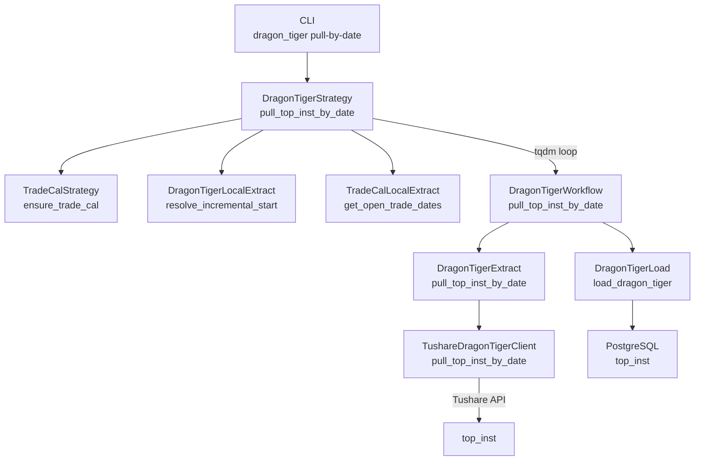
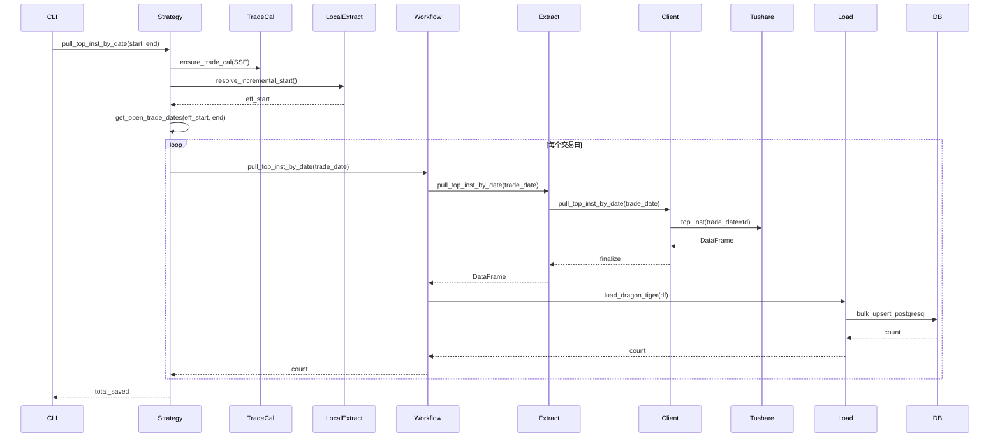

# SDD · 龙虎榜机构明细

> **CLI 命令：** `dragon_tiger pull-by-date`
> **交互菜单：** 【特色数据】龙虎榜机构明细
> **源码入口：** `src/etl/cli.py`
> **Tushare 接口：** [top_inst](https://tushare.pro/document/2?doc_id=107)

---

## 1. 概述

龙虎榜机构成交明细数据入库。拉取 Tushare `top_inst` 接口，按交易日遍历全市场龙虎榜机构交易数据，upsert 至 PostgreSQL `top_inst` 表。

> 单次请求最大返回 10000 行数据，需 5000 积分以上权限。

### 触发方式

```bash
# 默认区间
uv run ./src/etl/cli.py dragon_tiger pull-by-date

# 自定义区间
uv run ./src/etl/cli.py dragon_tiger pull-by-date --start-date 20200101 --end-date 20261231

# 交互菜单
uv run ./src/etl/cli.py
```

### 前置依赖

| 依赖 | 说明 |
|------|------|
| `TUSHARE_API_KEY` | Tushare Pro 鉴权 |
| `DRAGON_TIGER_START_DATE` | 龙虎榜数据起始日期（默认 20000101） |

### CLI 参数

| 选项 | 默认 | 说明 |
|------|------|------|
| `--start-date` | `settings.dragon_tiger_start_date` | 起始日期 YYYYMMDD |
| `--end-date` | 当天 | 结束日期 YYYYMMDD |

---

## 2. CLI 入口

| 项 | 值 |
|----|-----|
| Typer 子命令组 | `dragon_tiger` |
| 命令名 | `pull-by-date` |
| 处理函数 | `cmd_dragon_tiger_pull_by_date()` |
| 菜单 key | `dragon_tiger_pull_by_date` |

```python
# src/etl/cli.py（示意）
@dragon_tiger_app.command("pull-by-date")
def cmd_dragon_tiger_pull_by_date(
    start_date: str | None = None,
    end_date: str | None = None,
) -> None:
    """拉取龙虎榜机构明细。"""
    from src.etl.strategy.dragon_tiger.dragon_tiger_strategy import DragonTigerStrategy

    strategy = DragonTigerStrategy()
    strategy.pull_top_inst_by_date(start_date=start_date, end_date=end_date)
```

---

## 3. 分层架构

```
CLI (typer)
  └─ DragonTigerStrategy（按日期遍历编排）
       ├─ ensure_trade_cal（SSE 开市日历）
       ├─ resolve_incremental_start（增量起点）
       └─ tqdm loop over trade_dates
            └─ DragonTigerWorkflow（单日 ETL）
                 ├─ DragonTigerExtract → TushareDragonTigerClient
                 └─ DragonTigerLoad → bulk_upsert_postgresql
```

**新增源码骨架：**

| 路径 | 角色 |
|------|------|
| `src/entities/data_entities/top_inst_entities.py` | ORM 模型 |
| `src/etl/client/dragon_tiger/tushare.py` | Tushare API 调用 |
| `src/etl/client/dragon_tiger/common.py` | 列定义 + finalize |
| `src/etl/extract/dragon_tiger_extract.py` | Extract 薄封装 |
| `src/etl/load/dragon_tiger/dragon_tiger_load.py` | upsert 入库 |
| `src/etl/workflow/dragon_tiger/dragon_tiger_workflow.py` | 单日 E→L 串联 |
| `src/etl/strategy/dragon_tiger/dragon_tiger_strategy.py` | 区间编排 |
| `src/model/dragon_tiger/dragon_tiger_model.py` | DB 读 |
| `src/service/dragon_tiger/dragon_tiger_service.py` | 领域查询 |
| `src/etl/extract/local/dragon_tiger/dragon_tiger_extract.py` | 本地读库 |

---

## 4. 完整调用流程图

### 4.1 模块调用链



### 4.2 时序图



---

## 5. 逐步说明

| 步骤 | 位置 | 输入 | 处理 | 输出 / 副作用 |
|------|------|------|------|----------------|
| 1 | Strategy | start_date, end_date | 确保 SSE 交易日历覆盖区间 | trade_cal 表更新 |
| 2 | LocalExtract | configured_start | resolve_incremental_start：max(配置, 库内+1) | eff_start |
| 3 | TradeCalLocal | eff_start, end | 获取 SSE 开市日列表 | trade_dates |
| 4 | Strategy | trade_dates | tqdm 遍历每个交易日 | — |
| 5 | Workflow | trade_date | Extract → Load 串联 | — |
| 6 | Extract | trade_date | 调 Client，is_usable 校验 | DataFrame |
| 7 | Client | trade_date | 限流 → call_with_network_retry → finalize | DataFrame |
| 8 | Load | DataFrame | ensure_table → dataframe_to_list → bulk_upsert | 入库行数 |

---

## 6. 数据与外部依赖

### 6.1 Tushare API

| 项 | 值 |
|----|-----|
| 接口 | `top_inst` |
| Client | `src/etl/client/dragon_tiger/tushare.py` |
| Token | `settings.tushare_api_key` ← `TUSHARE_API_KEY` |
| 限流 | 500/min |

**接口输入参数：**

| 名称 | 类型 | 必选 | 说明 |
|------|------|------|------|
| trade_date | str | Y | 交易日期 |
| ts_code | str | N | TS代码 |

**接口输出字段：**

| 名称 | 类型 | 说明 |
|------|------|------|
| trade_date | str | 交易日期 |
| ts_code | str | TS代码 |
| exalter | str | 营业部名称 |
| side | str | 买卖类型 0-买入 1-卖出 |
| buy | float | 买入额（元） |
| buy_rate | float | 买入占总成交比例 |
| sell | float | 卖出额（元） |
| sell_rate | float | 卖出占总成交比例 |
| net_buy | float | 净成交额（元） |
| reason | str | 上榜理由 |

**示例（doc）：**

```python
pro = ts.pro_api()
df = pro.top_inst(trade_date='20210525')
```

### 6.2 数据库

| 项 | 值 |
|----|-----|
| 表名 | `top_inst` |
| ORM | `TopInstEntities`（`src/entities/data_entities/top_inst_entities.py`） |
| 冲突键 | `(trade_date, ts_code, exalter, side)` |
| Upsert | `bulk_upsert_postgresql(..., conflict_keys=["trade_date", "ts_code", "exalter", "side"], fallback_on_error=True)` |

**ORM 字段：**

| 列 | 类型 | 说明 |
|----|------|------|
| `id` | Integer PK autoincrement | — |
| `trade_date` | String(8) | 交易日期 YYYYMMDD |
| `ts_code` | String(20) | TS 代码 |
| `exalter` | String(256) | 营业部名称 |
| `side` | String(1) | 买卖类型 0-买入 1-卖出 |
| `buy` | Float | 买入额（元） |
| `buy_rate` | Float | 买入占总成交比例 |
| `sell` | Float | 卖出额（元） |
| `sell_rate` | Float | 卖出占总成交比例 |
| `net_buy` | Float | 净成交额（元） |
| `reason` | String(256) | 上榜理由 |

**索引：**

| 索引名 | 列 | 唯一 |
|--------|----|------|
| `idx_top_inst_unique` | `(trade_date, ts_code, exalter, side)` | UNIQUE |
| `idx_top_inst_trade_date` | `trade_date` | — |
| `idx_top_inst_ts_code` | `ts_code` | — |

### 6.3 finalize 规则

| 列 | 规则 |
|----|------|
| `trade_date` | `_normalize_ymd`：None/NaN → `""`，去 `-`，截前 8 位 |
| `ts_code` | `_normalize_str`：None/NaN → `""`，strip |
| `exalter` | `_normalize_str` |
| `side` | `_normalize_str` |
| 其他字段 | `_normalize_str` 或直接保留 |

---

## 7. 业务规则

1. **NULL 与 ON CONFLICT：** 冲突键中的 `exalter` 和 `side` 可能为 None/NaN，finalize 时归一化为空字符串，确保 PG ON CONFLICT 生效。
2. **增量同步起点：** `resolve_incremental_start` = max(配置起始日, 库内 max(trade_date) + 1天)。
3. **跳过逻辑：** 若 eff_start > end_date，打印「已同步至最新」并返回 0。
4. **限流：** 500/min，用 `create_rate_limiter(500)` 包装。

---

## 8. 日志与可观测性

| 机制 | 说明 |
|------|------|
| typer.echo | CLI 子命令路径输出执行结果 |
| print | Strategy 打印区间信息、跳过原因 |
| tqdm | `龙虎榜入库`，单位「日」，postfix `saved=N, total=M, date=YYYYMMDD` |

---

## 9. 已知限制与实现备注

| 项 | 说明 |
|----|------|
| 积分要求 | 需 5000 积分以上才能调用 top_inst |
| 单次限量 | 单次请求最大返回 10000 行，按日期遍历可规避 |
| exalter 字段长度 | 营业部名称可能较长，String(256) 或更长 |
| side 值域 | 仅 `0` / `1`，finalize 不做强校验 |

---

## 10. 相关命令

| 命令 | 关系 |
|------|------|
| `trade-cal pull-history` | 提供 SSE 开市日历，Strategy 依赖 |
| `stock pull-list-a` | 提供 A 股列表，按个股模式可选依赖 |

---

## 附录 · Call Stack

```
CLI::cmd_dragon_tiger_pull_by_date
  → DragonTigerStrategy::pull_top_inst_by_date
      → TradeCalStrategy::ensure_trade_cal
      → DragonTigerLocalExtract::resolve_incremental_start
      → TradeCalLocalExtract::get_open_trade_dates
      → for td in trade_dates:
            DragonTigerWorkflow::pull_top_inst_by_date(td)
              → DragonTigerExtract::pull_top_inst_by_date(td)
                  → TushareDragonTigerClient::pull_top_inst_by_date(td)
                      → call_with_network_retry(ts.top_inst, trade_date=td)
                      → finalize_dragon_tiger(df)
              → DragonTigerLoad::load_dragon_tiger(df)
                  → bulk_upsert_postgresql(TopInstEntities, conflict_keys=[...])
```

## 附录 · 环境变量新增项

| 变量 | 默认 | 用途 | 推荐 .env |
|------|------|------|-----------|
| `DRAGON_TIGER_START_DATE` | `20000101` | 龙虎榜数据起始日期 | `DRAGON_TIGER_START_DATE=20000101` |

> 应同步更新 `src/common/setting.py` 与 `spec/etl/README.md` 环境依赖表。
