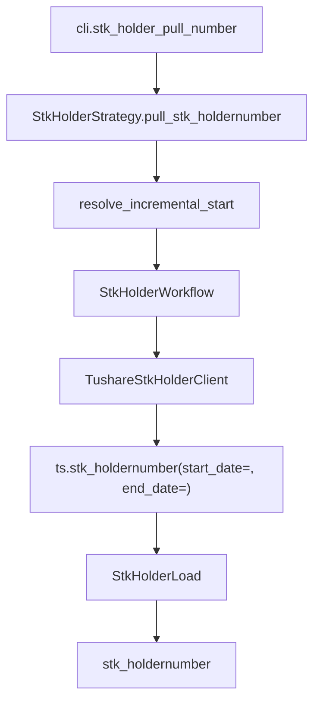

# SDD · 股东户数

> **CLI 命令：** `stk-holder pull-number`
> **交互菜单：** 【筹码】股东户数数据入库 (stk-holder pull-number)
> **源码入口：** `src/etl/cli.py`
> **Tushare 接口：** [`stk_holdernumber`](https://tushare.pro/document/2?doc_id=166)

---

## 1. 概述

按公告日区间调用 Tushare `financial_stock_holder` 拉取全市场股东户数数据，upsert 到 PostgreSQL `financial_stock_holder` 表。为多因子模型提供筹码集中度因子（股东户数变化率）、户均持股因子。

> Tushare `financial_stock_holder` 单次最大 3000 条，总量不限。积分要求 600+。数据不定期公布（随公告发布）。

### 触发方式

```bash
uv run ./src/etl/cli.py stk-holder pull-number
uv run ./src/etl/cli.py stk-holder pull-number --start-date 20100101 --end-date 20251231
uv run ./src/etl/cli.py
```

### 前置依赖

| 依赖 | 说明 |
|------|------|
| `TUSHARE_API_KEY` | 需 600+ 积分 |
| `STK_HOLDERNUMBER_START_DATE` | floor（`.env`，推荐 `20100101`） |
| PostgreSQL | 目标库连接 |

### CLI 参数

| 选项 | 默认 | 说明 |
|------|------|------|
| `--start-date` | `STK_HOLDERNUMBER_START_DATE` | 公告日区间起点 YYYYMMDD |
| `--end-date` | 今日 | 公告日区间终点 YYYYMMDD |

---

## 2. CLI 入口

| 项 | 值 |
|----|-----|
| Typer 子命令组 | `stk-holder`（新增） |
| 命令名 | `pull-number` |
| 处理函数 | `stk_holder_pull_number()` |
| 菜单 key | `stk-holder-pull-number` |
| 菜单 label | `【筹码】股东户数数据入库 (stk-holder pull-number)` |

```python
stk_holder_strategy = typer.Typer()
app.add_typer(stk_holder_strategy, name="stk-holder", help="股东数据 ETL commands")

@stk_holder_strategy.command("pull-number")
def stk_holder_pull_number(
    start_date: str | None = typer.Option(None, "--start-date"),
    end_date: str | None = typer.Option(None, "--end-date"),
) -> None:
    """拉取 Tushare stk_holdernumber 并 upsert。"""
    total = StkHolderStrategy().pull_stk_holdernumber(start_date=start_date, end_date=end_date)
    typer.echo(f"股东户数累计写入 {total} 条")
```

---

## 3. 分层架构

```
CLI → StkHolderStrategy.pull_stk_holdernumber(start, end)
       ├─ StkHolderLocalExtract.resolve_incremental_start()  ← max(floor, 库内 max(ann_date)+1)
       └─ StkHolderWorkflow.pull_stk_holdernumber(eff_start, end)
            ├─ StkHolderExtract → TushareStkHolderClient
            │    └─ ts.stk_holdernumber(start_date=eff_start, end_date=end, fields=...)
            └─ StkHolderLoad → bulk_upsert_postgresql → stk_holdernumber
```

> **注意：** 本接口按公告日区间一次拉取全量，不需要逐日遍历（与 by-date 模式不同）。

**新增源码：** `src/etl/{strategy,workflow,extract,load,client}/stk_holder/` + `src/entities/data_entities/stk_holdernumber_entities.py`

---

## 4. 完整调用流程图

### 4.1 模块调用链



---

## 5. 逐步说明

| 步骤 | 位置 | 输入 | 处理 | 输出 |
|------|------|------|------|------|
| 1 | CLI | `--start-date` / `--end-date` | 实例化 Strategy | echo 总条数 |
| 2 | Strategy | floor / end | 缺省 → return 0 | — |
| 3 | Strategy | floor / end | `TradeCalStrategy.ensure_trade_cal` | SSE 日历就绪 |
| 4 | Strategy | floor / end | `CompletenessEngine.backfill_keys(floor, end)`（`event_driven=True`，`date_column=ann_date`） | `pending`；空 → return 0 |
| 5 | Strategy | pending | `tqdm(pending)` 逐 `ann_date` 调 `pull_stk_holdernumber_by_ann_date` | saved_count |
| 6 | Client | ann_date | `ts.stk_holdernumber(ann_date=)` 全市场一次 → finalize | DataFrame |
| 7 | Load | DataFrame | bulk_upsert_postgresql | upsert 条数 |

---

## 6. 数据与外部依赖

### 6.1 Tushare API

| 项 | 值 |
|----|-----|
| 接口 | `financial_stock_holder` |
| Client | `src/etl/client/stk_holder/tushare.py` |
| 限流 | 600积分 100/min，5000积分更高（`create_rate_limiter(100)`） |
| 单次限量 | 3000 条（需分页） |

**接口输入参数：**

| 名称 | 类型 | 必选 | 说明 |
|------|------|------|------|
| ts_code | str | N | 股票代码（不用，全市场拉） |
| ann_date | str | N | 公告日期（不用） |
| enddate | str | N | 截止日期（不用） |
| start_date | str | N | 公告开始日期（**本任务使用**） |
| end_date | str | N | 公告结束日期（**本任务使用**） |

**接口输出字段（全部入库）：**

| 名称 | 类型 | 说明 |
|------|------|------|
| ts_code | str | TS 股票代码 |
| ann_date | str | 公告日期 |
| end_date | str | 截止日期 |
| holder_num | int | 股东户数 |

### 6.2 数据库

| 项 | 值 |
|----|-----|
| 表名 | `financial_stock_holder` |
| ORM | `StkHoldernumberEntities` |
| 冲突键 | `(ts_code, end_date)` |

**ORM 字段：**

| 列 | 类型 | 说明 |
|----|------|------|
| `id` | Integer PK autoincrement | — |
| `ts_code` | String(20) | TS 代码 |
| `ann_date` | String(8) | 公告日期 |
| `end_date` | String(8) | 截止日期 |
| `holder_num` | Integer | 股东户数 |

**索引：**

| 索引名 | 列 | 唯一 |
|--------|----|------|
| `idx_stk_holdernumber_unique` | `(ts_code, end_date)` | UNIQUE |
| `idx_stk_holdernumber_ann_date` | `(ann_date)` | — |
| `idx_stk_holdernumber_ts_code` | `(ts_code)` | — |

### 6.3 finalize_stk_holdernumber 规则

| 列 | 规则 |
|----|------|
| `ts_code` | `str.strip()` |
| `ann_date` / `end_date` | `_normalize_ymd` → 8 位 |
| `holder_num` | NaN → None |

---

## 7. 业务规则

1. **按公告日区间拉取：** `stk_holdernumber(start_date=eff_start, end_date=end)` 一次拉全量。
2. **分页处理：** 单次最大 3000 条，需分页循环直到返回空。
3. **增量语义：** `eff_start = max(STK_HOLDERNUMBER_START_DATE, 库内 max(ann_date)+1)`。
4. **Upsert 幂等：** `(ts_code, end_date)` 联合唯一。同一截止日期同一股票只有一条记录。
5. **不定期公布：** 数据随公告发布，非固定频率；不做完整性校验。

---

## 8. 日志与可观测性

| 机制 | 说明 |
|------|------|
| typer.echo | `股东户数累计写入 {total} 条` |
| print | `[信息] {eff_start}~{end} 拉取股东户数数据` |

---

## 9. 已知限制与实现备注

| 项 | 说明 |
|----|------|
| 积分要求 | 600+ 积分 |
| 不定期公布 | 数据随公告发布，非固定频率 |
| 分页 | 单次最大 3000 条，需分页循环 |
| 不做完整性校验 | 事件型数据，无固定频率 |

---

## 10. 相关命令

| 命令 | 关系 |
|------|------|
| `stock pull-list-a` | 弱依赖：下游可按 `stock_list` join |
| `daily-basic pull-by-date-range` | `free_share` 可计算户均持股 |

---

## 附录 · Call Stack

```
cli.stk_holder_pull_number()
└─ StkHolderStrategy.pull_stk_holdernumber(start_date, end_date)
   ├─ StkHolderLocalExtract.resolve_incremental_start(configured_start=floor)
   └─ StkHolderWorkflow.pull_stk_holdernumber(eff_start, end)
      ├─ StkHolderExtract → TushareStkHolderClient
      │  └─ ts.stk_holdernumber(start_date=eff_start, end_date=end, fields=COLUMNS)
      │  └─ finalize_stk_holdernumber(df)  [分页循环]
      └─ StkHolderLoad.load_stk_holdernumber(df)
         └─ bulk_upsert_postgresql(StkHoldernumberEntities, conflict_keys=['ts_code','end_date'])
```

## 附录 · 环境变量新增项

| 变量 | 默认 | 用途 | 推荐 .env |
|------|------|------|-----------|
| `STK_HOLDERNUMBER_START_DATE` | `""` | 增量起点；空则 no-op | `20100101` |
