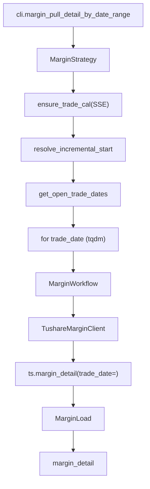

# SDD · 融资融券明细

> **CLI 命令：** `margin pull-detail-by-date-range`
> **交互菜单：** 【两融】融资融券明细 by date 区间增量 (margin pull-detail-by-date-range)
> **源码入口：** `src/etl/cli.py`
> **Tushare 接口：** [`margin_detail`](https://tushare.pro/document/2?doc_id=59)

---

## 1. 概述

按交易日历开市日，逐日调用 Tushare `margin_detail` 拉取**沪深两市**每日融资融券明细（融资余额/融券余量/融资买入额等），upsert 到 PostgreSQL `market_margin_detail` 表。为多因子模型提供杠杆情绪因子（融资余额占比/变化率）、做空压力因子（融券余量占比）。

> Tushare `margin_detail` 单次最大返回 6000 条。积分要求 2000+。交易所于每天 8:30 左右更新上一日数据。

### 触发方式

```bash
uv run ./src/etl/cli.py margin pull-detail-by-date-range
uv run ./src/etl/cli.py margin pull-detail-by-date-range --start-date 20150101
uv run ./src/etl/cli.py
```

### 前置依赖

| 依赖 | 说明 |
|------|------|
| `TUSHARE_API_KEY` | 需 2000+ 积分 |
| `MARGIN_START_DATE` | floor（`.env`，推荐 `20100101`） |
| `stock_trade_calendar`（SSE） | 开市日来源 |

### CLI 参数

| 选项 | 默认 | 说明 |
|------|------|------|
| `--start-date` | `MARGIN_START_DATE` | 区间起点 YYYYMMDD |
| `--end-date` | 今日 | 区间终点 YYYYMMDD |

---

## 2. CLI 入口

| 项 | 值 |
|----|-----|
| Typer 子命令组 | `margin`（新增） |
| 命令名 | `pull-detail-by-date-range` |
| 处理函数 | `margin_pull_detail_by_date_range()` |
| 菜单 key | `margin-pull-detail-by-date-range` |
| 菜单 label | `【两融】融资融券明细 by date 区间增量 (margin pull-detail-by-date-range)` |

```python
margin_strategy = typer.Typer()
app.add_typer(margin_strategy, name="margin", help="融资融券 ETL commands")

@margin_strategy.command("pull-detail-by-date-range")
def margin_pull_detail_by_date_range(
    start_date: str | None = typer.Option(None, "--start-date"),
    end_date: str | None = typer.Option(None, "--end-date"),
) -> None:
    """按交易日历开市日逐日拉取 Tushare margin_detail 并 upsert。"""
    total = MarginStrategy().pull_margin_detail_by_date_range(start_date=start_date, end_date=end_date)
    typer.echo(f"融资融券明细累计写入 {total} 条")
```

---

## 3. 分层架构

```
CLI → MarginStrategy.pull_margin_detail_by_date_range(start, end)
       ├─ TradeCalStrategy.ensure_trade_cal(SSE)
       ├─ MarginLocalExtract.resolve_incremental_start()
       ├─ TradeCalLocalExtract.get_open_trade_dates(SSE,...)
       └─ for trade_date in open_dates:
            └─ MarginWorkflow.pull_margin_detail_by_date(trade_date)
                 ├─ MarginExtract → TushareMarginClient → ts.margin_detail(trade_date=)
                 └─ MarginLoad → bulk_upsert_postgresql → margin_detail
```

**新增源码：** `src/etl/{strategy,workflow,extract,load,client}/margin/` + `src/entities/data_entities/margin_detail_entities.py`

---

## 4. 完整调用流程图

### 4.1 模块调用链



---

## 5. 逐步说明

| 步骤 | 位置 | 输入 | 处理 | 输出 |
|------|------|------|------|------|
| 1 | CLI | `--start-date` / `--end-date` | 实例化 Strategy | echo 总条数 |
| 2 | Strategy | floor / end | 缺省 → return 0 | — |
| 3 | Strategy | floor / end | ensure_trade_cal(SSE) | 日历兜底 |
| 4 | Strategy | floor / end | `CompletenessEngine.backfill_keys(floor, end)`（`period_stock_count_fn`=融资融券标的峰值） | `pending`；空 → return 0 |
| 5 | Strategy | pending | tqdm 逐日调 Workflow | saved_count |
| 7 | Client | trade_date | ts.margin_detail(trade_date=) → finalize | DataFrame |
| 8 | Load | DataFrame | bulk_upsert_postgresql | upsert 条数 |

---

## 6. 数据与外部依赖

### 6.1 Tushare API

| 项 | 值 |
|----|-----|
| 接口 | `market_margin_detail` |
| Client | `src/etl/client/margin/tushare.py` |
| 限流 | 500/min（`create_rate_limiter(500)`） |
| 单次限量 | 6000 条 |

**接口输入参数：**

| 名称 | 类型 | 必选 | 说明 |
|------|------|------|------|
| trade_date | str | N | 交易日期（**按日遍历**） |
| ts_code | str | N | 股票代码（不用） |
| start_date | str | N | 开始日期（不用） |
| end_date | str | N | 结束日期（不用） |

**接口输出字段（全部入库）：**

| 名称 | 类型 | 说明 |
|------|------|------|
| trade_date | str | 交易日期 |
| ts_code | str | TS 股票代码 |
| name | str | 股票名称（20190910 后有数据） |
| rzye | float | 融资余额（元） |
| rqye | float | 融券余额（元） |
| rzmre | float | 融资买入额（元） |
| rqyl | float | 融券余量（股） |
| rzche | float | 融资偿还额（元） |
| rqchl | float | 融券偿还量（股） |
| rqmcl | float | 融券卖出量（股） |
| rzrqye | float | 融资融券余额（元） |

### 6.2 数据库

| 项 | 值 |
|----|-----|
| 表名 | `market_margin_detail` |
| ORM | `MarginDetailEntities` |
| 冲突键 | `(ts_code, trade_date)` |

**ORM 字段：**

| 列 | 类型 | 说明 |
|----|------|------|
| `id` | Integer PK autoincrement | — |
| `ts_code` | String(20) | TS 代码 |
| `trade_date` | String(8) | 交易日期 |
| `name` | String(40) | 股票名称 |
| `rzye` | Float | 融资余额（元） |
| `rqye` | Float | 融券余额（元） |
| `rzmre` | Float | 融资买入额（元） |
| `rqyl` | Float | 融券余量（股） |
| `rzche` | Float | 融资偿还额（元） |
| `rqchl` | Float | 融券偿还量（股） |
| `rqmcl` | Float | 融券卖出量（股） |
| `rzrqye` | Float | 融资融券余额（元） |

**索引：**

| 索引名 | 列 | 唯一 |
|--------|----|------|
| `idx_margin_detail_unique` | `(ts_code, trade_date)` | UNIQUE |
| `idx_margin_detail_trade_date` | `(trade_date)` | — |

### 6.3 finalize_margin_detail 规则

| 列 | 规则 |
|----|------|
| `ts_code` | `str.strip()` |
| `trade_date` | `_normalize_ymd` → 8 位 |
| `name` | NaN → None |
| 数值列 | NaN → None |

---

## 7. 业务规则

1. **按日全市场拉取：** `margin_detail(trade_date=td)` 获取当日全市场两融标的。
2. **仅开市日遍历：** 通过 `stock_trade_calendar` SSE 开市日过滤。
3. **增量语义：** `eff_start = max(MARGIN_START_DATE, 库内 max(trade_date)+1)`。
4. **Upsert 幂等：** `(ts_code, trade_date)` 联合唯一。
5. **非两融标的：** 非两融标的股票不会出现在返回值中（不是全市场 ~5000 股，而是 ~2000 只两融标的）。

---

## 8. 日志与可观测性

| 机制 | 说明 |
|------|------|
| typer.echo | `融资融券明细累计写入 {total} 条` |
| tqdm | `融资融券明细入库`，单位「日」 |

---

## 9. 已知限制与实现备注

| 项 | 说明 |
|----|------|
| 数据延迟 | 交易所于每天 8:30 更新上一日数据 |
| 非全市场 | 仅两融标的（~2000 只），非全市场 ~5000 股 |
| `name` 字段 | 20190910 之前数据无 name 列 |

---

## 10. 相关命令

| 命令 | 关系 |
|------|------|
| `trade-cal pull-history` | **前置**：提供 SSE 开市日 |
| `daily-basic pull-by-date-range` | `total_mv` 可用于融资余额占比归一化 |

---

## 附录 · Call Stack

```
cli.margin_pull_detail_by_date_range()
└─ MarginStrategy.pull_margin_detail_by_date_range(start_date, end_date)
   ├─ TradeCalStrategy.ensure_trade_cal(start, end, exchange="SSE")
   ├─ MarginLocalExtract.resolve_incremental_start(configured_start=floor)
   ├─ TradeCalLocalExtract.get_open_trade_dates(start=eff_start, end=end, exchange="SSE")
   └─ for trade_date in open_dates:
      └─ MarginWorkflow.pull_margin_detail_by_date(trade_date)
         ├─ MarginExtract → TushareMarginClient
         │  └─ ts.margin_detail(trade_date=trade_date, fields=MARGIN_COLUMNS)
         │  └─ finalize_margin_detail(df)
         └─ MarginLoad.load_margin_detail(df)
            └─ bulk_upsert_postgresql(MarginDetailEntities, conflict_keys=['ts_code','trade_date'])
```

## 附录 · 环境变量新增项

| 变量 | 默认 | 用途 | 推荐 .env |
|------|------|------|-----------|
| `MARGIN_START_DATE` | `""` | 增量起点；空则 no-op | `20100101` |
