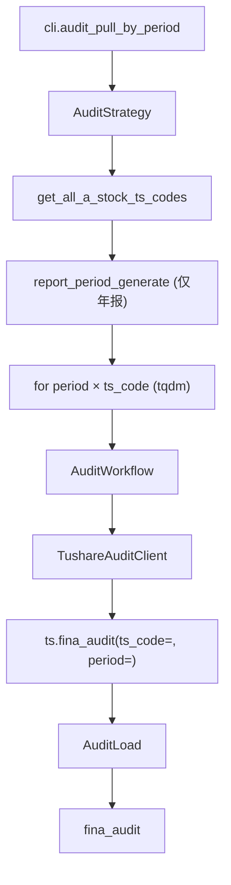

# SDD · 财务审计意见

> **CLI 命令：** `audit pull-by-period`
> **交互菜单：** 【审计】财务审计意见 by period 入库 (audit pull-by-period)
> **源码入口：** `src/etl/cli.py`
> **Tushare 接口：** [`fina_audit`](https://tushare.pro/document/2?doc_id=80)

---

## 1. 概述

按报告期逐股调用 Tushare `financial_audit` 拉取上市公司定期财务审计意见数据（审计结果/审计费用/会计事务所），upsert 到 PostgreSQL `financial_audit` 表。为多因子模型提供非标审计意见风险因子（审计意见为非标的公司标记为高风险）。

> `financial_audit` 必须传 `ts_code`（逐股拉取），不支持按 period 全市场拉取。采用「逐股 × 逐期」双重循环模式。积分要求 2000+。

### 触发方式

```bash
uv run ./src/etl/cli.py audit pull-by-period
uv run ./src/etl/cli.py audit pull-by-period --start-period 20101231
uv run ./src/etl/cli.py
```

### 前置依赖

| 依赖 | 说明 |
|------|------|
| `TUSHARE_API_KEY` | 需 2000+ 积分 |
| `AUDIT_START_PERIOD` | floor（`.env`，推荐 `20051231`） |
| `stock_list` | 提供全市场 A 股 ts_code 列表 |

### CLI 参数

| 选项 | 默认 | 说明 |
|------|------|------|
| `--start-period` | `AUDIT_START_PERIOD` | 报告期起点 YYYYMMDD |
| `--end-period` | 最新报告期 | 报告期终点 YYYYMMDD |

---

## 2. CLI 入口

| 项 | 值 |
|----|-----|
| Typer 子命令组 | `audit`（新增） |
| 命令名 | `pull-by-period` |
| 处理函数 | `audit_pull_by_period()` |
| 菜单 key | `audit-pull-by-period` |
| 菜单 label | `【审计】财务审计意见 by period 入库 (audit pull-by-period)` |

```python
audit_strategy = typer.Typer()
app.add_typer(audit_strategy, name="audit", help="审计意见 ETL commands")

@audit_strategy.command("pull-by-period")
def audit_pull_by_period(
    start_period: str | None = typer.Option(None, "--start-period"),
    end_period: str | None = typer.Option(None, "--end-period"),
) -> None:
    """按报告期逐股拉取 Tushare fina_audit 并 upsert。"""
    total = AuditStrategy().pull_fina_audit_by_period(start_period=start_period, end_period=end_period)
    typer.echo(f"审计意见累计写入 {total} 条")
```

---

## 3. 分层架构

```
CLI → AuditStrategy.pull_fina_audit_by_period(start, end)
       ├─ StockListLocalExtract.get_all_a_stock_ts_codes()
       ├─ report_period_generate(start, end) → periods (仅年报 1231)
       └─ for period in periods:
            └─ for ts_code in ts_codes (tqdm):
                 └─ AuditWorkflow.pull_fina_audit_by_period(ts_code, period)
                      ├─ AuditExtract → TushareAuditClient
                      │    └─ ts.fina_audit(ts_code=, period=, fields=...)
                      └─ AuditLoad → bulk_upsert_postgresql → fina_audit
```

> **注意：** 审计意见通常仅在年报（1231）披露，因此 `report_period_generate` 可过滤为仅年报期（end_date 以 1231 结尾）。

**新增源码：** `src/etl/{strategy,workflow,extract,load,client}/audit/` + `src/entities/data_entities/fina_audit_entities.py`

---

## 4. 完整调用流程图



---

## 5. 逐步说明

| 步骤 | 位置 | 输入 | 处理 | 输出 |
|------|------|------|------|------|
| 1 | CLI | `--start-period` / `--end-period` | 实例化 Strategy | echo 总条数 |
| 2 | Strategy | floor / end | resolve_incremental_start + PG 预加载已有 `(ts_code,end_date)` | eff_start / 跳过集合 |
| 3 | Strategy | periods | 仅对库内缺失 ts_code 逐股补拉（`pull_fina_audit_gaps_for_period`） | saved_count |
| 4 | Strategy | floor / end | `check_complete` 走 `CompletenessEngine.backfill_keys`（非逐股扫全市场） | 补拉条数 |
| 6 | Client | ts_code, period | ts.fina_audit(ts_code=, period=) → finalize | DataFrame（0~1 行） |
| 7 | Load | DataFrame | bulk_upsert_postgresql | upsert 条数 |

---

## 6. 数据与外部依赖

### 6.1 Tushare API

| 项 | 值 |
|----|-----|
| 接口 | `financial_audit` |
| Client | `src/etl/client/audit/tushare.py` |
| 限流 | 200/min（`create_rate_limiter(200)`） |

**接口输入参数：**

| 名称 | 类型 | 必选 | 说明 |
|------|------|------|------|
| ts_code | str | Y | 股票代码（**逐股遍历**） |
| ann_date | str | N | 公告日期（不用） |
| start_date | str | N | 公告开始日期（不用） |
| end_date | str | N | 公告结束日期（不用） |
| period | str | N | 报告期（**逐期遍历，仅年报**） |

**接口输出字段（全部入库）：**

| 名称 | 类型 | 说明 |
|------|------|------|
| ts_code | str | TS 股票代码 |
| ann_date | str | 公告日期 |
| end_date | str | 报告期 |
| audit_result | str | 审计结果（标准无保留/带强调事项无保留/保留/否定/无法表示） |
| audit_fees | float | 审计总费用（元） |
| audit_agency | str | 会计事务所 |
| audit_sign | str | 签字会计师 |

### 6.2 数据库

| 项 | 值 |
|----|-----|
| 表名 | `financial_audit` |
| ORM | `FinaAuditEntities` |
| 冲突键 | `(ts_code, end_date)` |

**ORM 字段：**

| 列 | 类型 | 说明 |
|----|------|------|
| `id` | Integer PK | — |
| `ts_code` | String(20) | TS 代码 |
| `ann_date` | String(8) | 公告日期 |
| `end_date` | String(8) | 报告期 |
| `audit_result` | String(40) | 审计结果 |
| `audit_fees` | Float | 审计费用（元） |
| `audit_agency` | String(200) | 会计事务所 |
| `audit_sign` | String(100) | 签字会计师 |

**索引：**

| 索引名 | 列 | 唯一 |
|--------|----|------|
| `idx_fina_audit_unique` | `(ts_code, end_date)` | UNIQUE |
| `idx_fina_audit_ts_code` | `(ts_code)` | — |
| `idx_fina_audit_end_date` | `(end_date)` | — |

### 6.3 finalize_fina_audit 规则

| 列 | 规则 |
|----|------|
| `ts_code` | `str.strip()` |
| `ann_date` / `end_date` | `_normalize_ymd` → 8 位；NaN → `""` |
| `audit_result` | `str.strip()` |
| `audit_agency` / `audit_sign` | `str.strip()`；NaN → None |
| 数值列 | NaN → None |

---

## 7. 业务规则

1. **逐股 × 逐期（仅年报）：** `financial_audit` 必须传 `ts_code`。审计意见通常仅在年报（1231）披露，因此只遍历年报告期。
2. **增量语义：** `eff_start_period = max(AUDIT_START_PERIOD, 库内 max(end_date)+1)`。
3. **Upsert 幂等：** `(ts_code, end_date)` 联合唯一。
4. **空集容忍：** 某股某年报无审计数据时 saved=0，继续下一股。
5. **不做完整性校验：** 年频事件数据。

---

## 8. 日志与可观测性

| 机制 | 说明 |
|------|------|
| typer.echo | `审计意见累计写入 {total} 条` |
| tqdm | `审计意见入库`，单位「股」，postfix `period/saved/ts_code` |

---

## 9. 已知限制与实现备注

| 项 | 说明 |
|----|------|
| 逐股拉取 | 不支持按 period 全市场拉取 |
| 仅年报 | 审计意见通常仅在年报披露，季报/半年报无审计数据 |
| 工作量大 | ~5000 股 × N 年 × 限流 200/min |

---

## 10. 相关命令

| 命令 | 关系 |
|------|------|
| `stock pull-list-a` | **前置**：提供全市场 A 股列表 |
| `report report-history-init` | 正式财报数据，审计意见为配套质量信息 |

---

## 附录 · Call Stack

```
cli.audit_pull_by_period()
└─ AuditStrategy.pull_fina_audit_by_period(start_period, end_period)
   ├─ StockListLocalExtract.get_all_a_stock_ts_codes()
   ├─ report_period_generate(start, end) → filter 仅年报(1231) → periods
   ├─ resolve_incremental_start_period(configured=floor)
   └─ for period in periods:
      └─ for ts_code in ts_codes (tqdm):
         └─ AuditWorkflow.pull_fina_audit_by_period(ts_code, period)
            ├─ AuditExtract → TushareAuditClient
            │  └─ ts.fina_audit(ts_code=ts_code, period=period, fields=AUDIT_COLUMNS)
            │  └─ finalize_fina_audit(df)
            └─ AuditLoad.load_fina_audit(df)
               └─ bulk_upsert_postgresql(FinaAuditEntities, conflict_keys=['ts_code','end_date'])
```

## 附录 · 环境变量新增项

| 变量 | 默认 | 用途 | 推荐 .env |
|------|------|------|-----------|
| `AUDIT_START_PERIOD` | `""` | 报告期起点；空则 no-op | `20051231` |
