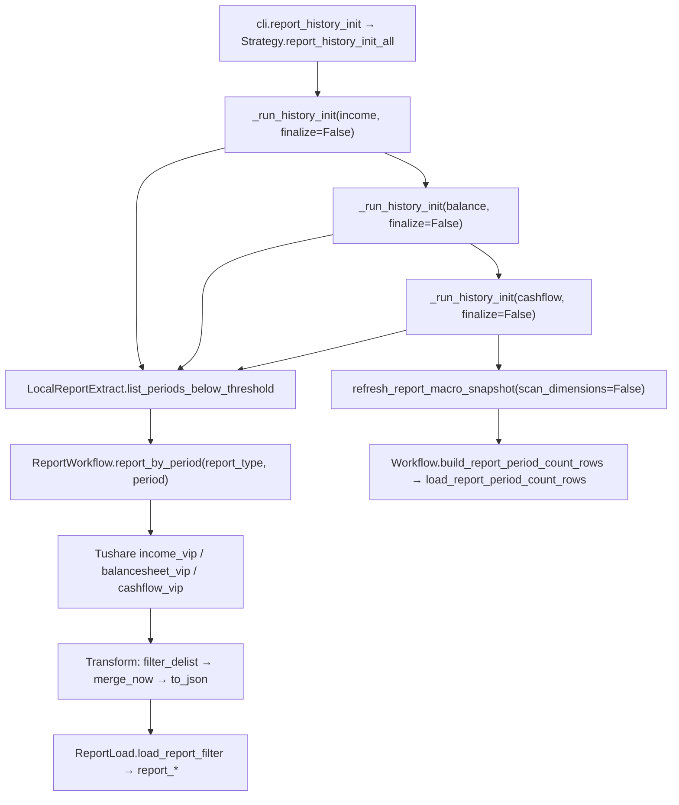

# SDD · 财报三表全量历史入库

> **CLI 命令：** `report report-history-init`  
> **交互菜单：** 【财报】财报三表全量历史入库 income→balance→cashflow  
> **源码入口：** [`src/etl/cli.py`](../../src/etl/cli.py) L68–74

---

## 1. 概述

按报告期（季度末）批量拉取 Tushare VIP 接口数据，顺序入库利润表 → 资产负债表 → 现金流量表。三表全部跑完后**统一一次**刷新宏观快照 `financial_report_period_count`（CLI 入口走 `report_history_init_all`）。单表 SSE 入口 `report_*_history_init` 每次结束后会各自刷一次快照（用于增量场景的快速 finalize）。微观查漏补拉请单独运行 `report check-report-complete`。仅对「采集条数未达该期在市股票数 95%」的报告期入库，避免重复拉取已达标期次。

### 触发方式

```bash
uv run ./src/etl/cli.py report report-history-init
```

### 前置依赖

| 依赖 | 说明 |
|------|------|
| `stock_list` | 退市过滤与 `period_stock_count` 计算依赖该表 |
| `financial_report_period_count` | Phase 1–3 用 95% 规则筛缺失期；**首次运行若表空可能 0 期** |
| `REPORT_PERIOD_COUNT_START_DATE` | 筛期起点与 Phase 4 统计起点（`.env`） |
| `TUSHARE_API_KEY` | VIP 接口鉴权 |

**建议顺序：** `stock pull-list-a`（初始化 stock_list）→ `report update-period-count`（初始化 report_period_count）→ 本命令。

### CLI 参数

无。

---

## 2. CLI 入口

| 项 | 值 |
|----|-----|
| 处理函数 | `report_history_init()` |
| 菜单 key | `report-history-init` |

```python
ReportStrategy().report_history_init_all()  # 三表顺序入库 + 末尾统一一次 refresh_report_macro_snapshot()
```

**「income→balance→cashflow」：** 三表顺序全量入库的编排顺序，各表独立按 `report_type` 筛期。
**SSE 单表入口：** `report_*_history_init(start_date, *, progress_queue)` 各自独立调用，每次结束后自带 finalize（适用于 API 增量触发）。

---

## 3. 分层架构

```
CLI → ReportStrategy.report_history_init_all（4 阶段）
  Phase 1–3: LocalReportExtract.list_periods_below_threshold → ReportWorkflow.report_by_period(report_type, period)
    Extract(Tushare *_vip) → Transform(filter_delist → merge_now → to_json) → Load(report_*)
  Phase 4: Strategy.refresh_report_macro_snapshot（三表跑完后统一一次）
    Workflow.build_report_period_count_rows → load_report_period_count_rows
```

---

## 4. 完整调用流程图



---

## 5. 逐步说明

### Phase 1–3 · 单表历史入库（结构相同，换 report_type / API / 目标表，由 `_REPORT_SPECS` dispatch）

| 步骤 | 处理 |
|------|------|
| 1 | `start_date` 默认 `REPORT_PERIOD_COUNT_START_DATE`，`end_date` = 今日 |
| 2 | `list_periods_below_threshold`：读 `financial_report_period_count`，保留 `count < 0.95 × period_stock_count` 的期 |
| 3 | 按期循环 `report_by_period(report_type, period)`（Workflow） |
| 4 | Extract：`ReportExtract.pull(report_type, period=period)` → 走 `TushareReportClient` 按 `report_type` 分派到 `income_vip` / `balancesheet_vip` / `cashflow_vip`（每 endpoint 独立 400/min 限流） |
| 5 | Transform：`filter_report_by_delist`（读 `stock_list`）→ `report_transform_merge_now` → `report_more_detail_to_json` |
| 6 | Load：`load_report_filter`（先查再改再插，`scope_end_date=period`）到 `financial_report_income` / `financial_report_balance` / `financial_report_cashflow` |

| 轮次 | report_type | Tushare API | 目标表 |
|------|-------------|-------------|--------|
| 1 | income | `income_vip` | `financial_report_income` |
| 2 | balance | `balancesheet_vip` | `financial_report_balance` |
| 3 | cashflow | `cashflow_vip` | `financial_report_cashflow` |

### Phase 4 · 刷新 report_period_count（三表跑完后统一一次）

| 步骤 | 处理 |
|------|------|
| 1 | 读全表 `stock_list` |
| 2 | 读三表各报告期条数 + 旧 `period_stock_count` |
| 3 | `StockTransform.period_stock_count` 重算各季末应在市股票数 |
| 4 | `report_period_generate` 生成季末列表，合并写入 |
| 5 | upsert `financial_report_period_count`（冲突键 `report_period`） |

**调用位置：** `Strategy.report_history_init_all` 在 Phase 1–3 全部完成后调用 `refresh_report_macro_snapshot(scan_dimensions=False)` 一次；
SSE 单表入口 `report_*_history_init` 各自结束时也会刷一次（独立 finalize，避免快照滞后）。
**区间：** `[REPORT_PERIOD_COUNT_START_DATE, 今日]`。

---

## 6. 数据与外部依赖

### 数据库表

| 表 | Phase 1–3 | Phase 4 |
|----|-----------|---------|
| `financial_report_period_count` | 读（筛期） | 写 |
| `stock_list` | 读（退市过滤） | 读 |
| `financial_report_income` / `financial_report_balance` / `financial_report_cashflow` | 写 | 读（count） |

### Tushare API

| API | 限流 |
|-----|------|
| `income_vip(period=...)` | 400/min |
| `balancesheet_vip(period=...)` | 400/min |
| `cashflow_vip(period=...)` | 400/min |

---

## 7. 业务规则

- **95% 阈值：** 某期三表条数 ≥ `period_stock_count × 0.95` 则跳过，不重复拉取。
- **退市过滤：** 入库前剔除已退市且报告期晚于退市日的记录。
- **Phase 4 在 Phase 1–3 之后：** 当次运行结束时才更新快照；当次筛期用的是**运行前**的快照。

---

## 8. 日志与可观测性

| 机制 | 说明 |
|------|------|
| tqdm | 三表各有一进度条，postfix 显示当期 `saved` 条数 |
| typer.echo | **无** |
| 返回值 | CLI 丢弃 |

---

## 9. 已知限制

| 项 | 说明 |
|----|------|
| 首次空库（自死锁） | `list_periods_below_threshold` 读 `financial_report_period_count`：表空 → 0 期入库；而 `financial_report_period_count` 又依赖三表 count 才能填出"非 0 缺"。**Bootstrap 路径**见下方 |
| 已废弃的 update-base-info | 曾组合调用 `pull-list-a` + `update-period-count` + K 线快照，已拆回各自独立命令 |
| progress_queue | Strategy 支持 SSE 进度帧，CLI 未传 |

### Bootstrap：首次部署如何破死锁

`financial_report_period_count` 在新库上是空的，95% 阈值过滤会让 `list_periods_below_threshold` 返回 `[]`，三表一条都拉不动。需手动越过一次阈值：

1. **先建快照（含全 0 行）**：跑 `stock pull-list-a` + `report update-period-count`——`build_report_period_count_rows` 会按 `report_period_generate` 生成每个季度末的占位行，三表 count 列均为 0，`period_stock_count` 由 `stock_list` 算出。
2. **此时 `report_*_count = 0 < 0.95 × period_stock_count`，全部期被判"缺"**，`report_history_init_all` 即可拉数。
3. 三表入库结束后 Phase 4 再次刷快照，count 列填上真值，下一次重跑会跳过已达标期。

---

## 10. 相关命令

| 命令 | 关系 |
|------|------|
| `stock pull-list-a` + `report update-period-count` | 建议先跑，初始化基础数据 |
| `report check-report-complete` | 按股查漏补拉，与本命令按期批量入库互补 |

---

## 附录 · Call Stack

```
cli.report_history_init()
└─ Strategy.report_history_init_all()
   ├─ _run_history_init("income",   finalize=False) → list_periods_below_threshold → report_by_period × N → income_vip → report_income
   ├─ _run_history_init("balance",  finalize=False) → …                                                  → balancesheet_vip → report_balance
   ├─ _run_history_init("cashflow", finalize=False) → …                                                  → cashflow_vip → report_cashflow
   └─ refresh_report_macro_snapshot(scan_dimensions=False) → stock_list + 三表 count → report_period_count
```
