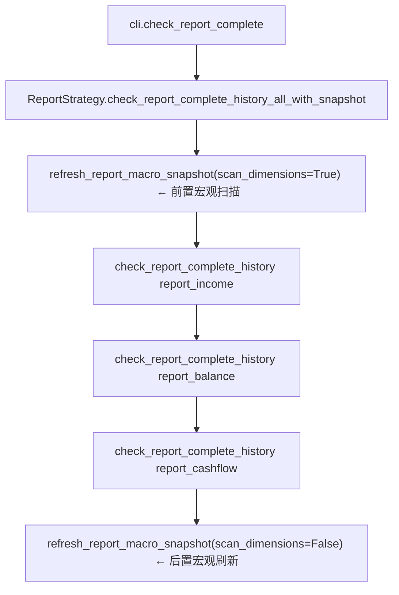
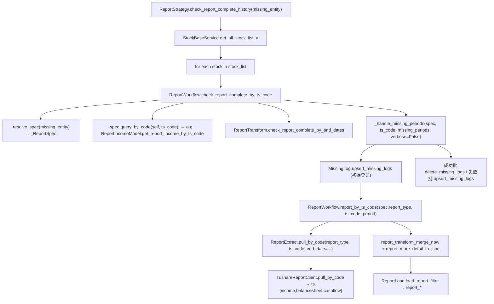
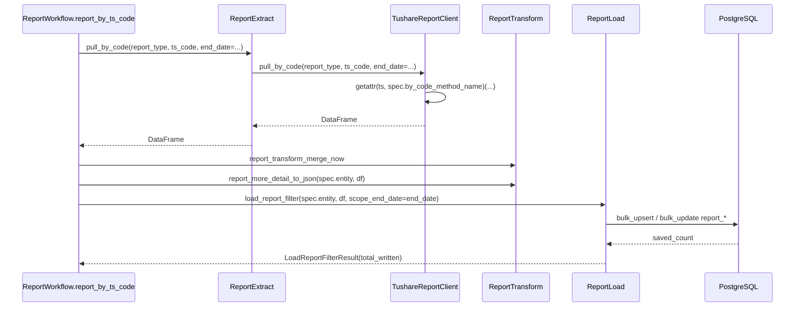

# SDD · 财报完整性校验

> **CLI 命令：** `report check-report-complete`  
> **交互菜单：** —（Typer 子命令；`report-history-init` / `pull-*` 流程首尾已自动补位）  
> **源码入口：** [`src/etl/cli.py`](../../src/etl/cli.py) L76–82

---

## 1. 概述

对全 A 股逐只股票、逐张财报表（利润表 → 资产负债表 → 现金流量表）检查**季度报告期是否齐全**（**微观查漏补拉**）。执行顺序：刷新宏观快照 → 三表逐股检查补拉 → 再刷新宏观快照。Strategy 层打印 `[宏观]` / `[微观]` 进度。

### 触发方式

```bash
# 直调（交互菜单无此项）
uv run ./src/etl/cli.py report check-report-complete
```

### 前置依赖

| 依赖 | 说明 |
|------|------|
| `stock_list` 表已有数据 | 通过 `stock pull-list-a` 维护；完整性检查从该表取 A 股列表与 `list_date` |
| `TUSHARE_API_KEY` | 补拉缺期时调用 Tushare |
| PostgreSQL | 读已有报告期、写补拉结果与 `log_missing` |

### CLI 参数

无。命令不接受任何 Option 或 Argument。

---

## 2. CLI 入口

| 项 | 值 |
|----|-----|
| Typer 子命令组 | `report`（`report_strategy`） |
| 命令名 | `check-report-complete` |
| 处理函数 | `check_report_complete()` |
| 菜单 key | `check-report-complete` → `_MENU_HANDLERS` |

```python
# src/etl/cli.py
ReportStrategy().check_report_complete_history_all_with_snapshot()
```

**快照编排：** 检查前、检查后各调用 `report_period_count()` 刷新 `financial_report_period_count` 表。

**「income→balance→cashflow」含义：** CLI 按上述顺序**依次执行三轮**完整性检查，每轮换一张表与对应 Tushare API。这是 ETL **编排顺序**，**不是**三表之间的交叉关联校验（例如「有利润表就必须有资产负债表」）。

---

## 3. 分层架构

```
CLI (cli.py)
  └─ ReportStrategy (report_strategy.py)     ← 全 A 股循环、日期区间
       └─ ReportWorkflow (report_workflow.py) ← 单股完整性 + 补拉编排
            ├─ StockBaseService               ← 读 stock_list
            ├─ _ReportSpec.query_by_code      ← 读 Report*Model 已有 end_date（dispatch）
            ├─ ReportTransform               ← 生成应有季度、算缺期
            ├─ _handle_missing_periods       ← 缺期写 MissingLog → report_by_ts_code → 回写 log
            └─ report_by_ts_code(report_type, ts_code, end_date)
                 ├─ ReportExtract.pull_by_code(report_type, ts_code, end_date=...)
                 │   └─ TushareReportClient.pull_by_code → ts.{income,balancesheet,cashflow}
                 ├─ ReportTransform.{merge_now, more_detail_to_json}
                 └─ ReportLoad.load_report_filter(spec.entity, df, scope_end_date=...)
```

---

## 4. 完整调用流程图

### 4.1 顶层：三轮顺序执行 + 前后宏观快照



### 4.2 单轮（以 report_income 为例，三表通过 `_REPORT_SPECS` 分派）



### 4.3 补拉子链时序（report_by_ts_code，三表参数化）



---

## 5. 逐步说明

### Phase 0 · CLI

| 步骤 | 输入 | 处理 | 输出 / 副作用 |
|------|------|------|---------------|
| 0.1 | 无 | 实例化 `ReportStrategy` | — |
| 0.2 | — | 调用 `check_report_complete_history_all_with_snapshot()`：前置 `refresh_report_macro_snapshot(scan_dimensions=True)` → 顺序跑三次 `check_report_complete_history(entity)` → 后置 `refresh_report_macro_snapshot(scan_dimensions=False)` | 三轮微观完整扫描 + 前后宏观快照 |

### Phase 1 · Strategy（[`report_strategy.py`](../../src/etl/strategy/financial/report_strategy.py) `check_report_complete_history`）

| 步骤 | 输入 | 处理 | 输出 / 副作用 |
|------|------|------|---------------|
| 1.1 | `missing_entity` | 校验 ∈ `_REPORT_MISSING_ENTITIES`（即 `{report_income, report_balance, report_cashflow}`），否则 `ValueError` | — |
| 1.2 | — | `stock_base_service.get_all_stock_list_a()`：从 `stock_list` 取 `exchange in [SSE, SZSE, BSE]` | A 股实体列表 |
| 1.3 | 每只股票 | `start_date = max("20050101", list_date)`，`end_date = 今日 YYYYMMDD` | 检查区间 |
| 1.4 | `ts_code`, 区间, missing_entity | 调用 `report_workflow.check_report_complete_by_ts_code(...)` | 该股缺期列表 |
| 1.5 | — | 汇总 `f"{ts_code},{ed}"` 到 `missing_all`；`tqdm` 进度条 + `format_micro_stock_postfix`（活跃/通过/缺失/缺期统计） | 打印 `[微观]` 汇总行；返回 `len(missing_all)` |

### Phase 2 · Workflow 单股（[`report_workflow.py`](../../src/etl/workflow/financial/report_workflow.py) `check_report_complete_by_ts_code` + `_handle_missing_periods`）

| 步骤 | 输入 | 处理 | 输出 / 副作用 |
|------|------|------|---------------|
| 2.1 | `missing_entity` | `_resolve_spec(missing_entity=...)` 拿到 `_ReportSpec`（含 `report_type` / `entity` / `query_by_code` / `label`） | spec 对象 |
| 2.2 | `ts_code` | `spec.query_by_code(self, ts_code)` 查 DB 该股已有报告期（含 `end_date`） | `resolved_end_dates` |
| 2.3 | 已有期 + 区间 | `report_transform.check_report_complete_by_end_dates` | `missing_periods` |
| 2.4 | 缺期 | 调 `_handle_missing_periods(spec, ts_code, missing_periods, verbose=False)` | 由公共体接管下方 2.5–2.7 |
| 2.5 | 缺期列表 | `missing_log.upsert_missing_logs(missing_items, missing_entity)`，初始登记 | 写 `log_missing` |
| 2.6 | 每个缺期 | `report_by_ts_code(spec.report_type, ts_code, period)` 走统一补拉链路 | Extract→Transform→Load |
| 2.7 | `saved_count` | 终态合并写：`> 0` → `delete_missing_logs(succeeded, ...)` 物理删除；`== 0` → `upsert_missing_logs(failed, ...)` 让 try_count++ | 解除登记 / 更新尝试次数 |
| 2.8 | — | 返回 `missing_periods` | 缺期 end_date 列表 |

> `_handle_missing_periods` 同时被 `check_report_complete`（批量预加载路径，`verbose=True` 使用 `tqdm.write`）复用，单股 CLI 路径走 `verbose=False`，不打印逐期日志。

### Phase 3 · Transform 缺期判定（[`report_transform.py`](../../src/etl/transform/financial/report_transform.py) L78–143）

| 步骤 | 处理 |
|------|------|
| 3.1 | `report_period_generate(start_end_date, end_end_date)` 生成区间内所有季度末：`0331`、`0630`、`0930`、`1231` |
| 3.2 | `expected` 与已有 `end_dates` 做差集 → `missing_periods` |

**实际行为：** 直接从调用方传入的 `start_end_date`（Strategy 已算好 `max(20050101, list_date)`）起算应有季度，**不会**再取「已观测报告期最小值」调整起点。

### Phase 4 · 补拉 ETL（`ReportWorkflow.report_by_ts_code(report_type, ts_code, end_date)`）

| 层 | 函数 | 作用 |
|----|------|------|
| Extract | `ReportExtract.pull_by_code(report_type, ts_code, end_date=...)` | 走 `TushareReportClient` 按 `report_type` 分派到 `ts.income` / `ts.balancesheet` / `ts.cashflow`（每 endpoint 独立 400/min 限流） |
| Transform | `report_transform_merge_now` | 清洗合并 |
| Transform | `report_more_detail_to_json(spec.entity, df)` | 按实体的 JSONB 列将明细字段聚合（`to_dict('records')` 实现） |
| Load | `ReportLoad.load_report_filter(spec.entity, df, scope_end_date=end_date, local_report_extract=...)` | 先查再改再插，写入 `financial_report_income` / `financial_report_balance` / `financial_report_cashflow` |

三表共用同一份方法，差异由 `_REPORT_SPECS[report_type]` 与 `_TUSHARE_REPORT_SPECS[report_type]` 提供。

---

## 6. 数据与外部依赖

### 6.1 数据库表

| 表名 | ORM 实体 | 读/写 | 用途 |
|------|----------|-------|------|
| `stock_list` | `StockListEntities` | 读 | A 股列表、`list_date` |
| `financial_report_income` | `ReportIncomeEntities` | 读 + 写 | 利润表已有期 / 补拉入库 |
| `financial_report_balance` | `ReportBalanceEntities` | 读 + 写 | 资产负债表 |
| `financial_report_cashflow` | `ReportCashflowEntities` | 读 + 写 | 现金流量表 |
| `log_missing` | `LogMissing` | 写 | 缺期与补拉尝试记录 |

### 6.2 Tushare API

| missing_entity | API | 限流 |
|----------------|-----|------|
| `financial_report_income` | `ts.income(ts_code=..., end_date=...)` | 400/min |
| `financial_report_balance` | `ts.balancesheet(ts_code=..., end_date=...)` | 400/min |
| `financial_report_cashflow` | `ts.cashflow(ts_code=..., end_date=...)` | 400/min |

Client：[`src/etl/client/report/tushare.py`](../../src/etl/client/report/tushare.py)

### 6.3 log_missing 字段语义

| 字段 | 说明 |
|------|------|
| `ts_code` | 股票代码 |
| `missing_entity` | `financial_report_income` / `financial_report_balance` / `financial_report_cashflow` |
| `missing_date` | 缺失报告期 end_date（YYYYMMDD） |
| `try_count` | 每次 upsert 递增 |
| `last_try_time` | 最后尝试时间 |

冲突键：`(ts_code, missing_entity, missing_date)`。语义：表里的每行都是「至今未补入库」的待办，补入成功后**物理删除**。详见 [`log-缺失日志.sdd.md`](./log-缺失日志.sdd.md)。

---

## 7. 业务规则

### 7.1 完整性定义

对每只股票、每张财报表，在区间 `[max(20050101, list_date), 今日]` 内：

1. 生成所有**季度末**报告期（0331 / 0630 / 0930 / 1231）
2. 与 DB 中该股已有 `end_date` 比较
3. 差集即为缺期 → 记录 log → Tushare 补拉

### 7.2 三表执行顺序

| 轮次 | missing_entity | Tushare API | 目标表 |
|------|----------------|-------------|--------|
| 1 | `financial_report_income` | `income` | `financial_report_income` |
| 2 | `financial_report_balance` | `balancesheet` | `financial_report_balance` |
| 3 | `financial_report_cashflow` | `cashflow` | `financial_report_cashflow` |

三轮算法相同，彼此独立。

### 7.3 日期边界

- 全局最早检查起点：`20050101`（硬编码）
- 单股起点：`max("20050101", list_date)`，`list_date` 来自 `stock_list`
- 终点：执行当日 `YYYYMMDD`

---

## 8. 日志与可观测性

| 机制 | 说明 |
|------|------|
| `tqdm` 进度条 | Strategy 层按股票数展示，postfix 为当前股缺期数 |
| `log_missing` | 缺期发现与补拉结果持久化 |
| CLI echo | **无**；不打印总缺期数或写入条数 |
| 返回值 | Strategy 返回 `len(missing_all)`，CLI 层丢弃 |

Workflow 批量版 `check_report_complete`（预加载全表路径）通过 `_handle_missing_periods(verbose=True)` 用 `tqdm.write` 打印逐期补拉日志（不打散进度条）；**CLI 实际走的单股路径 `check_report_complete_by_ts_code` 传 `verbose=False`，不打印逐期日志**。

---

## 9. 已知限制与实现备注

| 项 | 说明 |
|----|------|
| 未使用批量路径 | CLI 走 `check_report_complete_by_ts_code`（逐股查库）；`check_report_complete` 预加载全表 `(ts_code, end_date)` 更高效但未被 CLI 调用 |
| 三表非关联校验 | 有 income 缺期不影响 balance 轮次的判定逻辑 |
| Tushare 空返回 | `saved_count == 0` 时记 log 失败，不抛异常，任务继续 |
| 性能 | 全 A 股 × 三表 × 逐股 DB 查询，耗时可很长；受 Tushare 400/min 限流约束 |

---

## 10. 相关命令

| 命令 | 关系 |
|------|------|
| `stock pull-list-a` | **应先执行**，提供 `stock_list` 与 `list_date` |
| `report report-history-init` | 三表全量历史入库 + `financial_report_period_count`；完整性检查的前置或互补任务 |
| `stock pull-list-a` + `report update-period-count` | 更新 stock_list + report_period_count |

---

## 附录 · 完整 Call Stack

```
cli.check_report_complete()
└─ ReportStrategy.check_report_complete_history_all_with_snapshot()
   ├─ refresh_report_macro_snapshot(scan_dimensions=True)                # 检查前·扫描三维度
   ├─ for missing_entity in (report_income, report_balance, report_cashflow):
   │  └─ check_report_complete_history(missing_entity)
   │     └─ for each stock:
   │        └─ ReportWorkflow.check_report_complete_by_ts_code(ts_code, missing_entity, ...)
   │           ├─ _resolve_spec(missing_entity=...) → _ReportSpec
   │           ├─ spec.query_by_code(self, ts_code) → resolved_end_dates
   │           ├─ ReportTransform.check_report_complete_by_end_dates → missing_periods
   │           └─ _handle_missing_periods(spec, ts_code, missing_periods, verbose=False)
   │              ├─ MissingLog.upsert_missing_logs(initial)
   │              ├─ for period in missing_periods:
   │              │  └─ ReportWorkflow.report_by_ts_code(spec.report_type, ts_code, period)
   │              │     ├─ ReportExtract.pull_by_code(report_type, ts_code, end_date=period)
   │              │     ├─ ReportTransform.{merge_now, more_detail_to_json}
   │              │     └─ ReportLoad.load_report_filter(spec.entity, ..., scope_end_date=period)
   │              ├─ if succeeded: MissingLog.delete_missing_logs(succeeded, missing_entity)
   │              └─ if failed:    MissingLog.upsert_missing_logs(failed, missing_entity)  # try_count++
   └─ refresh_report_macro_snapshot(scan_dimensions=False)               # 检查后·仅刷新快照
```
