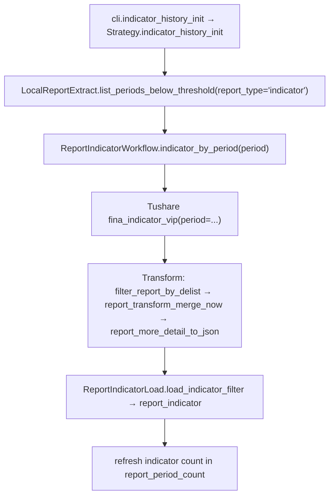

# SDD · 财务指标全量历史入库

> **CLI 命令：** `report indicator-history-init`  
> **交互菜单：** 【财报】财务指标全量历史入库 (report indicator-history-init)  
> **源码入口：** [`src/etl/cli.py`](../../src/etl/cli.py)

---

## 1. 概述

按报告期（季度末）批量拉取 Tushare `fina_indicator_vip` 接口数据（需 5000 积分），入库 `financial_report_indicator` 表。接口参数与 `fina_indicator` 一致，但支持按 `period` 拉取全市场。入库完成后刷新宏观快照 `report_period_count.report_indicator_count`。

### 与财报三表的关系

| 对比项 | 三表（income / balance / cashflow） | 财务指标（indicator） |
|--------|-------------------------------------|----------------------|
| 接口 | `*_vip`（三个 endpoint） | `fina_indicator_vip`（一个 endpoint） |
| 目标表 | 三张独立表 | 一张 `financial_report_indicator` |
| 公共列 | `ts_code, ann_date, f_ann_date, end_date, report_type, comp_type, end_type` | `ts_code, ann_date, end_date`（无 `f_ann_date` / `report_type` / `comp_type` / `end_type`） |
| 冲突键 | `(ts_code, end_date, f_ann_date, report_type, update_flag)` | `(ts_code, end_date, ann_date, update_flag)` |
| 字段数 | 各 ~25-35 显式列 + JSONB 兜底 | ~25 显式列 + JSONB 兜底（SDK 返回 109 字段） |
| 限流 | 400/min per endpoint | 400/min |

### 触发方式

```bash
uv run ./src/etl/cli.py report indicator-history-init
```

### 前置依赖

| 依赖 | 说明 |
|------|------|
| `stock_list` | 退市过滤与 `period_stock_count` 计算 |
| `financial_report_period_count` | 95% 规则筛缺失期；首次运行若表空可能 0 期（Bootstrap 同三表） |
| `REPORT_PERIOD_COUNT_START_DATE` | 筛期起点（`.env`） |
| `TUSHARE_API_KEY` | VIP 接口鉴权（需 5000+ 积分） |

### CLI 参数

无。

---

## 2. CLI 入口

| 项 | 值 |
|----|-----|
| 处理函数 | `indicator_history_init()` |
| 菜单 key | `report-indicator-history-init` |

```python
ReportIndicatorStrategy().indicator_history_init()
```

---

## 3. 分层架构

```
CLI → ReportIndicatorStrategy.indicator_history_init
  Extract(Tushare fina_indicator_vip) → Transform(filter_delist → merge_now → to_json) → Load(report_indicator)
  → refresh_report_macro_snapshot（仅刷 indicator 维度）
```

---

## 4. 完整调用流程图



---

## 5. 逐步说明

| 步骤 | 处理 |
|------|------|
| 1 | `start_date` 默认 `REPORT_PERIOD_COUNT_START_DATE`，`end_date` = 今日 |
| 2 | `list_periods_below_threshold(report_type='indicator')`：读 `financial_report_period_count`，保留 `report_indicator_count < 0.95 × period_stock_count` 的期 |
| 3 | 按期循环 `indicator_by_period(period)`（Workflow） |
| 4 | Extract：`fina_indicator_vip(period=period)`，限流 400/min |
| 5 | Transform：`filter_report_by_delist` → `report_transform_merge_now` → `report_more_detail_to_json` |
| 6 | Load：`load_indicator_filter`（先查再改再插，`scope_end_date=period`） |
| 7 | 全部期跑完后刷新 `report_period_count.report_indicator_count` |

---

## 6. 数据与外部依赖

### 数据库表

| 表 | 操作 |
|----|------|
| `financial_report_indicator` | 写 |
| `financial_report_period_count` | 读（筛期）+ 写（`report_indicator_count` 列） |
| `stock_list` | 读（退市过滤） |

### Tushare API

| API | 限流 | 积分要求 |
|-----|------|---------|
| `fina_indicator_vip(period=...)` | 400/min | ≥ 5000 |
| `fina_indicator(ts_code=..., end_date=...)` | 400/min | 普通积分（微观补拉用） |

---

## 7. 业务规则

- **95% 阈值：** 某期 `report_indicator_count ≥ period_stock_count × 0.95` 则跳过
- **退市过滤：** 入库前剔除已退市且报告期晚于退市日的记录（复用 `filter_report_by_delist`）
- **merge_now：** 同一 `(ts_code, end_date)` 有多行时，优先 `update_flag == '1'`，取最大 `ann_date`
- **report_period_count 扩展：** 在现有表中新增 `report_indicator_count` 列（Integer，默认 0）

---

## 8. 日志与可观测性

| 机制 | 说明 |
|------|------|
| tqdm | 进度条，postfix 显示当期 `saved` 条数 |
| 宏观快照 | 末尾刷新一次 `financial_report_period_count` |

---

## 9. 已知限制

| 项 | 说明 |
|----|------|
| 首次空库 | 同三表，需先跑 `stock pull-list-a` + `report update-period-count` 建快照占位行 |
| ebitda 字段稀疏 | SDK 实测 `ebitda` 非空率仅 317/6931（~4.6%），入库时大部分为 NULL |
| `fina_indicator`（非 VIP）| 必须传 `ts_code`，不支持按 period 全市场拉取；微观补拉路径可用 |

---

## 10. 相关命令

| 命令 | 关系 |
|------|------|
| `report report-history-init` | 三表历史入库，建议先跑 |
| `stock pull-list-a` + `report update-period-count` | 初始化 stock_list + report_period_count |
| `report check-indicator-complete` | 微观逐股查漏补拉（见 [`财报-财务指标完整性校验.sdd.md`](财报-财务指标完整性校验.sdd.md)） |

---

## 附录 A · report_indicator 表设计

### 显式列（26 列，高频查询/索引）

| 列名 | 类型 | 说明 |
|------|------|------|
| `id` | Integer PK | 自增主键 |
| `ts_code` | String(20) | 股票代码 |
| `ann_date` | String(8) | 公告日期 |
| `end_date` | String(8) | 报告期 |
| `update_flag` | String(1) | 更新标识 |
| **每股指标** | | |
| `eps` | Float | 基本每股收益 |
| `dt_eps` | Float | 稀释每股收益 |
| `bps` | Float | 每股净资产 |
| `ocfps` | Float | 每股经营现金净流量 |
| `cfps` | Float | 每股现金流量净额 |
| **盈利能力** | | |
| `roe` | Float | 净资产收益率 |
| `roe_dt` | Float | 净资产收益率（扣非） |
| `roa` | Float | 总资产报酬率 |
| `grossprofit_margin` | Float | 销售毛利率 |
| `netprofit_margin` | Float | 销售净利率 |
| **偿债能力** | | |
| `current_ratio` | Float | 流动比率 |
| `quick_ratio` | Float | 速动比率 |
| `debt_to_assets` | Float | 资产负债率 |
| **营运能力** | | |
| `ar_turn` | Float | 应收账款周转率 |
| `assets_turn` | Float | 总资产周转率 |
| **成长能力** | | |
| `op_yoy` | Float | 营业利润同比（%） |
| `dt_netprofit_yoy` | Float | 归母净利润同比（%） |
| `tr_yoy` | Float | 营业总收入同比（%） |
| `roe_yoy` | Float | ROE 同比（%） |
| **兜底** | | |
| `indicator_table` | JSONB | 其余 ~83 个指标字段 |

### 索引

单列索引：`ts_code`, `end_date`, `eps`, `roe`, `roa`, `debt_to_assets`, `grossprofit_margin`, `netprofit_margin`, `dt_netprofit_yoy`

冲突键（unique）：`(ts_code, end_date, ann_date, update_flag)`

### JSONB 兜底字段（`indicator_table`，~83 个）

包含 SDK 返回的其余字段：`total_revenue_ps`, `revenue_ps`, `capital_rese_ps`, `surplus_rese_ps`, `undist_profit_ps`, `extra_item`, `profit_dedt`, `gross_margin`, `cash_ratio`, `ca_turn`, `fa_turn`, `op_income`, `ebit`, `ebitda`, `fcff`, `fcfe`, `current_exint`, `noncurrent_exint`, `interestdebt`, `netdebt`, `tangible_asset`, `working_capital`, `networking_capital`, `invest_capital`, `retained_earnings`, `diluted2_eps`, `retainedps`, `ebit_ps`, `fcff_ps`, `fcfe_ps`, `cogs_of_sales`, `expense_of_sales`, `profit_to_gr`, `saleexp_to_gr`, `adminexp_of_gr`, `finaexp_of_gr`, `impai_ttm`, `gc_of_gr`, `op_of_gr`, `ebit_of_gr`, `roe_waa`, `npta`, `roic`, `roe_yearly`, `roa2_yearly`, `assets_to_eqt`, `dp_assets_to_eqt`, `ca_to_assets`, `nca_to_assets`, `tbassets_to_totalassets`, `int_to_talcap`, `eqt_to_talcapital`, `currentdebt_to_debt`, `longdeb_to_debt`, `ocf_to_shortdebt`, `debt_to_eqt`, `eqt_to_debt`, `eqt_to_interestdebt`, `tangibleasset_to_debt`, `tangasset_to_intdebt`, `tangibleasset_to_netdebt`, `ocf_to_debt`, `turn_days`, `roa_yearly`, `roa_dp`, `fixed_assets`, `profit_to_op`, `q_saleexp_to_gr`, `q_gc_to_gr`, `q_roe`, `q_dt_roe`, `q_npta`, `q_ocf_to_sales`, `basic_eps_yoy`, `dt_eps_yoy`, `cfps_yoy`, `ebt_yoy`, `netprofit_yoy`, `ocf_yoy`, `bps_yoy`, `assets_yoy`, `eqt_yoy`, `or_yoy`, `q_sales_yoy`, `q_op_qoq`, `equity_yoy`
