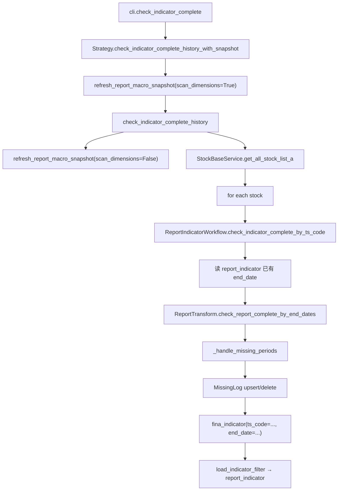

# SDD · 财务指标完整性校验

> **CLI 命令：** `report check-indicator-complete`  
> **交互菜单：** —（Typer 子命令；合入 `report check-report-complete`）  
> **源码入口：** [`src/etl/cli.py`](../../src/etl/cli.py)

---

## 1. 概述

对全 A 股逐只股票检查 `financial_report_indicator` 表的**季度报告期是否齐全**（微观查漏补拉）。执行顺序：刷新宏观快照 → 逐股检查补拉 → 再刷新宏观快照。

### 与财报三表完整性校验的关系

| 对比项 | 三表完整性校验 | 财务指标完整性校验 |
|--------|---------------|-------------------|
| 表 | 三张表各跑一轮 | 一张表跑一轮 |
| missing_entity | `financial_report_income` / `financial_report_balance` / `financial_report_cashflow` | `financial_report_indicator` |
| 补拉接口 | `ts.income` / `ts.balancesheet` / `ts.cashflow` | `ts.fina_indicator`（非 VIP，需传 `ts_code`） |
| 其余逻辑 | 完全相同 | 完全相同 |

### 触发方式

```bash
uv run ./src/etl/cli.py report check-indicator-complete
```

### 前置依赖

| 依赖 | 说明 |
|------|------|
| `stock_list` | A 股列表与 `list_date` |
| `financial_report_indicator` | 已有期判断 |
| `TUSHARE_API_KEY` | 补拉调用 `fina_indicator`（非 VIP） |

### CLI 参数

无。

---

## 2. CLI 入口

| 项 | 值 |
|----|-----|
| 处理函数 | `check_indicator_complete()` |
| 菜单 key | `report-check-indicator-complete` |

```python
ReportIndicatorStrategy().check_indicator_complete_history_with_snapshot()
```

---

## 3. 分层架构

```
CLI → ReportIndicatorStrategy.check_indicator_complete_history_with_snapshot
  ├─ refresh_report_macro_snapshot（前置）
  ├─ check_indicator_complete_history
  │    └─ for each stock in stock_list:
  │         └─ ReportIndicatorWorkflow.check_indicator_complete_by_ts_code
  │              ├─ 读已有 end_date
  │              ├─ ReportTransform.check_report_complete_by_end_dates → missing_periods
  │              └─ _handle_missing_periods → fina_indicator(ts_code=, end_date=)
  └─ refresh_report_macro_snapshot（后置）
```

---

## 4. 完整调用流程图



---

## 5. 逐步说明

### Phase 0 · CLI

| 步骤 | 处理 |
|------|------|
| 0.1 | 实例化 `ReportIndicatorStrategy` |
| 0.2 | 调用 `check_indicator_complete_history_with_snapshot()`：前置宏观快照 → 逐股检查 → 后置宏观快照 |

### Phase 1 · Strategy

| 步骤 | 处理 |
|------|------|
| 1.1 | `stock_base_service.get_all_stock_list_a()` 取 A 股列表 |
| 1.2 | 单股起点 `max("20050101", list_date)`，终点今日 |
| 1.3 | 调用 `ReportIndicatorWorkflow.check_indicator_complete_by_ts_code(...)` |
| 1.4 | tqdm 进度条 + `format_micro_stock_postfix` |

### Phase 2 · Workflow 单股

| 步骤 | 处理 |
|------|------|
| 2.1 | 读 `financial_report_indicator` 该股已有 `end_date` 列表 |
| 2.2 | `check_report_complete_by_end_dates` 算缺期 |
| 2.3 | `_handle_missing_periods`：写 log → 逐期 `fina_indicator(ts_code=..., end_date=period)` 补拉 → 入库 → 更新 log |

### Phase 3 · 补拉 ETL

| 层 | 函数 | 说明 |
|----|------|------|
| Extract | `TushareReportClient.pull_by_code('indicator', ts_code, end_date=...)` | 调用 `ts.fina_indicator`（非 VIP） |
| Transform | `report_transform_merge_now` | 去重合并 |
| Transform | `report_more_detail_to_json(ReportIndicatorEntities, df)` | 非显式列打 JSONB |
| Load | `load_indicator_filter(entity, df, scope_end_date=end_date)` | 先查再改再插 |

---

## 6. 数据与外部依赖

### 数据库表

| 表 | 读/写 | 用途 |
|----|-------|------|
| `stock_list` | 读 | A 股列表 |
| `financial_report_indicator` | 读 + 写 | 已有期 / 补拉入库 |
| `log_missing` | 写 | 缺期登记 |
| `financial_report_period_count` | 读 + 写 | 宏观快照 |

### Tushare API

| API | 限流 | 用途 |
|-----|------|------|
| `ts.fina_indicator(ts_code=..., end_date=...)` | 400/min | 微观补拉 |

### log_missing 字段语义

| 字段 | 说明 |
|------|------|
| `ts_code` | 股票代码 |
| `missing_entity` | `financial_report_indicator` |
| `missing_date` | 缺失报告期 end_date |
| `try_count` | 尝试次数 |

冲突键：`(ts_code, missing_entity, missing_date)`。

---

## 7. 业务规则

### 7.1 完整性定义

对每只股票，在 `[max(20050101, list_date), 今日]` 内：
1. 生成所有季度末报告期（0331 / 0630 / 0930 / 1231）
2. 与 `financial_report_indicator` 中该股已有 `end_date` 比较
3. 差集 → 缺期 → 补拉

### 7.2 日期边界

- 全局最早检查起点：`20050101`（硬编码，与三表一致）
- 单股起点：`max("20050101", list_date)`
- 终点：今日 `YYYYMMDD`

---

## 8. 日志与可观测性

| 机制 | 说明 |
|------|------|
| tqdm | Strategy 层按股票数展示 |
| log_missing | 缺期登记与补拉结果 |

---

## 9. 已知限制

| 项 | 说明 |
|----|------|
| 非 VIP 补拉 | `fina_indicator` 需传 `ts_code`，逐股逐期调用，受限流约束 |
| 独立于三表 | 有 income 缺期不影响 indicator 判定 |

---

## 10. 相关命令

| 命令 | 关系 |
|------|------|
| `report indicator-history-init` | 全量历史入库，建议先跑 |
| `report check-report-complete` | 三表完整性校验 |
| `stock pull-list-a` | 提供 stock_list 基础数据 |

---

## 附录 · Call Stack

```
cli.check_indicator_complete()
└─ ReportIndicatorStrategy.check_indicator_complete_history_with_snapshot()
   ├─ refresh_report_macro_snapshot(scan_dimensions=True)
   ├─ check_indicator_complete_history()
   │  └─ for each stock:
   │     └─ ReportIndicatorWorkflow.check_indicator_complete_by_ts_code(ts_code, ...)
   │        ├─ 读 report_indicator 已有 end_date
   │        ├─ ReportTransform.check_report_complete_by_end_dates → missing_periods
   │        └─ _handle_missing_periods(ts_code, missing_periods)
   │           ├─ MissingLog.upsert_missing_logs(initial)
   │           ├─ for period in missing_periods:
   │           │  └─ ReportIndicatorWorkflow.indicator_by_ts_code(ts_code, period)
   │           │     ├─ fina_indicator(ts_code=..., end_date=period)
   │           │     ├─ merge_now → to_json
   │           │     └─ load_indicator_filter(scope_end_date=period)
   │           ├─ if succeeded: MissingLog.delete_missing_logs
   │           └─ if failed:    MissingLog.upsert_missing_logs (try_count++)
   └─ refresh_report_macro_snapshot(scan_dimensions=False)
```
