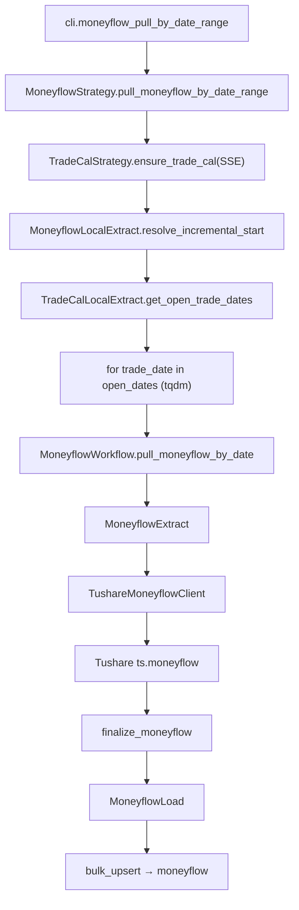
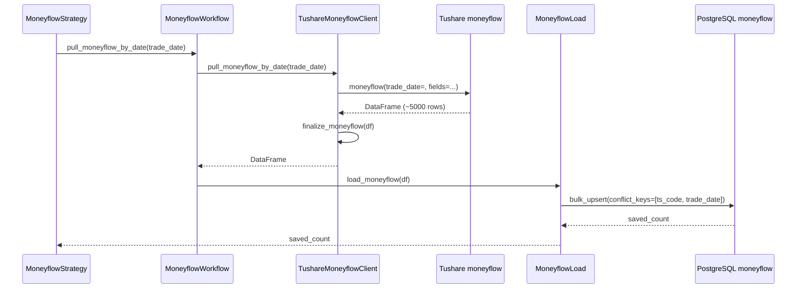

# SDD · 个股资金流向

> **CLI 命令：** `moneyflow pull-by-date-range`
> **交互菜单：** 【资金流】个股资金流向 by date 区间增量 (moneyflow pull-by-date-range)
> **源码入口：** `src/etl/cli.py`
> **Tushare 接口：** [`moneyflow`](https://tushare.pro/document/2?doc_id=170)

---

## 1. 概述

按交易日历开市日，逐日调用 Tushare `moneyflow` 拉取**全市场**个股资金流向（大/中/小单买入卖出），upsert 到 PostgreSQL `market_moneyflow` 表。为多因子模型提供主力资金净流入（NetBuy）、聪明钱因子、散户方向等情绪类因子。

> Tushare `moneyflow` 单次最大返回 6000 条；按 `trade_date` 拉取全市场（~5000 股），单日一次可拉完。积分要求 2000+。

### 触发方式

```bash
uv run ./src/etl/cli.py moneyflow pull-by-date-range
uv run ./src/etl/cli.py moneyflow pull-by-date-range --start-date 20150101 --end-date 20251231
uv run ./src/etl/cli.py
```

### 前置依赖

| 依赖 | 说明 |
|------|------|
| `TUSHARE_API_KEY` | Tushare Pro 鉴权（需 2000+ 积分） |
| `MONEYFLOW_START_DATE` | 未传 `--start-date` 时的 floor（`.env`，推荐 `20100101`） |
| `stock_trade_calendar`（SSE） | 区间内开市日来源 |
| PostgreSQL | 目标库连接 |

### CLI 参数

| 选项 | 默认 | 说明 |
|------|------|------|
| `--start-date` | `MONEYFLOW_START_DATE` | 区间起点 YYYYMMDD |
| `--end-date` | 今日 | 区间终点 YYYYMMDD |

---

## 2. CLI 入口

| 项 | 值 |
|----|-----|
| Typer 子命令组 | `market_moneyflow`（新增） |
| 命令名 | `pull-by-date-range` |
| 处理函数 | `moneyflow_pull_by_date_range()` |
| 菜单 key | `moneyflow-pull-by-date-range` |
| 菜单 label | `【资金流】个股资金流向 by date 区间增量 (moneyflow pull-by-date-range)` |

```python
moneyflow_strategy = typer.Typer()
app.add_typer(moneyflow_strategy, name="moneyflow", help="资金流向 ETL commands")

@moneyflow_strategy.command("pull-by-date-range")
def moneyflow_pull_by_date_range(
    start_date: str | None = typer.Option(None, "--start-date", help="起始日 YYYYMMDD"),
    end_date: str | None = typer.Option(None, "--end-date", help="结束日 YYYYMMDD"),
) -> None:
    """按交易日历开市日逐日拉取 Tushare moneyflow 并 upsert。"""
    total = MoneyflowStrategy().pull_moneyflow_by_date_range(start_date=start_date, end_date=end_date)
    typer.echo(f"资金流向累计写入 {total} 条")
```

---

## 3. 分层架构

```
CLI (cli.py)
  └─ MoneyflowStrategy.pull_moneyflow_by_date_range(start, end)
       ├─ TradeCalStrategy.ensure_trade_cal(SSE)
       ├─ MoneyflowLocalExtract.resolve_incremental_start()
       ├─ TradeCalLocalExtract.get_open_trade_dates(SSE,...)
       └─ for trade_date in open_dates:
            └─ MoneyflowWorkflow.pull_moneyflow_by_date(trade_date)
                 ├─ MoneyflowExtract → TushareMoneyflowClient → ts.moneyflow(trade_date=)
                 └─ MoneyflowLoad → bulk_upsert_postgresql → moneyflow
```

**新增源码：**

| 路径 | 角色 |
|------|------|
| `src/etl/cli.py` | 新增 `market_moneyflow` 子命令组与菜单项 |
| `src/etl/strategy/moneyflow/moneyflow_strategy.py` | 区间编排 |
| `src/etl/workflow/moneyflow/moneyflow_workflow.py` | 单日 Extract→Load |
| `src/etl/extract/moneyflow_extract.py` | 调用 Client |
| `src/etl/extract/local/moneyflow/moneyflow_local_extract.py` | 增量起点解析 |
| `src/etl/client/moneyflow/tushare.py` | Client，限流 500/min |
| `src/etl/client/moneyflow/common.py` | COLUMNS + finalize |
| `src/etl/load/moneyflow/moneyflow_load.py` | upsert |
| `src/entities/data_entities/moneyflow_entities.py` | ORM |

---

## 4. 完整调用流程图

### 4.1 模块调用链



### 4.2 时序图（单日）



---

## 5. 逐步说明

| 步骤 | 位置 | 输入 | 处理 | 输出 |
|------|------|------|------|------|
| 1 | CLI | `--start-date` / `--end-date` | 实例化 Strategy | echo 总条数 |
| 2 | Strategy | floor / end | 缺省 → return 0 | — |
| 3 | Strategy | floor / end | ensure_trade_cal(SSE) | 日历兜底 |
| 4 | Strategy | floor / end | `CompletenessEngine.backfill_keys(floor, end)`（threshold=0.92） | `pending`；空 → return 0 |
| 5 | Strategy | pending | tqdm 逐日调 Workflow | saved_count |
| 7 | Workflow | trade_date | Extract → Load | saved_count |
| 8 | Client | trade_date | ts.moneyflow(trade_date=) → finalize | DataFrame |
| 9 | Load | DataFrame | bulk_upsert_postgresql | upsert 条数 |

---

## 6. 数据与外部依赖

### 6.1 Tushare API

| 项 | 值 |
|----|-----|
| 接口 | `market_moneyflow` |
| Client | `src/etl/client/moneyflow/tushare.py` |
| 限流 | 500/min（`create_rate_limiter(500)`） |
| 单次限量 | 6000 条 |

**接口输入参数：**

| 名称 | 类型 | 必选 | 说明 |
|------|------|------|------|
| ts_code | str | N | 股票代码（本任务不用） |
| trade_date | str | N | 交易日期（**本任务按日遍历**） |
| start_date | str | N | 开始日期 |
| end_date | str | N | 结束日期 |

**接口输出字段（全部入库）：**

| 名称 | 类型 | 说明 |
|------|------|------|
| ts_code | str | TS 股票代码 |
| trade_date | str | 交易日期 |
| buy_sm_vol | float | 小单买入量（手） |
| buy_sm_amount | float | 小单买入金额（万元） |
| sell_sm_vol | float | 小单卖出量 |
| sell_sm_amount | float | 小单卖出金额 |
| buy_md_vol | float | 中单买入量 |
| buy_md_amount | float | 中单买入金额 |
| sell_md_vol | float | 中单卖出量 |
| sell_md_amount | float | 中单卖出金额 |
| buy_lg_vol | float | 大单买入量 |
| buy_lg_amount | float | 大单买入金额 |
| sell_lg_vol | float | 大单卖出量 |
| sell_lg_amount | float | 大单卖出金额 |
| buy_elg_vol | float | 特大单买入量 |
| buy_elg_amount | float | 特大单买入金额 |
| sell_elg_vol | float | 特大单卖出量 |
| sell_elg_amount | float | 特大单卖出金额 |
| net_mf_vol | float | 净流入量 |
| net_mf_amount | float | 净流入金额（万元） |

### 6.2 数据库

| 项 | 值 |
|----|-----|
| 表名 | `market_moneyflow` |
| ORM | `MoneyflowEntities` |
| 冲突键 | `(ts_code, trade_date)` |
| Upsert | `bulk_upsert_postgresql(..., conflict_keys=[ts_code, trade_date], fallback_on_error=True)` |

**ORM 字段：**

| 列 | 类型 | 说明 |
|----|------|------|
| `id` | Integer PK autoincrement | — |
| `ts_code` | String(20) | TS 代码 |
| `trade_date` | String(8) | 交易日期 |
| `buy_sm_vol` | Float | 小单买入量 |
| `buy_sm_amount` | Float | 小单买入金额 |
| `sell_sm_vol` | Float | 小单卖出量 |
| `sell_sm_amount` | Float | 小单卖出金额 |
| `buy_md_vol` | Float | 中单买入量 |
| `buy_md_amount` | Float | 中单买入金额 |
| `sell_md_vol` | Float | 中单卖出量 |
| `sell_md_amount` | Float | 中单卖出金额 |
| `buy_lg_vol` | Float | 大单买入量 |
| `buy_lg_amount` | Float | 大单买入金额 |
| `sell_lg_vol` | Float | 大单卖出量 |
| `sell_lg_amount` | Float | 大单卖出金额 |
| `buy_elg_vol` | Float | 特大单买入量 |
| `buy_elg_amount` | Float | 特大单买入金额 |
| `sell_elg_vol` | Float | 特大单卖出量 |
| `sell_elg_amount` | Float | 特大单卖出金额 |
| `net_mf_vol` | Float | 净流入量 |
| `net_mf_amount` | Float | 净流入金额 |

**索引：**

| 索引名 | 列 | 唯一 |
|--------|----|------|
| `idx_moneyflow_unique` | `(ts_code, trade_date)` | UNIQUE |
| `idx_moneyflow_trade_date` | `(trade_date)` | — |

### 6.3 finalize_moneyflow 规则

| 列 | 规则 |
|----|------|
| `ts_code` | `str.strip()` |
| `trade_date` | `_normalize_ymd` → 8 位 |
| 数值列 | NaN → None |

---

## 7. 业务规则

1. **按日全市场拉取：** `moneyflow(trade_date=td)` 获取当日全市场 ~5000 条。
2. **仅开市日遍历：** 通过 `stock_trade_calendar` SSE 开市日过滤。
3. **增量语义：** `eff_start = max(MONEYFLOW_START_DATE, 库内 max(trade_date)+1)`。
4. **Upsert 幂等：** `(ts_code, trade_date)` 联合唯一。
5. **空集容忍：** 单日返回空 saved=0，继续下一日。

---

## 8. 日志与可观测性

| 机制 | 说明 |
|------|------|
| typer.echo | `资金流向累计写入 {total} 条` |
| tqdm | `资金流向入库`，单位「日」，postfix `saved/total/trade_date` |

---

## 9. 已知限制与实现备注

| 项 | 说明 |
|----|------|
| 积分要求 | 需 2000+ 积分 |
| 不做 Transform | 直接入库原始数据 |
| 不做 period_count | 首期不含完整性快照 |

---

## 10. 相关命令

| 命令 | 关系 |
|------|------|
| `trade-cal pull-history` | **前置**：提供 SSE 开市日 |
| `daily-basic pull-by-date-range` | 同模式 by-date |
| `kline pull-daily-by-date-range` | 提供成交额 `amount`，资金流因子可归一化 |

---

## 附录 · Call Stack

```
cli.moneyflow_pull_by_date_range()
└─ MoneyflowStrategy.pull_moneyflow_by_date_range(start_date, end_date)
   ├─ TradeCalStrategy.ensure_trade_cal(start, end, exchange="SSE")
   ├─ MoneyflowLocalExtract.resolve_incremental_start(configured_start=floor)
   ├─ TradeCalLocalExtract.get_open_trade_dates(start=eff_start, end=end, exchange="SSE")
   └─ for trade_date in open_dates:
      └─ MoneyflowWorkflow.pull_moneyflow_by_date(trade_date)
         ├─ MoneyflowExtract → TushareMoneyflowClient
         │  └─ ts.moneyflow(trade_date=trade_date, fields=MONEYFLOW_COLUMNS)
         │  └─ finalize_moneyflow(df)
         └─ MoneyflowLoad.load_moneyflow(df)
            └─ bulk_upsert_postgresql(MoneyflowEntities, conflict_keys=['ts_code','trade_date'])
```

## 附录 · 环境变量新增项

| 变量 | 默认 | 用途 | 推荐 .env |
|------|------|------|-----------|
| `MONEYFLOW_START_DATE` | `""` | 增量起点；空则 no-op | `20100101` |
