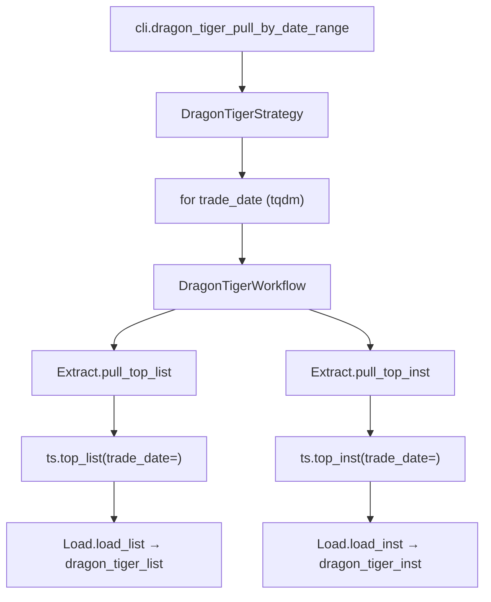

# SDD · 龙虎榜

> **CLI 命令：** `dragon-tiger pull-by-date-range`
> **交互菜单：** 【龙虎榜】龙虎榜数据 by date 区间增量 (dragon-tiger pull-by-date-range)
> **源码入口：** `src/etl/cli.py`
> **Tushare 接口：** [`top_list`](https://tushare.pro/document/2?doc_id=106) + [`top_inst`](https://tushare.pro/document/2?doc_id=107)

---

## 1. 概述

按交易日历开市日，逐日调用 Tushare `top_list`（龙虎榜每日交易明细）和 `top_inst`（机构席位明细），分别 upsert 到 PostgreSQL `market_dragon_tiger_list` 和 `market_dragon_tiger_inst` 两张表。为多因子模型提供龙虎榜净买入、机构席位买入、上榜频次等事件型因子。

> `top_list` 单次最大 10000 条，`top_inst` 同理。仅上榜个股有数据（非全市场），数据历史 2005 年至今。积分要求 2000+。

### 触发方式

```bash
uv run ./src/etl/cli.py dragon-tiger pull-by-date-range
uv run ./src/etl/cli.py dragon-tiger pull-by-date-range --start-date 20150101
uv run ./src/etl/cli.py
```

### 前置依赖

| 依赖 | 说明 |
|------|------|
| `TUSHARE_API_KEY` | 需 2000+ 积分 |
| `DRAGON_TIGER_START_DATE` | floor（`.env`，推荐 `20100101`） |
| `stock_trade_calendar`（SSE） | 开市日来源 |

### CLI 参数

| 选项 | 默认 | 说明 |
|------|------|------|
| `--start-date` | `DRAGON_TIGER_START_DATE` | 区间起点 YYYYMMDD |
| `--end-date` | 今日 | 区间终点 YYYYMMDD |

---

## 2. CLI 入口

| 项 | 值 |
|----|-----|
| Typer 子命令组 | `dragon-tiger`（新增） |
| 命令名 | `pull-by-date-range` |
| 处理函数 | `dragon_tiger_pull_by_date_range()` |
| 菜单 key | `dragon-tiger-pull-by-date-range` |
| 菜单 label | `【龙虎榜】龙虎榜数据 by date 区间增量 (dragon-tiger pull-by-date-range)` |

```python
dragon_tiger_strategy = typer.Typer()
app.add_typer(dragon_tiger_strategy, name="dragon-tiger", help="龙虎榜 ETL commands")

@dragon_tiger_strategy.command("pull-by-date-range")
def dragon_tiger_pull_by_date_range(
    start_date: str | None = typer.Option(None, "--start-date"),
    end_date: str | None = typer.Option(None, "--end-date"),
) -> None:
    """按交易日历开市日逐日拉取 Tushare top_list + top_inst 并 upsert。"""
    total_list, total_inst = DragonTigerStrategy().pull_dragon_tiger_by_date_range(
        start_date=start_date, end_date=end_date
    )
    typer.echo(f"龙虎榜 list 写入 {total_list} 条，inst 写入 {total_inst} 条")
```

---

## 3. 分层架构

```
CLI → DragonTigerStrategy.pull_dragon_tiger_by_date_range(start, end)
       ├─ TradeCalStrategy.ensure_trade_cal(SSE)
       ├─ DragonTigerLocalExtract.resolve_incremental_start()
       ├─ TradeCalLocalExtract.get_open_trade_dates(SSE,...)
       └─ for trade_date in open_dates:
            └─ DragonTigerWorkflow.pull_dragon_tiger_by_date(trade_date)
                 ├─ DragonTigerExtract.pull_top_list(trade_date) → top_list
                 │    └─ DragonTigerLoad.load_list → dragon_tiger_list
                 └─ DragonTigerExtract.pull_top_inst(trade_date) → top_inst
                      └─ DragonTigerLoad.load_inst → dragon_tiger_inst
```

**新增源码：** `src/etl/{strategy,workflow,extract,load,client}/dragon_tiger/` + 两张 entity 文件

---

## 4. 完整调用流程图

### 4.1 模块调用链



---

## 5. 逐步说明

| 步骤 | 位置 | 输入 | 处理 | 输出 |
|------|------|------|------|------|
| 1 | CLI | `--start-date` / `--end-date` | 实例化 Strategy | echo 两张表总条数 |
| 2 | Strategy | floor / end | ensure_trade_cal + `CompletenessEngine.backfill_keys(floor, end)` | `pending` 开市日；空 → return 0 |
| 3 | Strategy | pending | tqdm 逐日调 Workflow | (list_count, inst_count) |
| 4 | Workflow | trade_date | 分别拉 top_list 和 top_inst | 两份 saved_count |
| 5 | Client | trade_date | ts.top_list / ts.top_inst → finalize | DataFrame |
| 6 | Load | DataFrame | bulk_upsert_postgresql | upsert 条数 |

---

## 6. 数据与外部依赖

### 6.1 Tushare API — top_list

| 项 | 值 |
|----|-----|
| 接口 | `top_list` |
| 限流 | 200/min |
| 单次限量 | 10000 条 |

**输入参数：**

| 名称 | 类型 | 必选 | 说明 |
|------|------|------|------|
| trade_date | str | Y | 交易日期（**按日遍历**） |
| ts_code | str | N | 股票代码（不用） |

**输出字段：**

| 名称 | 类型 | 说明 |
|------|------|------|
| trade_date | str | 交易日期 |
| ts_code | str | TS 代码 |
| name | str | 名称 |
| close | float | 收盘价 |
| pct_change | float | 涨跌幅 |
| turnover_rate | float | 换手率 |
| amount | float | 总成交额 |
| l_sell | float | 龙虎榜卖出额 |
| l_buy | float | 龙虎榜买入额 |
| l_amount | float | 龙虎榜成交额 |
| net_amount | float | 龙虎榜净买入额 |
| net_rate | float | 龙虎榜净买额占比 |
| amount_rate | float | 龙虎榜成交额占比 |
| float_value | float | 流通市值 |
| reason | str | 上榜原因 |

### 6.2 Tushare API — top_inst

| 项 | 值 |
|----|-----|
| 接口 | `top_inst` |
| 限流 | 200/min |

**输入参数：**

| 名称 | 类型 | 必选 | 说明 |
|------|------|------|------|
| trade_date | str | Y | 交易日期 |
| ts_code | str | N | 股票代码（不用） |

**输出字段：**

| 名称 | 类型 | 说明 |
|------|------|------|
| trade_date | str | 交易日期 |
| ts_code | str | TS 代码 |
| exalter | str | 营业部名称 |
| side | str | 买入/卖出方向（0=买入，1=卖出） |
| buy | float | 买入额 |
| sell | float | 卖出额 |
| net_buy | float | 净买入额 |

### 6.3 数据库 — dragon_tiger_list

| 项 | 值 |
|----|-----|
| 表名 | `market_dragon_tiger_list` |
| ORM | `DragonTigerListEntities` |
| 冲突键 | `(ts_code, trade_date)` |

**ORM 字段：**

| 列 | 类型 | 说明 |
|----|------|------|
| `id` | Integer PK | — |
| `ts_code` | String(20) | TS 代码 |
| `trade_date` | String(8) | 交易日期 |
| `name` | String(40) | 名称 |
| `close` | Float | 收盘价 |
| `pct_change` | Float | 涨跌幅 |
| `turnover_rate` | Float | 换手率 |
| `amount` | Float | 总成交额 |
| `l_sell` | Float | 卖出额 |
| `l_buy` | Float | 买入额 |
| `l_amount` | Float | 成交额 |
| `net_amount` | Float | 净买入额 |
| `net_rate` | Float | 净买额占比 |
| `amount_rate` | Float | 成交额占比 |
| `float_value` | Float | 流通市值 |
| `reason` | String(200) | 上榜原因 |

**索引：** `idx_dt_list_unique(ts_code, trade_date)` UNIQUE + `idx_dt_list_trade_date(trade_date)`

### 6.4 数据库 — dragon_tiger_inst

| 项 | 值 |
|----|-----|
| 表名 | `market_dragon_tiger_inst` |
| ORM | `DragonTigerInstEntities` |
| 冲突键 | `(ts_code, trade_date, exalter, side)` |

**ORM 字段：**

| 列 | 类型 | 说明 |
|----|------|------|
| `id` | Integer PK | — |
| `ts_code` | String(20) | TS 代码 |
| `trade_date` | String(8) | 交易日期 |
| `exalter` | String(200) | 营业部名称 |
| `side` | String(2) | 方向（0=买入，1=卖出） |
| `buy` | Float | 买入额 |
| `sell` | Float | 卖出额 |
| `net_buy` | Float | 净买入额 |

**索引：** `idx_dt_inst_unique(ts_code, trade_date, exalter, side)` UNIQUE + `idx_dt_inst_trade_date(trade_date)`

### 6.5 finalize 规则

| 列 | 规则 |
|----|------|
| `ts_code` | `str.strip()` |
| `trade_date` | `_normalize_ymd` → 8 位 |
| `reason` / `exalter` | NaN → `""`（避免 NULL 在冲突键中导致 upsert 失效） |
| `side` | `str.strip()` |
| 数值列 | NaN → None |

---

## 7. 业务规则

1. **两张表一次拉：** 每个 trade_date 分别调 `top_list` 和 `top_inst`，写入两张表。
2. **仅上榜个股：** 非全市场数据，每日上榜个股数量有限。
3. **增量语义：** `eff_start = max(DRAGON_TIGER_START_DATE, 库内 max(trade_date)+1)`。
4. **Upsert 幂等：** list 表 `(ts_code, trade_date)` 唯一；inst 表 `(ts_code, trade_date, exalter, side)` 唯一。
5. **不做完整性校验：** 事件型数据，无"应有"全集。
6. **`exalter` 与 `side` 在冲突键中：** `exalter` 为营业部名称（字符串），`side` 为方向；两者均非空，但 `exalter` 可能含特殊字符，需 strip。

---

## 8. 日志与可观测性

| 机制 | 说明 |
|------|------|
| typer.echo | `龙虎榜 list 写入 N 条，inst 写入 M 条` |
| tqdm | `龙虎榜入库`，单位「日」，postfix `list/inst/trade_date` |

---

## 9. 已知限制与实现备注

| 项 | 说明 |
|----|------|
| 仅上榜个股 | 非全市场，每日上榜数量不定 |
| 历史深度 | 2005 年至今 |
| `reason` 字段 | 上榜原因文本，可能含特殊字符 |
| 两张表 | 一个命令写两张表，返回值为 tuple |

---

## 10. 相关命令

| 命令 | 关系 |
|------|------|
| `trade-cal pull-history` | **前置**：提供 SSE 开市日 |
| `block-trade pull-by-date-range` | 同为事件型数据，互补 |

---

## 附录 · Call Stack

```
cli.dragon_tiger_pull_by_date_range()
└─ DragonTigerStrategy.pull_dragon_tiger_by_date_range(start_date, end_date)
   ├─ TradeCalStrategy.ensure_trade_cal(start, end, exchange="SSE")
   ├─ DragonTigerLocalExtract.resolve_incremental_start(configured_start=floor)
   ├─ TradeCalLocalExtract.get_open_trade_dates(start=eff_start, end=end, exchange="SSE")
   └─ for trade_date in open_dates:
      └─ DragonTigerWorkflow.pull_dragon_tiger_by_date(trade_date)
         ├─ DragonTigerExtract.pull_top_list(trade_date)
         │  └─ ts.top_list(trade_date=trade_date, fields=...) → finalize
         │  └─ DragonTigerLoad.load_list(df)
         │     └─ bulk_upsert(DragonTigerListEntities, conflict_keys=['ts_code','trade_date'])
         └─ DragonTigerExtract.pull_top_inst(trade_date)
            └─ ts.top_inst(trade_date=trade_date, fields=...) → finalize
            └─ DragonTigerLoad.load_inst(df)
               └─ bulk_upsert(DragonTigerInstEntities, conflict_keys=['ts_code','trade_date','exalter','side'])
```

## 附录 · 环境变量新增项

| 变量 | 默认 | 用途 | 推荐 .env |
|------|------|------|-----------|
| `DRAGON_TIGER_START_DATE` | `""` | 增量起点；空则 no-op | `20100101` |
