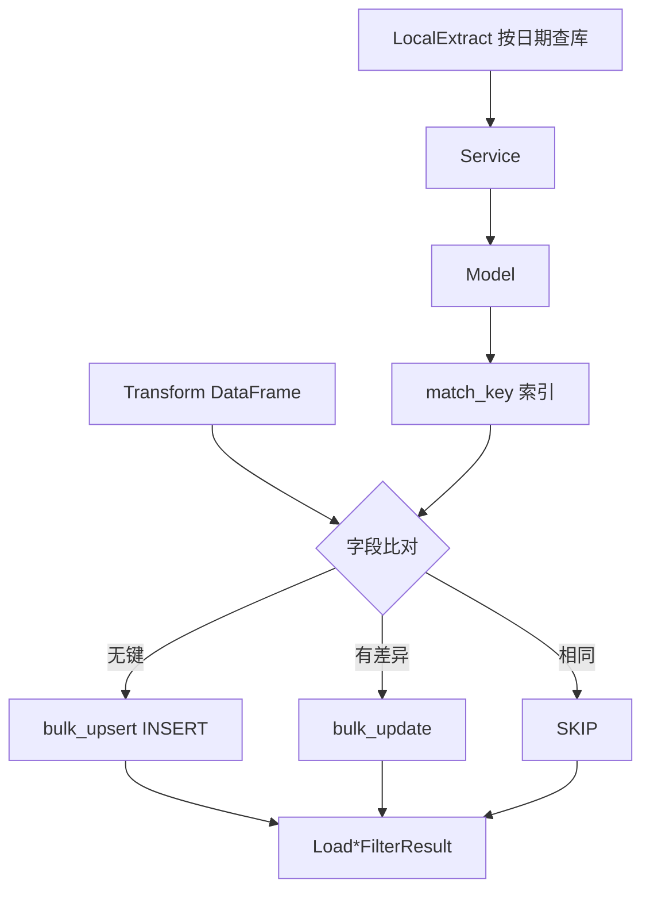

# SDD · 存储-先查再改再插

> **模式代号：** `load-*-filter`  
> **财报入口：** [`ReportLoad.load_report_filter`](../../src/etl/load/financial/report_load.py)  
> **日 K 入口：** [`KlineLoad.load_kline_daily_filter`](../../src/etl/load/kline/kline_load.py)  
> **查库链路：** LocalExtract → Service → Model（Load 不直接 `Database.get_all`）

---

## 1. 概述

在批量入库前，**先按日期范围键查库**，将待写入行与库内已有行按**业务唯一键**对齐并做字段级比对：

| 比对结果 | 动作 |
|----------|------|
| 库中无对应行 | **INSERT**（`bulk_upsert_postgresql`） |
| 有对应行且字段有差异 | **UPDATE**（`bulk_update` by `id`） |
| 有对应行且业务字段一致 | **SKIP**（不写库） |

相对 [`load_report`](../../src/etl/load/financial/report_load.py) / [`load_kline_daily`](../../src/etl/load/kline/kline_load.py) 的全量 upsert，本模式在**数据未变化**时避免无意义 UPDATE（财报重复期约 **11×** Load 加速，见 benchmark）。

### 与直接 upsert 的关系

| 项 | `load_report` / `load_kline_daily` | `load_*_filter` |
|----|-----------------------------------|-----------------|
| 查库 | 否 | 是，经 LocalExtract → Service → Model |
| 无变化行 | 仍 ON CONFLICT UPDATE / DO NOTHING | 内存比对后 SKIP |
| 适用 | 快照表、`financial_report_period_count`、按股多日 K 线区间 | 三表 `by_period` / `by_ts_code`；`pull_kline_daily_by_date` |

---

## 2. API 与接入

### 2.1 财报 `load_report_filter`

```python
load_report_filter(
    entities: Type[Any],
    df: pd.DataFrame,
    *,
    scope_end_date: str,
    local_report_extract: LocalReportExtract,
    match_keys: Sequence[str] | None = None,
    verbose: bool = False,
) -> LoadReportFilterResult
```

**Workflow 接入（均已切换）：**

- `ReportWorkflow.report_by_period(report_type, period)`（历史按期入库）
- `ReportWorkflow.report_by_ts_code(report_type, ts_code, end_date)`（按个股+期补拉）

> 旧的 `report_*_by_period` / `report_*_by_ts_code` 已合并为按 `report_type` 分派的两条统一入口（见 `_REPORT_SPECS`）。

### 2.2 日 K `load_kline_daily_filter`

```python
load_kline_daily_filter(
    df: pd.DataFrame,
    *,
    scope_trade_date: str,
    local_kline_extract: KlineLocalExtract,
    match_keys: Sequence[str] = ("ts_code", "trade_date"),
    verbose: bool = False,
) -> LoadKlineDailyFilterResult
```

**Workflow 接入：** `pull_kline_daily_by_date`（`pull-daily-by-date-range` 循环内）。

**未接入：** `_pull_kline_daily_range`、`check-daily-complete`（仍 `load_kline_daily`）。

### 2.3 查库（LocalExtract → Service → Model）

| 域 | LocalExtract | Service | Model |
|----|--------------|---------|-------|
| 财报 | `get_report_rows_by_end_date(report_type, end_date)` | `ReportService.list_by_end_date` | `Report*Model.list_by_end_date` |
| 日 K | `get_kline_daily_by_trade_date(trade_date)` | `KlineDailyService.list_kline_daily_by_trade_date` | `KlineDailyModel.list_by_trade_date` |

---

## 3. 分层与流程



---

## 4. 业务规则（财报）

### 4.1 范围键

| 规则 | 说明 |
|------|------|
| 范围字段 | `end_date`（报告期 YYYYMMDD） |
| 参数 | `scope_end_date` |
| 校验 | incoming 行 `end_date != scope_end_date` 计入 skip |

### 4.2 行级匹配键（三表相同）

```text
ts_code + end_date + f_ann_date + report_type + update_flag
```

与 `idx_report_*_upsert_key` 一致；`DEFAULT_REPORT_MATCH_KEYS` 定义于 [`report_load.py`](../../src/etl/load/financial/report_load.py)。

### 4.3 比对与写入

- 比对：全列除 `id`；JSONB 字段 `json.dumps(sort_keys=True)`；浮点 `math.isclose`
- INSERT：`bulk_upsert_postgresql(conflict_keys=match_keys)`
- UPDATE：`bulk_update`（含 `id`）

---

## 5. 业务规则（日 K）

| 项 | 值 |
|----|-----|
| 范围键 | `trade_date` → `scope_trade_date` |
| 匹配键 | `ts_code` + `trade_date` |
| 比对 | 全列除 `id`（无 JSONB） |

---

## 6. 返回值

`LoadReportFilterResult` / `LoadKlineDailyFilterResult`：

| 字段 | 含义 |
|------|------|
| `inserted` | 新增 |
| `updated` | 更新 |
| `skipped` | 一致跳过 |
| `total_written` | `inserted + updated`（Workflow `saved_count`） |

---

## 7. 已知限制

| 项 | 说明 |
|----|------|
| 内存 | 单日/单期全量载入内存建索引 |
| 并发 | 同日期多进程写可能竞态 |
| 删除 | 源端撤回不会自动删库内行 |
| 首跑 | INSERT 路径与 upsert 耗时接近；收益在重复跑 |

---

## 8. 验证

```bash
uv run python scripts/bench_report_cashflow_load.py
```

---

## 附录 · Call Stack（财报）

```
ReportWorkflow.report_by_period(report_type, period)
├─ ReportExtract.pull(report_type, period=period)
│   └─ TushareReportClient.pull → ts.{income,balancesheet,cashflow}_vip
├─ ReportTransform.{filter_report_by_delist, report_transform_merge_now, report_more_detail_to_json}
└─ ReportLoad.load_report_filter(spec.entity, df, scope_end_date=period, local_report_extract=...)
   └─ LocalReportExtract.get_report_rows_by_end_date(report_type, end_date)
        └─ ReportService.list_by_end_date → Report*Model.list_by_end_date
```

按个股补拉 `ReportWorkflow.report_by_ts_code(report_type, ts_code, end_date)` 仅把 Extract 换成 `ReportExtract.pull_by_code(report_type, ts_code, end_date=end_date)`，其余链路相同。

## 附录 · Call Stack（日 K by_date）

```
pull_kline_daily_by_date(trade_date)
├─ KlineExtract.pull_kline_daily_by_date
└─ KlineLoad.load_kline_daily_filter(..., scope_trade_date=trade_date, local_kline_extract=...)
   └─ KlineLocalExtract.get_kline_daily_by_trade_date
        └─ KlineDailyService.list_kline_daily_by_trade_date → KlineDailyModel.list_by_trade_date
```
