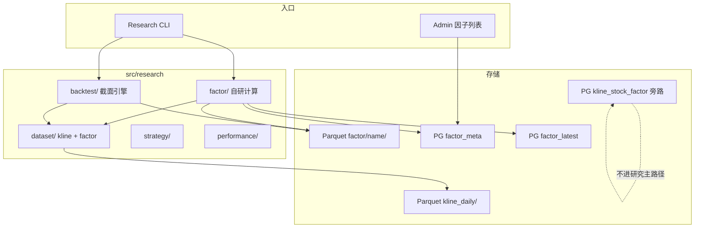

# Quantus 量化研究 · SDD 规格文档

本目录存放 **量化研究域的运行规格**（Software Design Document），覆盖因子计算、多源统一、回测引擎、策略与绩效评估。

## 与其他 spec 的分工

| 文档 | 定位 |
|------|------|
| [`spec/etl/`](../etl/README.md) | CLI / ETL：数据拉取、完整性、PG → Parquet |
| [`spec/api/`](../api/README.md) | HTTP API |
| `spec/quant/*.sdd.md` | 量化研究：因子框架、多源读取、回测、绩效 |

## 文档索引

| 文档 | CLI / 入口 | 说明 | 状态 |
|------|------------|------|------|
| [因子框架-起步.sdd.md](./因子框架-起步.sdd.md) | `research factor compute / list` | BaseFactor + Registry + Parquet | Phase 1 · 基本落地 |
| [因子热层与CLI.sdd.md](./因子热层与CLI.sdd.md) | `factor update-all / sync-pg` | `factor_latest` 宽表 + Research CLI | Phase 1 · 已落地（热层仅自研） |
| [Tushare技术因子入库.sdd.md](./Tushare技术因子入库.sdd.md) | `tushare-factor pull-by-date-range` | 93 因子 → Parquet 长表 | Phase 1 · 已落地 |
| [Admin-因子管理.sdd.md](./Admin-因子管理.sdd.md) | Admin `/quant/factor-list` | 因子元数据只读列表 | 已落地 |
| [多源因子统一与读取层.sdd.md](./多源因子统一与读取层.sdd.md) | `FactorDataset` + `sync-pg` 扩展 | 权威源定界、热层含 tushare、OHLC 后复权 | **Phase 1.5 · 已实现** |
| [截面回测.sdd.md](./截面回测.sdd.md) | `backtest run` | 自研截面引擎、IC/分组净值 | **Phase 2 · 已实现** |
| [国泰191因子.sdd.md](./国泰191因子.sdd.md) | `gtja191 compute` / SSE `gtja191_compute` | 190 可算 Alpha → Parquet；Alpha30 仅 meta | **Phase 3 · 已实现** |
| [国泰191-并行计算.sdd.md](./国泰191-并行计算.sdd.md) | 同上 + `--workers` / `GTJA191_WORKERS` | 月内多进程分片 + 算子向量化 | **已实现** |
| [Admin-回测.sdd.md](./Admin-回测.sdd.md) | Admin `/quant/backtest` · `/quant/factor-combo` | 单因子/多因子组合截面回测（SSE）+ 详情增强 | **已实现** |
| [Admin-投研分析.sdd.md](./Admin-投研分析.sdd.md) | Admin `/research/*` | 因子截面 / 个股K线 / 回测明细 / 行情快照 | **已实现** |

数据对照：[`docs/国泰191-数据需求与ETL对照.md`](../../docs/国泰191-数据需求与ETL对照.md)。

## 总体方案

详见 [`docs/量化层完整方案.md`](../../docs/量化层完整方案.md)（2026-07-09 修订）。

| Phase | 内容 | SDD |
|-------|------|-----|
| 1 | 因子框架起步 | [因子框架-起步](./因子框架-起步.sdd.md) 等 |
| **1.5** | **多源统一 + FactorDataset** | [多源因子统一与读取层](./多源因子统一与读取层.sdd.md) |
| 2 | 截面回测 | [截面回测](./截面回测.sdd.md) |
| 3 | 国泰 191 | [国泰191因子](./国泰191因子.sdd.md) · **已实现** |
| 4 | 多因子 + 财报因子 | 待起草 |
| 5 | 事件驱动 | 待起草 |
| 6+ | 分钟线 / Admin 可视化 | 待起草 |

## 公共架构

## 环境依赖

| 变量 | 用途 |
|------|------|
| `WAREHOUSE_ROOT` | Parquet 根；因子在 `{root}/factor/` |
| `POSTGRESQL_*` | `factor_meta` / `factor_latest` |

配置：[`src/common/setting.py`](../../src/common/setting.py)

## 技术栈

| 组件 | 选型 | 用途 |
|------|------|------|
| 因子计算 | Polars LazyFrame | 窗口 + 表达式 |
| 因子权威存储 | Parquet 长表 | `ts_code, trade_date, value` |
| 跨源查询 | DuckDB | 校验 / 可选 join |
| 回测主框架 | **自研截面引擎** | 不用 qlib / backtrader / VectorBT |
| 复权 | 后复权 hfq | `*_adj = raw * adj_factor` |
| 统计 | statsmodels + numpy | IC / 回归（Phase 2+） |
