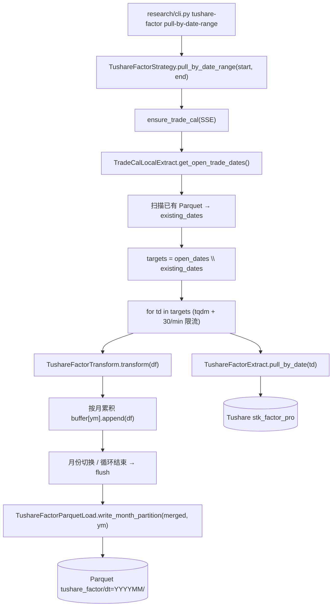

# SDD · 量化 · Tushare 技术面因子入库

> **状态：** 起草中
> **接口：** Tushare `stk_factor_pro`（股票技术面因子专业版）
> **限流：** 30 次/分钟
> **CLI：** `uv run ./src/research/cli.py tushare-factor pull-by-date-range`
> **存储：** Parquet 宽表 `data/warehouse/tushare_factor/dt=YYYYMM/`（不过 PG）

---

## 1. 概述

从 Tushare `stk_factor_pro` 接口按交易日拉取全市场技术面因子，按月落 Parquet 宽表。不经 PG 中转——Parquet 是唯一真理源，最近 60 天可同步到 `factor_latest` PG 热层。

### 数据规模

- 单日：~5500 股 × 93 因子列 ≈ 50 万数值
- 单月：~22 交易日 × 5500 股 = ~12 万行
- 全历史（2005-2026）：~250 月 × 12 万行 ≈ 3000 万行

### 与现有模块关系

| 维度 | 日 K ETL（Tushare → PG） | 本模块（Tushare → Parquet） |
|------|------------------------|--------------------------|
| 数据源 | Tushare `daily` / `adj_factor` | Tushare `stk_factor_pro` |
| 目标 | PG `kline_daily` | Parquet `tushare_factor/dt=YYYYMM/` |
| 按什么拉 | trade_date（逐日全市场） | trade_date（逐日全市场） |
| 限流 | 500/min | **30/min** |
| 完整性 | 95% 阈值 | 95% 阈值（复用同一套） |

---

## 2. 字段映射

### 2.1 接口返回 261 列，我们保留 93 列

| 类型 | 说明 | 数量 | 处理 |
|------|------|------|------|
| OHLCV + adj_factor | open/high/low/close/pre_close/change/pct_chg/vol/amount/adj_factor | 10 | **丢弃**（已在 kline_daily） |
| OHLCV 后复权 | open_hfq/high_hfq/low_hfq/close_hfq | 4 | **丢弃**（可从 kline_daily 算出） |
| 所有 _bfq（不复权） | asi_bfq, atr_bfq, ... | 74 | **丢弃** |
| 所有 _qfq（前复权） | asi_qfq, atr_qfq, ... | 78 | **丢弃** |
| **无后缀因子** | turnover_rate, pe, pb, ... | **19** | **保留** |
| **_hfq 后复权因子** | asi_hfq, atr_hfq, ... | **74** | **保留，去 _hfq 后缀** |

### 2.2 无后缀因子（19 个）— 基本面 + 量价 + 统计

| Tushare 字段 | 本地字段 | 说明 |
|-------------|---------|------|
| turnover_rate | turnover_rate | 换手率（%） |
| turnover_rate_f | turnover_rate_f | 换手率（自由流通股） |
| volume_ratio | volume_ratio | 量比 |
| pe | pe | 市盈率 |
| pe_ttm | pe_ttm | 市盈率（TTM） |
| pb | pb | 市净率 |
| ps | ps | 市销率 |
| ps_ttm | ps_ttm | 市销率（TTM） |
| dv_ratio | dv_ratio | 股息率（%） |
| dv_ttm | dv_ttm | 股息率（TTM）（%） |
| total_share | total_share | 总股本（万股） |
| float_share | float_share | 流通股本（万股） |
| free_share | free_share | 自由流通股本（万） |
| total_mv | total_mv | 总市值（万元） |
| circ_mv | circ_mv | 流通市值（万元） |
| downdays | down_streak | 连跌天数 |
| updays | up_streak | 连涨天数 |
| lowdays | low_period | 当前最低价是近多少周期最低 |
| topdays | high_period | 当前最高价是近多少周期最高 |

### 2.3 _hfq 后复权因子（74 个）— 技术指标

| Tushare 字段 | 本地字段 | 说明 |
|-------------|---------|------|
| asi_hfq | asi | 振动升降指标 |
| asit_hfq | asit | 振动升降指标（累计） |
| atr_hfq | atr | 真实波动 N 日均值 (N=20) |
| bbi_hfq | bbi | BBI 多空指标 |
| bias1_hfq / bias2_hfq / bias3_hfq | bias1 / bias2 / bias3 | BIAS 乖离率 (L=6/12/24) |
| boll_lower_hfq / boll_mid_hfq / boll_upper_hfq | boll_lower / boll_mid / boll_upper | 布林带 (N=20, P=2) |
| brar_ar_hfq / brar_br_hfq | brar_ar / brar_br | BRAR 情绪指标 |
| cci_hfq | cci | 顺势指标 (N=14) |
| cr_hfq | cr | CR 价格动量 (N=20) |
| dfma_dif_hfq / dfma_difma_hfq | dfma_dif / dfma_difma | 平行线差指标 |
| dmi_adx_hfq / dmi_adxr_hfq / dmi_mdi_hfq / dmi_pdi_hfq | dmi_adx / dmi_adxr / dmi_mdi / dmi_pdi | DMI 动向指标 |
| dpo_hfq / madpo_hfq | dpo / madpo | 区间震荡线 |
| ema_hfq_5/10/20/30/60/90/250 | ema_5 / ema_10 / ema_20 / ema_30 / ema_60 / ema_90 / ema_250 | 指数移动平均 |
| emv_hfq / maemv_hfq | emv / maemv | 简易波动指标 |
| expma_12_hfq / expma_50_hfq | expma_12 / expma_50 | EMA 指数平均数 |
| kdj_hfq / kdj_d_hfq / kdj_k_hfq | kdj / kdj_d / kdj_k | KDJ 指标 |
| ktn_down_hfq / ktn_mid_hfq / ktn_upper_hfq | ktn_down / ktn_mid / ktn_upper | 肯特纳通道 |
| ma_hfq_5/10/20/30/60/90/250 | ma_5 / ma_10 / ma_20 / ma_30 / ma_60 / ma_90 / ma_250 | 简单移动平均 |
| macd_hfq / macd_dea_hfq / macd_dif_hfq | macd / macd_dea / macd_dif | MACD 指标 |
| mass_hfq / ma_mass_hfq | mass / ma_mass | 梅斯线 |
| mfi_hfq | mfi | MFI 资金流量 |
| mtm_hfq / mtmma_hfq | mtm / mtmma | 动量指标 |
| obv_hfq | obv | 能量潮 |
| psy_hfq / psyma_hfq | psy / psyma | 心理线 |
| roc_hfq / maroc_hfq | roc / maroc | 变动率 |
| rsi_hfq_6/12/24 | rsi_6 / rsi_12 / rsi_24 | RSI 指标 |
| taq_down_hfq / taq_mid_hfq / taq_up_hfq | taq_down / taq_mid / taq_up | 唐安奇通道（海龟） |
| trix_hfq / trma_hfq | trix / trma | 三重指数平滑 |
| vr_hfq | vr | VR 容量比率 |
| wr_hfq / wr1_hfq | wr / wr1 | 威廉指标 |
| xsii_td1_hfq / xsii_td2_hfq / xsii_td3_hfq / xsii_td4_hfq | xsii_td1 / xsii_td2 / xsii_td3 / xsii_td4 | 薛斯通道 |

---

## 3. 分层架构

```
CLI (tushare-factor pull-by-date-range)
  └─ TushareFactorStrategy.pull_by_date_range(start, end)
       ├─ ensure_trade_cal(SSE)
       ├─ open_dates = TradeCalLocalExtract.get_open_trade_dates(start, end)
       ├─ 扫描已有 Parquet → 已落 trade_date 集合
       ├─ targets = open_dates \ existing（增量）
       └─ for trade_date in targets (tqdm, 30/min 限流):
            ├─ df = TushareFactorExtract.pull_by_date(trade_date)
            ├─ df = TushareFactorTransform.transform(df)   # 列筛选 + 重命名
            ├─ 按月累积到 buffer[year_month]
            └─ 月份切换时 → TushareFactorParquetLoad.write_month_partition(buffer)
```

**不走 Workflow 层**：单次 API 返回完整 DataFrame（全市场一日），不需要单股编排。Strategy 直接调 Extract → Transform → 累积 → Load。

---

## 4. 完整调用流程图



---

## 5. Parquet 存储

### 5.1 路径

```
{WAREHOUSE_ROOT}/tushare_factor/dt=YYYYMM/part-{uuid}.parquet
```

Hive 分区，与日 K / 自研因子同规范。

### 5.2 Schema

| 列 | 类型 | 说明 |
|----|------|------|
| ts_code | string (dict) | 股票代码 |
| trade_date | string | YYYYMMDD |
| turnover_rate | float64 | 换手率 |
| pe_ttm | float64 | 市盈率 TTM |
| ... | float64 | （共 93 个因子列） |

排序：`(trade_date, ts_code)`。压缩：zstd level 3。

### 5.3 单日存储量

~5500 行 × 95 列 × 8 字节 ≈ 4MB（未压缩），zstd 后 ~1MB。
单月 ~22 日 ≈ 22MB（未压缩），zstd 后 ~6MB。

---

## 6. 增量与完整性

### 6.1 增量判定

从已有 Parquet 中读取所有 trade_date（DuckDB 或 Polars scan），与 SSE 开市日做差集，只拉缺失的日期。

### 6.2 95% 守门

复用现有 `StockTransform.trade_date_stock_count` 逻辑：
- `expected(trade_date) = 该日在市股数`
- `actual = API 返回行数`
- `actual >= 0.95 × expected` → 该日合格

不合格的日期跳过（可能是 Tushare 数据延迟），下次重跑补上。

### 6.3 当月处理

参照 warehouse 日 K dump：当月每次跑时覆盖重写（Parquet 整月 overwrite），保证最新数据。

---

## 7. CLI 入口

在 `research/cli.py` 新增子命令组 `tushare-factor`：

```bash
# 增量拉取（默认从 KLINE_DAILY_START_DATE 开始）
uv run ./src/research/cli.py tushare-factor pull-by-date-range \
    [--start-date YYYYMMDD] [--end-date YYYYMMDD]

# 查看已落月份统计
uv run ./src/research/cli.py tushare-factor check
```

菜单新增：

```
【因子】Tushare技术因子 by date 区间增量 (tushare-factor pull-by-date-range)
```

---

## 8. 与 factor_latest PG 热层的集成

Tushare 因子入 Parquet 后，可以通过 `FactorSyncService` 同步到 PG 热层。但 Tushare 因子是 **宽表**（93 列），而自研因子是 **长表**（每因子一个 Parquet 目录）。

集成方式：`FactorSyncService.sync_to_pg` 扩展——除了读自研因子的各目录外，还读 `tushare_factor/` 宽表，合并后 upsert 到 `factor_latest`。动态建列机制不变。

---

## 9. 文件清单

```
新增：
  src/etl/client/factor/tushare_factor_client.py      # Tushare stk_factor_pro 封装
  src/etl/extract/factor/tushare_factor_extract.py     # 按日期拉取
  src/etl/transform/factor/tushare_factor_transform.py # 列筛选 + _hfq 重命名
  src/etl/load/factor/tushare_factor_parquet_load.py   # 按月 Parquet 写入
  src/etl/strategy/factor/tushare_factor_strategy.py   # 区间编排 + 限流 + 增量

修改：
  src/entities/client_entities/tushare_entities.py     # +stk_factor_pro 字段列表
  src/research/cli.py                                  # +tushare-factor 子命令组
  src/research/factor/sync.py                          # +读 tushare_factor Parquet
```

---

## 10. 限流与耗时估算

| 场景 | 交易日数 | 耗时（30/min） |
|------|---------|---------------|
| 单月增量 | ~22 日 | < 1 分钟 |
| 单年回填 | ~250 日 | ~9 分钟 |
| 全量历史 2005-2026 | ~5250 日 | ~3 小时 |

---

## 11. 验收

1. `uv run ./src/research/cli.py tushare-factor pull-by-date-range --start-date 20260601 --end-date 20260605` 跑通
2. `ls data/warehouse/tushare_factor/` 看到 `dt=202606/`
3. DuckDB 验证：

```python
import duckdb
duckdb.sql("""
    SELECT trade_date, COUNT(*) AS rows, 
           ROUND(AVG(pe_ttm), 2) AS avg_pe,
           ROUND(AVG(macd), 4) AS avg_macd
    FROM read_parquet('data/warehouse/tushare_factor/**/*.parquet', hive_partitioning=1)
    GROUP BY trade_date ORDER BY trade_date DESC LIMIT 5
""").show()
```

4. `factor sync-pg` 后 PG `factor_latest` 出现 Tushare 因子列
