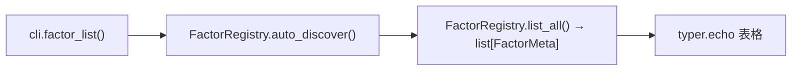

# SDD · 量化 · 因子框架起步

> **状态：** 起草中
> **模式：** 新增 `src/research/` 顶层域 + ETL `factor` 子命令组
> **CLI：** `quantus-etl factor compute / compute-all / list`
> **依赖新增：** `polars`（因子计算 + LazyFrame）
> **源码：** `src/research/{factor,dataset}/` + `src/etl/strategy/factor/` + `src/entities/data_entities/factor_meta_entities.py`
> **前置方案：** [`docs/量化层完整方案.md`](../../docs/量化层完整方案.md) Phase 1

---

## 1. 概述

建立因子计算框架：定义因子（`BaseFactor`）→ 注册因子（`FactorRegistry`）→ 批量计算（读日 K Parquet → Polars 计算 → 写因子 Parquet）→ CLI 触发。

这是量化层的第一个可运行闭环，验证「Parquet → Polars → Parquet」的计算链路。后续回测、选股、多因子合成都基于这一层的因子值输出。

**与现有模块关系**：

| 维度 | 现有 warehouse（PG → Parquet） | 本模块 factor（Parquet → Polars → Parquet） |
|------|-------------------------------|------------------------------------------|
| 数据源 | PG `kline_daily` | Parquet `data/warehouse/kline_daily/` |
| 目标 | Parquet `kline_daily/dt=YYYYMM/` | Parquet `factor/{name}/dt=YYYYMM/` |
| 计算引擎 | pyarrow（列裁剪 + 类型 cast） | **Polars LazyFrame**（窗口函数 + 表达式） |
| 幂等 | 整月分区 overwrite | 整月分区 overwrite |
| CLI | `warehouse pull-kline-daily-by-month-range` | `factor compute --name <name>` |

### 前置依赖

| 依赖 | 说明 |
|------|------|
| 日 K Parquet 仓库 | `warehouse pull-kline-daily-by-month-range` 至少跑过一轮，`data/warehouse/kline_daily/dt=YYYYMM/` 有分区 |
| `polars` | 新增依赖，`pyproject.toml` 添加 `polars>=1.0` |
| PostgreSQL | 因子元数据表 `factor_meta`（可选，首版可不入库仅注册表内存态） |

### 触发方式

```bash
# 计算指定因子（增量：跳过已有分区）
uv run ./src/etl/cli.py factor compute --name momentum_20d [--start-month YYYYMM] [--end-month YYYYMM]

# 强制重算（覆盖已有分区）
uv run ./src/etl/cli.py factor compute --name momentum_20d --force

# 计算注册表中所有因子
uv run ./src/etl/cli.py factor compute-all [--start-month YYYYMM] [--end-month YYYYMM]

# 列出已注册因子
uv run ./src/etl/cli.py factor list
```

---

## 2. CLI 入口

| 命令 | 处理函数 | 菜单 key |
|------|----------|----------|
| `factor compute --name <name>` | `factor_compute()` → `FactorComputeStrategy.compute_factor(name, ...)` | `factor-compute`（菜单项带交互输入 factor_name） |
| `factor compute-all` | `factor_compute_all()` → `FactorComputeStrategy.compute_all_factors(...)` | `factor-compute-all` |
| `factor list` | `factor_list()` → `FactorRegistry.list_all()` → typer.echo 表格 | `factor-list` |

Typer 注册参照 `warehouse_strategy`：

```python
factor_strategy = typer.Typer()
app.add_typer(factor_strategy, name="factor", help="因子计算 commands")
```

交互菜单新增：

```
【因子】计算指定因子 (factor compute)
【因子】计算全部因子 (factor compute-all)
【因子】列出已注册因子 (factor list)
```

### CLI 参数

| 参数 | 命令 | 类型 | 默认 | 说明 |
|------|------|------|------|------|
| `--name` | compute | str | 必填 | 因子名（如 `momentum_20d`） |
| `--start-month` | compute / compute-all | str (YYYYMM) | 日 K Parquet 最早月 | 计算起始月 |
| `--end-month` | compute / compute-all | str (YYYYMM) | 当月 | 计算截止月 |
| `--force` | compute / compute-all | bool | False | 强制重算已有分区 |

---

## 3. 分层架构

```
CLI (factor compute --name momentum_20d)
  └─ FactorComputeStrategy.compute_factor(name, start, end, force)
       ├─ FactorRegistry.get(name) → BaseFactor 实例
       ├─ 扫描已有因子分区 → 确定 targets（增量月份列表）
       └─ for ym in targets:
            └─ FactorComputeWorkflow.compute_month(factor, ym)
                 ├─ KlineDataset.read_month_with_window(ym, window) → Polars LazyFrame
                 ├─ factor.compute(lf) → LazyFrame(ts_code, trade_date, value)
                 ├─ 裁剪到当月 trade_date → pa.Table
                 └─ FactorParquetLoad.write_month_partition(table, factor_name, ym)
```

**不新建 ETL 四层（Extract/Transform/Load）子域**：因子计算的"读"来自已有 Parquet，"写"复用 `ParquetLoad`，"算"是 Polars 表达式——不是传统 ETL 的 API 拉取→清洗→入库模式。改为 `research/` 域下的 Strategy + Workflow + Dataset 三层。

ETL CLI 里只注册子命令入口，实际逻辑在 `src/research/` 域。

---

## 4. 完整调用流程图

### 4.1 compute 路径

```mermaid
flowchart TD
    CLI["cli.factor_compute(name, start_month, end_month, force)"]
    Strat["FactorComputeStrategy.compute_factor()"]
    Reg["FactorRegistry.get(name) → BaseFactor"]
    Scan["扫描已有因子 Parquet 分区"]
    Targets["targets = 日K已有月 ∩ [start, end] \\ 因子已有月"]
    Loop["for ym in targets (tqdm)"]
    WF["FactorComputeWorkflow.compute_month(factor, ym)"]
    Read["KlineDataset.read_month_with_window(ym, window)"]
    Compute["factor.compute(lf) → LazyFrame(ts_code, trade_date, value)"]
    Trim["过滤 trade_date 属于当月"]
    ToArrow["lf.collect() → Polars DF → pa.Table"]
    Write["FactorParquetLoad.write_month_partition(table, name, ym)"]
    PQ_IN[(Parquet kline_daily/dt=YYYYMM)]
    PQ_OUT[(Parquet factor/{name}/dt=YYYYMM)]

    CLI --> Strat
    Strat --> Reg
    Strat --> Scan
    Strat --> Targets
    Strat --> Loop
    Loop --> WF
    WF --> Read --> PQ_IN
    WF --> Compute
    WF --> Trim
    WF --> ToArrow
    WF --> Write --> PQ_OUT
```

### 4.2 list 路径



---

## 5. 逐步说明

### 5.1 BaseFactor 接口

```python
# src/research/factor/base.py

from abc import ABC, abstractmethod
from dataclasses import dataclass, field
import polars as pl


@dataclass(frozen=True)
class FactorMeta:
    name: str                         # 'momentum_20d' — 全局唯一
    display_name: str                 # '20日动量'
    category: str                     # 'price_volume' / 'fundamental' / 'event'
    frequency: str                    # 'daily' / 'weekly' / 'monthly'
    dependencies: tuple[str, ...]     # ('kline_daily',) — 输入数据集名
    params: dict = field(default_factory=dict)  # {"window": 20}
    version: int = 1

    @property
    def window_size(self) -> int:
        """因子需要的回溯窗口天数（用于读数据时向前扩展）。"""
        return self.params.get("window", 0)


class BaseFactor(ABC):
    @abstractmethod
    def meta(self) -> FactorMeta:
        """返回因子元数据。"""

    @abstractmethod
    def compute(self, lf: pl.LazyFrame) -> pl.LazyFrame:
        """
        纯计算，不管 IO。
        
        输入 lf 列：ts_code, trade_date, open, high, low, close, vol, amount,
                    adj_factor, up_limit, down_limit, close_adj (后复权收盘价)
        输出 lf 列：ts_code, trade_date, value
        
        调用方负责：
        - 读取足够窗口的数据（当月 + 前 window_size 个交易日）
        - 只保留当月 trade_date 的行（裁剪窗口期数据）
        - 写入 Parquet
        """
```

### 5.2 示例因子：20 日动量

```python
# src/research/factor/price_volume/momentum.py

class Momentum20d(BaseFactor):
    def meta(self) -> FactorMeta:
        return FactorMeta(
            name="momentum_20d",
            display_name="20日动量",
            category="price_volume",
            frequency="daily",
            dependencies=("kline_daily",),
            params={"window": 20},
        )

    def compute(self, lf: pl.LazyFrame) -> pl.LazyFrame:
        return (
            lf.sort("ts_code", "trade_date")
            .with_columns(
                (pl.col("close_adj") / pl.col("close_adj").shift(20).over("ts_code") - 1)
                .alias("value")
            )
            .select("ts_code", "trade_date", "value")
            .drop_nulls("value")
        )
```

### 5.3 FactorRegistry

```python
# src/research/factor/registry.py

class FactorRegistry:
    _factors: dict[str, BaseFactor] = {}

    @classmethod
    def register(cls, factor: BaseFactor) -> None:
        meta = factor.meta()
        if meta.name in cls._factors:
            existing = cls._factors[meta.name].meta()
            if existing.version >= meta.version:
                return
        cls._factors[meta.name] = factor

    @classmethod
    def get(cls, name: str) -> BaseFactor:
        if name not in cls._factors:
            raise KeyError(f"因子 '{name}' 未注册。已注册: {list(cls._factors.keys())}")
        return cls._factors[name]

    @classmethod
    def list_all(cls) -> list[FactorMeta]:
        return sorted([f.meta() for f in cls._factors.values()], key=lambda m: m.name)

    @classmethod
    def auto_discover(cls) -> None:
        """
        扫描 research/factor/ 下所有子模块，
        找到 BaseFactor 子类并实例化注册。
        
        机制：importlib 递归导入 research.factor.price_volume / fundamental / event，
        收集所有非抽象 BaseFactor 子类，实例化后 register。
        """
```

### 5.4 KlineDataset（因子计算专用读取）

```python
# src/research/dataset/kline.py

class KlineDataset:
    """从日 K Parquet 仓库读取数据，返回 Polars LazyFrame。"""

    def __init__(self, warehouse_root: str | None = None):
        self._root = Path(warehouse_root or settings.warehouse_root)
        self._kline_dir = self._root / "kline_daily"

    def list_available_months(self) -> list[str]:
        """扫描 dt=YYYYMM 目录，返回可用月份列表（升序）。"""

    def read_month(self, year_month: str) -> pl.LazyFrame:
        """读单月 Parquet，返回 LazyFrame。"""

    def read_months(self, months: list[str]) -> pl.LazyFrame:
        """读多月 Parquet（glob），返回合并 LazyFrame。"""

    def read_month_with_window(self, year_month: str, window_days: int) -> pl.LazyFrame:
        """
        读当月 + 前 N 个交易日的数据（用于窗口因子）。
        
        策略：window_days 对应约 N/21 个自然月（向上取整），
        从 year_month 向前多读若干月份的 Parquet。
        
        返回的 LazyFrame 增加 close_adj 列 = close * adj_factor。
        """
```

### 5.5 FactorParquetLoad

```python
# src/research/factor/load.py

class FactorParquetLoad:
    """因子值 Parquet 写入 — 复用 ParquetLoad 基础设施。"""

    def __init__(self, warehouse_root: str | None = None):
        self._loader = ParquetLoad()
        self._root = Path(warehouse_root or settings.warehouse_root)

    def factor_dir(self, factor_name: str) -> Path:
        return self._root / "factor" / factor_name

    def partition_dir(self, factor_name: str, year_month: str) -> Path:
        return self.factor_dir(factor_name) / f"dt={year_month}"

    def write_month_partition(self, table: pa.Table, factor_name: str, year_month: str) -> int:
        partition_rel = f"factor/{factor_name}/dt={year_month}"
        self._loader.remove_partition(self._root, partition_rel)
        file_path = self.partition_dir(factor_name, year_month) / f"part-{uuid.uuid4().hex}.parquet"
        return self._loader.write_table(table, file_path)

    def list_existing_months(self, factor_name: str) -> list[str]:
        """扫描该因子已有分区月份。"""
```

### 5.6 FactorComputeWorkflow

```python
# src/research/factor/workflow.py

class FactorComputeWorkflow:
    """单月因子计算：读数据 → 调 compute → 裁剪 → 写 Parquet。"""

    def __init__(self):
        self._dataset = KlineDataset()
        self._load = FactorParquetLoad()

    def compute_month(self, factor: BaseFactor, year_month: str) -> int:
        meta = factor.meta()

        # 1. 读当月 + 窗口数据
        lf = self._dataset.read_month_with_window(year_month, meta.window_size)

        # 2. 计算因子
        result_lf = factor.compute(lf)

        # 3. 裁剪到当月（去掉窗口期数据）
        ym_start = year_month + "01"
        ym_end = year_month + "31"  # trade_date 是 YYYYMMDD 字符串，"31" 足够
        result_lf = result_lf.filter(
            (pl.col("trade_date") >= ym_start) & (pl.col("trade_date") <= ym_end)
        )

        # 4. collect + 排序
        df = result_lf.sort("trade_date", "ts_code").collect()
        if df.is_empty():
            return 0

        # 5. → Arrow Table → 写 Parquet
        table = df.to_arrow()
        return self._load.write_month_partition(table, meta.name, year_month)
```

### 5.7 FactorComputeStrategy

```python
# src/etl/strategy/factor/factor_compute_strategy.py

class FactorComputeStrategy:
    """因子计算编排：解析月份、增量判定、逐月调 Workflow。"""

    def __init__(self):
        self._workflow = FactorComputeWorkflow()
        self._load = FactorParquetLoad()
        self._dataset = KlineDataset()

    def compute_factor(
        self,
        name: str,
        start_month: str | None = None,
        end_month: str | None = None,
        force: bool = False,
    ) -> int:
        FactorRegistry.auto_discover()
        factor = FactorRegistry.get(name)

        # 确定可计算月份 = 日 K 已有月 ∩ [start, end]
        kline_months = set(self._dataset.list_available_months())
        all_months = sorted(kline_months)  # 先用日 K 覆盖范围
        if start_month:
            all_months = [m for m in all_months if m >= start_month]
        if end_month:
            all_months = [m for m in all_months if m <= end_month]

        # 增量：跳过已有因子分区（force=True 时不跳过）
        if not force:
            existing = set(self._load.list_existing_months(factor.meta().name))
            all_months = [m for m in all_months if m not in existing]

        if not all_months:
            typer.echo(f"因子 {name}：无需计算（已全部覆盖或无可用日K数据）")
            return 0

        total = 0
        for ym in tqdm_iter(all_months, desc=f"计算因子 {name}"):
            rows = self._workflow.compute_month(factor, ym)
            total += rows

        return total

    def compute_all_factors(
        self,
        start_month: str | None = None,
        end_month: str | None = None,
        force: bool = False,
    ) -> int:
        FactorRegistry.auto_discover()
        total = 0
        for meta in FactorRegistry.list_all():
            rows = self.compute_factor(meta.name, start_month, end_month, force)
            total += rows
        return total
```

---

## 6. 数据与外部依赖

### 6.1 读

| 数据 | 路径 | 格式 | 用途 |
|------|------|------|------|
| 日 K 仓库 | `{WAREHOUSE_ROOT}/kline_daily/dt=YYYYMM/*.parquet` | Hive 分区 Parquet | 因子计算输入 |

### 6.2 写

| 数据 | 路径 | 格式 | 用途 |
|------|------|------|------|
| 因子值 | `{WAREHOUSE_ROOT}/factor/{factor_name}/dt=YYYYMM/*.parquet` | Hive 分区 Parquet | 因子计算输出 |

### 6.3 PG 表（可选，首版可不实现）

#### `factor_meta`（因子元数据）

```sql
CREATE TABLE factor_meta (
    id            SERIAL PRIMARY KEY,
    factor_name   VARCHAR(100) NOT NULL UNIQUE,
    display_name  VARCHAR(100),
    category      VARCHAR(50) NOT NULL,
    frequency     VARCHAR(20) NOT NULL,
    dependencies  VARCHAR(200),
    description   TEXT,
    params        JSONB,
    version       INTEGER DEFAULT 1,
    created_at    TIMESTAMP DEFAULT NOW(),
    updated_at    TIMESTAMP DEFAULT NOW()
);
CREATE UNIQUE INDEX idx_factor_meta_name ON factor_meta(factor_name);
```

SQLAlchemy 实体 `src/entities/data_entities/factor_meta_entities.py`：首版暂不实现入库，因子元数据由 `FactorRegistry` 内存态管理。

### 6.4 外部 API

**不调用**。因子计算纯本地：读 Parquet → Polars 计算 → 写 Parquet。

### 6.5 新增 env

无。因子分区路径复用 `WAREHOUSE_ROOT`（默认 `./data/warehouse`）。

### 6.6 新增依赖

| 包 | 版本 | 用途 |
|----|------|------|
| `polars` | `>=1.0` | 因子计算 LazyFrame + 表达式引擎 |

`pyarrow` / `duckdb` 已有，不新增。

---

## 7. 业务规则

### 7.1 因子值 Parquet Schema

| 列 | Arrow 类型 | 说明 |
|----|-----------|------|
| ts_code | string (dictionary) | 股票代码 |
| trade_date | string | YYYYMMDD |
| value | float64 | 因子值（可 null：如停牌日无因子） |

排序：`(trade_date, ts_code)`，与日 K 一致。

压缩：zstd level 3，ts_code dictionary encoding（复用 `ParquetLoad` 默认参数）。

### 7.2 分区规范

```
{WAREHOUSE_ROOT}/factor/{factor_name}/dt=YYYYMM/part-{uuid}.parquet
```

- 按 `factor_name` 一级目录隔离：重算一个因子不影响其他因子
- Hive 分区 `dt=YYYYMM`：与日 K 分区同规范，DuckDB `read_parquet(glob, hive_partitioning=1)` 直接可用
- 单文件每分区：幂等覆盖（先删目录后写）

### 7.3 窗口因子的数据读取

窗口因子（如 20 日动量）需要前 N 个交易日的数据。策略：

```
需要读取的月份 = [ym - ceil(window_days / 21), ..., ym]
```

- 以 21 个交易日 ≈ 1 个月估算，20 日窗口 → 多读前 1 个月
- 如果前月 Parquet 不存在（如最早月份），该月开头的 trade_date 算出的因子值为 null → `drop_nulls` 后自然缺失
- compute 返回后，Workflow 裁剪到当月 trade_date，丢弃窗口期多余行

### 7.4 后复权价

`KlineDataset.read_month_with_window` 在返回的 LazyFrame 中增加列：

```python
close_adj = close * adj_factor
```

因子 compute 应使用 `close_adj` 而非 `close`，避免除权缺口导致虚假信号。

### 7.5 增量逻辑

| 场景 | 行为 |
|------|------|
| 因子分区已存在 + `force=False` | 跳过 |
| 因子分区已存在 + `force=True` | 删旧分区 → 重算 → 写新 |
| 日 K 分区不存在 | 跳过（因子无法计算） |
| 窗口期跨月、前月日 K 不存在 | 当月前 N 日因子为 null → 写入缺少部分行 |

### 7.6 因子命名约定

```
{category}_{descriptor}_{params}
```

示例：`momentum_20d`、`volatility_60d`、`turnover_ratio_5d`、`roe_ttm`

类名：`Momentum20d`、`Volatility60d`

---

## 8. 日志与可观测性

| 机制 | 说明 |
|------|------|
| tqdm 进度条 | Strategy 层按月份展示，desc 含因子名 |
| CLI echo | `factor list` 打印表格（name / display_name / category / frequency / window） |
| 返回值 | Strategy 返回累计写入行数 |
| 无 log_missing | 因子计算无"缺失"概念——日 K 有即可算，无则跳过 |

`factor compute` 完成后打印：

```
因子 momentum_20d：计算完成，覆盖 N 个月，共 M 行
```

`factor list` 输出格式：

```
已注册因子 (N 个)：
  名称                类别           频率     窗口    版本
  momentum_20d        price_volume   daily    20      1
  volatility_60d      price_volume   daily    60      1
```

---

## 9. 已知限制与实现备注

| 项 | 说明 |
|----|------|
| 首版仅量价因子 | 财报因子需 forward-fill（report_period → trade_date 的 as-of join），留 Phase 3 |
| 单进程串行 | 月间无依赖可改并行；首版串行，避免 Polars 内部并行与外部多线程冲突 |
| 无 API / Admin 入口 | 只能 CLI 触发；未来 Admin 因子库页面 + SSE 触发计算 |
| factor_meta 不入 PG | 首版因子元数据由内存注册表管理，`factor list` 从代码扫描；后续可选入库 |
| 无因子值校验 | 不做因子分区 vs 日 K 分区行数对账；后续可加 `factor check` 命令 |
| 窗口近似 | `ceil(window_days / 21)` 月向前扩展，极端月份（春节/国庆长假）可能不够 → 多读一个月兜底 |
| 复权 | 仅支持后复权（`close * adj_factor`）；前复权 / 自定义复权不在首版范围 |

---

## 10. 相关命令

| 命令 | 关系 |
|------|------|
| `warehouse pull-kline-daily-by-month-range` | **应先执行**，产出因子计算的输入数据（日 K Parquet） |
| `warehouse check-kline-daily-parquet` | 校验日 K Parquet 完整性 |
| `stock pull-list-a` | 更新 `stock_list`（因子计算不直接依赖，但 warehouse dump 依赖） |

---

## 11. 文件清单（新增）

```
src/
  research/                          # 新增顶层域
    __init__.py
    dataset/
      __init__.py
      kline.py                       # KlineDataset：日 K Parquet 读取 → Polars LazyFrame
    factor/
      __init__.py
      base.py                        # BaseFactor 抽象类 + FactorMeta 数据类
      registry.py                    # FactorRegistry：注册 + 自动发现 + 查询
      workflow.py                    # FactorComputeWorkflow：单月计算流程
      load.py                        # FactorParquetLoad：因子 Parquet 写入
      price_volume/
        __init__.py
        momentum.py                  # Momentum20d：20 日动量（demo 因子）

  etl/
    strategy/factor/
      __init__.py
      factor_compute_strategy.py     # FactorComputeStrategy：月份编排 + 增量判定

  etl/cli.py                         # +factor typer 子命令组 + 菜单项
```

不新增的：
- `entities/data_entities/factor_meta_entities.py` — 首版不建表
- `research/dataset/factor.py` — 因子值读取留回测 Phase
- `research/dataset/connection.py` — DuckDB 连接工厂留回测 Phase

---

## 12. 附录 · Call Stack

```
cli.factor_compute(name, start_month, end_month, force)
└─ FactorComputeStrategy.compute_factor(name, start_month, end_month, force)
   ├─ FactorRegistry.auto_discover()              # 扫描注册所有 BaseFactor 子类
   ├─ factor = FactorRegistry.get(name)
   ├─ kline_months = KlineDataset.list_available_months()
   ├─ existing = FactorParquetLoad.list_existing_months(name)
   ├─ targets = kline_months ∩ [start, end] \ existing  (force 时不减)
   └─ for ym in targets (tqdm):
        └─ FactorComputeWorkflow.compute_month(factor, ym)
             ├─ lf = KlineDataset.read_month_with_window(ym, meta.window_size)
             │       # 读当月 + 前 ceil(window/21)+1 个月的 Parquet → LazyFrame
             │       # 增加 close_adj = close * adj_factor
             ├─ result_lf = factor.compute(lf)
             │       # 纯 Polars 表达式，输出 (ts_code, trade_date, value)
             ├─ result_lf = result_lf.filter(trade_date in current_month)
             │       # 裁剪窗口期多余行
             ├─ df = result_lf.sort("trade_date", "ts_code").collect()
             ├─ table = df.to_arrow()
             └─ FactorParquetLoad.write_month_partition(table, name, ym)
                  ├─ ParquetLoad.remove_partition(root, f"factor/{name}/dt={ym}")
                  └─ ParquetLoad.write_table(table, file_path)

cli.factor_compute_all(start_month, end_month, force)
└─ FactorComputeStrategy.compute_all_factors(start_month, end_month, force)
   ├─ FactorRegistry.auto_discover()
   └─ for meta in FactorRegistry.list_all():
        └─ compute_factor(meta.name, start_month, end_month, force)

cli.factor_list()
├─ FactorRegistry.auto_discover()
├─ metas = FactorRegistry.list_all()
└─ typer.echo(表格)
```

---

## 13. 验收

1. `uv run ./src/etl/cli.py factor list` 输出注册因子表格（至少 `momentum_20d`）
2. `uv run ./src/etl/cli.py factor compute --name momentum_20d` 跑通无报错
3. `ls data/warehouse/factor/momentum_20d/` 看到 `dt=YYYYMM/` 目录
4. DuckDB 验证：

```python
import duckdb
con = duckdb.connect()
con.sql("""
    SELECT dt, COUNT(*), AVG(value), MIN(value), MAX(value)
    FROM read_parquet('data/warehouse/factor/momentum_20d/**/*.parquet', hive_partitioning=1)
    GROUP BY dt ORDER BY dt DESC LIMIT 5
""").show()
```

5. `uv run ./src/etl/cli.py factor compute --name momentum_20d`（第二次）→ 应秒完（增量跳过）
6. `uv run ./src/etl/cli.py factor compute --name momentum_20d --force` → 全量重算
