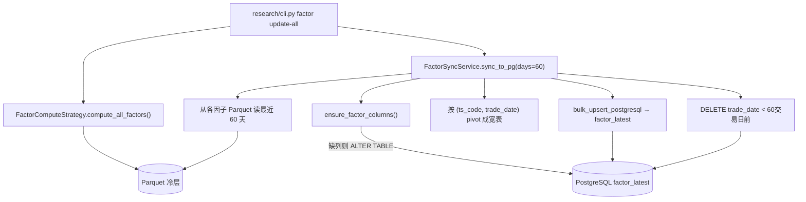
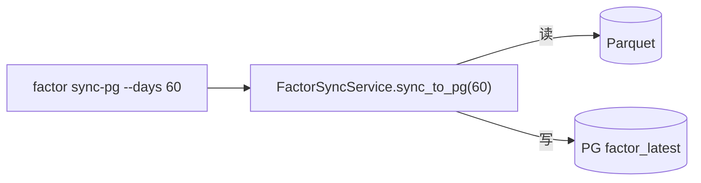

# SDD · 量化 · 因子 PG 热层与 Research CLI

> **状态：** 起草中
> **前置：** [因子框架-起步.sdd.md](./因子框架-起步.sdd.md)（BaseFactor + Parquet 计算已完成）
> **CLI 入口：** `uv run ./src/research/cli.py`
> **新增依赖：** 无（polars / pyarrow / duckdb 已有）
> **源码：** `src/research/cli.py` + `src/research/factor/sync.py` + `src/entities/data_entities/factor_latest_entities.py`

---

## 1. 概述

在因子 Parquet 冷层（全历史、批量扫描）基础上，增加 **PG 热层**（最近 60 交易日、毫秒级查询），支撑未来在线选股 API。

同时将因子相关 CLI 从 `etl/cli.py` 迁出到独立的 `src/research/cli.py`，为后续回测、策略命令预留空间。

### 两层存储的分工

| 层 | 存储 | 保留范围 | 用途 |
|----|------|---------|------|
| **冷层** Parquet | `data/warehouse/factor/{name}/dt=YYYYMM/` | 全历史（30 年） | 回测、因子研究、批量扫描 |
| **热层** PG | `factor_latest` 宽表 | 最近 60 交易日 | 在线选股 API、Admin 页面 |

### 核心流程

```
CLI "更新全量因子"
  ├─ 1. Parquet 计算：所有注册因子增量计算 → 写 Parquet 冷层
  └─ 2. PG 同步：从 Parquet 读最近 60 天 → 宽表 upsert → 清理旧数据
```

---

## 2. CLI 入口

### 2.1 独立入口

```bash
uv run ./src/research/cli.py
```

独立于 `etl/cli.py`，专为量化研究域（因子、回测、策略）服务。

### 2.2 交互菜单

```
选择要执行的任务：
  1. 【因子】更新全量因子 Parquet计算+PG同步 (factor update-all)
  2. 【因子】计算指定因子到Parquet (factor compute)
  3. 【因子】同步因子到PG热层 (factor sync-pg)
  4. 【因子】列出已注册因子 (factor list)
  5. 退出
```

### 2.3 子命令

| 命令 | 说明 | 参数 |
|------|------|------|
| `factor update-all` | 计算全部因子 Parquet + 同步 PG（**主推**） | `--force` |
| `factor compute --name <name>` | 只算指定因子到 Parquet | `--name, --start-month, --end-month, --force` |
| `factor sync-pg` | 只同步 Parquet → PG | `--days 60` |
| `factor list` | 列出已注册因子 | 无 |

### 2.4 从 etl/cli.py 迁出

移除 `etl/cli.py` 中的 factor 相关内容：
- `factor_strategy_cmd` Typer 组
- 3 个菜单项（factor-compute / compute-all / list）
- 对应命令函数和 MENU_HANDLERS 条目

---

## 3. PG 宽表 `factor_latest`

### 3.1 表结构

```sql
CREATE TABLE factor_latest (
    id            SERIAL PRIMARY KEY,
    ts_code       VARCHAR(20) NOT NULL,
    trade_date    VARCHAR(8) NOT NULL,
    -- 以下列由注册因子动态创建 --
    momentum_20d    FLOAT,
    volatility_60d  FLOAT,
    -- ... 未来新因子自动 ALTER TABLE ADD COLUMN ...
);
CREATE UNIQUE INDEX idx_factor_latest_code_date ON factor_latest(ts_code, trade_date);
```

### 3.2 动态建列机制

**不依赖静态 Entity 类的 sync_table**（因为因子列在运行时才知道），改为同步前做：

```python
# 1. 查 PG 当前列
existing_cols = inspect(engine).get_columns('factor_latest')
existing_names = {c['name'] for c in existing_cols}

# 2. 对比注册因子
for meta in FactorRegistry.list_all():
    if meta.name not in existing_names:
        ALTER TABLE factor_latest ADD COLUMN {meta.name} FLOAT
```

新增因子只需：写一个 `BaseFactor` 子类 → 放到 `price_volume/` 目录 → 自动发现注册 → 下次同步时自动建列。

### 3.3 Entity 类

`factor_latest_entities.py` **只定义固定列**（id, ts_code, trade_date + unique index），用于首次建表。因子列由 `FactorSyncService` 动态管理。

---

## 4. 完整调用流程图

### 4.1 update-all（主路径）



### 4.2 sync-pg（单独同步）



---

## 5. 逐步说明

### 5.1 FactorSyncService

```python
# src/research/factor/sync.py

class FactorSyncService:
    def ensure_factor_columns(self) -> list[str]:
        """检查 PG 列 vs 注册因子，缺列则 ALTER TABLE ADD COLUMN。返回新增列名。"""

    def sync_to_pg(self, days: int = 60) -> int:
        """
        1. ensure_table（首次建表）
        2. ensure_factor_columns（动态加列）
        3. 找出最近 days 个交易日（从 Parquet 日 K 读 trade_date 去重排序取尾部）
        4. 逐因子读 Parquet（只读这些交易日所在月份） → 合并成宽 DataFrame
        5. upsert 到 PG factor_latest（conflict on ts_code + trade_date）
        6. 清理过期数据
        返回 upsert 行数。
        """

    def cleanup_old(self, days: int = 60) -> int:
        """DELETE FROM factor_latest WHERE trade_date < cutoff。返回删除行数。"""
```

### 5.2 新增因子：60 日波动率

```python
# src/research/factor/price_volume/volatility.py

class Volatility60d(BaseFactor):
    """过去 60 日收益率的标准差，衡量股票波动程度。"""

    def meta(self) -> FactorMeta:
        return FactorMeta(
            name="volatility_60d",
            display_name="60日波动率",
            category="price_volume",
            frequency="daily",
            dependencies=("kline_daily",),
            params={"window": 60},
        )

    def compute(self, lf: pl.LazyFrame) -> pl.LazyFrame:
        # daily_return = close_adj / close_adj.shift(1) - 1
        # value = rolling_std(daily_return, window=60)
```

### 5.3 Research CLI 结构

```python
# src/research/cli.py

app = typer.Typer()
factor_cmd = typer.Typer()
app.add_typer(factor_cmd, name="factor")

_MENU_ROWS = [
    ("【因子】更新全量因子 Parquet计算+PG同步 (factor update-all)", "factor-update-all"),
    ("【因子】计算指定因子到Parquet (factor compute)", "factor-compute"),
    ("【因子】同步因子到PG热层 (factor sync-pg)", "factor-sync-pg"),
    ("【因子】列出已注册因子 (factor list)", "factor-list"),
]
```

---

## 6. 数据与外部依赖

| 数据 | 操作 | 用途 |
|------|------|------|
| Parquet `factor/{name}/dt=YYYYMM/` | 读 | 同步数据源 |
| Parquet `kline_daily/dt=YYYYMM/` | 读 | 找最近 N 个交易日 |
| PG `factor_latest` | 读写 | 热层宽表 |

无外部 API 调用。

---

## 7. 业务规则

| 规则 | 说明 |
|------|------|
| 60 交易日保留 | 约 3 个月，覆盖因子标准化 z-score（需近 20-60 天均值标准差） |
| 动态建列 | 新因子放入 `price_volume/` 目录 → auto_discover → 同步时自动 `ALTER TABLE ADD COLUMN` |
| upsert 冲突键 | `(ts_code, trade_date)` 唯一索引 |
| NULL 语义 | 因子值为 NULL = 该日无法算出（停牌 / 窗口不足） |
| 清理时机 | 每次 sync_to_pg 结束后自动清理 |

---

## 8. 已知限制

| 项 | 说明 |
|----|------|
| 宽表列数 | 因子多了列会膨胀，50 个因子以内没问题；超过时可考虑分表 |
| 同步全量覆盖 | 每次 sync 覆盖最近 60 天全部数据，非增量；单因子 60 天 ~33 万行，多因子合并后 ~33 万行（宽表），PG 秒级可完成 |
| 无实时更新 | 手动 CLI 触发，不是定时任务 |

---

## 9. 相关命令

| 命令 | 关系 |
|------|------|
| `warehouse pull-kline-daily-by-month-range` | 前置：日 K Parquet 须就绪 |
| `etl/cli.py` 因子命令 | 迁出到 `research/cli.py` |

---

## 10. 文件清单

```
新增：
  src/research/cli.py                                # Research 独立 CLI
  src/research/factor/price_volume/volatility.py     # 60 日波动率因子
  src/research/factor/sync.py                        # FactorSyncService
  src/entities/data_entities/factor_latest_entities.py # PG 宽表（固定列）

修改：
  src/etl/cli.py                                     # 移除因子菜单/命令
  spec/quant/README.md                               # 索引新增
```

---

## 11. 验收

1. `uv run ./src/research/cli.py` 显示 4 项菜单
2. `uv run ./src/research/cli.py factor list` 输出 2 个因子
3. `uv run ./src/research/cli.py factor update-all` 跑通
4. PG 查询：`SELECT ts_code, trade_date, momentum_20d, volatility_60d FROM factor_latest ORDER BY trade_date DESC, momentum_20d DESC LIMIT 5`
5. `uv run ./src/etl/cli.py` 菜单无因子项
