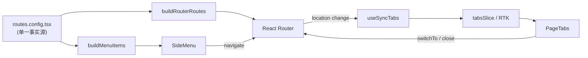

# Quantus Admin · 开发规范

> 本文件是 AI 编码助手（Claude / Cursor / Codex 等）与人类开发者共同遵循的项目规范。
> 修改本文件需谨慎，所有架构性约定都会被 AI 当作 ground truth。

---

## 1. 项目概述

Quantus Admin 是 Quantus 量化平台的 Agent 管理后台，用于：

- 配置 / 编辑 / 启停量化 Agent
- 监控 Agent 运行状态、查看日志
- 策略回测、收益分析与告警

中后台典型形态：顶部导航 + 二级侧边菜单 + 多 Tab 工作区。

## 2. 技术栈与版本约束

| 类别        | 选型                                        | 备注                                 |
| ----------- | ------------------------------------------- | ------------------------------------ |
| 构建        | Vite 7 + TypeScript 5.9                     | 要求 **Node ≥ 20.19**（或 **≥ 22.12**）；`pnpm` 为唯一包管理器。根目录 [`.nvmrc`](.nvmrc) 锁定推荐次版本。 |
| UI 框架     | React 19                                    | 配合 antd v6 原生支持，无需补丁      |
| 组件库      | antd ^6.3                                   | CSS Variables 主题，hashed:false     |
| 高级组件    | @ant-design/pro-components ^3 (beta)        | 仅在业务页面用 ProTable / ProForm 等 |
| 路由        | react-router-dom ^7                         | `createBrowserRouter`，SPA 模式      |
| 状态管理    | @reduxjs/toolkit + react-redux              | 全局态用 RTK，局部态用 useState      |
| 样式        | Tailwind v4 + CSS Modules                   | 原子样式优先，复杂样式用 CSS Modules |
| 国际化      | antd `ConfigProvider` + `zh_CN` locale      | 默认中文                             |

> ⚠️ 不要随意升级 `pro-components` 至非 beta 版本（latest 仍是 v2，不兼容 antd v6）。

## 3. 本地开发命令

```bash
pnpm install        # 安装依赖
pnpm dev            # 启动开发服务，默认 http://localhost:5173
pnpm build          # 类型检查 + 生产构建
pnpm preview        # 本地预览 dist
pnpm lint           # ESLint
pnpm typecheck      # 仅类型检查
```

## 4. 目录结构

```text
quantus_admin/
├── index.html
├── vite.config.ts            # Vite + Tailwind + alias 配置
├── tsconfig.{json,app,node}.json
├── eslint.config.js          # ESLint 9 flat config
├── .prettierrc
├── CLAUDE.md                 # 本文件
├── README.md
└── src/
    ├── main.tsx              # 应用入口：Redux + Router + ConfigProvider
    ├── index.css             # @import "tailwindcss";
    ├── vite-env.d.ts
    ├── types/
    │   └── route.ts          # RouteConfig 类型
    ├── routes/
    │   ├── index.tsx         # createBrowserRouter
    │   ├── routes.config.tsx # 【唯一事实源】路由 + 菜单 + Tab 配置
    │   └── helpers.ts        # buildRouterRoutes / buildMenuItems / findRouteByPath
    ├── layouts/
    │   └── BasicLayout/
    │       ├── index.tsx     # 顶部 + 侧边 + Tab + Outlet
    │       ├── HeaderBar.tsx # 顶部导航
    │       ├── SideMenu.tsx  # 二级侧边菜单
    │       └── PageTabs.tsx  # 多 Tab 标签页
    ├── store/
    │   ├── index.ts          # configureStore
    │   ├── hooks.ts          # useAppDispatch / useAppSelector
    │   └── slices/
    │       └── tabsSlice.ts  # Tab 状态切片
    ├── hooks/
    │   ├── useTabs.ts        # 暴露 open / close / closeOthers / closeAll / switchTo
    │   └── useSyncTabs.ts    # 监听 location 自动同步 Tab（无需业务调用）
    ├── components/           # 业务无关公共组件
    ├── pages/                # 业务页面（按域分目录）
    │   ├── Home.tsx
    │   ├── demo/
    │   │   ├── Demo1.tsx
    │   │   └── Demo2.tsx
    │   └── NotFound.tsx
    └── utils/                # 通用工具函数
```

## 5. 架构核心：路由 / 菜单 / Tab 三位一体

整个应用的菜单、路由、Tab 标题都由 [`src/routes/routes.config.tsx`](src/routes/routes.config.tsx) 这一份配置驱动：



**任何路由变化（点击菜单 / `useTabs.open` / `useTabs.switchTo` / 浏览器前进后退 / 直接输入 URL）都会通过 `useSyncTabs` 自动反映到 Tab 栏，业务代码无须关心。**

## 6. 【重点】新增页面 SOP

### Step 1 · 创建页面组件

在 `src/pages/<domain>/` 下创建组件，命名 `PascalCase`：

```tsx
// src/pages/agent/AgentList.tsx
import { Card, Typography } from 'antd';
const { Title } = Typography;

export default function AgentList() {
  return (
    <Card>
      <Title level={3}>Agent 列表</Title>
    </Card>
  );
}
```

### Step 2 · 在 `routes.config.tsx` 注册

打开 [`src/routes/routes.config.tsx`](src/routes/routes.config.tsx)，按需选择「一级菜单」或「挂到现有分组」：

```tsx
// 一级菜单
{
  path: '/agents',
  name: 'Agent 管理',
  icon: <RobotOutlined />,
  element: <AgentList />,
},

// 二级菜单（挂到既有 /demo 节点的 children）
{
  path: '/demo',
  name: 'Demo',
  icon: <AppstoreOutlined />,
  children: [
    { path: '/demo/page1', name: 'Demo页面1', element: <Demo1 /> },
    { path: '/demo/page2', name: 'Demo页面2', element: <Demo2 /> },
    // 👇 新增子页面
    { path: '/demo/page3', name: 'Demo页面3', element: <Demo3 /> },
  ],
},
```

### Step 3 · （可选）补充元信息

| 字段          | 默认值 | 用途                                                       |
| ------------- | ------ | ---------------------------------------------------------- |
| `icon`        | 无     | 菜单图标，建议从 `@ant-design/icons` 取                    |
| `closable`    | `true` | Tab 是否可关闭。首页 / 大盘等设为 `false`                  |
| `hideInMenu`  | `false`| 不在菜单显示但可通过 URL 直达（如「编辑」「详情」类页面） |

### Step 4 · 完成 ✅

刷新浏览器即可。**无需改动 `BasicLayout`、`store`、`Menu`、`PageTabs` 任何代码。**

### 路由命名约定

- `path` 必须是绝对完整路径，**全局唯一**，避免相对路径
- `path` 用 kebab-case：`/order-list`、`/agent/edit`
- 动态路由用 React Router v7 语法：`/agent/:id/detail`
- 动态详情类路由通常配 `hideInMenu: true`

## 7. 状态管理规范

- 全局态都放进 RTK slice，按业务域拆分（一个域一个 slice）
- 在组件中**只**使用 `useAppDispatch` / `useAppSelector`（来自 `@/store/hooks`），不要直接用 `useDispatch` / `useSelector`
- 严禁跨 slice 直接访问别的 slice 的 internal state；要联动时通过 selector 组合
- 派生状态优先用 `createSelector`（带 memoize）

新增 slice 三步：

1. `src/store/slices/xxxSlice.ts` 写 slice
2. `src/store/index.ts` 在 `reducer` 里挂上
3. 业务里 `useAppSelector(s => s.xxx.foo)`

## 8. Tab 操作规范

业务里**只**通过 `useTabs()` 操作 Tab，不要直接 dispatch tabsSlice 的 action：

```tsx
import { useTabs } from '@/hooks/useTabs';

function ToolBar() {
  const { open, close, switchTo, closeAll } = useTabs();
  return <Button onClick={() => open('/demo/page1')}>打开 Demo1</Button>;
}
```

`open` 只需要传 path，标题和 closable 都从 `routesConfig` 自动读取，避免分裂。

## 9. 样式规范

- **优先 Tailwind**：间距、布局、文字大小、颜色辅助、flex/grid 一律用原子类
- antd 组件**主题**通过 `ConfigProvider.theme.token` 调整（`main.tsx`）；不要改 antd 内部 class 名
- 复杂、与 Tailwind 表达不便的样式（如复杂的伪元素动画）用 CSS Modules（`*.module.css`）
- 不写全局 CSS，除非是字体 / reset 等真正全局的内容（`src/index.css`）
- 颜色使用 antd 设计 token：`var(--ant-color-primary)` 等，避免散落的 hex

## 10. 代码风格

- ESLint 9 flat config + Prettier；提交前自动 fix
- 文件名：组件用 `PascalCase.tsx`，工具/hook 用 `camelCase.ts`
- 组件 `default export`；hook / 工具用 `named export`
- 提倡 React 19 的 `function Component()` 写法（不用 `React.FC`）
- 类型导入用 `import type {...}`，避免被打包

## 11. 提交规范

遵循 Conventional Commits：

```
feat: 新增 Agent 列表页
fix: 修复 Tab 关闭后 URL 不同步
refactor: 抽离 menu 构建逻辑
chore: 升级 antd 到 6.3.7
docs: 补充 CLAUDE.md 新增页面示例
```

## 12. 常见问题 FAQ

**Q: Tab 没刷新 / 不出现？**
A: 检查 `routes.config.tsx` 里 path 是否唯一、是否填了 `element`。**纯菜单分组节点（无 element）不会出现在 Tab 中。**

**Q: 想换主题色？**
A: 改 `src/main.tsx` 的 `ConfigProvider.theme.token.colorPrimary`。v6 走 CSS Variables，运行时切换也支持。

**Q: 从 antd v5 文档复制的代码有警告？**
A: v6 有破坏性变更（移除部分弃用 API、默认无 IE 支持、Wave / 静态方法行为变化），优先查 v6 官方迁移指南。

**Q: 想用 ProTable / ProForm？**
A: 直接 `import { ProTable } from '@ant-design/pro-components';`，已与 antd v6 对齐。**不要**单独装 `@ant-design/pro-table` 等子包（v3 已合并）。

**Q: `pnpm dev` 报 `TypeError: crypto.hash is not a function`？**
A: Node 版本不满足 Vite 7 要求。请安装 **Node ≥ 20.19** 或 **≥ 22.12**，并按根目录 [`.nvmrc`](.nvmrc) 执行 `nvm install && nvm use`（无 nvm 时见 [README](README.md)）。

**Q: `pnpm install` 报 peer dependency 警告？**
A: pro-components beta 阶段会有少量 peer 警告，不影响功能。等其转 latest 后再升级。
